# Subscription Billing

<cite>
**Referenced Files in This Document**
- [SubscriptionPackage.php](file://app/Models/SubscriptionPackage.php)
- [StoreSubscription.php](file://app/Models/StoreSubscription.php)
- [SubscriptionTransaction.php](file://app/Models/SubscriptionTransaction.php)
- [SubscriptionBillingAndRefundHistory.php](file://app/Models/SubscriptionBillingAndRefundHistory.php)
- [SubscriptionController.php (Admin)](file://app/Http/Controllers/Admin/Subscription/SubscriptionController.php)
- [SubscriptionController.php (Vendor)](file://app/Http/Controllers/Vendor/SubscriptionController.php)
- [SubscriptionController.php (Api/V1/Vendor)](file://app/Http/Controllers/Api/V1/Vendor/SubscriptionController.php)
- [Subscription.php (Middleware)](file://app/Http/Middleware/Subscription.php)
- [create_subscription_packages_table.php](file://database/migrations/2024_05_13_102547_create_subscription_packages_table.php)
- [create_store_subscriptions_table.php](file://database/migrations/2024_05_13_102612_create_store_subscriptions_table.php)
- [create_subscription_transactions_table.php](file://database/migrations/2024_05_13_104250_create_subscription_transactions_table.php)
- [create_subscription_billing_and_refund_histories_table.php](file://database/migrations/2024_05_22_115717_create_subscription_billing_and_refund_histories_table.php)
- [subscription-invoice.blade.php](file://resources/views/subscription-invoice.blade.php)
- [subscription-cancel-format.blade.php](file://resources/views/admin-views/business-settings/email-format-setting/store-email-formats/subscription-cancel-format.blade.php)
- [subscription-plan_upadte-format.blade.php](file://resources/views/admin-views/business-settings/email-format-setting/store-email-formats/subscription-plan_upadte-format.blade.php)
- [subscription-renew-format.blade.php](file://resources/views/admin-views/business-settings/email-format-setting/store-email-formats/subscription-renew-format.blade.php)
- [subscription-shift-format.blade.php](file://resources/views/admin-views/business-settings/email-format-setting/store-email-formats/subscription-shift-format.blade.php)
- [subscription-successful-format.blade.php](file://resources/views/admin-views/business-settings/email-format-setting/store-email-formats/subscription-successful-format.blade.php)
- [subscription-deadline-format.blade.php](file://resources/views/admin-views/business-settings/email-format-setting/store-email-formats/subscription-deadline-format.blade.php)
</cite>

## Table of Contents
1. [Introduction](#introduction)
2. [Project Structure](#project-structure)
3. [Core Components](#core-components)
4. [Architecture Overview](#architecture-overview)
5. [Detailed Component Analysis](#detailed-component-analysis)
6. [Dependency Analysis](#dependency-analysis)
7. [Performance Considerations](#performance-considerations)
8. [Troubleshooting Guide](#troubleshooting-guide)
9. [Conclusion](#conclusion)
10. [Appendices](#appendices)

## Introduction
This document describes the subscription billing system that manages recurring payments, plan upgrades/downgrades, billing cycles, and administrative workflows. It documents subscription package configuration, pricing tiers, feature limitations, automatic renewal, proration and trial handling, cancellation and refund workflows, usage-based limits, analytics and revenue tracking, churn prediction signals, tax reporting, multi-currency support, and international compliance considerations.

## Project Structure
The subscription billing system spans models, controllers, middleware, migrations, and email templates/views. The core domain entities are:
- SubscriptionPackage: defines pricing tiers and feature flags
- StoreSubscription: tracks per-store subscription state and validity
- SubscriptionTransaction: records payment events and plan types
- SubscriptionBillingAndRefundHistory: tracks pending bills and refunds

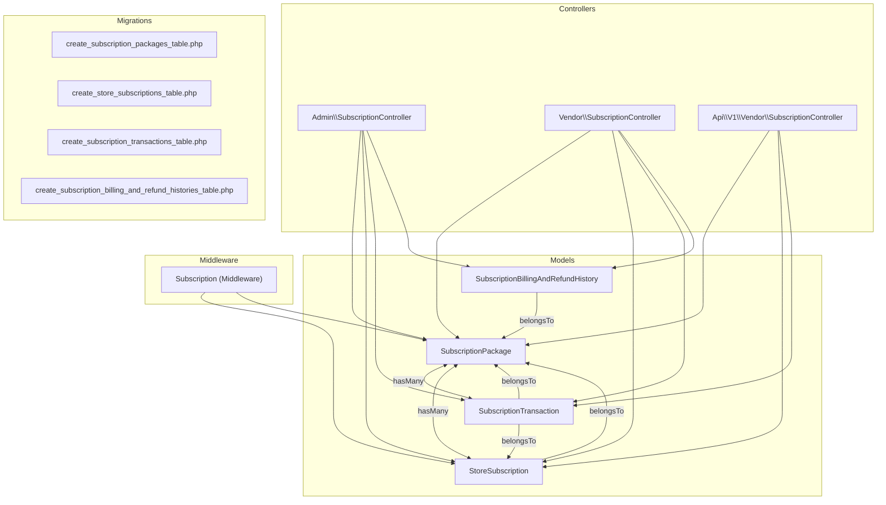

**Diagram sources**
- [SubscriptionPackage.php:10-89](file://app/Models/SubscriptionPackage.php#L10-L89)
- [StoreSubscription.php:10-57](file://app/Models/StoreSubscription.php#L10-L57)
- [SubscriptionTransaction.php:9-51](file://app/Models/SubscriptionTransaction.php#L9-L51)
- [SubscriptionBillingAndRefundHistory.php:8-17](file://app/Models/SubscriptionBillingAndRefundHistory.php#L8-L17)
- [SubscriptionController.php (Admin):31-995](file://app/Http/Controllers/Admin/Subscription/SubscriptionController.php#L31-L995)
- [SubscriptionController.php (Vendor):27-320](file://app/Http/Controllers/Vendor/SubscriptionController.php#L27-L320)
- [SubscriptionController.php (Api/V1/Vendor):22-260](file://app/Http/Controllers/Api/V1/Vendor/SubscriptionController.php#L22-L260)
- [Subscription.php (Middleware):11-66](file://app/Http/Middleware/Subscription.php#L11-L66)
- [create_subscription_packages_table.php:14-32](file://database/migrations/2024_05_13_102547_create_subscription_packages_table.php#L14-L32)
- [create_store_subscriptions_table.php:14-34](file://database/migrations/2024_05_13_102612_create_store_subscriptions_table.php#L14-L34)
- [create_subscription_transactions_table.php:15-34](file://database/migrations/2024_05_13_104250_create_subscription_transactions_table.php#L15-L34)
- [create_subscription_billing_and_refund_histories_table.php:14-24](file://database/migrations/2024_05_22_115717_create_subscription_billing_and_refund_histories_table.php#L14-L24)

**Section sources**
- [create_subscription_packages_table.php:14-32](file://database/migrations/2024_05_13_102547_create_subscription_packages_table.php#L14-L32)
- [create_store_subscriptions_table.php:14-34](file://database/migrations/2024_05_13_102612_create_store_subscriptions_table.php#L14-L34)
- [create_subscription_transactions_table.php:15-34](file://database/migrations/2024_05_13_104250_create_subscription_transactions_table.php#L15-L34)
- [create_subscription_billing_and_refund_histories_table.php:14-24](file://database/migrations/2024_05_22_115717_create_subscription_billing_and_refund_histories_table.php#L14-L24)

## Core Components
- SubscriptionPackage: Defines pricing, validity, feature flags (chat, review, pos, mobile_app, self_delivery), and unlimited limits via max_order/max_product. Includes translation support and scopes for status and subscribers.
- StoreSubscription: Tracks per-store subscription state, expiry date, validity, feature flags, trial flag, renewal metadata, and cancellation fields.
- SubscriptionTransaction: Records payment events with plan_type (new_plan, renew, first_purchased, free_trial), paid amount, previous due, discount, and package details.
- SubscriptionBillingAndRefundHistory: Tracks pending bills and refunds per store/package with success flags and references.

**Section sources**
- [SubscriptionPackage.php:10-89](file://app/Models/SubscriptionPackage.php#L10-L89)
- [StoreSubscription.php:10-57](file://app/Models/StoreSubscription.php#L10-L57)
- [SubscriptionTransaction.php:9-51](file://app/Models/SubscriptionTransaction.php#L9-L51)
- [SubscriptionBillingAndRefundHistory.php:8-17](file://app/Models/SubscriptionBillingAndRefundHistory.php#L8-L17)

## Architecture Overview
The system integrates controllers for Admin, Vendor, and API layers with middleware enforcing subscription permissions. Transactions and billing histories record financial events, while email templates and notifications support lifecycle communications.

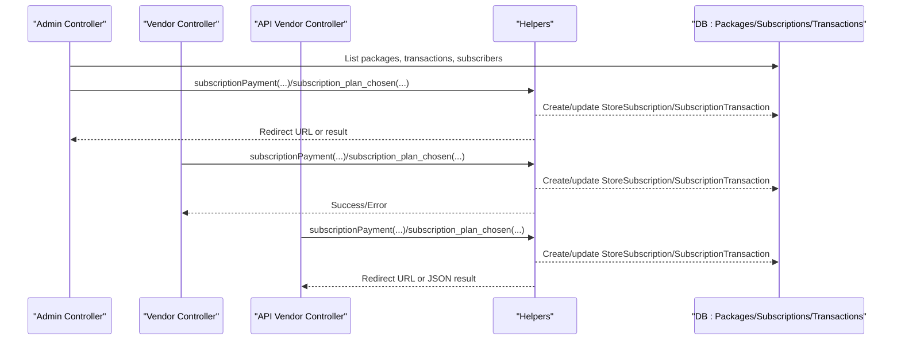

**Diagram sources**
- [SubscriptionController.php (Admin):31-995](file://app/Http/Controllers/Admin/Subscription/SubscriptionController.php#L31-L995)
- [SubscriptionController.php (Vendor):27-320](file://app/Http/Controllers/Vendor/SubscriptionController.php#L27-L320)
- [SubscriptionController.php (Api/V1/Vendor):22-260](file://app/Http/Controllers/Api/V1/Vendor/SubscriptionController.php#L22-L260)

## Detailed Component Analysis

### Subscription Packages and Pricing Tiers
- Package definition includes price, validity (days), optional unlimited limits via max_order and max_product, and feature flags (chat, review, pos, mobile_app, self_delivery).
- Translatable fields for package_name and text; global scope applies locale-aware translations.
- Admin CRUD supports creation, updates, activation/deactivation, and bulk operations with exports.

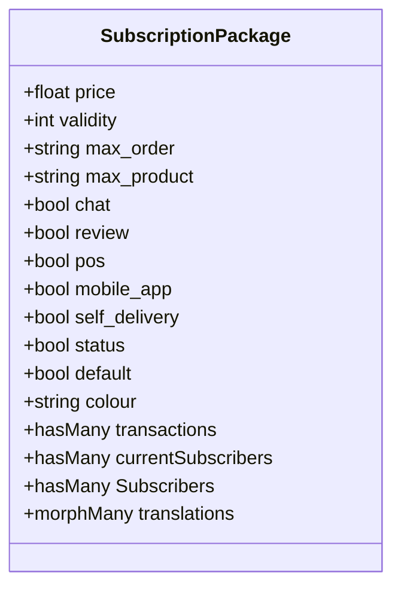

**Diagram sources**
- [SubscriptionPackage.php:10-89](file://app/Models/SubscriptionPackage.php#L10-L89)
- [create_subscription_packages_table.php:14-32](file://database/migrations/2024_05_13_102547_create_subscription_packages_table.php#L14-L32)

**Section sources**
- [SubscriptionPackage.php:10-89](file://app/Models/SubscriptionPackage.php#L10-L89)
- [create_subscription_packages_table.php:14-32](file://database/migrations/2024_05_13_102547_create_subscription_packages_table.php#L14-L32)
- [SubscriptionController.php (Admin):85-134](file://app/Http/Controllers/Admin/Subscription/SubscriptionController.php#L85-L134)

### Per-Store Subscriptions and Billing Cycles
- StoreSubscription maintains expiry_date, validity, feature flags, trial flag, renewal counters, and cancellation state.
- Links to SubscriptionPackage and aggregates transactions; middleware enforces feature access based on package flags.

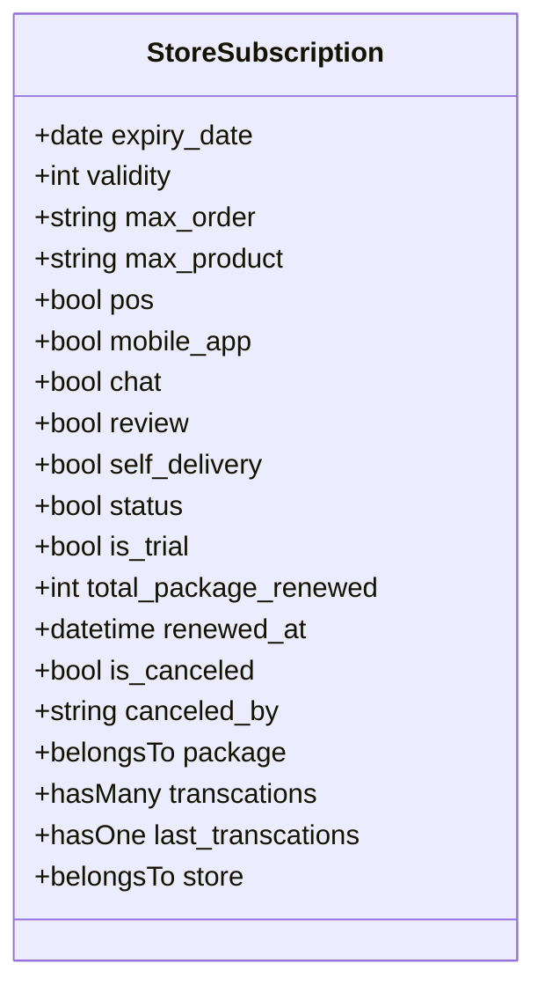

**Diagram sources**
- [StoreSubscription.php:10-57](file://app/Models/StoreSubscription.php#L10-L57)
- [create_store_subscriptions_table.php:14-34](file://database/migrations/2024_05_13_102612_create_store_subscriptions_table.php#L14-L34)
- [Subscription.php (Middleware):18-64](file://app/Http/Middleware/Subscription.php#L18-L64)

**Section sources**
- [StoreSubscription.php:10-57](file://app/Models/StoreSubscription.php#L10-L57)
- [create_store_subscriptions_table.php:14-34](file://database/migrations/2024_05_13_102612_create_store_subscriptions_table.php#L14-L34)
- [Subscription.php (Middleware):18-64](file://app/Http/Middleware/Subscription.php#L18-L64)

### Transactions and Plan Types
- SubscriptionTransaction captures payment_method, payment_status, reference, paid_amount, discount, package_details, plan_type, trial flag, and timestamps.
- Supports filtering by plan_type and date ranges; used for revenue tracking and analytics.

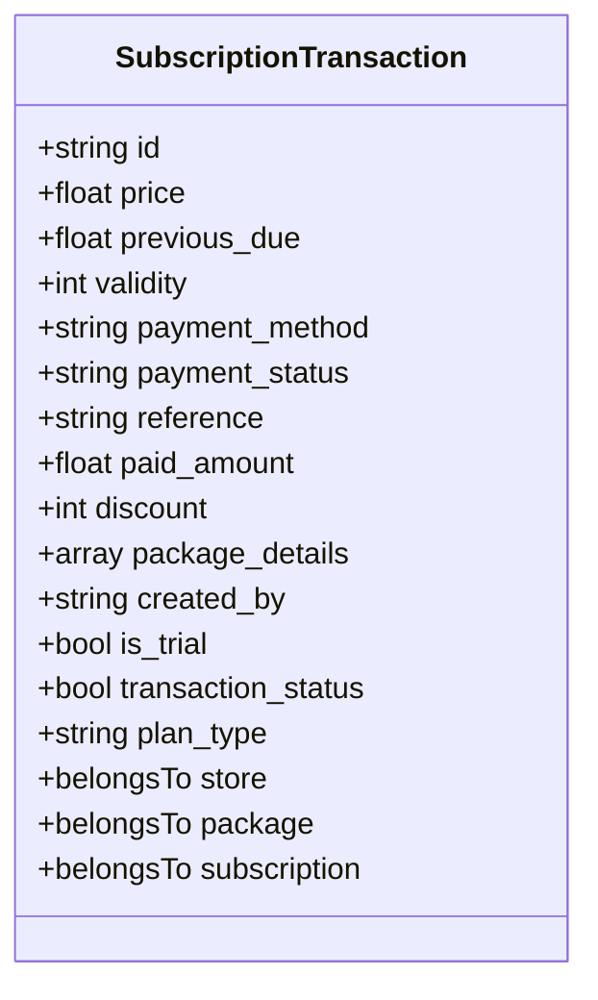

**Diagram sources**
- [SubscriptionTransaction.php:9-51](file://app/Models/SubscriptionTransaction.php#L9-L51)
- [create_subscription_transactions_table.php:15-34](file://database/migrations/2024_05_13_104250_create_subscription_transactions_table.php#L15-L34)

**Section sources**
- [SubscriptionTransaction.php:9-51](file://app/Models/SubscriptionTransaction.php#L9-L51)
- [create_subscription_transactions_table.php:15-34](file://database/migrations/2024_05_13_104250_create_subscription_transactions_table.php#L15-L34)
- [SubscriptionController.php (Admin):322-364](file://app/Http/Controllers/Admin/Subscription/SubscriptionController.php#L322-L364)

### Billing and Refund Tracking
- SubscriptionBillingAndRefundHistory stores pending_bill and refund entries per store/package with amounts and success flags.
- Used to compute outstanding balances and refund calculations during plan switches.

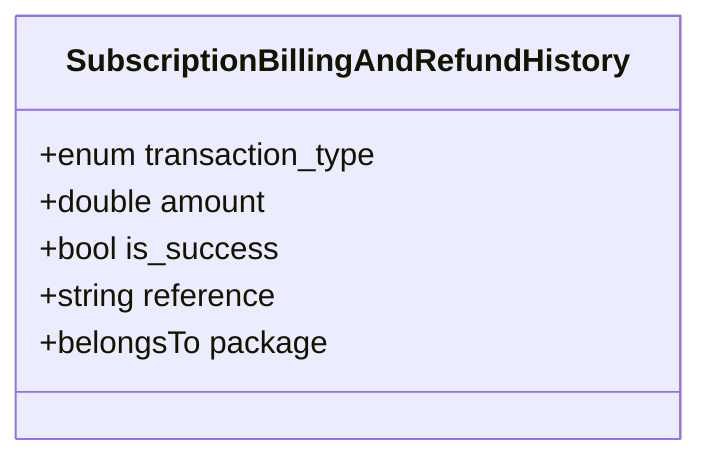

**Diagram sources**
- [SubscriptionBillingAndRefundHistory.php:8-17](file://app/Models/SubscriptionBillingAndRefundHistory.php#L8-L17)
- [create_subscription_billing_and_refund_histories_table.php:14-24](file://database/migrations/2024_05_22_115717_create_subscription_billing_and_refund_histories_table.php#L14-L24)

**Section sources**
- [SubscriptionBillingAndRefundHistory.php:8-17](file://app/Models/SubscriptionBillingAndRefundHistory.php#L8-L17)
- [create_subscription_billing_and_refund_histories_table.php:14-24](file://database/migrations/2024_05_22_115717_create_subscription_billing_and_refund_histories_table.php#L14-L24)

### Automatic Renewal and Proration
- Renewal triggers occur when StoreSubscription.renewed_at and expiry_date are managed; renewal counters track total_package_renewed.
- Proration is not explicitly modeled in the schema; however, paid_amount and previous_due fields in transactions enable post-payment adjustments and pending bill tracking via SubscriptionBillingAndRefundHistory.

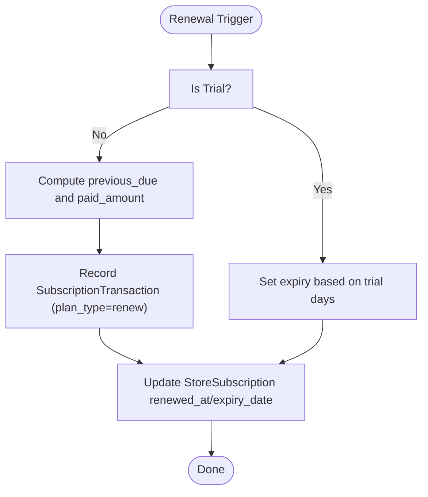

**Diagram sources**
- [create_store_subscriptions_table.php:18-33](file://database/migrations/2024_05_13_102612_create_store_subscriptions_table.php#L18-L33)
- [create_subscription_transactions_table.php:32-32](file://database/migrations/2024_05_13_104250_create_subscription_transactions_table.php#L32-L32)
- [create_subscription_billing_and_refund_histories_table.php:19-19](file://database/migrations/2024_05_22_115717_create_subscription_billing_and_refund_histories_table.php#L19-L19)

**Section sources**
- [create_store_subscriptions_table.php:18-33](file://database/migrations/2024_05_13_102612_create_store_subscriptions_table.php#L18-L33)
- [create_subscription_transactions_table.php:32-32](file://database/migrations/2024_05_13_104250_create_subscription_transactions_table.php#L32-L32)

### Trial Period Management
- Free trial activation controlled by BusinessSetting keys; trial days configurable and converted based on selected unit (days/month/year).
- Transactions marked is_trial; plan_type indicates free_trial for initial purchase.

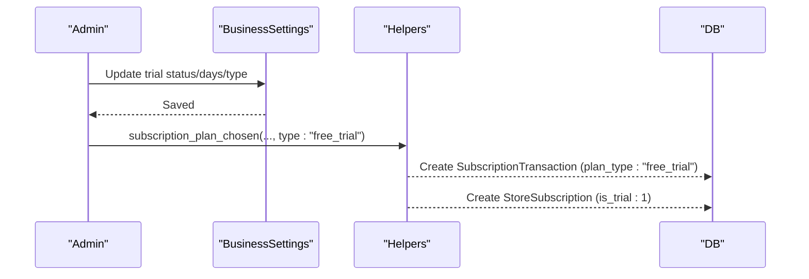

**Diagram sources**
- [SubscriptionController.php (Admin):365-407](file://app/Http/Controllers/Admin/Subscription/SubscriptionController.php#L365-L407)
- [SubscriptionController.php (Api/V1/Vendor):83-85](file://app/Http/Controllers/Api/V1/Vendor/SubscriptionController.php#L83-L85)
- [create_subscription_transactions_table.php:32-32](file://database/migrations/2024_05_13_104250_create_subscription_transactions_table.php#L32-L32)

**Section sources**
- [SubscriptionController.php (Admin):365-407](file://app/Http/Controllers/Admin/Subscription/SubscriptionController.php#L365-L407)
- [SubscriptionController.php (Api/V1/Vendor):83-85](file://app/Http/Controllers/Api/V1/Vendor/SubscriptionController.php#L83-L85)

### Plan Upgrades/Downgrades and Switching
- Admin can switch plans for active subscribers; commission mode disables subscription features.
- Vendor and API flows support wallet payments and free trial selection; plan shifts recorded via Helpers and stored in transactions.

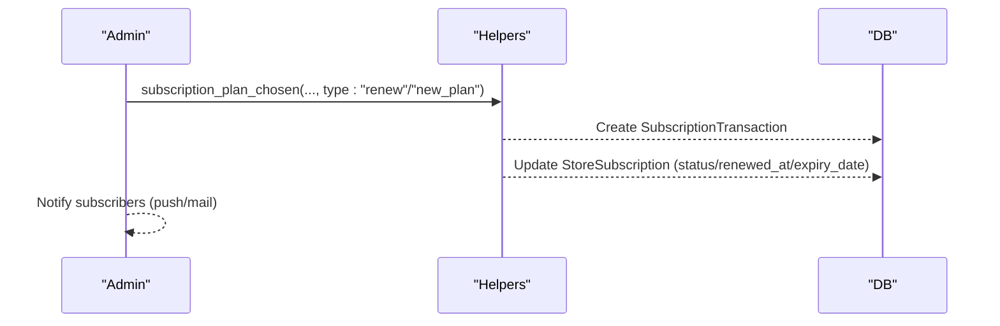

**Diagram sources**
- [SubscriptionController.php (Admin):740-775](file://app/Http/Controllers/Admin/Subscription/SubscriptionController.php#L740-L775)
- [SubscriptionController.php (Vendor):156-196](file://app/Http/Controllers/Vendor/SubscriptionController.php#L156-L196)
- [SubscriptionController.php (Api/V1/Vendor):56-92](file://app/Http/Controllers/Api/V1/Vendor/SubscriptionController.php#L56-L92)

**Section sources**
- [SubscriptionController.php (Admin):740-775](file://app/Http/Controllers/Admin/Subscription/SubscriptionController.php#L740-L775)
- [SubscriptionController.php (Vendor):156-196](file://app/Http/Controllers/Vendor/SubscriptionController.php#L156-L196)
- [SubscriptionController.php (Api/V1/Vendor):56-92](file://app/Http/Controllers/Api/V1/Vendor/SubscriptionController.php#L56-L92)

### Cancellations and Refunds
- Admin and Vendor can cancel subscriptions; canceled_by field distinguishes origin.
- Refund computation invoked before switching to commission; pending bills tracked in billing history.

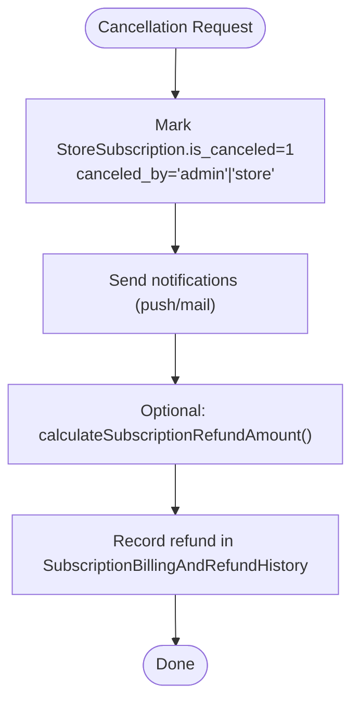

**Diagram sources**
- [SubscriptionController.php (Admin):546-604](file://app/Http/Controllers/Admin/Subscription/SubscriptionController.php#L546-L604)
- [SubscriptionController.php (Vendor):52-109](file://app/Http/Controllers/Vendor/SubscriptionController.php#L52-L109)
- [create_subscription_billing_and_refund_histories_table.php:19-19](file://database/migrations/2024_05_22_115717_create_subscription_billing_and_refund_histories_table.php#L19-L19)

**Section sources**
- [SubscriptionController.php (Admin):546-604](file://app/Http/Controllers/Admin/Subscription/SubscriptionController.php#L546-L604)
- [SubscriptionController.php (Vendor):52-109](file://app/Http/Controllers/Vendor/SubscriptionController.php#L52-L109)

### Usage-Based Billing and Limits
- Unlimited vs limited plans supported via max_order and max_product; middleware checks feature flags for reviews, POS, self-delivery, and chat.
- API and Vendor endpoints expose checks for product/item limits and potential cash-back amounts upon plan change.

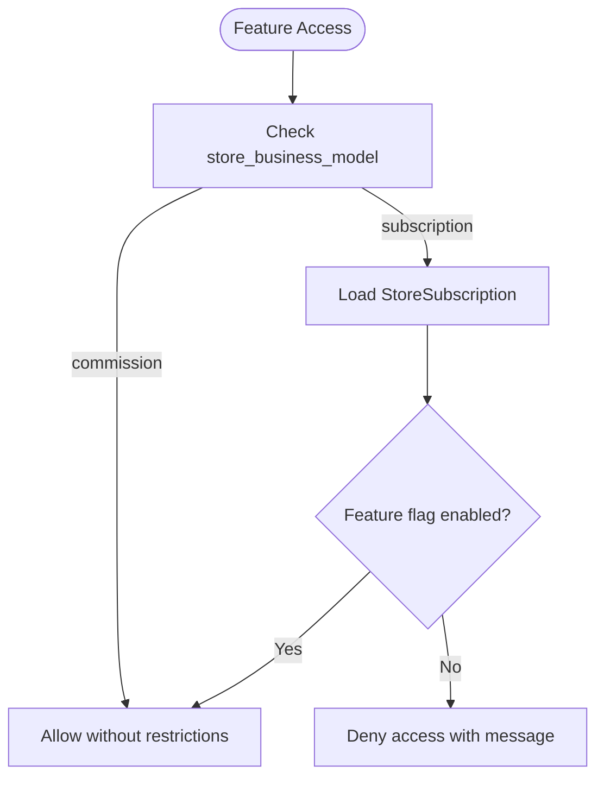

**Diagram sources**
- [Subscription.php (Middleware):18-64](file://app/Http/Middleware/Subscription.php#L18-L64)
- [Api/V1/Vendor/SubscriptionController.php:229-258](file://app/Http/Controllers/Api/V1/Vendor/SubscriptionController.php#L229-L258)

**Section sources**
- [Subscription.php (Middleware):18-64](file://app/Http/Middleware/Subscription.php#L18-L64)
- [Api/V1/Vendor/SubscriptionController.php:229-258](file://app/Http/Controllers/Api/V1/Vendor/SubscriptionController.php#L229-L258)

### Analytics, Revenue Tracking, and Churn Prediction
- Admin dashboard computes totals for subscribers, active/expired/expiring soon, free trials, renewals, and total revenue filtered by time windows.
- Transaction lists support filtering by plan_type and date ranges; export capabilities available.

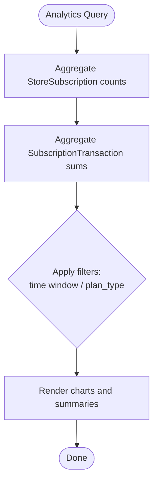

**Diagram sources**
- [SubscriptionController.php (Admin):272-319](file://app/Http/Controllers/Admin/Subscription/SubscriptionController.php#L272-L319)
- [SubscriptionController.php (Admin):322-364](file://app/Http/Controllers/Admin/Subscription/SubscriptionController.php#L322-L364)

**Section sources**
- [SubscriptionController.php (Admin):272-319](file://app/Http/Controllers/Admin/Subscription/SubscriptionController.php#L272-L319)
- [SubscriptionController.php (Admin):322-364](file://app/Http/Controllers/Admin/Subscription/SubscriptionController.php#L322-L364)

### Tax Calculation, Multi-Currency Support, and International Compliance
- Tax reporting views exist for subscription tax details and exports.
- Multi-currency and tax calculation are not explicitly modeled in the schema; however, paid_amount and currency-aware payment gateways are integrated via Helpers and payment flows.

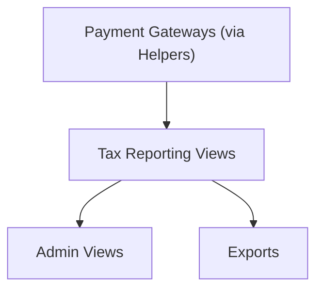

**Diagram sources**
- [subscription-invoice.blade.php](file://resources/views/subscription-invoice.blade.php)
- [subscription-cancel-format.blade.php](file://resources/views/admin-views/business-settings/email-format-setting/store-email-formats/subscription-cancel-format.blade.php)
- [subscription-plan_upadte-format.blade.php](file://resources/views/admin-views/business-settings/email-format-setting/store-email-formats/subscription-plan_upadte-format.blade.php)
- [subscription-renew-format.blade.php](file://resources/views/admin-views/business-settings/email-format-setting/store-email-formats/subscription-renew-format.blade.php)
- [subscription-shift-format.blade.php](file://resources/views/admin-views/business-settings/email-format-setting/store-email-formats/subscription-shift-format.blade.php)
- [subscription-successful-format.blade.php](file://resources/views/admin-views/business-settings/email-format-setting/store-email-formats/subscription-successful-format.blade.php)
- [subscription-deadline-format.blade.php](file://resources/views/admin-views/business-settings/email-format-setting/store-email-formats/subscription-deadline-format.blade.php)

**Section sources**
- [subscription-invoice.blade.php](file://resources/views/subscription-invoice.blade.php)
- [subscription-cancel-format.blade.php](file://resources/views/admin-views/business-settings/email-format-setting/store-email-formats/subscription-cancel-format.blade.php)
- [subscription-plan_upadte-format.blade.php](file://resources/views/admin-views/business-settings/email-format-setting/store-email-formats/subscription-plan_upadte-format.blade.php)
- [subscription-renew-format.blade.php](file://resources/views/admin-views/business-settings/email-format-setting/store-email-formats/subscription-renew-format.blade.php)
- [subscription-shift-format.blade.php](file://resources/views/admin-views/business-settings/email-format-setting/store-email-formats/subscription-shift-format.blade.php)
- [subscription-successful-format.blade.php](file://resources/views/admin-views/business-settings/email-format-setting/store-email-formats/subscription-successful-format.blade.php)
- [subscription-deadline-format.blade.php](file://resources/views/admin-views/business-settings/email-format-setting/store-email-formats/subscription-deadline-format.blade.php)

## Dependency Analysis
- Controllers depend on Helpers for payment initiation and plan selection; Models encapsulate persistence and relationships.
- Middleware depends on StoreSubscription and package flags to enforce feature access.
- Email templates and notification settings integrate with push and mail systems.

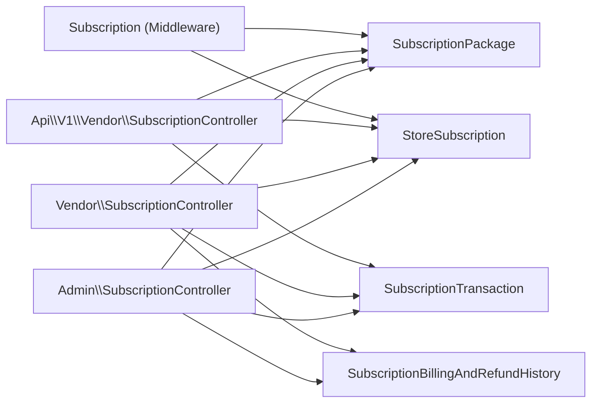

**Diagram sources**
- [SubscriptionController.php (Admin):31-995](file://app/Http/Controllers/Admin/Subscription/SubscriptionController.php#L31-L995)
- [SubscriptionController.php (Vendor):27-320](file://app/Http/Controllers/Vendor/SubscriptionController.php#L27-L320)
- [SubscriptionController.php (Api/V1/Vendor):22-260](file://app/Http/Controllers/Api/V1/Vendor/SubscriptionController.php#L22-L260)
- [Subscription.php (Middleware):18-64](file://app/Http/Middleware/Subscription.php#L18-L64)

**Section sources**
- [SubscriptionController.php (Admin):31-995](file://app/Http/Controllers/Admin/Subscription/SubscriptionController.php#L31-L995)
- [SubscriptionController.php (Vendor):27-320](file://app/Http/Controllers/Vendor/SubscriptionController.php#L27-L320)
- [SubscriptionController.php (Api/V1/Vendor):22-260](file://app/Http/Controllers/Api/V1/Vendor/SubscriptionController.php#L22-L260)
- [Subscription.php (Middleware):18-64](file://app/Http/Middleware/Subscription.php#L18-L64)

## Performance Considerations
- Use pagination for transaction and subscriber listings to avoid heavy queries.
- Index foreign keys (package_id, store_id, store_subscription_id) present in migrations to optimize joins.
- Aggregate queries for analytics should leverage selectRaw with appropriate grouping to minimize data transfer.
- Cache frequently accessed package lists and feature flags where feasible.

## Troubleshooting Guide
- Insufficient wallet balance: Wallet payment attempts validate balance against package price plus pending bills; ensure store wallet is enabled and funded.
- Feature access denied: Middleware checks StoreSubscription feature flags; verify package includes requested feature.
- Trial configuration: Confirm BusinessSetting keys for trial status, days, and unit conversion.
- Cancellation notifications: Verify push/notification settings and mail configurations for provider/store contexts.

**Section sources**
- [SubscriptionController.php (Vendor):174-191](file://app/Http/Controllers/Vendor/SubscriptionController.php#L174-L191)
- [SubscriptionController.php (Api/V1/Vendor):65-81](file://app/Http/Controllers/Api/V1/Vendor/SubscriptionController.php#L65-L81)
- [Subscription.php (Middleware):37-58](file://app/Http/Middleware/Subscription.php#L37-L58)
- [SubscriptionController.php (Admin):381-407](file://app/Http/Controllers/Admin/Subscription/SubscriptionController.php#L381-L407)

## Conclusion
The subscription billing system provides robust package management, per-store subscription tracking, transaction recording, and administrative controls for renewals, plan changes, cancellations, and analytics. While proration and multi-currency tax handling are not explicitly modeled in schema, the transaction and billing history tables support post-payment adjustments and reporting. Feature enforcement and usage limits are enforced via middleware and package flags, ensuring alignment between plan capabilities and store operations.

## Appendices

### Data Model Diagram
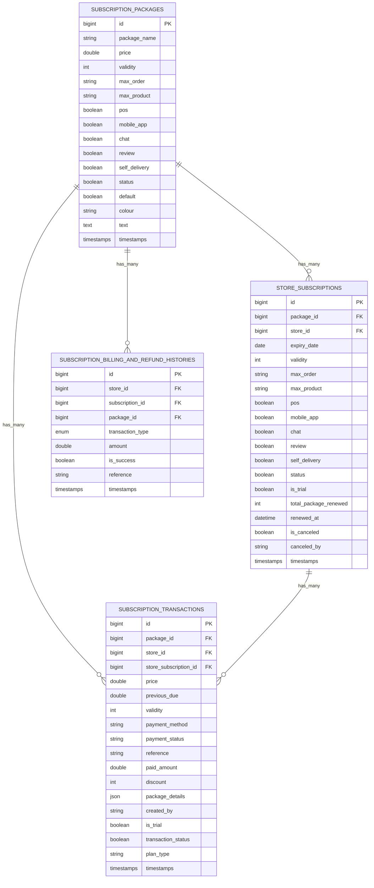

**Diagram sources**
- [create_subscription_packages_table.php:14-32](file://database/migrations/2024_05_13_102547_create_subscription_packages_table.php#L14-L32)
- [create_store_subscriptions_table.php:14-34](file://database/migrations/2024_05_13_102612_create_store_subscriptions_table.php#L14-L34)
- [create_subscription_transactions_table.php:15-34](file://database/migrations/2024_05_13_104250_create_subscription_transactions_table.php#L15-L34)
- [create_subscription_billing_and_refund_histories_table.php:14-24](file://database/migrations/2024_05_22_115717_create_subscription_billing_and_refund_histories_table.php#L14-L24)