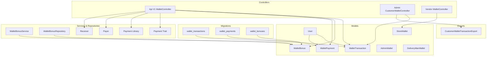
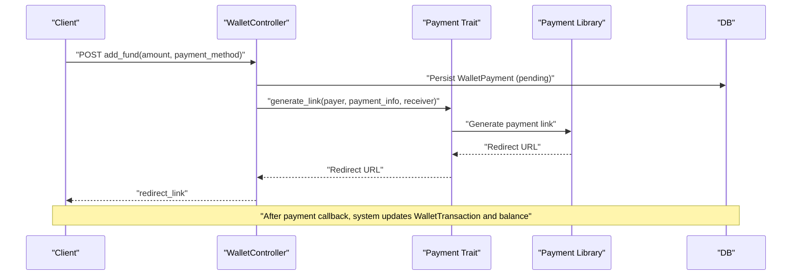
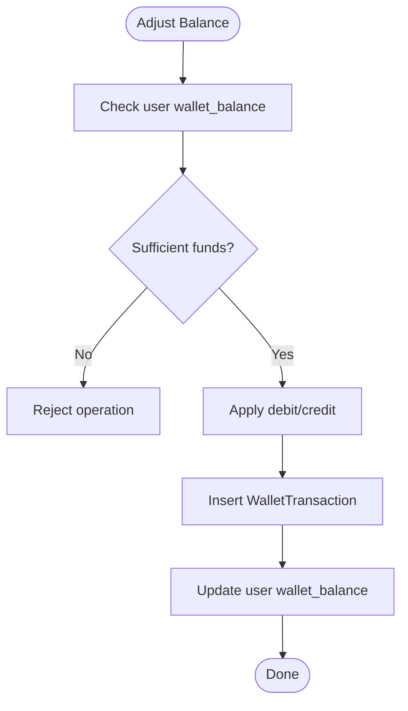
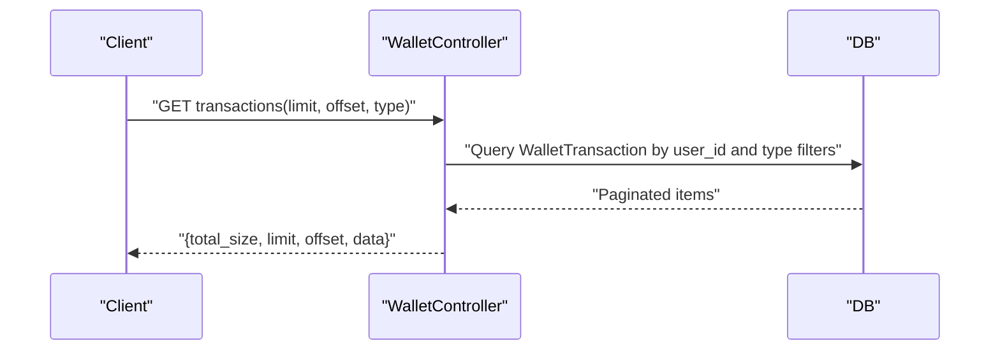
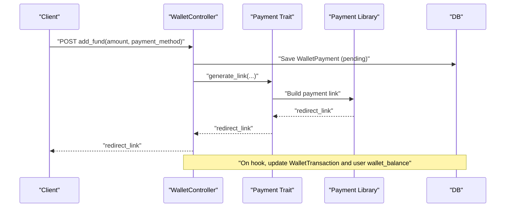
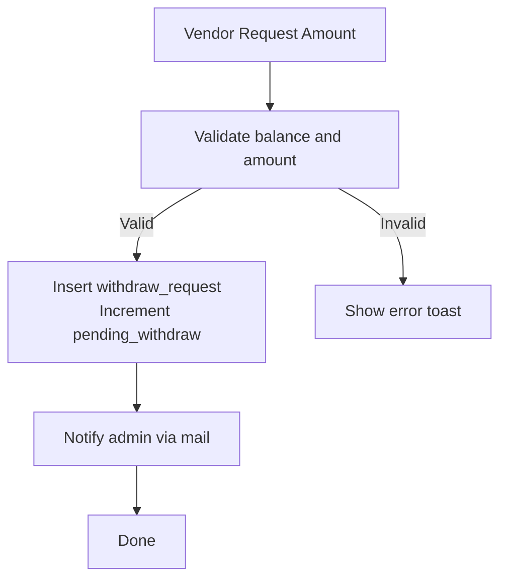
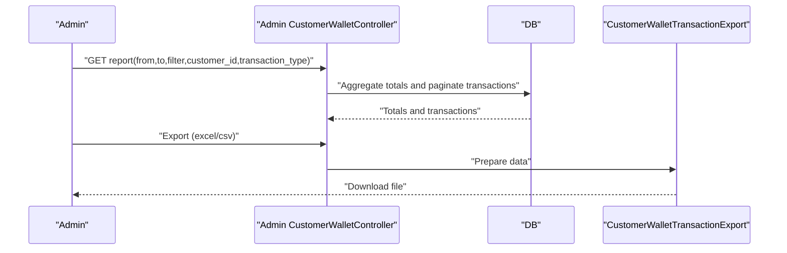
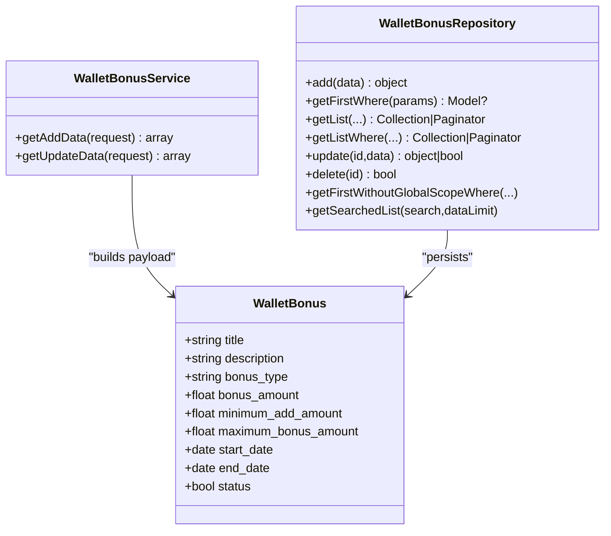
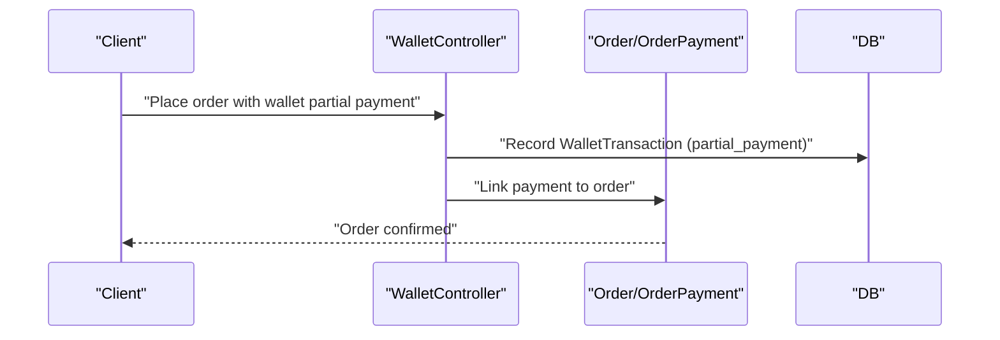
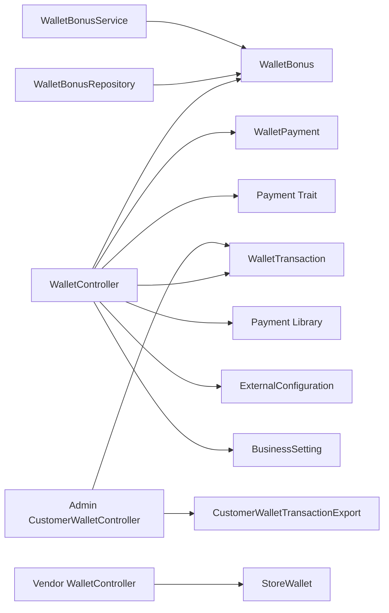

# Wallet System

<cite>
**Referenced Files in This Document**
- [WalletTransaction.php](file://app/Models/WalletTransaction.php)
- [WalletBonus.php](file://app/Models/WalletBonus.php)
- [WalletPayment.php](file://app/Models/WalletPayment.php)
- [WalletController.php](file://app/Http/Controllers/Api/V1/WalletController.php)
- [Admin_CustomerWalletController.php](file://app/Http/Controllers/Admin/CustomerWalletController.php)
- [Vendor_WalletController.php](file://app/Http/Controllers/Vendor/WalletController.php)
- [User.php](file://app/Models/User.php)
- [StoreWallet.php](file://app/Models/StoreWallet.php)
- [AdminWallet.php](file://app/Models/AdminWallet.php)
- [DeliveryManWallet.php](file://app/Models/DeliveryManWallet.php)
- [WalletBonusService.php](file://app/Services/WalletBonusService.php)
- [WalletBonusRepository.php](file://app/Repositories/WalletBonusRepository.php)
- [WalletBonusController.php](file://app/Http/Controllers/Admin/Customer/WalletBonusController.php)
- [create_wallet_transactions_table.php](file://database/migrations/2022_03_31_103418_create_wallet_transactions_table.php)
- [create_wallet_bonuses_table.php](file://database/migrations/2023_07_10_121938_create_wallet_bonuses_table.php)
- [create_wallet_payments_table.php](file://database/migrations/2023_07_09_143746_create_wallet_payments_table.php)
- [CustomerWalletTransactionExport.php](file://app/Exports/CustomerWalletTransactionExport.php)
- [Payment.php](file://app/Traits/Payment.php)
- [Payment.php](file://app/Library/Payment.php)
- [Payer.php](file://app/Library/Payer.php)
- [Receiver.php](file://app/Library/Receiver.php)
- [Helpers.php](file://app/Helpers.php)
- [ExternalConfiguration.php](file://app/Models/ExternalConfiguration.php)
- [BusinessSetting.php](file://app/Models/BusinessSetting.php)
- [WalletBonusAddRequest.php](file://app/Http/Requests/Admin/WalletBonusAddRequest.php)
- [WalletBonusUpdateRequest.php](file://app/Http/Requests/Admin/WalletBonusUpdateRequest.php)
- [Order.php](file://app/Models/Order.php)
- [OrderPayment.php](file://app/Models/OrderPayment.php)
- [OrderTransaction.php](file://app/Models/OrderTransaction.php)
- [OrderStatusService.php](file://app/Services/OrderStatusService.php)
- [OrderSecurityService.php](file://app/Services/OrderSecurityService.php)
</cite>

## Table of Contents
1. [Introduction](#introduction)
2. [Project Structure](#project-structure)
3. [Core Components](#core-components)
4. [Architecture Overview](#architecture-overview)
5. [Detailed Component Analysis](#detailed-component-analysis)
6. [Dependency Analysis](#dependency-analysis)
7. [Performance Considerations](#performance-considerations)
8. [Troubleshooting Guide](#troubleshooting-guide)
9. [Conclusion](#conclusion)
10. [Appendices](#appendices)

## Introduction
This document describes the integrated wallet system, covering balance management, transaction history, funding and withdrawal, bonus campaigns, promotional credits, reward accumulation, wallet-to-order payment integration, partial payments, refunds, security measures, transaction limits, audit trails, synchronization across multiple payment methods, and currency conversion within wallet balances.

## Project Structure
The wallet system spans models, controllers, repositories, services, migrations, exports, traits, and library/payment components. It integrates with order processing, external systems, and administrative reporting.

**Diagram sources**
- [WalletTransaction.php:1-29](file://app/Models/WalletTransaction.php#L1-L29)
- [WalletBonus.php:1-137](file://app/Models/WalletBonus.php#L1-L137)
- [WalletPayment.php:1-12](file://app/Models/WalletPayment.php#L1-L12)
- [WalletController.php:1-319](file://app/Http/Controllers/Api/V1/WalletController.php#L1-L319)
- [Admin_CustomerWalletController.php:1-287](file://app/Http/Controllers/Admin/CustomerWalletController.php#L1-L287)
- [Vendor_WalletController.php:1-318](file://app/Http/Controllers/Vendor/WalletController.php#L1-L318)
- [WalletBonusService.php:1-36](file://app/Services/WalletBonusService.php#L1-L36)
- [WalletBonusRepository.php:1-76](file://app/Repositories/WalletBonusRepository.php#L1-L76)
- [create_wallet_transactions_table.php:1-40](file://database/migrations/2022_03_31_103418_create_wallet_transactions_table.php#L1-L40)
- [create_wallet_payments_table.php:1-33](file://database/migrations/2023_07_09_143746_create_wallet_payments_table.php#L1-L33)
- [create_wallet_bonuses_table.php:1-37](file://database/migrations/2023_07_10_121938_create_wallet_bonuses_table.php#L1-L37)
- [CustomerWalletTransactionExport.php](file://app/Exports/CustomerWalletTransactionExport.php)

**Section sources**
- [WalletTransaction.php:1-29](file://app/Models/WalletTransaction.php#L1-L29)
- [WalletBonus.php:1-137](file://app/Models/WalletBonus.php#L1-L137)
- [WalletPayment.php:1-12](file://app/Models/WalletPayment.php#L1-L12)
- [WalletController.php:1-319](file://app/Http/Controllers/Api/V1/WalletController.php#L1-L319)
- [Admin_CustomerWalletController.php:1-287](file://app/Http/Controllers/Admin/CustomerWalletController.php#L1-L287)
- [Vendor_WalletController.php:1-318](file://app/Http/Controllers/Vendor/WalletController.php#L1-L318)
- [WalletBonusService.php:1-36](file://app/Services/WalletBonusService.php#L1-L36)
- [WalletBonusRepository.php:1-76](file://app/Repositories/WalletBonusRepository.php#L1-L76)
- [create_wallet_transactions_table.php:1-40](file://database/migrations/2022_03_31_103418_create_wallet_transactions_table.php#L1-L40)
- [create_wallet_payments_table.php:1-33](file://database/migrations/2023_07_09_143746_create_wallet_payments_table.php#L1-L33)
- [create_wallet_bonuses_table.php:1-37](file://database/migrations/2023_07_10_121938_create_wallet_bonuses_table.php#L1-L37)
- [CustomerWalletTransactionExport.php](file://app/Exports/CustomerWalletTransactionExport.php)

## Core Components
- WalletTransaction: Records credit/debit, bonuses, balance updates, and references per user.
- WalletBonus: Manages promotional bonus campaigns with type, amounts, min/max thresholds, and validity dates.
- WalletPayment: Tracks pending/failed/successful wallet funding attempts linked to payment methods.
- User: Holds wallet_balance and related user-level attributes.
- StoreWallet: Tracks vendor earnings, withdrawals, pending amounts, and collected cash.
- AdminWallet/DeliveryManWallet: Separate wallets for administrative and delivery personnel accounting.
- Controllers: API wallet endpoints, admin customer wallet actions, and vendor wallet operations.
- Services/Repositories: Bonus creation/update logic and persistence.
- Migrations: Schema definitions for wallet transactions, bonuses, and payments.
- Exports: Admin reporting of wallet transactions.

**Section sources**
- [WalletTransaction.php:1-29](file://app/Models/WalletTransaction.php#L1-L29)
- [WalletBonus.php:1-137](file://app/Models/WalletBonus.php#L1-L137)
- [WalletPayment.php:1-12](file://app/Models/WalletPayment.php#L1-L12)
- [User.php:65-78](file://app/Models/User.php#L65-L78)
- [StoreWallet.php:1-27](file://app/Models/StoreWallet.php#L1-L27)
- [AdminWallet.php:1-18](file://app/Models/AdminWallet.php#L1-L18)
- [DeliveryManWallet.php:1-27](file://app/Models/DeliveryManWallet.php#L1-L27)
- [WalletController.php:23-319](file://app/Http/Controllers/Api/V1/WalletController.php#L23-L319)
- [Admin_CustomerWalletController.php:18-287](file://app/Http/Controllers/Admin/CustomerWalletController.php#L18-L287)
- [Vendor_WalletController.php:31-318](file://app/Http/Controllers/Vendor/WalletController.php#L31-L318)
- [WalletBonusService.php:1-36](file://app/Services/WalletBonusService.php#L1-L36)
- [WalletBonusRepository.php:1-76](file://app/Repositories/WalletBonusRepository.php#L1-L76)
- [create_wallet_transactions_table.php:1-40](file://database/migrations/2022_03_31_103418_create_wallet_transactions_table.php#L1-L40)
- [create_wallet_payments_table.php:1-33](file://database/migrations/2023_07_09_143746_create_wallet_payments_table.php#L1-L33)
- [create_wallet_bonuses_table.php:1-37](file://database/migrations/2023_07_10_121938_create_wallet_bonuses_table.php#L1-L37)
- [CustomerWalletTransactionExport.php](file://app/Exports/CustomerWalletTransactionExport.php)

## Architecture Overview
The wallet system orchestrates:
- Funding via external payment gateways with a dedicated WalletPayment record and subsequent WalletTransaction entries.
- Bonus allocation governed by WalletBonus rules applied during funding.
- Transaction history filtered by type for UI/API consumption.
- Admin and vendor controls for adding funds, managing bonuses, and withdrawal requests.
- Cross-system synchronization with external wallet providers and currency checks.

**Diagram sources**
- [WalletController.php:63-139](file://app/Http/Controllers/Api/V1/WalletController.php#L63-L139)
- [Payment.php](file://app/Traits/Payment.php)
- [Payment.php](file://app/Library/Payment.php)
- [create_wallet_payments_table.php:1-33](file://database/migrations/2023_07_09_143746_create_wallet_payments_table.php#L1-L33)
- [create_wallet_transactions_table.php:1-40](file://database/migrations/2022_03_31_103418_create_wallet_transactions_table.php#L1-L40)

## Detailed Component Analysis

### Wallet Balance Management
- User wallet_balance is a float field used for checks and adjustments.
- WalletTransaction records each credit/debit and cumulative balance.
- StoreWallet computes balance as earnings minus withdrawals/pending/collected cash.

**Diagram sources**
- [User.php:65-78](file://app/Models/User.php#L65-L78)
- [WalletTransaction.php:1-29](file://app/Models/WalletTransaction.php#L1-L29)
- [StoreWallet.php:19-25](file://app/Models/StoreWallet.php#L19-L25)

**Section sources**
- [User.php:65-78](file://app/Models/User.php#L65-L78)
- [WalletTransaction.php:1-29](file://app/Models/WalletTransaction.php#L1-L29)
- [StoreWallet.php:19-25](file://app/Models/StoreWallet.php#L19-L25)

### Transaction History
- Filtering by transaction_type supports categories: order, loyalty_point, add_fund, referrer, CashBack.
- Paginated retrieval with limit/offset and typed filters.

**Diagram sources**
- [WalletController.php:25-61](file://app/Http/Controllers/Api/V1/WalletController.php#L25-L61)
- [create_wallet_transactions_table.php:16-27](file://database/migrations/2022_03_31_103418_create_wallet_transactions_table.php#L16-L27)

**Section sources**
- [WalletController.php:25-61](file://app/Http/Controllers/Api/V1/WalletController.php#L25-L61)
- [create_wallet_transactions_table.php:16-27](file://database/migrations/2022_03_31_103418_create_wallet_transactions_table.php#L16-L27)

### Wallet Funding Methods
- add_fund validates amount and payment_method, disables digital payments if setting is off.
- Creates a WalletPayment row with pending status and generates a payment link via Payment trait/library.
- On success/failure callbacks, WalletTransaction entries are created reflecting credits and balance updates.

**Diagram sources**
- [WalletController.php:63-139](file://app/Http/Controllers/Api/V1/WalletController.php#L63-L139)
- [create_wallet_payments_table.php:14-22](file://database/migrations/2023_07_09_143746_create_wallet_payments_table.php#L14-L22)
- [Payment.php](file://app/Traits/Payment.php)
- [Payment.php](file://app/Library/Payment.php)

**Section sources**
- [WalletController.php:63-139](file://app/Http/Controllers/Api/V1/WalletController.php#L63-L139)
- [create_wallet_payments_table.php:14-22](file://database/migrations/2023_07_09_143746_create_wallet_payments_table.php#L14-L22)
- [Payment.php](file://app/Traits/Payment.php)
- [Payment.php](file://app/Library/Payment.php)

### Withdrawal Processes
- Vendor wallet withdrawal requests validated against store balance and amount.
- Pending withdrawals increase pending_withdraw; approved requests trigger disbursement workflows.
- Admin and vendor controllers coordinate withdrawal method selection and notifications.

**Diagram sources**
- [Vendor_WalletController.php:40-87](file://app/Http/Controllers/Vendor/WalletController.php#L40-L87)
- [StoreWallet.php:19-25](file://app/Models/StoreWallet.php#L19-L25)

**Section sources**
- [Vendor_WalletController.php:40-87](file://app/Http/Controllers/Vendor/WalletController.php#L40-L87)
- [StoreWallet.php:19-25](file://app/Models/StoreWallet.php#L19-L25)

### Balance Reconciliation
- Admin reports summarize totals for credits, debits, and specific transaction types.
- Export functionality supports CSV/XLSX downloads for audit and reconciliation.

**Diagram sources**
- [Admin_CustomerWalletController.php:62-161](file://app/Http/Controllers/Admin/CustomerWalletController.php#L62-L161)
- [Admin_CustomerWalletController.php:163-277](file://app/Http/Controllers/Admin/CustomerWalletController.php#L163-L277)
- [CustomerWalletTransactionExport.php](file://app/Exports/CustomerWalletTransactionExport.php)

**Section sources**
- [Admin_CustomerWalletController.php:62-161](file://app/Http/Controllers/Admin/CustomerWalletController.php#L62-L161)
- [Admin_CustomerWalletController.php:163-277](file://app/Http/Controllers/Admin/CustomerWalletController.php#L163-L277)
- [CustomerWalletTransactionExport.php](file://app/Exports/CustomerWalletTransactionExport.php)

### Wallet Bonus Campaigns and Promotional Credits
- WalletBonus defines campaign metadata, eligibility thresholds, and validity windows.
- WalletBonusService prepares normalized data for add/update operations.
- WalletBonusRepository persists and manages campaigns with translation support.
- API endpoint retrieves active and running bonuses.

**Diagram sources**
- [WalletBonus.php:1-137](file://app/Models/WalletBonus.php#L1-L137)
- [WalletBonusService.php:1-36](file://app/Services/WalletBonusService.php#L1-L36)
- [WalletBonusRepository.php:1-76](file://app/Repositories/WalletBonusRepository.php#L1-L76)

**Section sources**
- [WalletBonus.php:1-137](file://app/Models/WalletBonus.php#L1-L137)
- [WalletBonusService.php:1-36](file://app/Services/WalletBonusService.php#L1-L36)
- [WalletBonusRepository.php:1-76](file://app/Repositories/WalletBonusRepository.php#L1-L76)
- [WalletBonusController.php:45-78](file://app/Http/Controllers/Admin/Customer/WalletBonusController.php#L45-L78)
- [WalletController.php:141-145](file://app/Http/Controllers/Api/V1/WalletController.php#L141-L145)

### Reward Accumulation and Redemption
- WalletTransaction tracks admin_bonus and balance after each event.
- Order-related transaction types include order_place, order_refund, and partial_payment.
- Loyalty point and CashBack types are supported for historical categorization.

**Section sources**
- [WalletTransaction.php:14-22](file://app/Models/WalletTransaction.php#L14-L22)
- [WalletController.php:36-52](file://app/Http/Controllers/Api/V1/WalletController.php#L36-L52)

### Wallet-to-Order Payment Integration and Partial Payments
- OrderPayment and OrderTransaction models integrate with wallet usage for full/partial payments.
- WalletController supports transaction types including partial_payment and order_refund/order_place.
- OrderSecurityService and OrderStatusService manage order lifecycle and security constraints.

**Diagram sources**
- [WalletController.php:36-52](file://app/Http/Controllers/Api/V1/WalletController.php#L36-L52)
- [OrderPayment.php](file://app/Models/OrderPayment.php)
- [OrderTransaction.php](file://app/Models/OrderTransaction.php)
- [OrderSecurityService.php](file://app/Services/OrderSecurityService.php)
- [OrderStatusService.php](file://app/Services/OrderStatusService.php)

**Section sources**
- [WalletController.php:36-52](file://app/Http/Controllers/Api/V1/WalletController.php#L36-L52)
- [OrderPayment.php](file://app/Models/OrderPayment.php)
- [OrderTransaction.php](file://app/Models/OrderTransaction.php)
- [OrderSecurityService.php](file://app/Services/OrderSecurityService.php)
- [OrderStatusService.php](file://app/Services/OrderStatusService.php)

### Wallet Refund Mechanisms
- Refunds are recorded as credits in WalletTransaction with appropriate transaction_type.
- Admin reporting aggregates order_refund totals for reconciliation.

**Section sources**
- [Admin_CustomerWalletController.php:75-115](file://app/Http/Controllers/Admin/CustomerWalletController.php#L75-L115)
- [create_wallet_transactions_table.php:16-27](file://database/migrations/2022_03_31_103418_create_wallet_transactions_table.php#L16-L27)

### Security Measures, Transaction Limits, and Audit Trails
- Digital payment enablement controlled by business settings.
- External configuration checks for cross-system transfers.
- Currency code enforcement for inter-system wallet transfers.
- Audit-ready WalletTransaction timestamps and references.
- Admin notifications and email confirmations for fund additions.

**Section sources**
- [WalletController.php:74-77](file://app/Http/Controllers/Api/V1/WalletController.php#L74-L77)
- [WalletController.php:166-228](file://app/Http/Controllers/Api/V1/WalletController.php#L166-L228)
- [WalletController.php:248-254](file://app/Http/Controllers/Api/V1/WalletController.php#L248-L254)
- [Admin_CustomerWalletController.php:44-52](file://app/Http/Controllers/Admin/CustomerWalletController.php#L44-L52)
- [create_wallet_transactions_table.php:12-27](file://database/migrations/2022_03_31_103418_create_wallet_transactions_table.php#L12-L27)

### Synchronization Across Multiple Payment Methods and Currency Conversion
- WalletPayment stores payment_method and payment_status for reconciliation.
- External wallet transfer endpoints validate currency codes and tokens.
- BusinessSetting provides currency context for payment generation.

**Section sources**
- [create_wallet_payments_table.php:14-22](file://database/migrations/2023_07_09_143746_create_wallet_payments_table.php#L14-L22)
- [WalletController.php:166-228](file://app/Http/Controllers/Api/V1/WalletController.php#L166-L228)
- [WalletController.php:248-254](file://app/Http/Controllers/Api/V1/WalletController.php#L248-L254)
- [BusinessSetting.php](file://app/Models/BusinessSetting.php)

## Dependency Analysis
- Controllers depend on models, services, and traits for payment orchestration.
- Repositories encapsulate WalletBonus persistence and queries.
- Exports rely on WalletTransaction data for reporting.
- External integrations require ExternalConfiguration and BusinessSetting.

**Diagram sources**
- [WalletController.php:1-319](file://app/Http/Controllers/Api/V1/WalletController.php#L1-L319)
- [Admin_CustomerWalletController.php:1-287](file://app/Http/Controllers/Admin/CustomerWalletController.php#L1-L287)
- [Vendor_WalletController.php:1-318](file://app/Http/Controllers/Vendor/WalletController.php#L1-L318)
- [WalletBonusRepository.php:1-76](file://app/Repositories/WalletBonusRepository.php#L1-L76)
- [WalletBonusService.php:1-36](file://app/Services/WalletBonusService.php#L1-L36)
- [ExternalConfiguration.php](file://app/Models/ExternalConfiguration.php)
- [BusinessSetting.php](file://app/Models/BusinessSetting.php)

**Section sources**
- [WalletController.php:1-319](file://app/Http/Controllers/Api/V1/WalletController.php#L1-L319)
- [Admin_CustomerWalletController.php:1-287](file://app/Http/Controllers/Admin/CustomerWalletController.php#L1-L287)
- [Vendor_WalletController.php:1-318](file://app/Http/Controllers/Vendor/WalletController.php#L1-L318)
- [WalletBonusRepository.php:1-76](file://app/Repositories/WalletBonusRepository.php#L1-L76)
- [WalletBonusService.php:1-36](file://app/Services/WalletBonusService.php#L1-L36)
- [ExternalConfiguration.php](file://app/Models/ExternalConfiguration.php)
- [BusinessSetting.php](file://app/Models/BusinessSetting.php)

## Performance Considerations
- Use indexed columns for user_id, created_at, and transaction_type in WalletTransaction for efficient filtering and pagination.
- Batch reconciliation exports leverage aggregated queries to minimize memory footprint.
- Cache frequently accessed business settings (e.g., currency, digital payment status) to reduce repeated reads.

[No sources needed since this section provides general guidance]

## Troubleshooting Guide
Common issues and resolutions:
- Insufficient funds: WalletController checks user wallet_balance before transfers and returns specific error codes/messages.
- Currency mismatch: External transfer endpoints validate currency codes and return error_code 405.
- Drivemond account not found: Validation failures return error_code 402 or 403 depending on context.
- Digital payment disabled: add_fund rejects requests when digital payment setting is off.
- Transaction export failures: Ensure filters and date ranges are valid; verify export permissions.

**Section sources**
- [WalletController.php:158-165](file://app/Http/Controllers/Api/V1/WalletController.php#L158-L165)
- [WalletController.php:206-212](file://app/Http/Controllers/Api/V1/WalletController.php#L206-L212)
- [WalletController.php:248-254](file://app/Http/Controllers/Api/V1/WalletController.php#L248-L254)
- [WalletController.php:267-308](file://app/Http/Controllers/Api/V1/WalletController.php#L267-L308)
- [WalletController.php:74-77](file://app/Http/Controllers/Api/V1/WalletController.php#L74-L77)

## Conclusion
The wallet system provides robust balance management, comprehensive transaction tracking, flexible funding and withdrawal mechanisms, structured bonus campaigns, and secure integration with external systems. Admin and vendor controls, combined with audit-ready exports and currency-aware transfers, support scalable operations across multiple payment methods.

## Appendices
- Data model relationships and key attributes are defined in the referenced model files and migrations.
- Administrative controls for bonus management and wallet reporting are implemented in dedicated controllers and repositories.