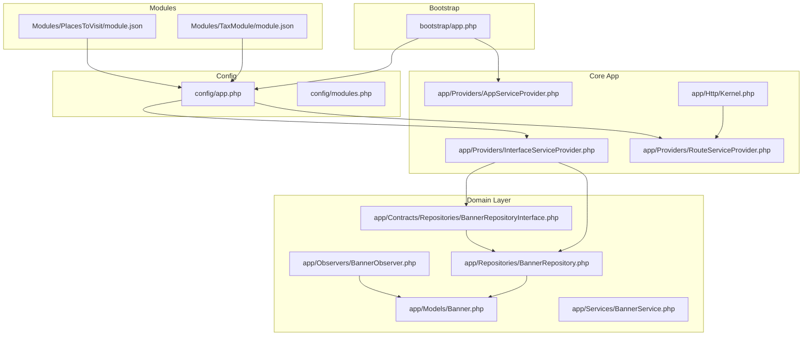
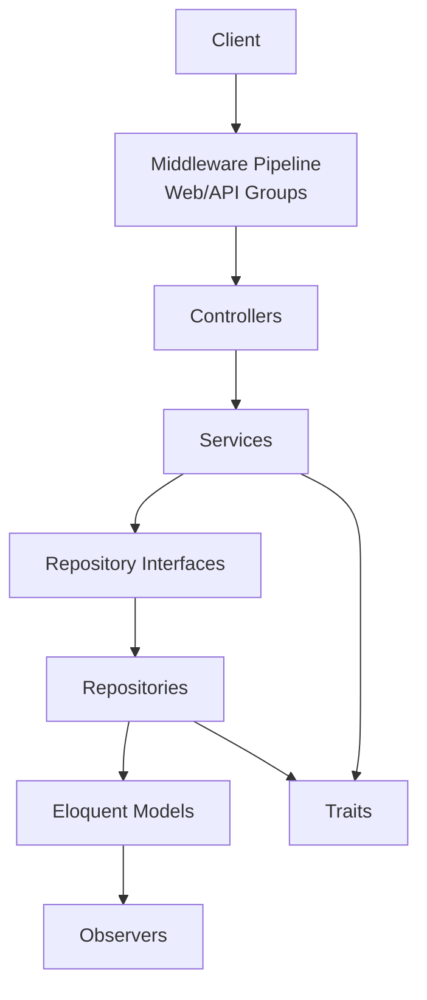
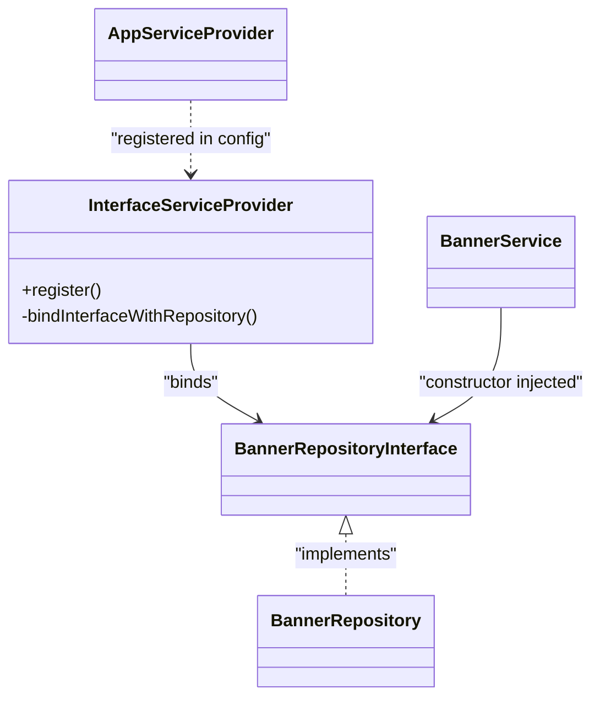
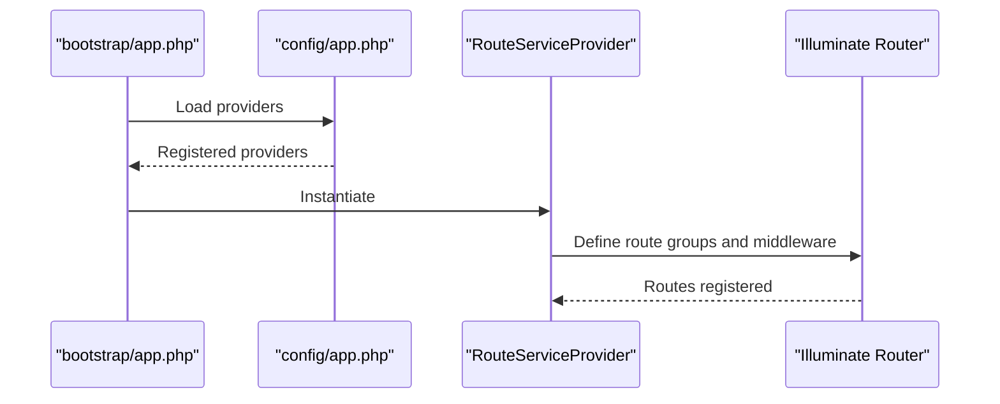
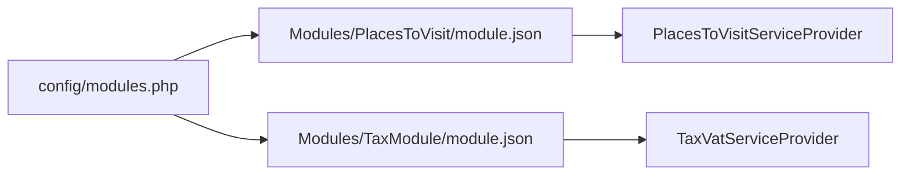
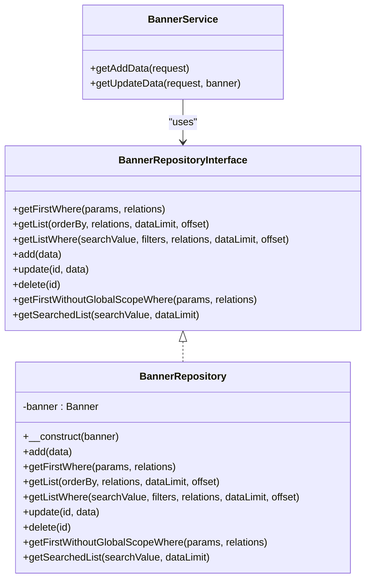
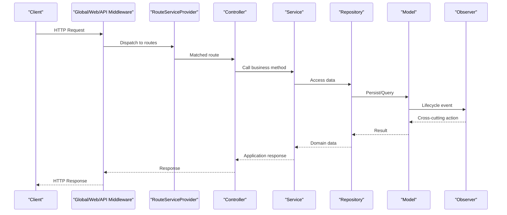
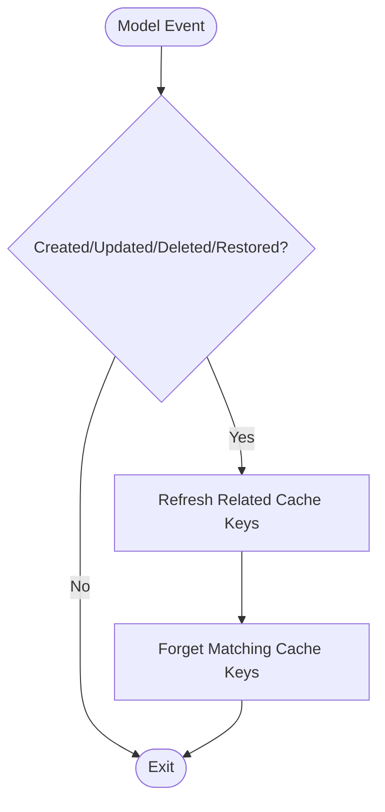
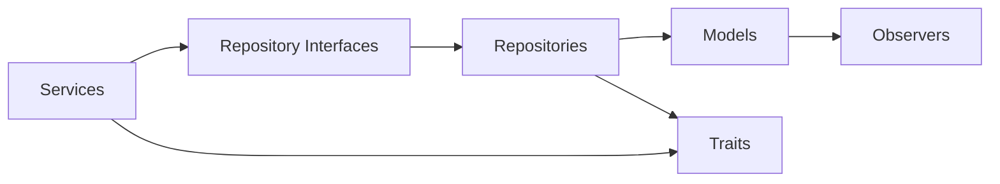

# Core Architecture

<cite>
**Referenced Files in This Document**
- [bootstrap/app.php](file://bootstrap/app.php)
- [config/app.php](file://config/app.php)
- [config/modules.php](file://config/modules.php)
- [app/Providers/AppServiceProvider.php](file://app/Providers/AppServiceProvider.php)
- [app/Providers/InterfaceServiceProvider.php](file://app/Providers/InterfaceServiceProvider.php)
- [app/Providers/RouteServiceProvider.php](file://app/Providers/RouteServiceProvider.php)
- [app/Http/Kernel.php](file://app/Http/Kernel.php)
- [app/Contracts/Repositories/BannerRepositoryInterface.php](file://app/Contracts/Repositories/BannerRepositoryInterface.php)
- [app/Repositories/BannerRepository.php](file://app/Repositories/BannerRepository.php)
- [app/Services/BannerService.php](file://app/Services/BannerService.php)
- [app/Models/Banner.php](file://app/Models/Banner.php)
- [app/Observers/BannerObserver.php](file://app/Observers/BannerObserver.php)
- [Modules/PlacesToVisit/module.json](file://Modules/PlacesToVisit/module.json)
- [Modules/TaxModule/module.json](file://Modules/TaxModule/module.json)
</cite>

## Table of Contents
1. [Introduction](#introduction)
2. [Project Structure](#project-structure)
3. [Core Components](#core-components)
4. [Architecture Overview](#architecture-overview)
5. [Detailed Component Analysis](#detailed-component-analysis)
6. [Dependency Analysis](#dependency-analysis)
7. [Performance Considerations](#performance-considerations)
8. [Troubleshooting Guide](#troubleshooting-guide)
9. [Conclusion](#conclusion)

## Introduction
This document describes the core system design of Waddy Back, focusing on the Laravel MVC architecture, the service container and dependency injection patterns, the provider registration system, the module-based architecture using Nwidart Laravel Modules, the repository pattern for data access abstraction, service layer patterns for business logic encapsulation, middleware pipeline architecture, request/response flow, cross-cutting concerns handling, observer and trait usage, and scalability/performance considerations.

## Project Structure
Waddy Back follows a layered Laravel MVC structure with:
- A central application core under app/ containing Models, Repositories, Services, Contracts, Observers, Traits, Providers, and Http components.
- A modular system under Modules/ implementing feature modules via Nwidart Laravel Modules.
- Configuration under config/ controlling providers, module scanning, and runtime behavior.
- Bootstrapping under bootstrap/ initializing the application container and singleton bindings.

**Diagram sources**
- [bootstrap/app.php:14-42](file://bootstrap/app.php#L14-L42)
- [config/app.php:139-186](file://config/app.php#L139-L186)
- [config/modules.php:63-132](file://config/modules.php#L63-L132)
- [app/Providers/AppServiceProvider.php:29-47](file://app/Providers/AppServiceProvider.php#L29-L47)
- [app/Providers/InterfaceServiceProvider.php:20-36](file://app/Providers/InterfaceServiceProvider.php#L20-L36)
- [app/Providers/RouteServiceProvider.php:50-82](file://app/Providers/RouteServiceProvider.php#L50-L82)
- [app/Http/Kernel.php:18-86](file://app/Http/Kernel.php#L18-L86)
- [app/Models/Banner.php:33-195](file://app/Models/Banner.php#L33-L195)
- [app/Observers/BannerObserver.php:10-69](file://app/Observers/BannerObserver.php#L10-L69)
- [app/Contracts/Repositories/BannerRepositoryInterface.php:8-23](file://app/Contracts/Repositories/BannerRepositoryInterface.php#L8-L23)
- [app/Repositories/BannerRepository.php:14-89](file://app/Repositories/BannerRepository.php#L14-L89)
- [app/Services/BannerService.php:8-38](file://app/Services/BannerService.php#L8-L38)
- [Modules/PlacesToVisit/module.json:11-13](file://Modules/PlacesToVisit/module.json#L11-L13)
- [Modules/TaxModule/module.json:7-9](file://Modules/TaxModule/module.json#L7-L9)

**Section sources**
- [bootstrap/app.php:14-42](file://bootstrap/app.php#L14-L42)
- [config/app.php:139-186](file://config/app.php#L139-L186)
- [config/modules.php:63-132](file://config/modules.php#L63-L132)

## Core Components
- Service Container and Singletons: The bootstrap initializes the application container and binds kernel and exception handler singletons.
- Provider Registration: The application registers framework, package, and custom providers, including InterfaceServiceProvider for dynamic repository binding.
- Module System: Nwidart Modules scans and activates modules via module.json manifests and activator configuration.
- MVC and Patterns:
  - Models encapsulate domain logic and global scopes.
  - Repositories abstract persistence behind interfaces.
  - Services encapsulate business logic and coordinate repositories.
  - Observers handle cross-cutting model lifecycle concerns.
  - Traits provide reusable functionality across services and models.

**Section sources**
- [bootstrap/app.php:29-42](file://bootstrap/app.php#L29-L42)
- [config/app.php:139-186](file://config/app.php#L139-L186)
- [app/Providers/InterfaceServiceProvider.php:20-36](file://app/Providers/InterfaceServiceProvider.php#L20-L36)
- [config/modules.php:246-277](file://config/modules.php#L246-L277)
- [Modules/PlacesToVisit/module.json:11-13](file://Modules/PlacesToVisit/module.json#L11-L13)
- [Modules/TaxModule/module.json:7-9](file://Modules/TaxModule/module.json#L7-L9)

## Architecture Overview
The system follows a layered architecture:
- Presentation: Http controllers receive requests and delegate to services.
- Application: Services orchestrate business logic and interact with repositories.
- Persistence: Repositories encapsulate Eloquent queries and persistence.
- Domain: Models define entity state, relations, and lifecycle hooks.
- Cross-cutting: Observers react to model events; traits provide shared behavior; middleware enforces policies.

**Diagram sources**
- [app/Http/Kernel.php:18-86](file://app/Http/Kernel.php#L18-L86)
- [app/Providers/RouteServiceProvider.php:50-82](file://app/Providers/RouteServiceProvider.php#L50-L82)
- [app/Providers/InterfaceServiceProvider.php:20-36](file://app/Providers/InterfaceServiceProvider.php#L20-L36)
- [app/Repositories/BannerRepository.php:14-89](file://app/Repositories/BannerRepository.php#L14-L89)
- [app/Services/BannerService.php:8-38](file://app/Services/BannerService.php#L8-L38)
- [app/Models/Banner.php:33-195](file://app/Models/Banner.php#L33-L195)
- [app/Observers/BannerObserver.php:10-69](file://app/Observers/BannerObserver.php#L10-L69)

## Detailed Component Analysis

### Service Container and Dependency Injection
- Singleton bindings for HTTP and console kernels and exception handler are established early in bootstrap.
- InterfaceServiceProvider dynamically binds repository interfaces to concrete implementations discovered in app/Repositories and app/Contracts/Repositories.
- This enables constructor injection of interfaces throughout services and controllers, promoting testability and loose coupling.

**Diagram sources**
- [app/Providers/InterfaceServiceProvider.php:15-36](file://app/Providers/InterfaceServiceProvider.php#L15-L36)
- [app/Contracts/Repositories/BannerRepositoryInterface.php:8-23](file://app/Contracts/Repositories/BannerRepositoryInterface.php#L8-L23)
- [app/Repositories/BannerRepository.php:14-18](file://app/Repositories/BannerRepository.php#L14-L18)
- [app/Services/BannerService.php:8-10](file://app/Services/BannerService.php#L8-L10)
- [config/app.php:174-184](file://config/app.php#L174-L184)

**Section sources**
- [bootstrap/app.php:29-42](file://bootstrap/app.php#L29-L42)
- [app/Providers/InterfaceServiceProvider.php:15-36](file://app/Providers/InterfaceServiceProvider.php#L15-L36)
- [config/app.php:174-184](file://config/app.php#L174-L184)

### Provider Registration System
- Framework and package providers are autoloaded from config/app.php.
- App-specific providers (AppServiceProvider, EventServiceProvider, RouteServiceProvider, FirebaseServiceProvider, etc.) are registered centrally.
- RouteServiceProvider defines route groups by prefix and middleware, enabling modular routing and API versioning.

**Diagram sources**
- [bootstrap/app.php:14-42](file://bootstrap/app.php#L14-L42)
- [config/app.php:139-186](file://config/app.php#L139-L186)
- [app/Providers/RouteServiceProvider.php:50-82](file://app/Providers/RouteServiceProvider.php#L50-L82)

**Section sources**
- [config/app.php:139-186](file://config/app.php#L139-L186)
- [app/Providers/RouteServiceProvider.php:50-82](file://app/Providers/RouteServiceProvider.php#L50-L82)

### Module-Based Architecture with Nwidart Laravel Modules
- Module discovery and generation paths are configured in config/modules.php.
- Modules declare providers in their module.json manifests; these providers are resolved by the framework and can register bindings, routes, and services.
- Example modules: PlacesToVisit and TaxModule register their respective service providers.

**Diagram sources**
- [config/modules.php:63-132](file://config/modules.php#L63-L132)
- [Modules/PlacesToVisit/module.json:11-13](file://Modules/PlacesToVisit/module.json#L11-L13)
- [Modules/TaxModule/module.json:7-9](file://Modules/TaxModule/module.json#L7-L9)

**Section sources**
- [config/modules.php:63-132](file://config/modules.php#L63-L132)
- [Modules/PlacesToVisit/module.json:11-13](file://Modules/PlacesToVisit/module.json#L11-L13)
- [Modules/TaxModule/module.json:7-9](file://Modules/TaxModule/module.json#L7-L9)

### Repository Pattern and Service Layer
- Repository Interface: Defines contract methods for data access (e.g., BannerRepositoryInterface).
- Repository Implementation: Implements Eloquent operations and pagination/search logic (e.g., BannerRepository).
- Service Layer: Encapsulates business logic and coordinates repository operations (e.g., BannerService).
- Dependency Injection: Services receive repository interfaces via constructor injection; InterfaceServiceProvider binds interfaces to implementations.

**Diagram sources**
- [app/Contracts/Repositories/BannerRepositoryInterface.php:8-23](file://app/Contracts/Repositories/BannerRepositoryInterface.php#L8-L23)
- [app/Repositories/BannerRepository.php:14-89](file://app/Repositories/BannerRepository.php#L14-L89)
- [app/Services/BannerService.php:8-38](file://app/Services/BannerService.php#L8-L38)

**Section sources**
- [app/Contracts/Repositories/BannerRepositoryInterface.php:8-23](file://app/Contracts/Repositories/BannerRepositoryInterface.php#L8-L23)
- [app/Repositories/BannerRepository.php:14-89](file://app/Repositories/BannerRepository.php#L14-L89)
- [app/Services/BannerService.php:8-38](file://app/Services/BannerService.php#L8-L38)
- [app/Providers/InterfaceServiceProvider.php:20-36](file://app/Providers/InterfaceServiceProvider.php#L20-L36)

### Middleware Pipeline and Request/Response Flow
- Global middleware stack and named middleware groups are defined in Http Kernel.
- RouteServiceProvider registers route groups with prefixes and middleware stacks.
- Typical flow: Client → Global/Web/API middleware → Route → Controller → Service → Repository → Model → Observer/Cross-cutting → Response.

**Diagram sources**
- [app/Http/Kernel.php:18-86](file://app/Http/Kernel.php#L18-L86)
- [app/Providers/RouteServiceProvider.php:50-82](file://app/Providers/RouteServiceProvider.php#L50-L82)
- [app/Services/BannerService.php:12-35](file://app/Services/BannerService.php#L12-L35)
- [app/Repositories/BannerRepository.php:20-72](file://app/Repositories/BannerRepository.php#L20-L72)
- [app/Models/Banner.php:175-193](file://app/Models/Banner.php#L175-L193)
- [app/Observers/BannerObserver.php:15-50](file://app/Observers/BannerObserver.php#L15-L50)

**Section sources**
- [app/Http/Kernel.php:18-86](file://app/Http/Kernel.php#L18-L86)
- [app/Providers/RouteServiceProvider.php:50-82](file://app/Providers/RouteServiceProvider.php#L50-L82)

### Cross-Cutting Concerns: Observers and Traits
- Observers: BannerObserver reacts to model lifecycle events to invalidate related caches.
- Traits: FileManagerTrait and others provide reusable functionality for services and models.

**Diagram sources**
- [app/Observers/BannerObserver.php:15-67](file://app/Observers/BannerObserver.php#L15-L67)
- [app/Models/Banner.php:175-193](file://app/Models/Banner.php#L175-L193)

**Section sources**
- [app/Observers/BannerObserver.php:10-69](file://app/Observers/BannerObserver.php#L10-L69)
- [app/Models/Banner.php:175-193](file://app/Models/Banner.php#L175-L193)

## Dependency Analysis
- Coupling: Services depend on repository interfaces, minimizing coupling to concrete implementations.
- Cohesion: Repositories encapsulate persistence logic; Services encapsulate business logic; Models encapsulate domain state and behavior.
- External Dependencies: Nwidart Modules, Laravel framework providers, and third-party packages registered in config/app.php.
- Circular Dependencies: None observed in the analyzed components; InterfaceServiceProvider avoids cycles by binding interfaces to existing implementations.

**Diagram sources**
- [app/Providers/InterfaceServiceProvider.php:20-36](file://app/Providers/InterfaceServiceProvider.php#L20-L36)
- [app/Services/BannerService.php:8-10](file://app/Services/BannerService.php#L8-L10)
- [app/Repositories/BannerRepository.php:14-18](file://app/Repositories/BannerRepository.php#L14-L18)
- [app/Models/Banner.php:33-195](file://app/Models/Banner.php#L33-L195)
- [app/Observers/BannerObserver.php:10-69](file://app/Observers/BannerObserver.php#L10-L69)

**Section sources**
- [app/Providers/InterfaceServiceProvider.php:20-36](file://app/Providers/InterfaceServiceProvider.php#L20-L36)
- [app/Services/BannerService.php:8-10](file://app/Services/BannerService.php#L8-L10)
- [app/Repositories/BannerRepository.php:14-18](file://app/Repositories/BannerRepository.php#L14-L18)
- [app/Models/Banner.php:33-195](file://app/Models/Banner.php#L33-L195)

## Performance Considerations
- Pagination: Repositories use paginate to limit result sets; ensure appropriate dataLimit usage in services.
- Global Scopes: Models apply global scopes for localization and storage; consider selective disabling when performance-critical queries are needed.
- Caching: Observers invalidate related cache keys; ensure cache backend is tuned and keys are scoped appropriately.
- Middleware Throttling: RouteServiceProvider configures rate limiters for API, auth, and OTP flows; adjust limits per environment.
- Memory Limits: bootstrap/app.php increases memory limit; monitor memory usage in long-running jobs and batch operations.

[No sources needed since this section provides general guidance]

## Troubleshooting Guide
- Repository Binding Failures: Verify InterfaceServiceProvider discovers matching interface and repository filenames and that module.json providers are registered.
- Middleware Issues: Confirm route groups and middleware assignments in RouteServiceProvider and Http Kernel match intended behavior.
- Observer Cache Invalidation: Ensure cache keys are prefixed consistently and that the cache store is reachable.
- Module Activation: Check modules_statuses.json and config/modules.php activator settings.

**Section sources**
- [app/Providers/InterfaceServiceProvider.php:20-36](file://app/Providers/InterfaceServiceProvider.php#L20-L36)
- [app/Providers/RouteServiceProvider.php:50-82](file://app/Providers/RouteServiceProvider.php#L50-L82)
- [app/Http/Kernel.php:18-86](file://app/Http/Kernel.php#L18-L86)
- [app/Observers/BannerObserver.php:52-67](file://app/Observers/BannerObserver.php#L52-L67)
- [config/modules.php:267-277](file://config/modules.php#L267-L277)

## Conclusion
Waddy Back employs a clean separation of concerns leveraging Laravel’s service container, repository/service patterns, and Nwidart Modules. The design promotes modularity, testability, and maintainability while supporting scalable growth through configurable providers, middleware pipelines, and cross-cutting concerns handled by observers and traits.