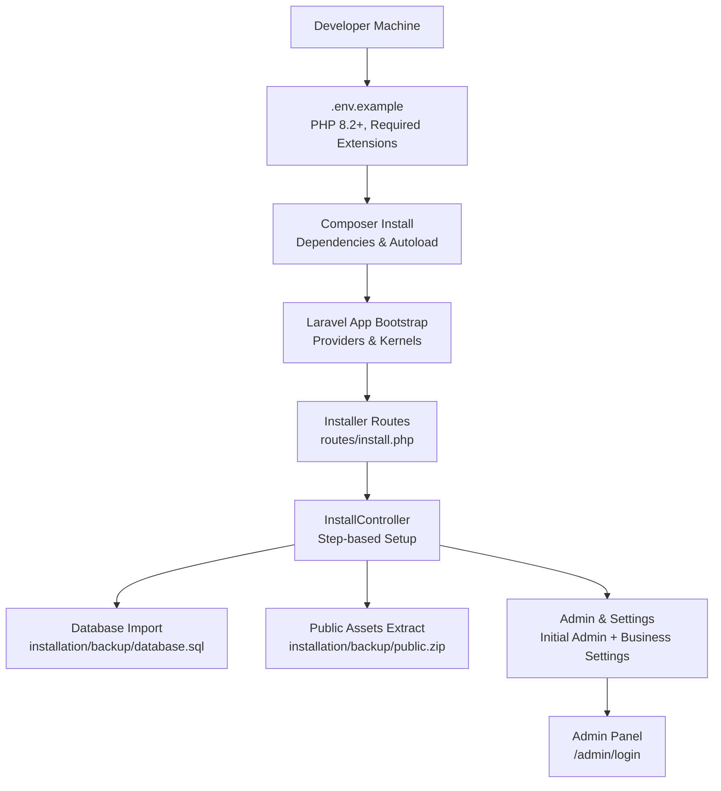
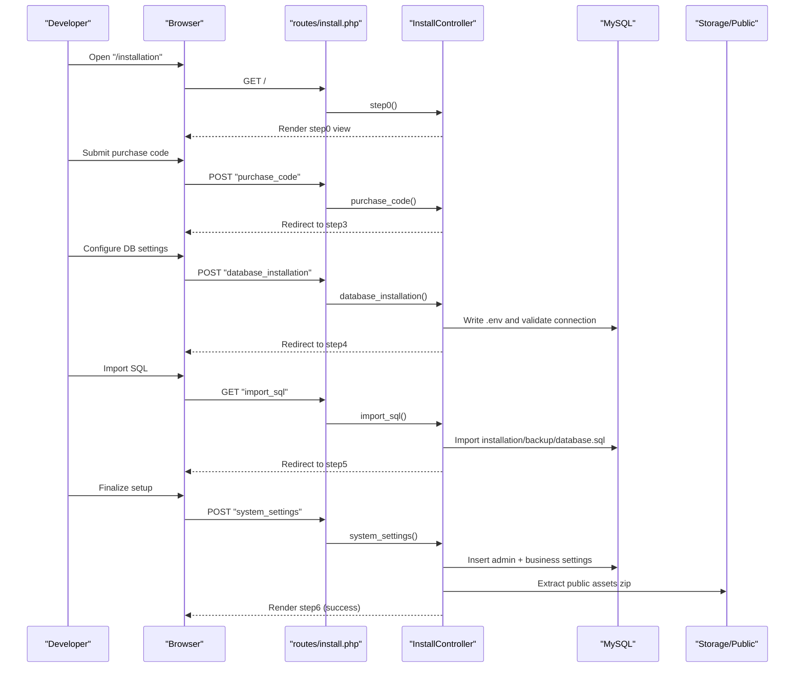
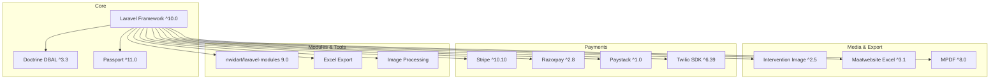

# Getting Started

<cite>
**Referenced Files in This Document**
- [composer.json](file://composer.json)
- [.env.example](file://.env.example)
- [config/app.php](file://config/app.php)
- [config/database.php](file://config/database.php)
- [config/mail.php](file://config/mail.php)
- [config/cache.php](file://config/cache.php)
- [config/queue.php](file://config/queue.php)
- [config/session.php](file://config/session.php)
- [config/modules.php](file://config/modules.php)
- [bootstrap/app.php](file://bootstrap/app.php)
- [routes/install.php](file://routes/install.php)
- [installation/activate_install_routes.txt](file://installation/activate_install_routes.txt)
- [app/Http/Controllers/InstallController.php](file://app/Http/Controllers/InstallController.php)
- [resources/views/installation](file://resources/views/installation)
- [installation/backup/database.sql](file://installation/backup/database.sql)
- [installation/backup/public.zip](file://installation/backup/public.zip)
- [README.md](file://README.md)
</cite>

## Table of Contents
1. [Introduction](#introduction)
2. [Project Structure](#project-structure)
3. [Core Components](#core-components)
4. [Architecture Overview](#architecture-overview)
5. [Detailed Component Analysis](#detailed-component-analysis)
6. [Dependency Analysis](#dependency-analysis)
7. [Performance Considerations](#performance-considerations)
8. [Troubleshooting Guide](#troubleshooting-guide)
9. [Conclusion](#conclusion)
10. [Appendices](#appendices)

## Introduction
This guide helps you install and configure the Waddy Back platform from environment setup to the first-time admin experience. It covers prerequisites, step-by-step installation, initial configuration, and common troubleshooting. The content is designed to be accessible to developers with varying Laravel experience levels.

## Project Structure
Waddy Back is a Laravel 10 application with a modular architecture using the nwidart/laravel-modules package. The installation process is handled through a dedicated installer that generates the environment file, imports the database, and sets up initial system settings and assets.

**Diagram sources**
- [composer.json:1-131](file://composer.json#L1-L131)
- [bootstrap/app.php:1-62](file://bootstrap/app.php#L1-L62)
- [routes/install.php:1-22](file://routes/install.php#L1-L22)
- [app/Http/Controllers/InstallController.php:1-260](file://app/Http/Controllers/InstallController.php#L1-L260)
- [installation/backup/database.sql](file://installation/backup/database.sql)
- [installation/backup/public.zip](file://installation/backup/public.zip)

**Section sources**
- [README.md:1-74](file://README.md#L1-L74)
- [composer.json:1-131](file://composer.json#L1-L131)
- [config/modules.php:1-278](file://config/modules.php#L1-L278)

## Core Components
- Prerequisites and environment
  - PHP: ^8.2
  - Required PHP extensions: curl, json, simplexml
  - Laravel Framework: ^10.0
  - Additional packages include database abstraction, image processing, Excel export, spatial extensions, and multiple payment SDKs
- Database configuration
  - Default connection: mysql
  - Charset: utf8mb4
  - Collation: utf8mb4_unicode_ci
  - Support for sqlite, pgsql, sqlsrv included
- Installer and routes
  - Installer routes are mounted conditionally via a service provider
  - Step-based installation flow handles environment generation, database import, and initial admin creation
- Initial configuration
  - Application name, environment, key, URL, and cache/session/queue drivers are set during installation
  - Business settings and admin credentials are created during step 6

**Section sources**
- [composer.json:7-40](file://composer.json#L7-L40)
- [config/database.php:36-94](file://config/database.php#L36-L94)
- [routes/install.php:6-21](file://routes/install.php#L6-L21)
- [installation/activate_install_routes.txt:50-54](file://installation/activate_install_routes.txt#L50-L54)
- [app/Http/Controllers/InstallController.php:162-216](file://app/Http/Controllers/InstallController.php#L162-L216)

## Architecture Overview
The installation flow is orchestrated by the installer routes and controller. The controller writes the environment file, imports SQL, extracts public assets, creates the admin user, and updates business settings. The application’s providers and modules are initialized afterward.

**Diagram sources**
- [routes/install.php:6-21](file://routes/install.php#L6-L21)
- [app/Http/Controllers/InstallController.php:88-160](file://app/Http/Controllers/InstallController.php#L88-L160)
- [installation/backup/database.sql](file://installation/backup/database.sql)
- [installation/backup/public.zip](file://installation/backup/public.zip)

## Detailed Component Analysis

### Prerequisites and Environment Setup
- PHP version and extensions
  - PHP version requirement: ^8.2
  - Required extensions: curl, json, simplexml
- Laravel and package dependencies
  - Laravel Framework ^10.0
  - Doctrine DBAL, Intervention Image, Passport, Excel, MPDF, Firebase, Stripe, Razorpay, Paystack, Twilio, and others
- Environment template
  - Copy .env.example to .env
  - APP_KEY is generated automatically during project creation via Composer scripts

**Section sources**
- [composer.json:8-11](file://composer.json#L8-L11)
- [composer.json:21](file://composer.json#L21)
- [.env.example:1-51](file://.env.example#L1-L51)
- [composer.json:88-93](file://composer.json#L88-L93)

### Database Setup
- Default connection: mysql with utf8mb4 charset and utf8mb4_unicode_ci collation
- Optional connections: sqlite, pgsql, sqlsrv
- SSL configuration for MySQL via environment variables
- Redis client and cache prefixes configurable via environment

**Section sources**
- [config/database.php:46-64](file://config/database.php#L46-L64)
- [config/database.php:120-145](file://config/database.php#L120-L145)

### Installation Steps

#### Step 1: Requirements Check
- Validates PHP extensions and write permissions for key files
- Checks availability of curl, bcmath, ctype, json, mbstring, openssl, pdo, tokenizer, xml, zip, fileinfo, gd, sodium, pdo_mysql
- Verifies write permissions for .env and the RouteServiceProvider file

**Section sources**
- [app/Http/Controllers/InstallController.php:25-50](file://app/Http/Controllers/InstallController.php#L25-L50)

#### Step 2: Purchase Code Validation
- Captures buyer username, purchase code, and domain
- Stores values in environment and session for subsequent steps

**Section sources**
- [app/Http/Controllers/InstallController.php:88-107](file://app/Http/Controllers/InstallController.php#L88-L107)

#### Step 3: Database Configuration
- Generates .env with APP_KEY, APP_URL, DB_* settings
- Validates database connectivity before proceeding

**Section sources**
- [app/Http/Controllers/InstallController.php:162-216](file://app/Http/Controllers/InstallController.php#L162-L216)

#### Step 4: Database Import
- Imports installation/backup/database.sql
- Creates cache table for cache driver
- Handles existing data scenarios with optional force import

**Section sources**
- [app/Http/Controllers/InstallController.php:218-245](file://app/Http/Controllers/InstallController.php#L218-L245)
- [installation/backup/database.sql](file://installation/backup/database.sql)

#### Step 5: Public Assets Extraction
- Extracts installation/backup/public.zip to storage/app/public
- Ensures assets are available for admin and vendor panels

**Section sources**
- [app/Http/Controllers/InstallController.php:149-159](file://app/Http/Controllers/InstallController.php#L149-L159)
- [installation/backup/public.zip](file://installation/backup/public.zip)

#### Step 6: System Settings and Admin Creation
- Inserts initial admin record with role and hashed password
- Updates business settings (e.g., business_name, system_language)
- Sets login URLs for admin/admin-employee/store/store-employee
- Enables daily subscription validity checks and country picker/manual login flags

**Section sources**
- [app/Http/Controllers/InstallController.php:109-160](file://app/Http/Controllers/InstallController.php#L109-L160)

### First-Time User Experience and Navigation
- Admin panel URL: /admin/login
- After successful installation, the installer redirects to a success screen
- Initial admin credentials are created during step 6; use them to log in to the admin panel
- The admin dashboard provides navigation to core modules and settings

**Section sources**
- [app/Http/Controllers/InstallController.php:134-137](file://app/Http/Controllers/InstallController.php#L134-L137)
- [resources/views/installation](file://resources/views/installation)

## Dependency Analysis
The application relies on Laravel 10 and a set of third-party packages for payments, exports, images, notifications, and more. Composer manages autoloading and PSR-4 namespaces for app and modules.

**Diagram sources**
- [composer.json:21](file://composer.json#L21)
- [composer.json:14-39](file://composer.json#L14-L39)
- [composer.json:31](file://composer.json#L31)

**Section sources**
- [composer.json:50-82](file://composer.json#L50-L82)
- [config/modules.php:74](file://config/modules.php#L74)

## Performance Considerations
- Use appropriate cache and session drivers for production (e.g., database for cache, redis for sessions)
- Enable opcache and adjust memory limits as needed
- Keep autoload optimized and prefer stable versions for production deployments

[No sources needed since this section provides general guidance]

## Troubleshooting Guide
- PHP version mismatch
  - Ensure PHP ^8.2 is installed and the required extensions are enabled
- Database connection failures
  - Verify DB_HOST, DB_DATABASE, DB_USERNAME, DB_PASSWORD in .env
  - Confirm MySQL service is running and user has privileges
- Installer write permissions
  - Ensure the web server can write to .env and app/Providers/RouteServiceProvider.php
- Database import errors
  - Clean database and retry import or use force import if acceptable
- Missing assets
  - Re-run public assets extraction after verifying zip integrity
- Email configuration
  - Adjust MAIL_MAILER, MAIL_HOST, MAIL_PORT, MAIL_ENCRYPTION, MAIL_USERNAME, MAIL_PASSWORD in .env

**Section sources**
- [app/Http/Controllers/InstallController.php:44-45](file://app/Http/Controllers/InstallController.php#L44-L45)
- [app/Http/Controllers/InstallController.php:247-258](file://app/Http/Controllers/InstallController.php#L247-L258)
- [config/mail.php:36-73](file://config/mail.php#L36-L73)

## Conclusion
You have reviewed the prerequisites, understood the installation flow, and learned how to configure the environment, database, and initial admin. Proceed to the admin panel using the credentials created during installation and explore the dashboard to manage modules, users, and settings.

[No sources needed since this section summarizes without analyzing specific files]

## Appendices

### Step-by-Step Installation Checklist
- Prepare environment: PHP ^8.2, required extensions, Composer
- Clone repository and install dependencies
- Copy .env.example to .env and set APP_KEY
- Configure database settings in .env
- Run installer steps in order: requirements check → purchase code → database configuration → import SQL → extract assets → system settings
- Access admin panel at /admin/login with the initial admin credentials

**Section sources**
- [composer.json:88-93](file://composer.json#L88-L93)
- [app/Http/Controllers/InstallController.php:162-216](file://app/Http/Controllers/InstallController.php#L162-L216)
- [app/Http/Controllers/InstallController.php:218-245](file://app/Http/Controllers/InstallController.php#L218-L245)
- [app/Http/Controllers/InstallController.php:149-159](file://app/Http/Controllers/InstallController.php#L149-L159)
- [app/Http/Controllers/InstallController.php:109-160](file://app/Http/Controllers/InstallController.php#L109-L160)