# Key Features

<cite>
**Referenced Files in This Document**
- [Module.php](file://app/Models/Module.php)
- [ModuleService.php](file://app/Services/ModuleService.php)
- [OrderTrackingStreamController.php](file://app/Http/Controllers/Api/V1/OrderTrackingStreamController.php)
- [DMLocationSocketHandler.php](file://app/WebSockets/Handler/DMLocationSocketHandler.php)
- [websocket-index.blade.php](file://resources/views/admin-views/business-settings/websocket-index.blade.php)
- [XP_SYSTEM_API_DOCS.md](file://XP_SYSTEM_API_DOCS.md)
- [XpController.php](file://app/Http/Controllers/Api/V1/XpController.php)
- [ZoneService.php](file://app/Services/ZoneService.php)
- [ZoneRepositoryInterface.php](file://app/Contracts/Repositories/ZoneRepositoryInterface.php)
- [routes.php](file://routes/admin/routes.php)
- [home.blade.php](file://resources/views/home.blade.php)
- [Item.php](file://app/Models/Item.php)
- [bulk-export.blade.php](file://resources/views/vendor-views/product/bulk-export.blade.php)
- [ReportController.php](file://app/Http/Controllers/Admin/ReportController.php)
- [dashboard-users.blade.php](file://resources/views/admin-views/dashboard-users.blade.php)
- [dashboard-pharmacy.blade.php](file://resources/views/admin-views/dashboard-pharmacy.blade.php)
- [WalletController.php](file://app/Http/Controllers/Api/V1/WalletController.php)
- [wallet/index.blade.php](file://resources/views/vendor-views/wallet/index.blade.php)
- [wallet/disbursement.blade.php](file://resources/views/vendor-views/wallet/disbursement.blade.php)
- [wallet/payment_list.blade.php](file://resources/views/vendor-views/wallet/payment_list.blade.php)
- [PaypalPaymentController.php](file://app/Http/Controllers/PaypalPaymentController.php)
- [Constant.php](file://app/Library/Constant.php)
- [OrderStatusService.php](file://app/Services/OrderStatusService.php)
- [module.json](file://Modules/PlacesToVisit/module.json)
- [module.json](file://Modules/TaxModule/module.json)
</cite>

## Table of Contents
1. [Introduction](#introduction)
2. [Project Structure](#project-structure)
3. [Core Components](#core-components)
4. [Architecture Overview](#architecture-overview)
5. [Detailed Component Analysis](#detailed-component-analysis)
6. [Dependency Analysis](#dependency-analysis)
7. [Performance Considerations](#performance-considerations)
8. [Troubleshooting Guide](#troubleshooting-guide)
9. [Conclusion](#conclusion)

## Introduction
This document presents the key features of the Waddy Back platform, focusing on its multi-module business ecosystem, real-time order tracking, XP loyalty system, subscription management, multi-zone operations, inventory management, reporting/analytics, and payment processing. It synthesizes the backend architecture, controller flows, services, models, and frontend templates to explain how these systems work together to support food delivery, retail, pharmacy, and parcel services.

## Project Structure
Waddy Back follows a modular Laravel architecture with:
- Core application under app/ with models, services, repositories, controllers, traits, and libraries
- Multi-module support via Modules/ (e.g., PlacesToVisit, TaxModule)
- Frontend views under resources/views organized by role and feature
- Routing under routes/ for admin, web, and REST APIs
- Broadcasting/WebSockets under app/WebSockets/Handler for live updates

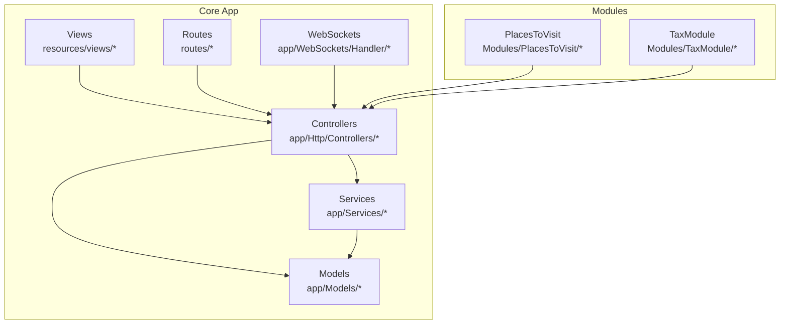

**Diagram sources**
- [Module.php:32-240](file://app/Models/Module.php#L32-L240)
- [ModuleService.php:7-54](file://app/Services/ModuleService.php#L7-L54)
- [OrderTrackingStreamController.php:10-101](file://app/Http/Controllers/Api/V1/OrderTrackingStreamController.php#L10-L101)
- [DMLocationSocketHandler.php](file://app/WebSockets/Handler/DMLocationSocketHandler.php)
- [module.json:1-17](file://Modules/PlacesToVisit/module.json#L1-L17)
- [module.json:1-14](file://Modules/TaxModule/module.json#L1-L14)

**Section sources**
- [Module.php:32-240](file://app/Models/Module.php#L32-L240)
- [ModuleService.php:7-54](file://app/Services/ModuleService.php#L7-L54)
- [module.json:1-17](file://Modules/PlacesToVisit/module.json#L1-L17)
- [module.json:1-14](file://Modules/TaxModule/module.json#L1-L14)

## Core Components
- Multi-module business system: Module model and ModuleService enable creation, updates, and dropdown formatting for modules with module_type and zone associations.
- Real-time order tracking: SSE-based streaming via OrderTrackingStreamController and optional WebSocket handler for live updates.
- XP loyalty system: API documentation and controller endpoints for levels, challenges, prizes, and checkout integration.
- Subscription management: Admin views and routes for plan selection, validity, pricing, and renewal actions.
- Multi-zone operations: ZoneService constructs polygon coordinates, topics, and module setup per zone; routes expose zone administration.
- Inventory management: Item model with stock tracking, minimum stock warnings, and bulk operations UI.
- Reporting and analytics: Admin ReportController exports and dashboards with charts and filters.
- Payment processing: Gateway constants, wallet controller, vendor payment UI, and PayPal payment controller.

**Section sources**
- [Module.php:32-240](file://app/Models/Module.php#L32-L240)
- [ModuleService.php:7-54](file://app/Services/ModuleService.php#L7-L54)
- [OrderTrackingStreamController.php:10-101](file://app/Http/Controllers/Api/V1/OrderTrackingStreamController.php#L10-L101)
- [DMLocationSocketHandler.php](file://app/WebSockets/Handler/DMLocationSocketHandler.php)
- [XP_SYSTEM_API_DOCS.md:351-649](file://XP_SYSTEM_API_DOCS.md#L351-L649)
- [XpController.php:116-138](file://app/Http/Controllers/Api/V1/XpController.php#L116-L138)
- [ZoneService.php:9-92](file://app/Services/ZoneService.php#L9-L92)
- [ZoneRepositoryInterface.php:10-63](file://app/Contracts/Repositories/ZoneRepositoryInterface.php#L10-L63)
- [routes.php:230-241](file://routes/admin/routes.php#L230-L241)
- [Item.php:17-404](file://app/Models/Item.php#L17-L404)
- [ReportController.php:2779-2800](file://app/Http/Controllers/Admin/ReportController.php#L2779-L2800)
- [Constant.php:1-38](file://app/Library/Constant.php#L1-L38)
- [WalletController.php:98-130](file://app/Http/Controllers/Api/V1/WalletController.php#L98-L130)

## Architecture Overview
The platform integrates modules, zones, and services to deliver a unified commerce experience. Controllers orchestrate requests, services encapsulate business logic, models define persistence, and views render UI. WebSockets and SSE provide real-time updates, while payment controllers integrate multiple gateways.

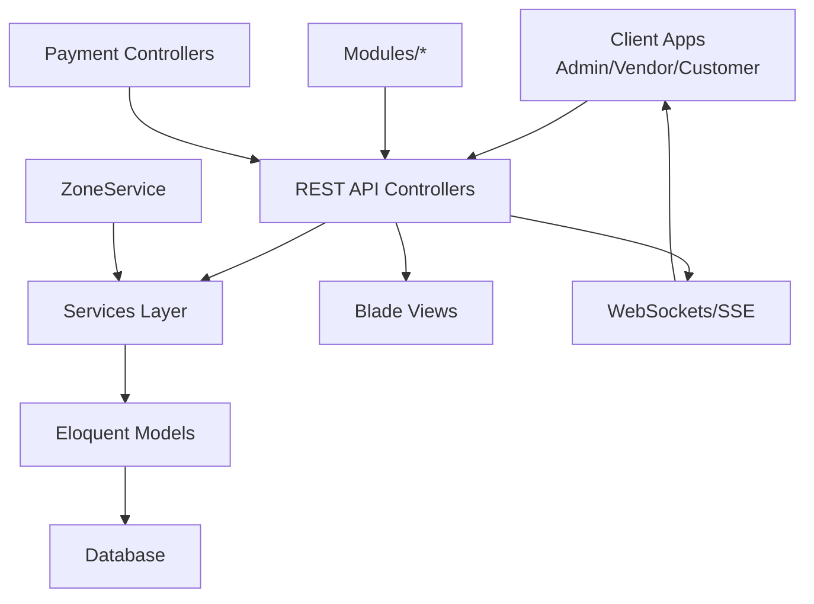

**Diagram sources**
- [OrderTrackingStreamController.php:10-101](file://app/Http/Controllers/Api/V1/OrderTrackingStreamController.php#L10-L101)
- [DMLocationSocketHandler.php](file://app/WebSockets/Handler/DMLocationSocketHandler.php)
- [ZoneService.php:9-92](file://app/Services/ZoneService.php#L9-L92)
- [Module.php:32-240](file://app/Models/Module.php#L32-L240)
- [Constant.php:1-38](file://app/Library/Constant.php#L1-L38)

## Detailed Component Analysis

### Multi-Module Business System
- Module model supports module_name, module_type, status, and zone relations. It includes scopes for parcel/non-parcel filtering and active status.
- ModuleService handles upload and formatting for module icons/thumbnails and prepares data for dropdowns.

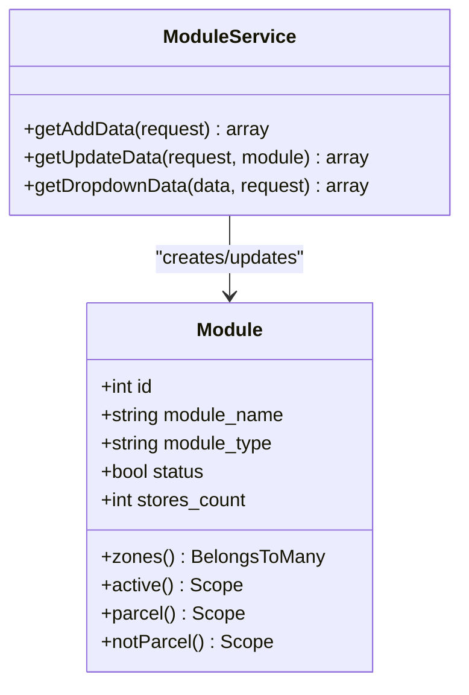

**Diagram sources**
- [Module.php:32-240](file://app/Models/Module.php#L32-L240)
- [ModuleService.php:7-54](file://app/Services/ModuleService.php#L7-L54)

**Section sources**
- [Module.php:32-240](file://app/Models/Module.php#L32-L240)
- [ModuleService.php:7-54](file://app/Services/ModuleService.php#L7-L54)
- [module.json:1-17](file://Modules/PlacesToVisit/module.json#L1-L17)
- [module.json:1-14](file://Modules/TaxModule/module.json#L1-L14)

### Real-Time Order Tracking (SSE + Optional WebSocket)
- SSE streaming endpoint streams order status and delivery updates at intervals with heartbeat and termination on terminal statuses.
- Optional WebSocket handler supports live location updates for delivery persons.

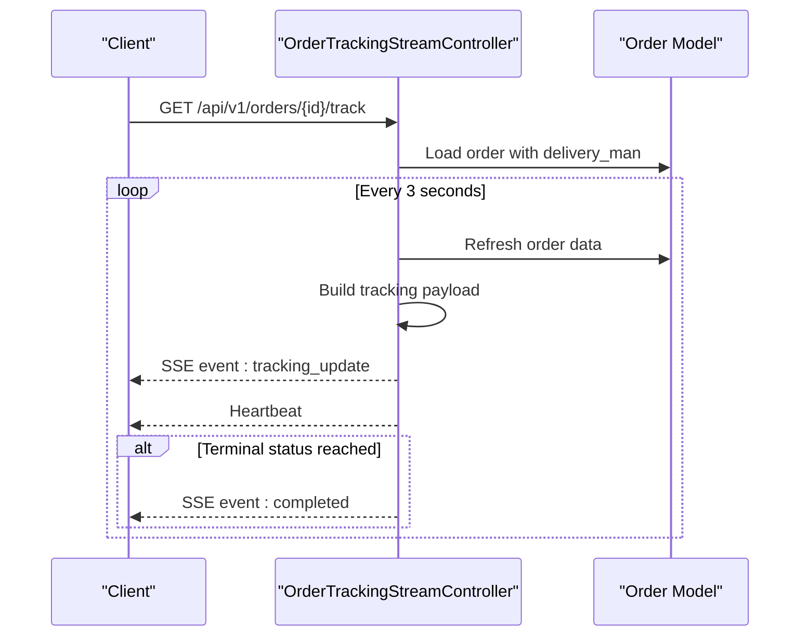

**Diagram sources**
- [OrderTrackingStreamController.php:10-101](file://app/Http/Controllers/Api/V1/OrderTrackingStreamController.php#L10-L101)

**Section sources**
- [OrderTrackingStreamController.php:10-101](file://app/Http/Controllers/Api/V1/OrderTrackingStreamController.php#L10-L101)
- [DMLocationSocketHandler.php](file://app/WebSockets/Handler/DMLocationSocketHandler.php)
- [websocket-index.blade.php:52-66](file://resources/views/admin-views/business-settings/websocket-index.blade.php#L52-L66)

### XP Loyalty System
- API documentation defines endpoints for level details, challenges, prizes, and checkout integration.
- Controller logic auto-creates user-level-prize records upon level unlock and manages claim flows.

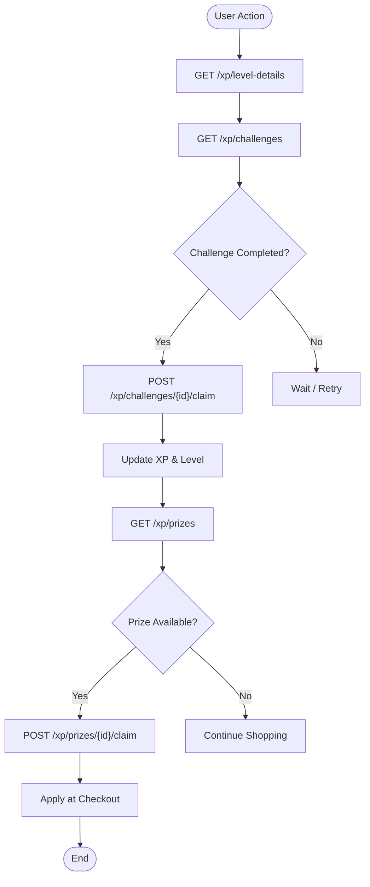

**Diagram sources**
- [XP_SYSTEM_API_DOCS.md:351-649](file://XP_SYSTEM_API_DOCS.md#L351-L649)
- [XpController.php:116-138](file://app/Http/Controllers/Api/V1/XpController.php#L116-L138)

**Section sources**
- [XP_SYSTEM_API_DOCS.md:351-649](file://XP_SYSTEM_API_DOCS.md#L351-L649)
- [XpController.php:116-138](file://app/Http/Controllers/Api/V1/XpController.php#L116-L138)

### Subscription Management System
- Admin views present plan details, validity, price, and renewal status. Renewal modals allow plan selection and confirmation.

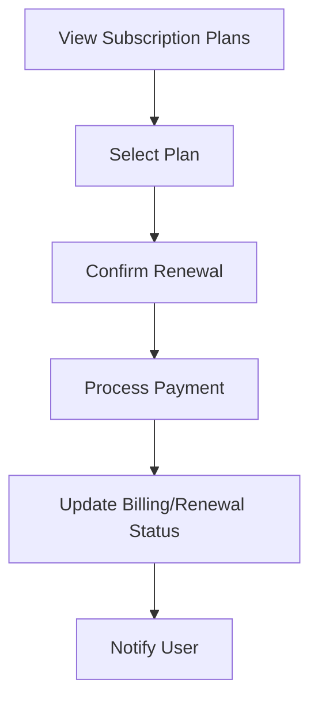

**Diagram sources**
- [subscription/subscription-in-store-details.blade.php:348-460](file://resources/views/admin-views/subscription/subscription-in-store-details.blade.php#L348-L460)
- [subscription/index.blade.php:348-460](file://resources/views/admin-views/subscription/index.blade.php#L348-L460)

**Section sources**
- [subscription/subscription-in-store-details.blade.php:348-460](file://resources/views/admin-views/subscription/subscription-in-store-details.blade.php#L348-L460)
- [subscription/index.blade.php:348-460](file://resources/views/admin-views/subscription/index.blade.php#L348-L460)

### Multi-Zone Operations
- ZoneService builds polygon coordinates, assigns zone-specific topics, and formats coordinate arrays for rendering.
- Zone routes expose CRUD, export, status toggles, and module setup per zone.

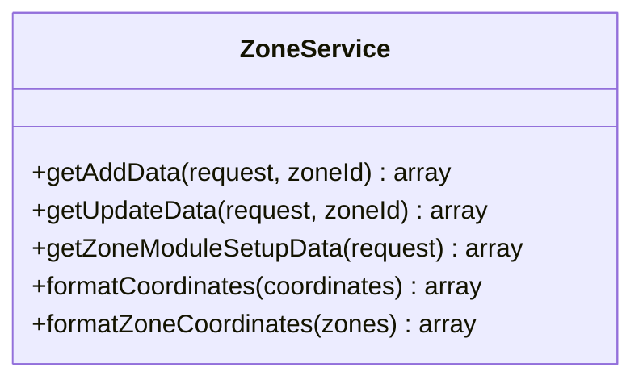

**Diagram sources**
- [ZoneService.php:9-92](file://app/Services/ZoneService.php#L9-L92)
- [ZoneRepositoryInterface.php:10-63](file://app/Contracts/Repositories/ZoneRepositoryInterface.php#L10-L63)
- [routes.php:230-241](file://routes/admin/routes.php#L230-L241)

**Section sources**
- [ZoneService.php:9-92](file://app/Services/ZoneService.php#L9-L92)
- [ZoneRepositoryInterface.php:10-63](file://app/Contracts/Repositories/ZoneRepositoryInterface.php#L10-L63)
- [routes.php:230-241](file://routes/admin/routes.php#L230-L241)
- [home.blade.php:201-220](file://resources/views/home.blade.php#L201-L220)

### Inventory Management
- Item model tracks stock, units, and module associations; includes scopes for active, approved, and discounted items.
- Minimum stock warning configurable per store; bulk operations UI supports quantity aggregation and export.

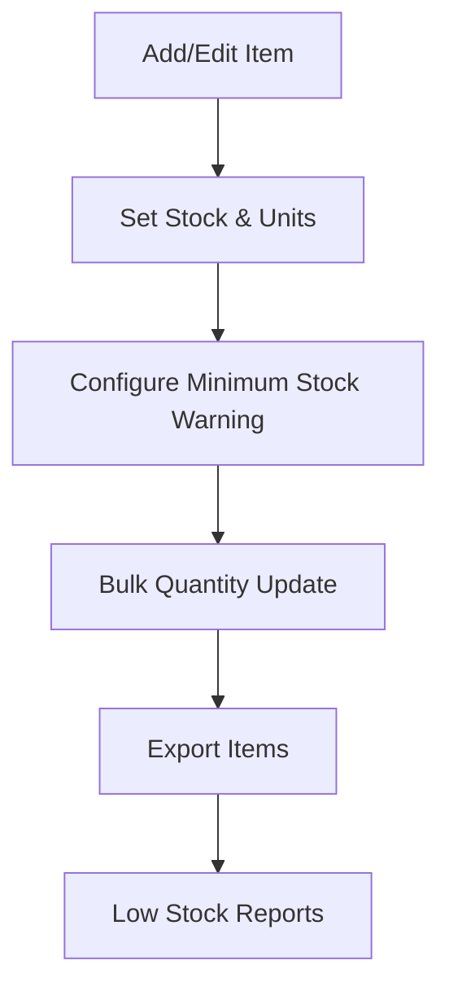

**Diagram sources**
- [Item.php:17-404](file://app/Models/Item.php#L17-L404)
- [restaurant-index.blade.php:398-415](file://resources/views/vendor-views/business-settings/restaurant-index.blade.php#L398-L415)
- [bulk-export.blade.php:79-108](file://resources/views/vendor-views/product/bulk-export.blade.php#L79-L108)
- [ReportController.php:2790-2800](file://app/Http/Controllers/Admin/ReportController.php#L2790-L2800)

**Section sources**
- [Item.php:17-404](file://app/Models/Item.php#L17-L404)
- [restaurant-index.blade.php:398-415](file://resources/views/vendor-views/business-settings/restaurant-index.blade.php#L398-L415)
- [bulk-export.blade.php:79-108](file://resources/views/vendor-views/product/bulk-export.blade.php#L79-L108)
- [ReportController.php:2790-2800](file://app/Http/Controllers/Admin/ReportController.php#L2790-L2800)

### Reporting and Analytics Dashboard
- Dashboards render charts and statistics for user growth, commission overview, and module-specific KPIs.
- Export functionality integrated across reports.

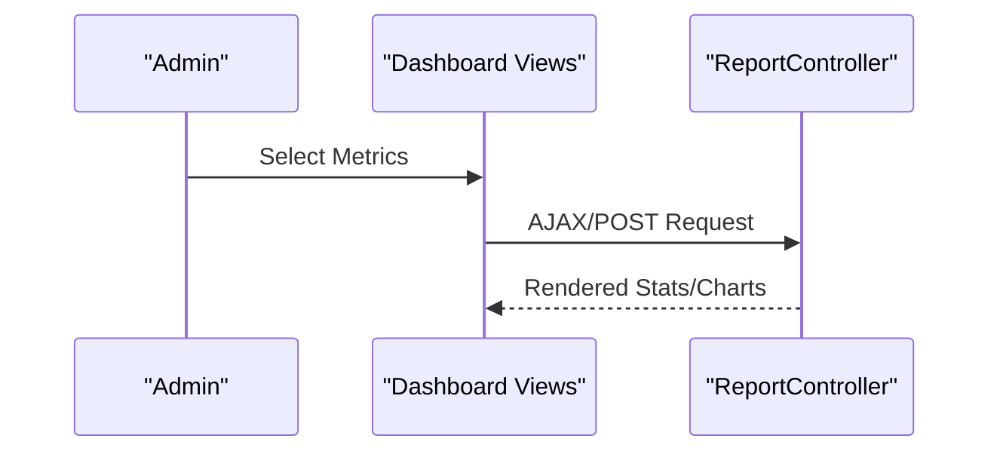

**Diagram sources**
- [dashboard-users.blade.php:582-611](file://resources/views/admin-views/dashboard-users.blade.php#L582-L611)
- [dashboard-pharmacy.blade.php:564-601](file://resources/views/admin-views/dashboard-pharmacy.blade.php#L564-L601)
- [ReportController.php:2779-2800](file://app/Http/Controllers/Admin/ReportController.php#L2779-L2800)

**Section sources**
- [dashboard-users.blade.php:582-611](file://resources/views/admin-views/dashboard-users.blade.php#L582-L611)
- [dashboard-pharmacy.blade.php:564-601](file://resources/views/admin-views/dashboard-pharmacy.blade.php#L564-L601)
- [ReportController.php:2779-2800](file://app/Http/Controllers/Admin/ReportController.php#L2779-L2800)

### Payment Processing and Wallet Integration
- Gateway constants enumerate supported payment methods (15+ gateways).
- Wallet controller orchestrates payment initiation with payer/receiver info and hooks.
- Vendor payment UI lists available gateways and amount selection.
- PayPal payment controller validates payment identifiers and retrieves access tokens.

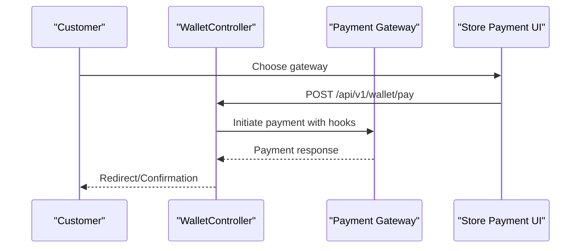

**Diagram sources**
- [Constant.php:1-38](file://app/Library/Constant.php#L1-L38)
- [WalletController.php:98-130](file://app/Http/Controllers/Api/V1/WalletController.php#L98-L130)
- [wallet/index.blade.php:189-211](file://resources/views/vendor-views/wallet/index.blade.php#L189-L211)
- [wallet/disbursement.blade.php:281-303](file://resources/views/vendor-views/wallet/disbursement.blade.php#L281-L303)
- [wallet/payment_list.blade.php:106-128](file://resources/views/vendor-views/wallet/payment_list.blade.php#L106-L128)
- [PaypalPaymentController.php:46-84](file://app/Http/Controllers/PaypalPaymentController.php#L46-L84)

**Section sources**
- [Constant.php:1-38](file://app/Library/Constant.php#L1-L38)
- [WalletController.php:98-130](file://app/Http/Controllers/Api/V1/WalletController.php#L98-L130)
- [wallet/index.blade.php:189-211](file://resources/views/vendor-views/wallet/index.blade.php#L189-L211)
- [wallet/disbursement.blade.php:281-303](file://resources/views/vendor-views/wallet/disbursement.blade.php#L281-L303)
- [wallet/payment_list.blade.php:106-128](file://resources/views/vendor-views/wallet/payment_list.blade.php#L106-L128)
- [PaypalPaymentController.php:46-84](file://app/Http/Controllers/PaypalPaymentController.php#L46-L84)

## Dependency Analysis
- ModuleService depends on FileManagerTrait for uploads and works with Module model.
- OrderTrackingStreamController relies on Order model and delivery-man relationship.
- ZoneService constructs spatial polygons and module setup data.
- WalletController integrates with Payer/Receiver and PaymentInfo abstractions.
- OrderStatusService centralizes status transitions, notifications, and audit logging.

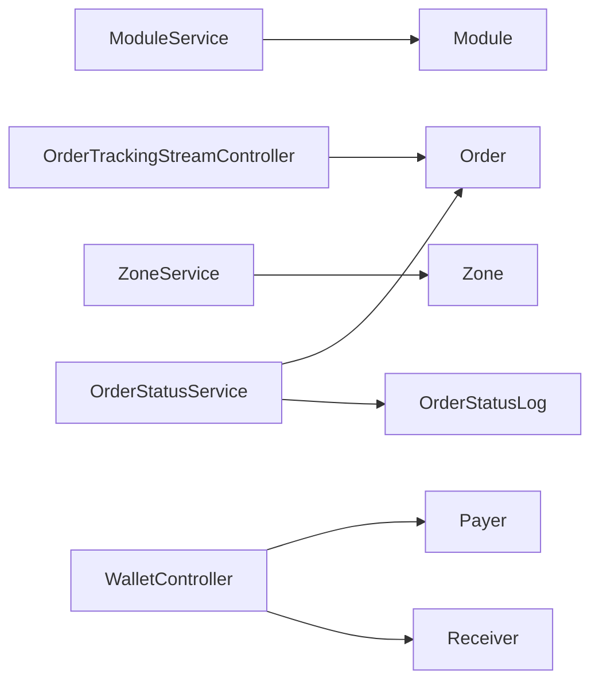

**Diagram sources**
- [ModuleService.php:7-54](file://app/Services/ModuleService.php#L7-L54)
- [Module.php:32-240](file://app/Models/Module.php#L32-L240)
- [OrderTrackingStreamController.php:10-101](file://app/Http/Controllers/Api/V1/OrderTrackingStreamController.php#L10-L101)
- [ZoneService.php:9-92](file://app/Services/ZoneService.php#L9-L92)
- [WalletController.php:98-130](file://app/Http/Controllers/Api/V1/WalletController.php#L98-L130)

**Section sources**
- [ModuleService.php:7-54](file://app/Services/ModuleService.php#L7-L54)
- [OrderStatusService.php:21-348](file://app/Services/OrderStatusService.php#L21-L348)

## Performance Considerations
- Use database locks and transactions for order status updates to prevent race conditions.
- Implement caching for OTP attempts and reduce repeated DB queries in tracking loops.
- Optimize polygon parsing and coordinate formatting in zone operations.
- Batch export and report generation should leverage pagination and chunked processing.
- Enable server-side event buffering controls and heartbeat intervals to maintain efficient SSE connections.

## Troubleshooting Guide
- Order status transitions: Validate allowed transitions and handle edge cases (already completed/cancelled/refunded).
- SSE tracking: Ensure headers disable buffering and handle connection_aborted gracefully; terminate on terminal statuses.
- Zone setup: Verify coordinate formatting and spatial polygon integrity; confirm zone-specific topics are set.
- Payment failures: Check gateway credentials, hooks, and response handling; validate payment identifiers.
- WebSocket: Confirm broadcasting configuration and client connectivity for live location updates.

**Section sources**
- [OrderStatusService.php:51-156](file://app/Services/OrderStatusService.php#L51-L156)
- [OrderTrackingStreamController.php:32-101](file://app/Http/Controllers/Api/V1/OrderTrackingStreamController.php#L32-L101)
- [ZoneService.php:12-37](file://app/Services/ZoneService.php#L12-L37)
- [PaypalPaymentController.php:62-84](file://app/Http/Controllers/PaypalPaymentController.php#L62-L84)

## Conclusion
Waddy Back integrates a robust multi-module architecture with real-time tracking, XP loyalty, subscription management, multi-zone operations, inventory controls, comprehensive reporting, and extensive payment support. The documented components and flows provide a blueprint for extending and maintaining these features across food delivery, retail, pharmacy, and parcel verticals.