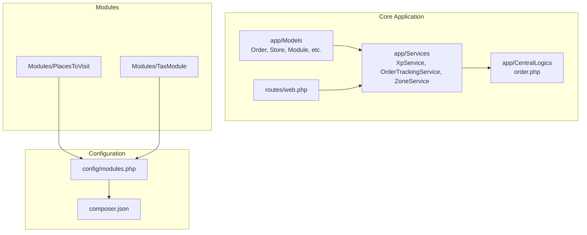
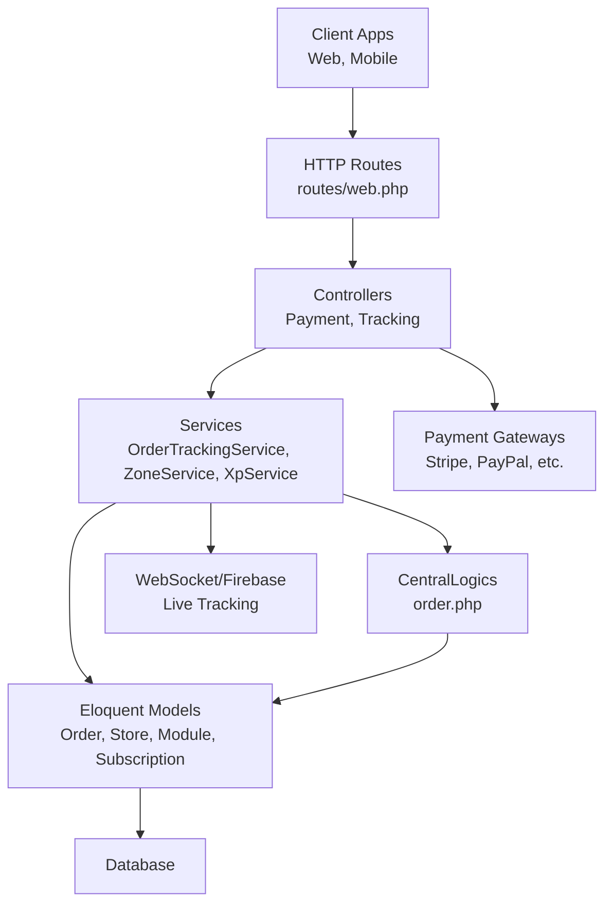
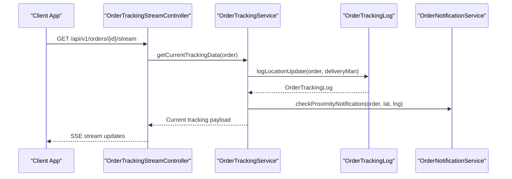
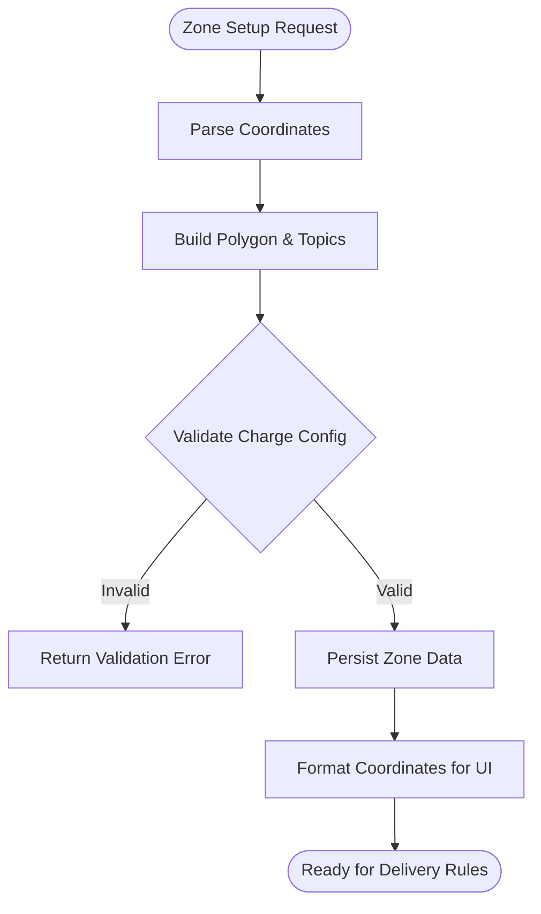
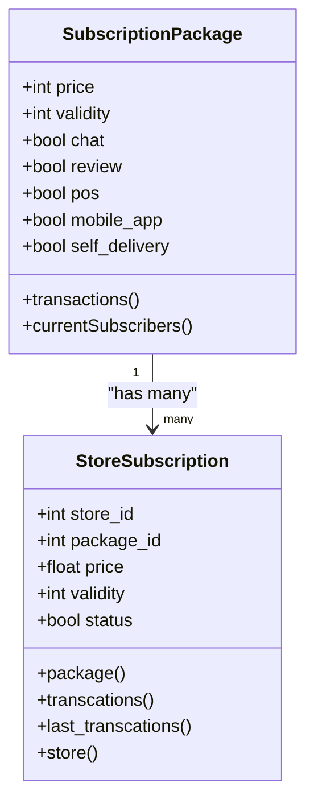
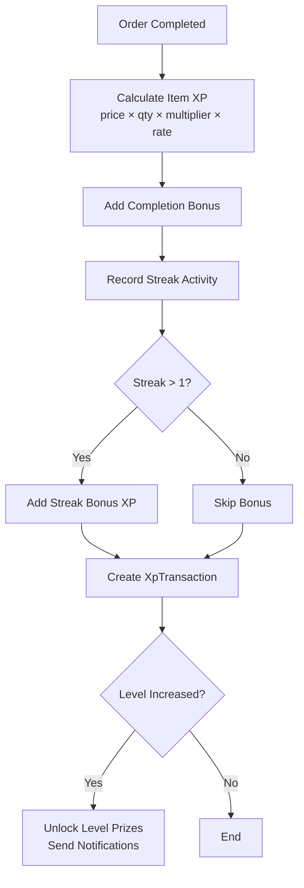
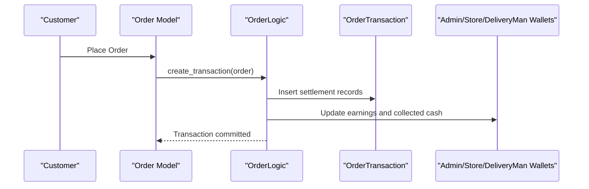
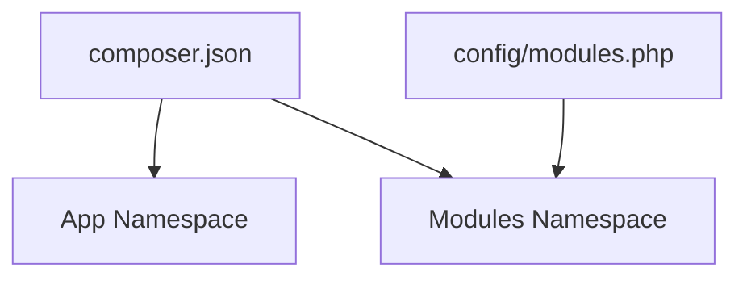

# Project Overview

<cite>
**Referenced Files in This Document**
- [README.md](file://README.md)
- [composer.json](file://composer.json)
- [config/modules.php](file://config/modules.php)
- [app/Models/Module.php](file://app/Models/Module.php)
- [app/Services/XpService.php](file://app/Services/XpService.php)
- [app/Services/OrderTrackingService.php](file://app/Services/OrderTrackingService.php)
- [app/Services/ZoneService.php](file://app/Services/ZoneService.php)
- [app/Models/StoreSubscription.php](file://app/Models/StoreSubscription.php)
- [app/Models/SubscriptionPackage.php](file://app/Models/SubscriptionPackage.php)
- [app/CentralLogics/order.php](file://app/CentralLogics/order.php)
- [app/Models/Order.php](file://app/Models/Order.php)
- [routes/web.php](file://routes/web.php)
- [Modules/PlacesToVisit/module.json](file://Modules/PlacesToVisit/module.json)
- [Modules/TaxModule/module.json](file://Modules/TaxModule/module.json)
</cite>

## Table of Contents
1. [Introduction](#introduction)
2. [Project Structure](#project-structure)
3. [Core Components](#core-components)
4. [Architecture Overview](#architecture-overview)
5. [Detailed Component Analysis](#detailed-component-analysis)
6. [Dependency Analysis](#dependency-analysis)
7. [Performance Considerations](#performance-considerations)
8. [Troubleshooting Guide](#troubleshooting-guide)
9. [Conclusion](#conclusion)

## Introduction
Waddy Back is a multi-module Laravel-based e-commerce platform designed as a comprehensive business management solution. It supports diverse verticals including food delivery, retail, pharmacy, and parcel services within a unified system. The platform emphasizes real-time order tracking, multi-zone operations, subscription management for stores, and an XP (experience points) loyalty system to drive engagement.

Key stakeholder benefits:
- Unified dashboard and operations across multiple business modules
- Real-time visibility into orders and deliveries
- Flexible zone-based pricing and payment options
- Automated financial settlement and commission calculations
- Loyalty and XP-driven customer retention

Developer benefits:
- Modular architecture using Laravel Modules for clean separation of concerns
- Strong Eloquent models and services encapsulating business logic
- Extensible payment gateway integrations and notifications
- Scalable order lifecycle management with transactional integrity

## Project Structure
The platform follows Laravel conventions with a modular extension:
- Core application under app/, with models, services, repositories, traits, and central logics
- Modules directory for feature-specific extensions (e.g., PlacesToVisit, TaxModule)
- Composer configuration enabling PSR-4 autoloading and module discovery
- Configuration for module scaffolding and activation

**Diagram sources**
- [composer.json:71-76](file://composer.json#L71-L76)
- [config/modules.php:6-18](file://config/modules.php#L6-L18)
- [routes/web.php:1-260](file://routes/web.php#L1-L260)

**Section sources**
- [composer.json:71-76](file://composer.json#L71-L76)
- [config/modules.php:63-131](file://config/modules.php#L63-L131)
- [routes/web.php:1-260](file://routes/web.php#L1-L260)

## Core Components
- Multi-module architecture: Modules/PlacesToVisit and Modules/TaxModule demonstrate extensibility and feature isolation.
- Order lifecycle: Centralized logic in app/CentralLogics/order.php handles order creation, settlement, refunds, and cashback.
- Real-time tracking: app/Services/OrderTrackingService manages live updates and proximity notifications.
- Zone management: app/Services/ZoneService defines geographic boundaries and delivery rules.
- XP and loyalty: app/Services/XpService implements XP accumulation, level progression, streak bonuses, and prize unlocks.
- Subscription management: Models app/Models/StoreSubscription and app/Models/SubscriptionPackage support store business plans and billing.

Practical examples:
- Real-time order tracking stream endpoint for customers and riders
- Zone-based delivery fee computation and validation
- Subscription-based store commission model versus traditional commission
- XP awarded per purchase, review, and referral actions

**Section sources**
- [Modules/PlacesToVisit/module.json:1-17](file://Modules/PlacesToVisit/module.json#L1-L17)
- [Modules/TaxModule/module.json:1-14](file://Modules/TaxModule/module.json#L1-L14)
- [app/CentralLogics/order.php:40-371](file://app/CentralLogics/order.php#L40-L371)
- [app/Services/OrderTrackingService.php:12-124](file://app/Services/OrderTrackingService.php#L12-L124)
- [app/Services/ZoneService.php:9-126](file://app/Services/ZoneService.php#L9-L126)
- [app/Services/XpService.php:15-336](file://app/Services/XpService.php#L15-L336)
- [app/Models/StoreSubscription.php:10-58](file://app/Models/StoreSubscription.php#L10-L58)
- [app/Models/SubscriptionPackage.php:10-90](file://app/Models/SubscriptionPackage.php#L10-L90)

## Architecture Overview
The system integrates Laravel’s MVC with a modular plugin pattern. Controllers route requests, services encapsulate domain logic, models represent data, and modules extend functionality. Payment routes and streaming endpoints are exposed via routes/web.php.

**Diagram sources**
- [routes/web.php:248-258](file://routes/web.php#L248-L258)
- [app/Services/OrderTrackingService.php:12-124](file://app/Services/OrderTrackingService.php#L12-L124)
- [app/Services/ZoneService.php:9-126](file://app/Services/ZoneService.php#L9-L126)
- [app/Services/XpService.php:15-336](file://app/Services/XpService.php#L15-L336)
- [app/CentralLogics/order.php:40-371](file://app/CentralLogics/order.php#L40-L371)
- [app/Models/Order.php:13-358](file://app/Models/Order.php#L13-L358)

## Detailed Component Analysis

### Real-Time Order Tracking
The tracking service logs driver locations and exposes streaming and history endpoints. It integrates with proximity notifications and maintains a dedicated tracking log.

**Diagram sources**
- [routes/web.php:248-258](file://routes/web.php#L248-L258)
- [app/Services/OrderTrackingService.php:28-100](file://app/Services/OrderTrackingService.php#L28-L100)

**Section sources**
- [app/Services/OrderTrackingService.php:12-124](file://app/Services/OrderTrackingService.php#L12-L124)
- [app/Models/Order.php:196-199](file://app/Models/Order.php#L196-L199)

### Multi-Zone Operations
ZoneService constructs spatial polygons from coordinate inputs, validates delivery charge setups, and formats coordinates for frontend consumption. Zones influence payment methods and delivery fees.

**Diagram sources**
- [app/Services/ZoneService.php:12-126](file://app/Services/ZoneService.php#L12-L126)

**Section sources**
- [app/Services/ZoneService.php:9-126](file://app/Services/ZoneService.php#L9-L126)
- [app/Models/Module.php:201-204](file://app/Models/Module.php#L201-L204)

### Subscription Management
Stores can subscribe to packages with features like chat, reviews, POS, mobile app access, and self-delivery. Billing and renewal history are tracked per store and package.

**Diagram sources**
- [app/Models/SubscriptionPackage.php:10-90](file://app/Models/SubscriptionPackage.php#L10-L90)
- [app/Models/StoreSubscription.php:10-58](file://app/Models/StoreSubscription.php#L10-L58)

**Section sources**
- [app/Models/StoreSubscription.php:10-58](file://app/Models/StoreSubscription.php#L10-L58)
- [app/Models/SubscriptionPackage.php:10-90](file://app/Models/SubscriptionPackage.php#L10-L90)

### XP Loyalty System
The XP service calculates points based on purchases, multipliers per module, and streak bonuses. It prevents duplicate awards and notifies users on level-ups.

**Diagram sources**
- [app/Services/XpService.php:15-336](file://app/Services/XpService.php#L15-L336)

**Section sources**
- [app/Services/XpService.php:15-336](file://app/Services/XpService.php#L15-L336)

### Order Lifecycle and Settlement
OrderLogic orchestrates order creation, settlement, refunds, and cashback. It computes commissions, taxes, discounts, and updates wallets and account transactions accordingly.

**Diagram sources**
- [app/CentralLogics/order.php:40-371](file://app/CentralLogics/order.php#L40-L371)
- [app/Models/Order.php:174-177](file://app/Models/Order.php#L174-L177)

**Section sources**
- [app/CentralLogics/order.php:40-371](file://app/CentralLogics/order.php#L40-L371)
- [app/Models/Order.php:13-358](file://app/Models/Order.php#L13-L358)

### Conceptual Overview
- Unified modules: Food, retail, pharmacy, and parcel modules coexist under a shared infrastructure.
- Real-time operations: Live tracking, proximity alerts, and streaming endpoints.
- Flexible zones: Dynamic delivery rules, payment methods, and fee structures.
- Revenue model: Hybrid subscription and commission-based store earnings.
- Engagement: XP and streak mechanics encourage repeat purchases.

[No sources needed since this section doesn't analyze specific files]

## Dependency Analysis
The platform leverages Laravel Modules for modularity and Composer for dependency management. Payment gateways and third-party SDKs are integrated via Composer packages.

**Diagram sources**
- [composer.json:71-76](file://composer.json#L71-L76)
- [config/modules.php:6-18](file://config/modules.php#L6-L18)

**Section sources**
- [composer.json:1-131](file://composer.json#L1-131)
- [config/modules.php:1-278](file://config/modules.php#L1-278)

## Performance Considerations
- Use scopes and global scopes judiciously to avoid heavy joins on frequently queried models.
- Batch processing for notifications and settlements to reduce contention.
- Indexes on frequently filtered columns (e.g., order_status, zone_id, module_id).
- Optimize streaming endpoints with appropriate throttling and connection reuse.
- Cache module and zone metadata where safe and acceptable.

[No sources needed since this section provides general guidance]

## Troubleshooting Guide
Common areas to inspect:
- Order settlement failures: Verify OrderLogic transaction inserts and wallet updates.
- Tracking endpoint issues: Confirm streaming controller and OrderTrackingService integration.
- Zone validation errors: Check ZoneService validation flags for fixed vs. distance delivery charges.
- Subscription billing anomalies: Review StoreSubscription and SubscriptionPackage relationships.

**Section sources**
- [app/CentralLogics/order.php:358-368](file://app/CentralLogics/order.php#L358-L368)
- [app/Services/OrderTrackingService.php:28-50](file://app/Services/OrderTrackingService.php#L28-L50)
- [app/Services/ZoneService.php:94-123](file://app/Services/ZoneService.php#L94-L123)
- [app/Models/StoreSubscription.php:50-57](file://app/Models/StoreSubscription.php#L50-L57)

## Conclusion
Waddy Back delivers a cohesive, scalable foundation for multi-vertical e-commerce operations. Its modular design, real-time tracking, zone-aware logistics, subscription-enabled store economics, and XP-driven loyalty system collectively support diverse business needs while maintaining developer-friendly architecture and operational clarity.

[No sources needed since this section summarizes without analyzing specific files]