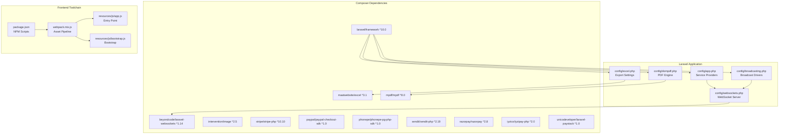
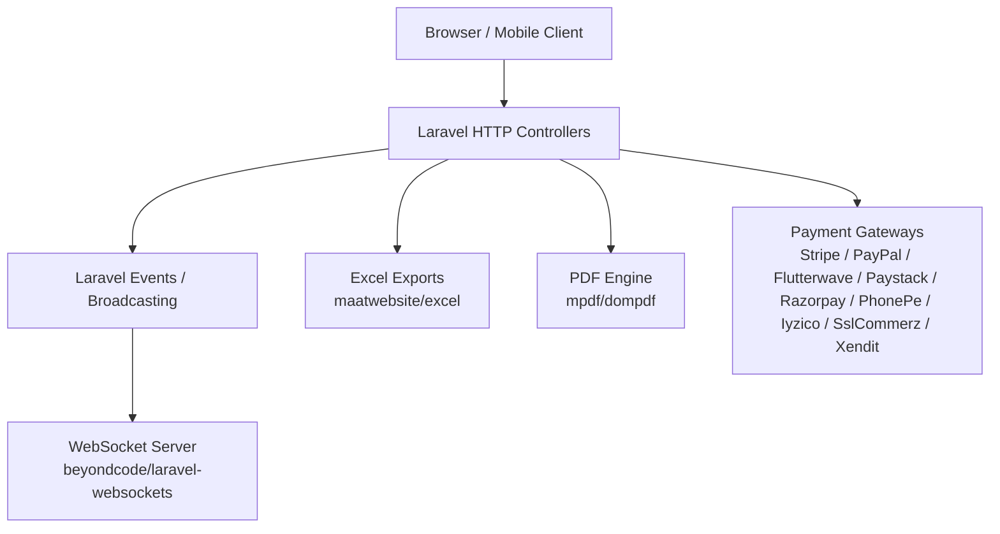
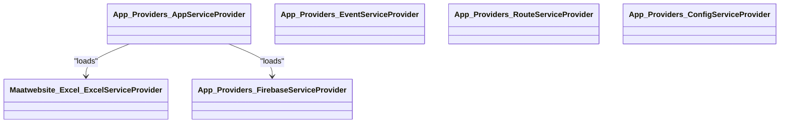
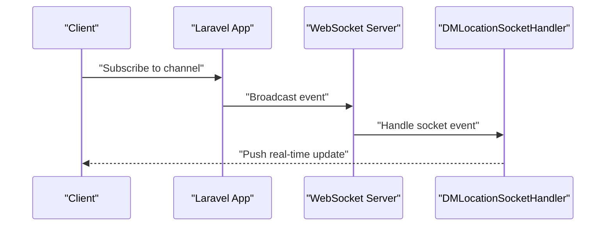
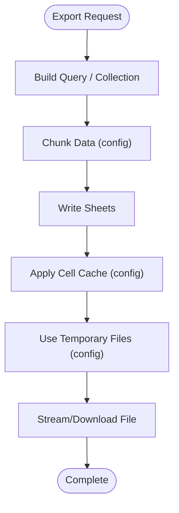
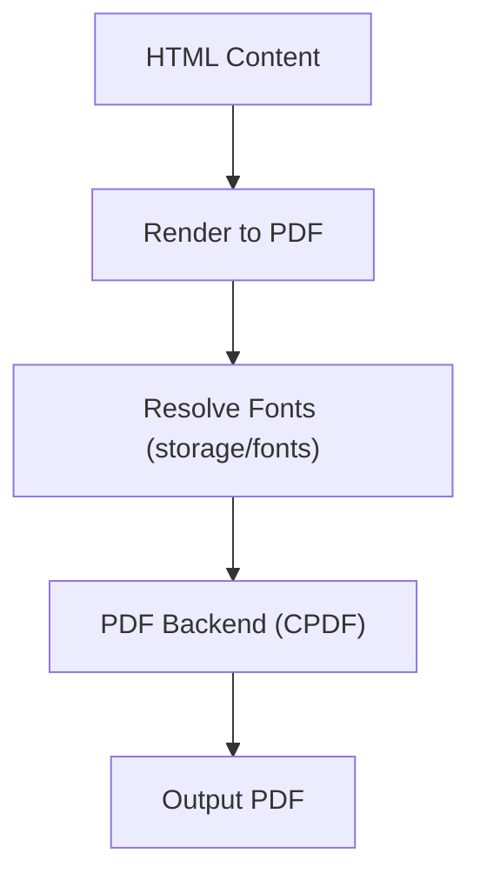
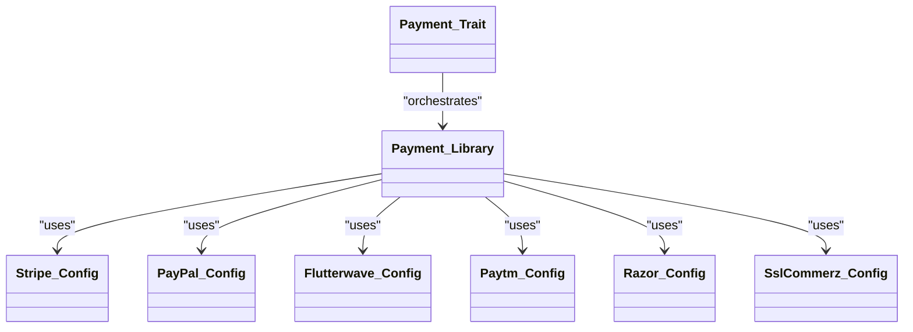
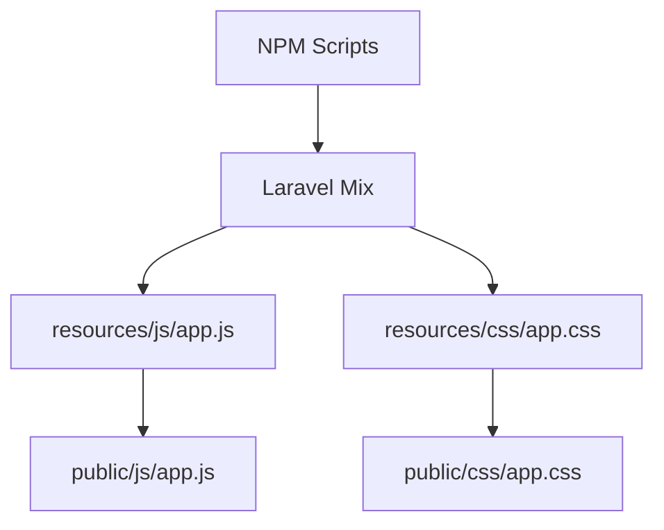

# Technology Stack

<cite>
**Referenced Files in This Document**
- [composer.json](file://composer.json)
- [package.json](file://package.json)
- [webpack.mix.js](file://webpack.mix.js)
- [config/app.php](file://config/app.php)
- [config/broadcasting.php](file://config/broadcasting.php)
- [config/websockets.php](file://config/websockets.php)
- [config/excel.php](file://config/excel.php)
- [config/dompdf.php](file://config/dompdf.php)
- [config/flutterwave.php](file://config/flutterwave.php)
- [config/paypal.php](file://config/paypal.php)
- [config/paytm.php](file://config/paytm.php)
- [config/razor.php](file://config/razor.php)
- [config/sslcommerz.php](file://config/sslcommerz.php)
- [app/Providers/BroadcastServiceProvider.php](file://app/Providers/BroadcastServiceProvider.php)
- [app/WebSockets/Handler/DMLocationSocketHandler.php](file://app/WebSockets/Handler/DMLocationSocketHandler.php)
- [app/Traits/Payment.php](file://app/Traits/Payment.php)
- [app/Library/Payment.php](file://app/Library/Payment.php)
- [app/Library/SslCommerz/](file://app/Library/SslCommerz/)
- [app/Exports/](file://app/Exports/)
- [resources/js/app.js](file://resources/js/app.js)
- [resources/js/bootstrap.js](file://resources/js/bootstrap.js)
</cite>

## Table of Contents
1. [Introduction](#introduction)
2. [Project Structure](#project-structure)
3. [Core Components](#core-components)
4. [Architecture Overview](#architecture-overview)
5. [Detailed Component Analysis](#detailed-component-analysis)
6. [Dependency Analysis](#dependency-analysis)
7. [Performance Considerations](#performance-considerations)
8. [Troubleshooting Guide](#troubleshooting-guide)
9. [Conclusion](#conclusion)

## Introduction
This document provides a comprehensive technology stack overview for the Waddy Back platform. It details the Laravel framework foundation, real-time communication, image processing, exports, PDF generation, payment gateway integrations, frontend toolchain, and operational dependencies. The goal is to help developers and operators understand the platform’s technical foundation, integration points, and upgrade considerations.

## Project Structure
The platform follows a modular Laravel architecture with a monorepo layout:
- Laravel core in the repository root with Composer-managed dependencies
- Frontend assets managed via Laravel Mix and NPM scripts
- Real-time features powered by beyondcode/laravel-websockets
- Payment gateways integrated via dedicated SDKs and configuration
- Export and PDF generation handled by maatwebsite/excel and mpdf/dompdf
- Modular feature sets organized under Modules/

**Diagram sources**
- [config/app.php:139-186](file://config/app.php#L139-L186)
- [config/broadcasting.php:18](file://config/broadcasting.php#L18)
- [config/websockets.php:10](file://config/websockets.php#L10)
- [config/excel.php:6](file://config/excel.php#L6)
- [config/dompdf.php:41](file://config/dompdf.php#L41)
- [composer.json:7-40](file://composer.json#L7-L40)
- [package.json:1-19](file://package.json#L1-L19)
- [webpack.mix.js:14-17](file://webpack.mix.js#L14-L17)
- [resources/js/app.js:1](file://resources/js/app.js#L1)
- [resources/js/bootstrap.js:1](file://resources/js/bootstrap.js#L1)

**Section sources**
- [composer.json:7-40](file://composer.json#L7-L40)
- [package.json:1-19](file://package.json#L1-L19)
- [webpack.mix.js:14-17](file://webpack.mix.js#L14-L17)
- [config/app.php:139-186](file://config/app.php#L139-L186)
- [config/broadcasting.php:18](file://config/broadcasting.php#L18)
- [config/websockets.php:10](file://config/websockets.php#L10)
- [config/excel.php:6](file://config/excel.php#L6)
- [config/dompdf.php:41](file://config/dompdf.php#L41)

## Core Components
- Laravel Framework: ^10.0 forms the core MVC and service container foundation. Service providers and aliases are configured centrally.
- Real-time Communication: beyondcode/laravel-websockets enables WebSocket broadcasting with configurable dashboard and SSL options.
- Image Processing: intervention/image supports dynamic image manipulation and transformations.
- Exports: maatwebsite/excel integrates with PhpSpreadsheet for CSV/XLSX/ODS exports and configurable chunking and caching.
- PDF Generation: mpdf/mpdf is configured via dompdf wrapper settings for rendering HTML to PDF.
- Payment Gateways: Multiple providers integrated via official SDKs and environment-driven configs (Stripe, PayPal, Flutterwave, Paystack, Razorpay, PhonePe, Iyzico, SslCommerz, Xendit).
- Frontend Toolchain: Laravel Mix with NPM scripts compiles JS and CSS assets.

**Section sources**
- [composer.json:21](file://composer.json#L21)
- [config/app.php:139-186](file://config/app.php#L139-L186)
- [config/websockets.php:10](file://config/websockets.php#L10)
- [composer.json:18](file://composer.json#L18)
- [composer.json:26](file://composer.json#L26)
- [composer.json:30](file://composer.json#L30)
- [config/excel.php:6](file://config/excel.php#L6)
- [config/dompdf.php:41](file://config/dompdf.php#L41)
- [composer.json:36](file://composer.json#L36)
- [composer.json:32](file://composer.json#L32)
- [composer.json:33](file://composer.json#L33)
- [composer.json:38](file://composer.json#L38)
- [composer.json:35](file://composer.json#L35)
- [composer.json:19](file://composer.json#L19)
- [composer.json:29](file://composer.json#L29)
- [composer.json:39](file://composer.json#L39)
- [package.json:1-19](file://package.json#L1-L19)
- [webpack.mix.js:14-17](file://webpack.mix.js#L14-L17)

## Architecture Overview
The platform architecture centers on Laravel’s service container and modular broadcasting. Real-time updates leverage laravel-websockets, while payment processing is abstracted through traits and libraries. Exports and PDFs are handled through dedicated packages with centralized configuration.

**Diagram sources**
- [config/websockets.php:10](file://config/websockets.php#L10)
- [config/excel.php:6](file://config/excel.php#L6)
- [config/dompdf.php:41](file://config/dompdf.php#L41)
- [composer.json:36](file://composer.json#L36)
- [composer.json:32](file://composer.json#L32)
- [composer.json:33](file://composer.json#L33)
- [composer.json:38](file://composer.json#L38)
- [composer.json:35](file://composer.json#L35)
- [composer.json:19](file://composer.json#L19)
- [composer.json:29](file://composer.json#L29)
- [composer.json:39](file://composer.json#L39)

## Detailed Component Analysis

### Laravel Framework Foundation
- Role: Provides routing, middleware, service container, Eloquent ORM, Blade templating, and broadcasting.
- Service Providers: Core Laravel providers plus application-specific providers including Excel, Firebase, and InterfaceServiceProvider.
- Aliases: Facades like Excel are registered for convenient access.

**Diagram sources**
- [config/app.php:139-186](file://config/app.php#L139-L186)

**Section sources**
- [config/app.php:139-186](file://config/app.php#L139-L186)

### Real-Time Features with Laravel WebSockets
- Package: beyondcode/laravel-websockets
- Configuration: Dashboard port, app credentials, client message enablement, statistics, SSL, and channel manager.
- Broadcasting: Integrated with Laravel’s broadcasting configuration and can be extended via custom handlers.

**Diagram sources**
- [config/websockets.php:10](file://config/websockets.php#L10)
- [config/websockets.php:24](file://config/websockets.php#L24)
- [config/websockets.php:76](file://config/websockets.php#L76)
- [config/websockets.php:112](file://config/websockets.php#L112)
- [app/WebSockets/Handler/DMLocationSocketHandler.php](file://app/WebSockets/Handler/DMLocationSocketHandler.php)

**Section sources**
- [config/websockets.php:10](file://config/websockets.php#L10)
- [config/websockets.php:24](file://config/websockets.php#L24)
- [config/websockets.php:76](file://config/websockets.php#L76)
- [config/websockets.php:112](file://config/websockets.php#L112)
- [app/WebSockets/Handler/DMLocationSocketHandler.php](file://app/WebSockets/Handler/DMLocationSocketHandler.php)

### Image Processing with Intervention/Image
- Purpose: Dynamic image manipulation, resizing, cropping, and format conversion.
- Integration: Typically used in controllers or services to transform uploaded images before storage or delivery.

**Section sources**
- [composer.json:18](file://composer.json#L18)

### Exports with Maatwebsite/Excel
- Capabilities: CSV/XLSX/ODS exports with chunking, strict null comparison, and value binding customization.
- Configuration: Extension detection, cache driver, transaction handler, and temporary files path.

**Diagram sources**
- [config/excel.php:17](file://config/excel.php#L17)
- [config/excel.php:231](file://config/excel.php#L231)
- [config/excel.php:281](file://config/excel.php#L281)
- [config/excel.php:297](file://config/excel.php#L297)

**Section sources**
- [config/excel.php:6](file://config/excel.php#L6)
- [config/excel.php:17](file://config/excel.php#L17)
- [config/excel.php:231](file://config/excel.php#L231)
- [config/excel.php:281](file://config/excel.php#L281)
- [config/excel.php:297](file://config/excel.php#L297)

### PDF Generation with mPDF
- Engine: mpdf/mpdf configured via dompdf wrapper settings.
- Paths: Font directory, cache directory, temp directory, chroot, and backend selection.

**Diagram sources**
- [config/dompdf.php:41](file://config/dompdf.php#L41)
- [config/dompdf.php:109](file://config/dompdf.php#L109)

**Section sources**
- [config/dompdf.php:41](file://config/dompdf.php#L41)
- [config/dompdf.php:109](file://config/dompdf.php#L109)

### Payment Gateway Integrations
- Supported providers: Stripe, PayPal, Flutterwave, Paystack, Razorpay, PhonePe, Iyzico, SslCommerz, Xendit.
- Implementation pattern: Environment-driven configuration per provider, with shared traits and libraries orchestrating payment lifecycle.

**Diagram sources**
- [app/Traits/Payment.php](file://app/Traits/Payment.php)
- [app/Library/Payment.php](file://app/Library/Payment.php)
- [config/flutterwave.php:18](file://config/flutterwave.php#L18)
- [config/paypal.php:4](file://config/paypal.php#L4)
- [config/paytm.php:4](file://config/paytm.php#L4)
- [config/razor.php:4](file://config/razor.php#L4)
- [config/sslcommerz.php:9](file://config/sslcommerz.php#L9)

**Section sources**
- [composer.json:36](file://composer.json#L36)
- [composer.json:32](file://composer.json#L32)
- [composer.json:33](file://composer.json#L33)
- [composer.json:38](file://composer.json#L38)
- [composer.json:35](file://composer.json#L35)
- [composer.json:19](file://composer.json#L19)
- [composer.json:29](file://composer.json#L29)
- [composer.json:39](file://composer.json#L39)
- [config/flutterwave.php:18](file://config/flutterwave.php#L18)
- [config/paypal.php:4](file://config/paypal.php#L4)
- [config/paytm.php:4](file://config/paytm.php#L4)
- [config/razor.php:4](file://config/razor.php#L4)
- [config/sslcommerz.php:9](file://config/sslcommerz.php#L9)
- [app/Traits/Payment.php](file://app/Traits/Payment.php)
- [app/Library/Payment.php](file://app/Library/Payment.php)
- [app/Library/SslCommerz/](file://app/Library/SslCommerz/)

### Frontend Technologies and Asset Compilation
- Vue.js: Integrated via Laravel Mix and NPM scripts; entry points defined in resources/js.
- Bootstrap: Included via Laravel Mix; compiled CSS output produced.
- Asset Pipeline: Laravel Mix compiles JS and CSS; hot reload and production builds supported.

**Diagram sources**
- [package.json:3](file://package.json#L3)
- [webpack.mix.js:14](file://webpack.mix.js#L14)
- [webpack.mix.js:15](file://webpack.mix.js#L15)

**Section sources**
- [package.json:1-19](file://package.json#L1-L19)
- [webpack.mix.js:14-17](file://webpack.mix.js#L14-L17)
- [resources/js/app.js:1](file://resources/js/app.js#L1)
- [resources/js/bootstrap.js:1](file://resources/js/bootstrap.js#L1)

## Dependency Analysis
- Core framework: laravel/framework ^10.0
- Real-time: beyondcode/laravel-websockets ^1.14
- Image processing: intervention/image ^2.5
- Exports: maatwebsite/excel ^3.1
- PDF: mpdf/mpdf ^8.0
- Payment gateways: stripe/stripe-php ^10.10, paypal/paypal-checkout-sdk ^1.0, phonepe/phonepe-pg-php-sdk ^1.0, xendit/xendit-php ^2.19, razorpay/razorpay ^2.8, iyzico/iyzipay-php ^2.0, unicodeveloper/laravel-paystack ^1.0, mercadopago/dx-php 3.0.7, nwidart/laravel-modules 9.0
- Utilities: guzzlehttp/guzzle ^7, firebase/php-jwt ^6.4, kreait/firebase-php ^7.12, matanyadaev/laravel-eloquent-spatial ^3.1, league/flysystem-aws-s3-v3 ^3.0, laravelpkg/laravelchk dev-master, madnest/madzipper, brian2694/laravel-toastr ^5.54, gregwar/captcha ^1.1, twilio/sdk ^6.39
- Development: barryvdh/laravel-debugbar ^3.5, fakerphp/faker ^1.9.1, laravel/sail ^1.0.1, mockery/mockery ^1.4.2, nunomaduro/collision ^6.1, phpunit/phpunit ^10.0, spatie/laravel-ignition ^2.0

```mermaid
graph TB
Core["laravel/framework ^10.0"]
WS["beyondcode/laravel-websockets ^1.14"]
Img["intervention/image ^2.5"]
Excel["maatwebsite/excel ^3.1"]
PDF["mpdf/mpdf ^8.0"]
Stripe["stripe/stripe-php ^10.10"]
PayPal["paypal/paypal-checkout-sdk ^1.0"]
PhonePe["phonepe/phonepe-pg-php-sdk ^1.0"]
Xendit["xendit/xendit-php ^2.19"]
Razor["razorpay/razorpay ^2.8"]
Iyzico["iyzico/iyzipay-php ^2.0"]
Paystack["unicodeveloper/laravel-paystack ^1.0"]
MercadoPago["mercadopago/dx-php 3.0.7"]
SslCommerz["sslcommerz (via config)"]
Others["guzzle, jwt, firebase, spatial, s3, toastr, captcha, twilio"]
Core --> WS
Core --> Img
Core --> Excel
Core --> PDF
Core --> Stripe
Core --> PayPal
Core --> PhonePe
Core --> Xendit
Core --> Razor
Core --> Iyzico
Core --> Paystack
Core --> MercadoPago
Core --> SslCommerz
Core --> Others
```

**Diagram sources**
- [composer.json:21](file://composer.json#L21)
- [composer.json:12](file://composer.json#L12)
- [composer.json:18](file://composer.json#L18)
- [composer.json:26](file://composer.json#L26)
- [composer.json:30](file://composer.json#L30)
- [composer.json:36](file://composer.json#L36)
- [composer.json:32](file://composer.json#L32)
- [composer.json:33](file://composer.json#L33)
- [composer.json:39](file://composer.json#L39)
- [composer.json:35](file://composer.json#L35)
- [composer.json:19](file://composer.json#L19)
- [composer.json:29](file://composer.json#L29)
- [composer.json:38](file://composer.json#L38)

**Section sources**
- [composer.json:7-40](file://composer.json#L7-L40)

## Performance Considerations
- Exports: Use chunk_size and batch memory caching to manage large datasets efficiently. Prefer queued exports for heavy workloads.
- PDFs: Disable font subsetting if embedding many fonts; ensure writable storage paths for fonts and temp directories.
- WebSockets: Monitor statistics and adjust intervals; enable SSL for production deployments.
- Image processing: Use appropriate quality and dimensions to balance fidelity and bandwidth.
- Caching: Leverage Redis or database-backed cache stores for high-traffic scenarios.

[No sources needed since this section provides general guidance]

## Troubleshooting Guide
- WebSockets: Verify dashboard port, app credentials, and SSL configuration. Confirm middleware and allowed origins.
- Exports: Check chunk size and cache driver settings; validate temporary file paths and permissions.
- PDFs: Ensure font directories exist and are writable; confirm backend selection and chroot paths.
- Payments: Validate provider keys and secrets; confirm webhook endpoints and signature verification.
- Frontend: Rebuild assets with production scripts; clear browser cache after hot reload.

**Section sources**
- [config/websockets.php:10](file://config/websockets.php#L10)
- [config/websockets.php:24](file://config/websockets.php#L24)
- [config/websockets.php:76](file://config/websockets.php#L76)
- [config/websockets.php:112](file://config/websockets.php#L112)
- [config/excel.php:17](file://config/excel.php#L17)
- [config/excel.php:231](file://config/excel.php#L231)
- [config/dompdf.php:41](file://config/dompdf.php#L41)
- [config/dompdf.php:109](file://config/dompdf.php#L109)
- [config/flutterwave.php:18](file://config/flutterwave.php#L18)
- [config/paypal.php:4](file://config/paypal.php#L4)
- [config/paytm.php:4](file://config/paytm.php#L4)
- [config/razor.php:4](file://config/razor.php#L4)
- [config/sslcommerz.php:9](file://config/sslcommerz.php#L9)

## Conclusion
The Waddy Back platform is built on Laravel 10 with a robust ecosystem of packages for real-time communication, image processing, exports, PDF generation, and multi-provider payments. The architecture leverages Laravel’s modularity and broadcasting, with clear separation of concerns for frontend asset compilation and backend integrations. Following the configuration and performance recommendations herein will help maintain stability and scalability as the platform evolves.