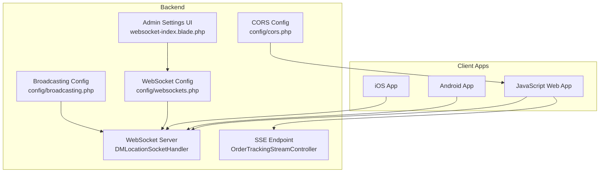
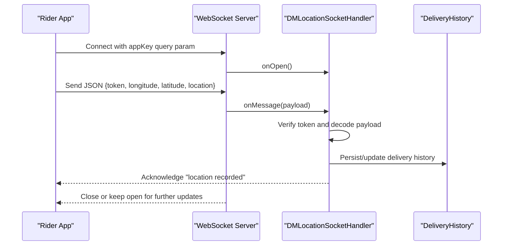
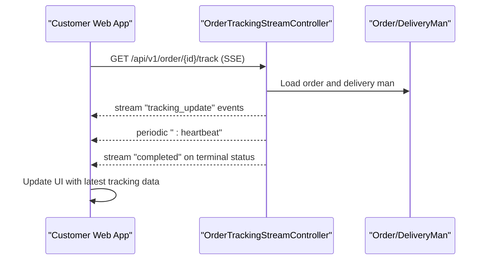
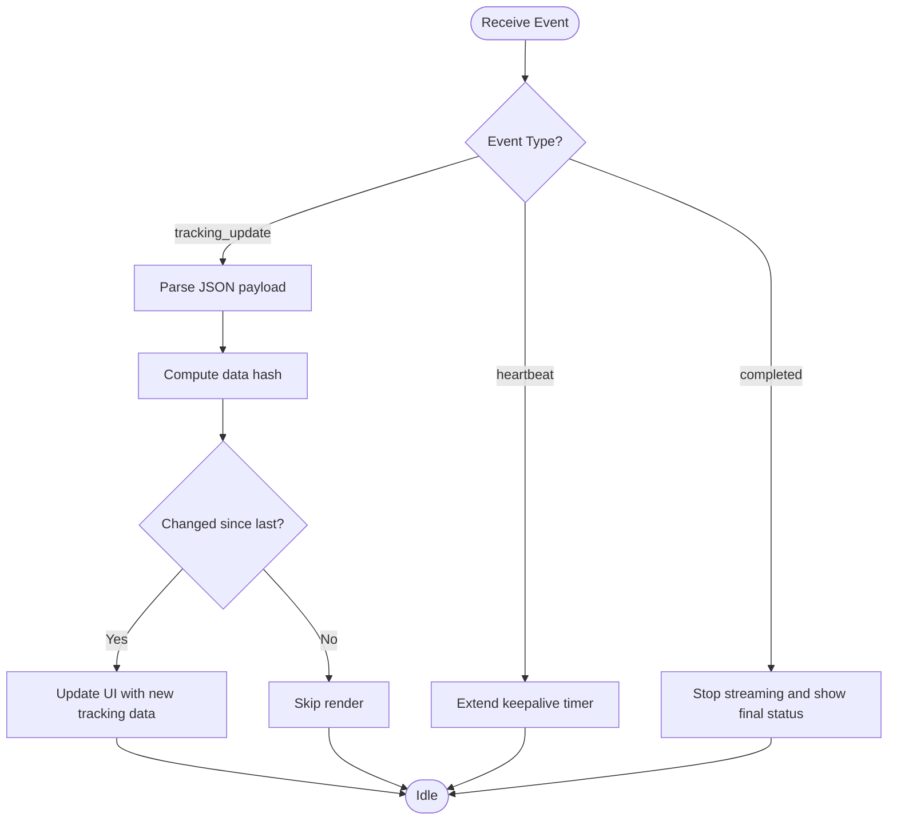
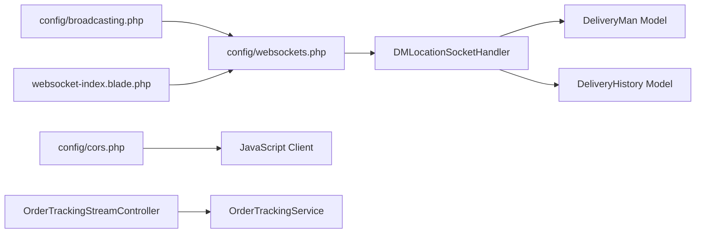

# Client Integration Guide

<cite>
**Referenced Files in This Document**
- [DMLocationSocketHandler.php](file://app/WebSockets/Handler/DMLocationSocketHandler.php)
- [websockets.php](file://config/websockets.php)
- [broadcasting.php](file://config/broadcasting.php)
- [cors.php](file://config/cors.php)
- [.env.example](file://.env.example)
- [websocket-index.blade.php](file://resources/views/admin-views/business-settings/websocket-index.blade.php)
- [OrderTrackingStreamController.php](file://app/Http/Controllers/Api/V1/OrderTrackingStreamController.php)
- [OrderTrackingService.php](file://app/Services/OrderTrackingService.php)
- [DeliveryMan.php](file://app/Models/DeliveryMan.php)
- [DeliveryHistory.php](file://app/Models/DeliveryHistory.php)
</cite>

## Table of Contents
1. [Introduction](#introduction)
2. [Project Structure](#project-structure)
3. [Core Components](#core-components)
4. [Architecture Overview](#architecture-overview)
5. [Detailed Component Analysis](#detailed-component-analysis)
6. [Dependency Analysis](#dependency-analysis)
7. [Performance Considerations](#performance-considerations)
8. [Troubleshooting Guide](#troubleshooting-guide)
9. [Conclusion](#conclusion)
10. [Appendices](#appendices)

## Introduction
This guide explains how to integrate real-time features into JavaScript web applications and mobile apps (Android/iOS) using the platform’s WebSocket and Server-Sent Events (SSE) infrastructure. It covers:
- WebSocket client setup for JavaScript, including connection parameters, authentication, and reconnection strategies
- Real-time event handling, message parsing, and UI updates for live tracking interfaces
- Mobile app integration patterns leveraging native WebSocket implementations and notification permissions
- Security considerations including CORS configuration and HTTPS requirements
- Production-ready client-side handlers, event listeners, and error handling

## Project Structure
The real-time stack consists of:
- A WebSocket handler for delivery location updates
- A Laravel configuration for the WebSocket server
- SSE endpoints for order tracking streams
- CORS configuration for cross-origin access
- Blade templates exposing admin-configurable WebSocket settings

**Diagram sources**
- [DMLocationSocketHandler.php:16-81](file://app/WebSockets/Handler/DMLocationSocketHandler.php#L16-L81)
- [websockets.php:1-142](file://config/websockets.php#L1-L142)
- [broadcasting.php:1-65](file://config/broadcasting.php#L1-L65)
- [cors.php:1-36](file://config/cors.php#L1-L36)
- [websocket-index.blade.php:1-96](file://resources/views/admin-views/business-settings/websocket-index.blade.php#L1-L96)
- [OrderTrackingStreamController.php:47-119](file://app/Http/Controllers/Api/V1/OrderTrackingStreamController.php#L47-L119)

**Section sources**
- [DMLocationSocketHandler.php:16-81](file://app/WebSockets/Handler/DMLocationSocketHandler.php#L16-L81)
- [websockets.php:1-142](file://config/websockets.php#L1-L142)
- [broadcasting.php:1-65](file://config/broadcasting.php#L1-L65)
- [cors.php:1-36](file://config/cors.php#L1-L36)
- [websocket-index.blade.php:1-96](file://resources/views/admin-views/business-settings/websocket-index.blade.php#L1-L96)
- [OrderTrackingStreamController.php:47-119](file://app/Http/Controllers/Api/V1/OrderTrackingStreamController.php#L47-L119)

## Core Components
- WebSocket Handler: Receives delivery location updates from riders, authenticates via token, persists history, and acknowledges receipt.
- SSE Tracking Stream: Streams order status and delivery location updates to clients at intervals.
- Configuration: WebSocket server, broadcasting driver, and CORS policies.
- Admin Settings: Exposes toggles and editable WebSocket endpoint parameters.

Key responsibilities:
- WebSocket handler validates app key via query parameter and persists location data for authenticated riders.
- SSE controller streams tracking updates and heartbeats, with terminal-status termination.
- CORS allows cross-origin requests for web clients.

**Section sources**
- [DMLocationSocketHandler.php:19-43](file://app/WebSockets/Handler/DMLocationSocketHandler.php#L19-L43)
- [OrderTrackingStreamController.php:47-119](file://app/Http/Controllers/Api/V1/OrderTrackingStreamController.php#L47-L119)
- [websockets.php:24-35](file://config/websockets.php#L24-L35)
- [cors.php:18-35](file://config/cors.php#L18-L35)

## Architecture Overview
The real-time architecture supports two primary client-facing protocols:
- WebSocket for bidirectional delivery location updates and acknowledgments
- SSE for unidirectional tracking updates and heartbeats

**Diagram sources**
- [DMLocationSocketHandler.php:19-43](file://app/WebSockets/Handler/DMLocationSocketHandler.php#L19-L43)
- [DeliveryHistory.php:1-22](file://app/Models/DeliveryHistory.php#L1-L22)

**Diagram sources**
- [OrderTrackingStreamController.php:47-119](file://app/Http/Controllers/Api/V1/OrderTrackingStreamController.php#L47-L119)
- [DeliveryMan.php:104-112](file://app/Models/DeliveryMan.php#L104-L112)

## Detailed Component Analysis

### WebSocket Client Setup (JavaScript)
Connection parameters and authentication:
- Base URL: ws(s)://{host}:{port}/{path}?appKey={your_app_key}
- Required query parameter: appKey
- Optional headers: Authorization (if configured by your backend)
- Reconnection strategy: exponential backoff with jitter; retry until max attempts or explicit stop

Authentication flow:
- After connecting, send a JSON message containing token, longitude, latitude, and location
- Server responds with an acknowledgment upon successful persistence

Reconnection logic:
- Detect close/error events and schedule reconnect after delay
- On reconnect, re-send authentication and resume live updates

Message format:
- Outgoing: {"token":"...", "longitude": "...", "latitude": "...", "location": "..."}
- Incoming: {"message":"location recorded"}

Error handling:
- Log connection failures and notify UI
- Surface actionable messages for invalid appKey or missing token

UI update pattern:
- On acknowledgment, clear any pending indicators
- Debounce frequent updates to reduce DOM churn

Production tips:
- Enforce TLS (wss) in production
- Validate origin against allowed list
- Limit message size per WebSocket config

**Section sources**
- [DMLocationSocketHandler.php:24-42](file://app/WebSockets/Handler/DMLocationSocketHandler.php#L24-L42)
- [DMLocationSocketHandler.php:62-72](file://app/WebSockets/Handler/DMLocationSocketHandler.php#L62-L72)
- [websockets.php:62-62](file://config/websockets.php#L62-L62)
- [cors.php:22-23](file://config/cors.php#L22-L23)

### SSE Client Setup (JavaScript)
Endpoint:
- GET /api/v1/order/{id}/track with Accept: text/event-stream

Event types:
- tracking_update: carries tracking payload
- completed: signals terminal order status
- Heartbeat: colon-prefixed comment to keep connection alive

Client lifecycle:
- Open connection on page load
- Parse incoming events and update UI
- On completed, stop polling and show final status
- On heartbeat absence beyond threshold, trigger reconnect

Headers and CORS:
- Ensure Access-Control-Allow-Origin and credentials support per CORS config

**Section sources**
- [OrderTrackingStreamController.php:47-119](file://app/Http/Controllers/Api/V1/OrderTrackingStreamController.php#L47-L119)
- [cors.php:18-35](file://config/cors.php#L18-L35)

### Real-Time Event Handling and UI Updates
Processing logic:
- For WebSocket: validate payload keys, authenticate token, persist delivery history, acknowledge
- For SSE: compute data hash to avoid duplicate renders, stream heartbeats, terminate on terminal status

UI update strategy:
- Debounce updates to prevent excessive re-layouts
- Show loading states during initial fetch and reconnects
- Display last known coordinates and timestamps

**Diagram sources**
- [OrderTrackingStreamController.php:47-119](file://app/Http/Controllers/Api/V1/OrderTrackingStreamController.php#L47-L119)

**Section sources**
- [OrderTrackingStreamController.php:106-119](file://app/Http/Controllers/Api/V1/OrderTrackingStreamController.php#L106-L119)
- [OrderTrackingService.php:28-50](file://app/Services/OrderTrackingService.php#L28-L50)

### Mobile App Integration (Android and iOS)
Android:
- Use a native WebSocket client library (e.g., OkHttp WebSocket)
- Establish connection with wss:// and appKey query parameter
- Request and persist notification permissions for push notifications
- Implement exponential backoff for reconnection

iOS:
- Use URLSessionWebSocketTask or Starscream
- Ensure background modes for location and network
- Request notification permissions and handle user denials gracefully
- Reconnect on network changes and app foregrounding

Shared patterns:
- Authenticate with token and location payload
- Handle server acknowledgments and error events
- Respect user preferences for real-time updates

[No sources needed since this section provides general guidance]

### Security Considerations
CORS configuration:
- Configure allowed origins and headers for cross-origin access
- Enable credentials if needed for authenticated clients

HTTPS and TLS:
- Prefer wss:// for production WebSocket connections
- Configure SSL context in WebSocket server

Authentication:
- Validate appKey via query parameter on connect
- Require token in payload for location updates
- Sanitize and validate incoming message fields

Rate limiting and limits:
- Respect max request size as configured in WebSocket server
- Apply client-side throttling for frequent updates

**Section sources**
- [cors.php:18-35](file://config/cors.php#L18-L35)
- [websockets.php:112-131](file://config/websockets.php#L112-L131)
- [DMLocationSocketHandler.php:62-72](file://app/WebSockets/Handler/DMLocationSocketHandler.php#L62-L72)
- [DMLocationSocketHandler.php:24-42](file://app/WebSockets/Handler/DMLocationSocketHandler.php#L24-L42)

### Admin Configuration and Environment
Admin settings:
- Toggle WebSocket status and configure WebSocket URL and port
- Save settings to business settings for runtime consumption

Environment variables:
- Broadcasting driver and Pusher app credentials
- CORS allowed origins list

**Section sources**
- [websocket-index.blade.php:22-93](file://resources/views/admin-views/business-settings/websocket-index.blade.php#L22-L93)
- [.env.example:18-50](file://.env.example#L18-L50)
- [broadcasting.php:33-42](file://config/broadcasting.php#L33-L42)

## Dependency Analysis

**Diagram sources**
- [DMLocationSocketHandler.php:5-13](file://app/WebSockets/Handler/DMLocationSocketHandler.php#L5-L13)
- [DeliveryMan.php:104-112](file://app/Models/DeliveryMan.php#L104-L112)
- [DeliveryHistory.php:17-20](file://app/Models/DeliveryHistory.php#L17-L20)
- [websockets.php:24-35](file://config/websockets.php#L24-L35)
- [broadcasting.php:33-42](file://config/broadcasting.php#L33-L42)
- [cors.php:18-35](file://config/cors.php#L18-L35)
- [websocket-index.blade.php:66-83](file://resources/views/admin-views/business-settings/websocket-index.blade.php#L66-L83)
- [OrderTrackingStreamController.php:47-119](file://app/Http/Controllers/Api/V1/OrderTrackingStreamController.php#L47-L119)
- [OrderTrackingService.php:28-50](file://app/Services/OrderTrackingService.php#L28-L50)

**Section sources**
- [DMLocationSocketHandler.php:5-13](file://app/WebSockets/Handler/DMLocationSocketHandler.php#L5-L13)
- [websockets.php:24-35](file://config/websockets.php#L24-L35)
- [broadcasting.php:33-42](file://config/broadcasting.php#L33-L42)
- [cors.php:18-35](file://config/cors.php#L18-L35)
- [websocket-index.blade.php:66-83](file://resources/views/admin-views/business-settings/websocket-index.blade.php#L66-L83)
- [OrderTrackingStreamController.php:47-119](file://app/Http/Controllers/Api/V1/OrderTrackingStreamController.php#L47-L119)
- [OrderTrackingService.php:28-50](file://app/Services/OrderTrackingService.php#L28-L50)

## Performance Considerations
- Reduce update frequency: throttle location updates to a sensible cadence
- Efficient rendering: debounce UI updates and batch DOM changes
- Connection reuse: keep a single WebSocket connection per session
- SSE buffering: ensure server disables buffering for immediate delivery
- Backpressure: stop sending updates when UI cannot process them

[No sources needed since this section provides general guidance]

## Troubleshooting Guide
Common issues and resolutions:
- Connection refused or blocked: verify WebSocket URL/port and firewall rules; ensure TLS is enabled in production
- Invalid appKey: confirm appKey query parameter matches configured app settings
- Missing token in payload: ensure rider app sends token, longitude, latitude, and location
- CORS errors: align allowed origins and headers with client domain and required headers
- SSE not receiving updates: check server headers and ensure client sets Accept header for SSE

Operational checks:
- Confirm WebSocket server is running and listening on configured port
- Validate SSE endpoint returns proper event stream headers
- Monitor for heartbeat absence indicating client disconnect

**Section sources**
- [DMLocationSocketHandler.php:62-72](file://app/WebSockets/Handler/DMLocationSocketHandler.php#L62-L72)
- [OrderTrackingStreamController.php:94-100](file://app/Http/Controllers/Api/V1/OrderTrackingStreamController.php#L94-L100)
- [cors.php:22-27](file://config/cors.php#L22-L27)

## Conclusion
This guide outlines a production-grade approach to integrating real-time features across web and mobile platforms. By adhering to secure connection practices, robust reconnection strategies, and efficient event handling, you can deliver responsive live tracking experiences. Use the provided configuration references and component analyses to implement reliable WebSocket and SSE clients tailored to your deployment environment.

[No sources needed since this section summarizes without analyzing specific files]

## Appendices

### Appendix A: WebSocket Message Schema
- Outgoing (from client): {token, longitude, latitude, location}
- Incoming (from server): {message:"location recorded"}

**Section sources**
- [DMLocationSocketHandler.php:24-42](file://app/WebSockets/Handler/DMLocationSocketHandler.php#L24-L42)

### Appendix B: SSE Event Payload
- tracking_update: includes order_id, status, sub_status, delivery_man (id, lat, lng), timestamp
- completed: indicates terminal order status

**Section sources**
- [OrderTrackingStreamController.php:106-119](file://app/Http/Controllers/Api/V1/OrderTrackingStreamController.php#L106-L119)