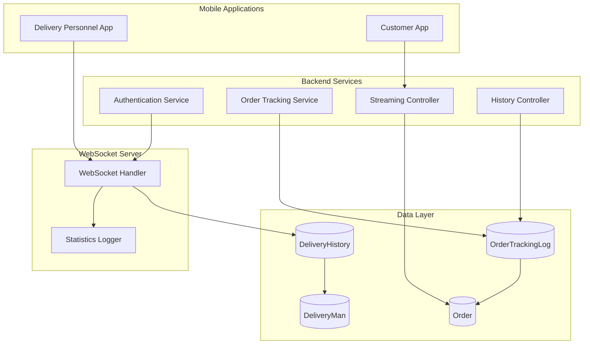
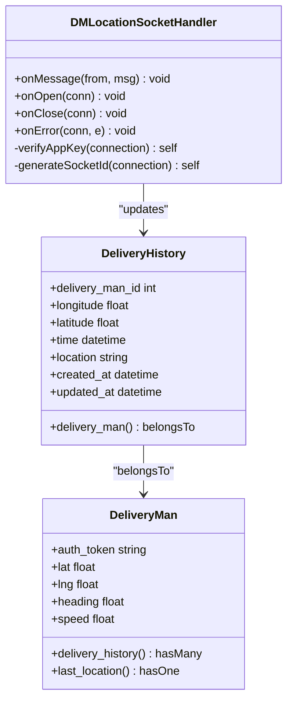
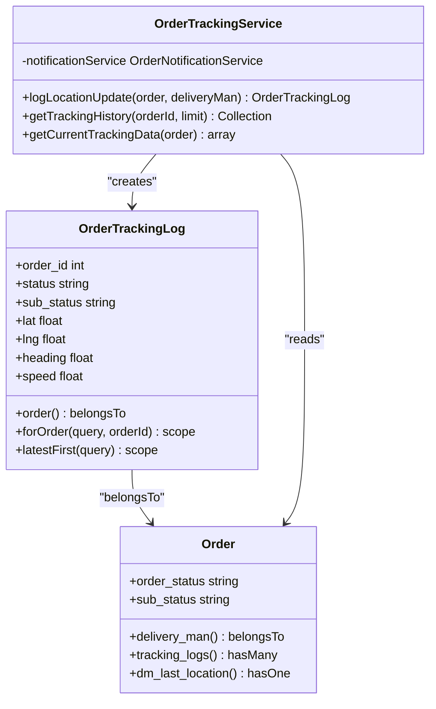
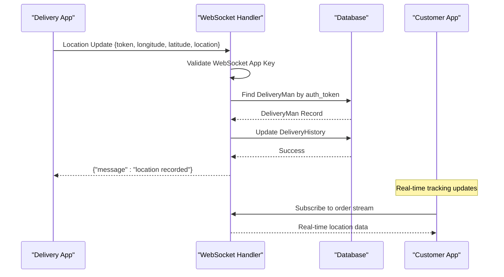
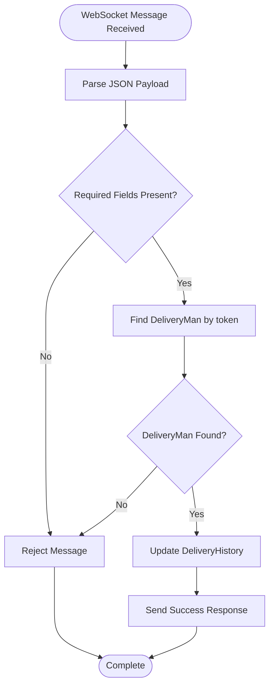
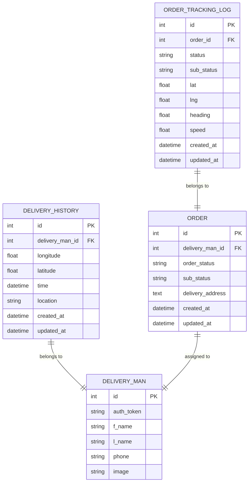
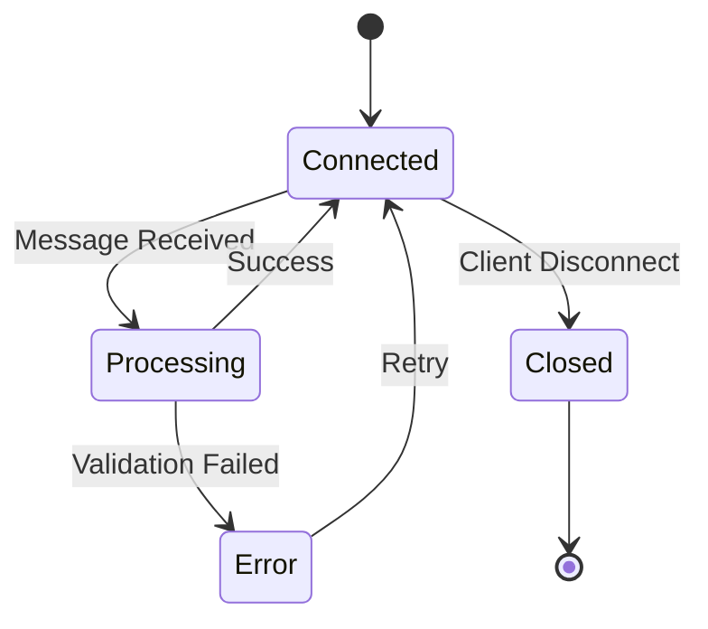
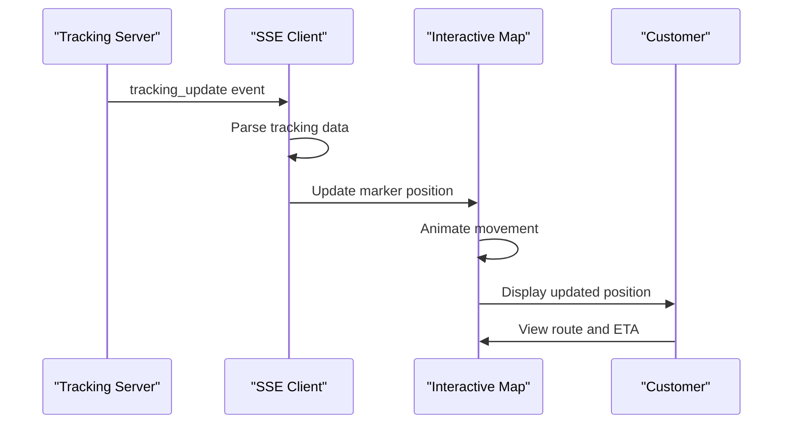

# Live Location Tracking

<cite>
**Referenced Files in This Document**
- [DMLocationSocketHandler.php](file://app/WebSockets/Handler/DMLocationSocketHandler.php)
- [DeliveryHistory.php](file://app/Models/DeliveryHistory.php)
- [DeliveryMan.php](file://app/Models/DeliveryMan.php)
- [Order.php](file://app/Models/Order.php)
- [OrderTrackingLog.php](file://app/Models/OrderTrackingLog.php)
- [OrderTrackingService.php](file://app/Services/OrderTrackingService.php)
- [OrderTrackingStreamController.php](file://app/Http/Controllers/Api/V1/OrderTrackingStreamController.php)
- [OrderTrackingHistoryController.php](file://app/Http/Controllers/Api/V1/OrderTrackingHistoryController.php)
- [websockets.php](file://config/websockets.php)
- [websocket-index.blade.php](file://resources/views/admin-views/business-settings/websocket-index.blade.php)
</cite>

## Table of Contents
1. [Introduction](#introduction)
2. [System Architecture](#system-architecture)
3. [Core Components](#core-components)
4. [Location Data Collection Process](#location-data-collection-process)
5. [Real-time GPS Coordinate Updates](#real-time-gps-coordinate-updates)
6. [Historical Tracking Capabilities](#historical-tracking-capabilities)
7. [WebSocket Integration](#websocket-integration)
8. [Data Persistence](#data-persistence)
9. [Mapping and Coordinates](#mapping-and-coordinates)
10. [Client Implementation Examples](#client-implementation-examples)
11. [Real-time Map Rendering](#real-time-map-rendering)
12. [Performance Considerations](#performance-considerations)
13. [Troubleshooting Guide](#troubleshooting-guide)
14. [Conclusion](#conclusion)

## Introduction

The live location tracking system enables real-time monitoring of delivery personnel positions during order fulfillment. This comprehensive system provides continuous location broadcasting from mobile applications to the backend server, real-time tracking updates for customers, and historical location data for analytics and audit purposes.

The system integrates three primary data collection methods: WebSocket-based live location updates, traditional HTTP-based location reporting, and historical tracking logs. This multi-modal approach ensures robust location tracking regardless of network conditions or client capabilities.

## System Architecture

The live location tracking system follows a distributed architecture with clear separation of concerns:



**Diagram sources**
- [DMLocationSocketHandler.php:16-81](file://app/WebSockets/Handler/DMLocationSocketHandler.php#L16-L81)
- [OrderTrackingService.php:12-50](file://app/Services/OrderTrackingService.php#L12-L50)
- [OrderTrackingStreamController.php:10-101](file://app/Http/Controllers/Api/V1/OrderTrackingStreamController.php#L10-L101)

## Core Components

### WebSocket Location Handler

The WebSocket handler serves as the primary interface for real-time location updates from delivery personnel mobile applications.



**Diagram sources**
- [DMLocationSocketHandler.php:16-81](file://app/WebSockets/Handler/DMLocationSocketHandler.php#L16-L81)
- [DeliveryHistory.php:7-21](file://app/Models/DeliveryHistory.php#L7-L21)
- [DeliveryMan.php:104-112](file://app/Models/DeliveryMan.php#L104-L112)

**Section sources**
- [DMLocationSocketHandler.php:16-81](file://app/WebSockets/Handler/DMLocationSocketHandler.php#L16-L81)
- [DeliveryHistory.php:7-21](file://app/Models/DeliveryHistory.php#L7-L21)
- [DeliveryMan.php:104-112](file://app/Models/DeliveryMan.php#L104-L112)

### Order Tracking Service

The order tracking service manages historical location data and proximity notifications.



**Diagram sources**
- [OrderTrackingService.php:12-100](file://app/Services/OrderTrackingService.php#L12-L100)
- [OrderTrackingLog.php:8-55](file://app/Models/OrderTrackingLog.php#L8-L55)
- [Order.php:196-199](file://app/Models/Order.php#L196-L199)

**Section sources**
- [OrderTrackingService.php:12-100](file://app/Services/OrderTrackingService.php#L12-L100)
- [OrderTrackingLog.php:8-55](file://app/Models/OrderTrackingLog.php#L8-L55)
- [Order.php:196-199](file://app/Models/Order.php#L196-L199)

## Location Data Collection Process

The system employs multiple data collection mechanisms to ensure reliable location tracking:

### Real-time WebSocket Collection

The WebSocket handler processes live location updates from delivery personnel applications:



**Diagram sources**
- [DMLocationSocketHandler.php:19-42](file://app/WebSockets/Handler/DMLocationSocketHandler.php#L19-L42)
- [OrderTrackingStreamController.php:19-101](file://app/Http/Controllers/Api/V1/OrderTrackingStreamController.php#L19-L101)

### Historical Data Collection

The system maintains comprehensive historical records through multiple mechanisms:

**Section sources**
- [DMLocationSocketHandler.php:19-42](file://app/WebSockets/Handler/DMLocationSocketHandler.php#L19-L42)
- [OrderTrackingService.php:28-49](file://app/Services/OrderTrackingService.php#L28-L49)

## Real-time GPS Coordinate Updates

### WebSocket Message Format

The WebSocket communication protocol supports bidirectional real-time location updates:

| Field | Type | Required | Description |
|-------|------|----------|-------------|
| token | string | Yes | Delivery personnel authentication token |
| longitude | float | Yes | GPS longitude coordinate |
| latitude | float | Yes | GPS latitude coordinate |
| location | string | Yes | Human-readable location address |

### Authentication Token Validation

The system validates delivery personnel credentials before processing location updates:



**Diagram sources**
- [DMLocationSocketHandler.php:24-42](file://app/WebSockets/Handler/DMLocationSocketHandler.php#L24-L42)

**Section sources**
- [DMLocationSocketHandler.php:24-42](file://app/WebSockets/Handler/DMLocationSocketHandler.php#L24-L42)

## Historical Tracking Capabilities

### Order Tracking Logs

The system maintains detailed historical records of delivery personnel movements:

| Field | Type | Description |
|-------|------|-------------|
| order_id | integer | Associated order identifier |
| status | string | Current order status |
| sub_status | string | Detailed order sub-status |
| lat | float | Latitude coordinate |
| lng | float | Longitude coordinate |
| heading | float | Movement direction (degrees) |
| speed | float | Movement speed (km/h) |
| created_at | datetime | Log creation timestamp |

### Delivery History Management

The delivery history model provides efficient location tracking and retrieval:



**Diagram sources**
- [DeliveryHistory.php:7-21](file://app/Models/DeliveryHistory.php#L7-L21)
- [OrderTrackingLog.php:8-55](file://app/Models/OrderTrackingLog.php#L8-L55)
- [DeliveryMan.php:104-112](file://app/Models/DeliveryMan.php#L104-L112)
- [Order.php:196-199](file://app/Models/Order.php#L196-L199)

**Section sources**
- [OrderTrackingLog.php:12-30](file://app/Models/OrderTrackingLog.php#L12-L30)
- [DeliveryHistory.php:9-15](file://app/Models/DeliveryHistory.php#L9-L15)

## WebSocket Integration

### Configuration and Setup

The WebSocket server operates independently from the main HTTP server, providing dedicated real-time communication capabilities:

| Configuration | Default Value | Description |
|---------------|---------------|-------------|
| Port | 6001 | WebSocket server listening port |
| Path | laravel-websockets | WebSocket endpoint path |
| Capacity | null | Maximum concurrent connections |
| Client Messages | false | Allow client-to-client messaging |
| Statistics | true | Enable connection statistics |

### Connection Management

The WebSocket handler implements robust connection lifecycle management:



**Diagram sources**
- [DMLocationSocketHandler.php:46-60](file://app/WebSockets/Handler/DMLocationSocketHandler.php#L46-L60)
- [websockets.php:10-35](file://config/websockets.php#L10-L35)

**Section sources**
- [websockets.php:10-35](file://config/websockets.php#L10-L35)
- [DMLocationSocketHandler.php:46-81](file://app/WebSockets/Handler/DMLocationSocketHandler.php#L46-L81)

## Data Persistence

### Database Schema Design

The system employs optimized database schemas for efficient location data storage and retrieval:

#### DeliveryHistory Table
- Primary key: `id`
- Foreign key: `delivery_man_id` → `delivery_men.id`
- Indexes: Composite index on `(delivery_man_id, created_at)`
- Storage: Efficient binary representation of coordinates

#### OrderTrackingLog Table  
- Primary key: `id`
- Foreign key: `order_id` → `orders.id`
- Indexes: `order_id`, composite `(order_id, created_at)`
- Storage: Decimal precision for GPS coordinates (10,8) for latitude, (11,8) for longitude

### Data Retention Policies

The system implements configurable data retention for optimal performance:

| Data Type | Default Retention | Purpose |
|-----------|-------------------|---------|
| WebSocket Statistics | 60 days | Connection analytics |
| Order Tracking Logs | Configurable | Audit trails and analytics |
| Delivery History | Configurable | Last known locations |

**Section sources**
- [websockets.php:96-105](file://config/websockets.php#L96-L105)
- [OrderTrackingLog.php:22-30](file://app/Models/OrderTrackingLog.php#L22-L30)

## Mapping and Coordinates

### Coordinate Precision and Accuracy

The system maintains precise geographic coordinates with appropriate decimal precision:

| Coordinate Type | Precision | Range | Accuracy |
|----------------|-----------|-------|----------|
| Latitude | 10 decimal places | -90.00000000 to 90.00000000 | ~0.11 meters |
| Longitude | 11 decimal places | -180.000000000 to 180.000000000 | ~0.11 meters |

### Location Accuracy Handling

The system processes location data with built-in accuracy validation and filtering mechanisms to ensure reliable tracking information.

### Map Integration

The platform supports integration with major mapping providers through configuration settings for:

- Google Maps API integration
- Custom map tile providers
- Route calculation services
- Geocoding services

**Section sources**
- [OrderTrackingLog.php:24-26](file://app/Models/OrderTrackingLog.php#L24-L26)

## Client Implementation Examples

### Mobile Application Integration

Delivery personnel applications should implement the following location broadcasting pattern:

```javascript
// Example WebSocket client implementation
const socket = new WebSocket(`ws://your-server.com:6001/laravel-websockets?appKey=${APP_KEY}`);

socket.onopen = function(event) {
    console.log('Connected to location tracking server');
};

socket.onmessage = function(event) {
    const data = JSON.parse(event.data);
    console.log('Location update received:', data.message);
};

// Send periodic location updates
setInterval(() => {
    const locationData = {
        token: AUTH_TOKEN,
        longitude: CURRENT_LONGITUDE,
        latitude: CURRENT_LATITUDE,
        location: ADDRESS_STRING
    };
    
    socket.send(JSON.stringify(locationData));
}, 5000); // Every 5 seconds
```

### Real-time Tracking Implementation

Customer applications can subscribe to real-time order tracking updates:

```javascript
// Server-Sent Events implementation
const eventSource = new EventSource(`/api/v1/tracking/stream/${ORDER_ID}?contact_number=${PHONE_NUMBER}`);

eventSource.onmessage = function(event) {
    const trackingData = JSON.parse(event.data);
    updateMap(trackingData.delivery_man);
    updateOrderStatus(trackingData.status);
};

eventSource.onerror = function(error) {
    console.error('Tracking stream error:', error);
};
```

## Real-time Map Rendering

### Dynamic Map Updates

The system supports real-time map rendering with smooth animation and accurate positioning:



**Diagram sources**
- [OrderTrackingStreamController.php:64-68](file://app/Http/Controllers/Api/V1/OrderTrackingStreamController.php#L64-L68)

### Map Features

The integrated mapping system provides:

- Real-time delivery personnel markers
- Route visualization with estimated arrival times
- Historical route playback
- Proximity alerts and notifications
- Traffic-aware route optimization

**Section sources**
- [OrderTrackingStreamController.php:106-131](file://app/Http/Controllers/Api/V1/OrderTrackingStreamController.php#L106-L131)

## Performance Considerations

### Connection Optimization

The WebSocket server implements several performance optimizations:

- **Connection Pooling**: Efficient management of concurrent connections
- **Message Batching**: Reduced network overhead through message aggregation
- **Compression**: Automatic compression of location data payloads
- **Heartbeat Monitoring**: Automatic detection and cleanup of stale connections

### Database Performance

Optimized database queries and indexing strategies ensure fast location data retrieval:

- **Composite Indexes**: Multi-column indexes for frequently queried combinations
- **Partitioning**: Logical partitioning of historical data
- **Connection Pooling**: Database connection reuse for improved throughput
- **Query Optimization**: Efficient retrieval of latest location records

### Memory Management

The system implements memory-efficient location data handling:

- **Circular Buffers**: Limited memory footprint for recent location history
- **Lazy Loading**: Deferred loading of historical location data
- **Garbage Collection**: Automatic cleanup of expired location records

## Troubleshooting Guide

### Common Issues and Solutions

#### WebSocket Connection Problems

**Issue**: Clients cannot establish WebSocket connections
**Solution**: Verify WebSocket server is running and configured correctly

**Issue**: Authentication failures for location updates
**Solution**: Check delivery personnel authentication tokens and server configuration

#### Location Data Issues

**Issue**: Inaccurate or missing location coordinates
**Solution**: Implement GPS accuracy validation and retry mechanisms

**Issue**: Delayed location updates
**Solution**: Optimize network configuration and reduce payload sizes

#### Performance Issues

**Issue**: High server resource consumption
**Solution**: Monitor connection limits and implement rate limiting

**Issue**: Slow map rendering
**Solution**: Optimize client-side rendering and reduce update frequency

### Monitoring and Debugging

The system provides comprehensive monitoring capabilities:

- **WebSocket Statistics**: Connection counts, message rates, and error metrics
- **Location Accuracy Metrics**: GPS signal quality and update frequency tracking
- **Performance Analytics**: Response times and resource utilization monitoring
- **Error Logging**: Comprehensive error tracking and alerting

**Section sources**
- [websockets.php:76-106](file://config/websockets.php#L76-L106)
- [DMLocationSocketHandler.php:57-60](file://app/WebSockets/Handler/DMLocationSocketHandler.php#L57-L60)

## Conclusion

The live location tracking system provides a robust, scalable solution for real-time delivery personnel monitoring. Through its multi-modal approach combining WebSocket-based live updates, historical tracking logs, and real-time streaming capabilities, the system ensures reliable location tracking under various network conditions.

Key strengths of the implementation include:

- **Real-time Communication**: Instantaneous location updates via WebSocket technology
- **Historical Analytics**: Comprehensive tracking logs for audit and optimization
- **Scalable Architecture**: Independent WebSocket server for optimal performance
- **Flexible Integration**: Support for multiple client platforms and mapping providers
- **Performance Optimization**: Efficient data storage and retrieval mechanisms

The system's modular design allows for easy extension and customization while maintaining high reliability and performance standards essential for production delivery tracking applications.