# Order Status Streaming

<cite>
**Referenced Files in This Document**
- [OrderTrackingStreamController.php](file://app/Http/Controllers/Api/V1/OrderTrackingStreamController.php)
- [OrderTrackingHistoryController.php](file://app/Http/Controllers/Api/V1/OrderTrackingHistoryController.php)
- [LiveActivityController.php](file://app/Http/Controllers/Api/V1/LiveActivityController.php)
- [routes/web.php](file://routes/web.php)
- [LiveActivityService.php](file://app/Services/LiveActivityService.php)
- [OrderNotificationService.php](file://app/Services/OrderNotificationService.php)
- [OrderTrackingService.php](file://app/Services/OrderTrackingService.php)
- [OrderStatusService.php](file://app/Services/OrderStatusService.php)
- [OrderTrackingLog.php](file://app/Models/OrderTrackingLog.php)
- [OrderStatusLog.php](file://app/Models/OrderStatusLog.php)
- [LiveActivityToken.php](file://app/Models/LiveActivityToken.php)
- [DMLocationSocketHandler.php](file://app/WebSockets/Handler/DMLocationSocketHandler.php)
- [create_live_activity_tokens_table.php](file://database/migrations/2026_03_22_000001_create_live_activity_tokens_table.php)
- [order.php](file://config/order.php)
- [helpers.php](file://app/CentralLogics/helpers.php)
- [NotificationTrait.php](file://app/Traits/NotificationTrait.php)
</cite>

## Table of Contents
1. [Introduction](#introduction)
2. [Project Structure](#project-structure)
3. [Core Components](#core-components)
4. [Architecture Overview](#architecture-overview)
5. [Detailed Component Analysis](#detailed-component-analysis)
6. [Dependency Analysis](#dependency-analysis)
7. [Performance Considerations](#performance-considerations)
8. [Troubleshooting Guide](#troubleshooting-guide)
9. [Conclusion](#conclusion)
10. [Appendices](#appendices)

## Introduction
This document explains the real-time order status streaming and notifications system. It covers:
- Server-Sent Events (SSE) streaming for live order tracking
- iOS Live Activity integration for persistent order progress on devices
- Event-driven order status updates across kitchen preparation, delivery assignment, and delivery completion
- Access control, throttling, and heartbeat mechanisms for SSE
- Proximity-based notifications and ETA-aware messaging
- Timeline visualization and in-app messaging via push notifications

## Project Structure
The streaming and notification stack spans controllers, services, models, traits, and configuration:
- Controllers expose SSE and Live Activity endpoints
- Services orchestrate status transitions, notifications, and proximity checks
- Models persist tracking and status logs
- Traits encapsulate cross-cutting notification logic
- Configuration defines valid status transitions and operational limits

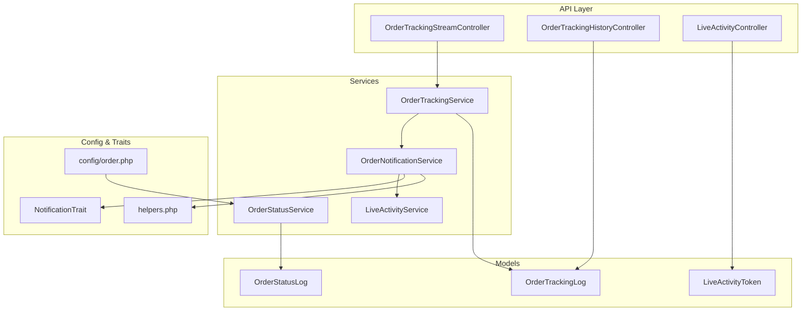

**Diagram sources**
- [OrderTrackingStreamController.php:1-119](file://app/Http/Controllers/Api/V1/OrderTrackingStreamController.php#L1-L119)
- [OrderTrackingHistoryController.php:1-103](file://app/Http/Controllers/Api/V1/OrderTrackingHistoryController.php#L1-L103)
- [LiveActivityController.php:1-42](file://app/Http/Controllers/Api/V1/LiveActivityController.php#L1-L42)
- [OrderTrackingService.php:1-124](file://app/Services/OrderTrackingService.php#L1-L124)
- [OrderNotificationService.php:1-312](file://app/Services/OrderNotificationService.php#L1-L312)
- [LiveActivityService.php:1-37](file://app/Services/LiveActivityService.php#L1-L37)
- [OrderStatusService.php:1-348](file://app/Services/OrderStatusService.php#L1-L348)
- [OrderTrackingLog.php:1-56](file://app/Models/OrderTrackingLog.php#L1-L56)
- [OrderStatusLog.php:1-112](file://app/Models/OrderStatusLog.php#L1-L112)
- [LiveActivityToken.php:1-31](file://app/Models/LiveActivityToken.php#L1-L31)
- [order.php:66-79](file://config/order.php#L66-L79)
- [NotificationTrait.php:34-63](file://app/Traits/NotificationTrait.php#L34-L63)
- [helpers.php:1410-1439](file://app/CentralLogics/helpers.php#L1410-L1439)

**Section sources**
- [routes/web.php:248-258](file://routes/web.php#L248-L258)
- [OrderTrackingStreamController.php:1-119](file://app/Http/Controllers/Api/V1/OrderTrackingStreamController.php#L1-L119)
- [OrderTrackingHistoryController.php:1-103](file://app/Http/Controllers/Api/V1/OrderTrackingHistoryController.php#L1-L103)
- [LiveActivityController.php:1-42](file://app/Http/Controllers/Api/V1/LiveActivityController.php#L1-L42)
- [OrderTrackingService.php:1-124](file://app/Services/OrderTrackingService.php#L1-L124)
- [OrderNotificationService.php:1-312](file://app/Services/OrderNotificationService.php#L1-L312)
- [LiveActivityService.php:1-37](file://app/Services/LiveActivityService.php#L1-L37)
- [OrderStatusService.php:1-348](file://app/Services/OrderStatusService.php#L1-L348)
- [OrderTrackingLog.php:1-56](file://app/Models/OrderTrackingLog.php#L1-L56)
- [OrderStatusLog.php:1-112](file://app/Models/OrderStatusLog.php#L1-L112)
- [LiveActivityToken.php:1-31](file://app/Models/LiveActivityToken.php#L1-L31)
- [order.php:66-79](file://config/order.php#L66-L79)
- [NotificationTrait.php:34-63](file://app/Traits/NotificationTrait.php#L34-L63)
- [helpers.php:1410-1439](file://app/CentralLogics/helpers.php#L1410-L1439)

## Core Components
- OrderTrackingStreamController: SSE endpoint that streams order state changes to clients with heartbeat and termination on terminal statuses.
- OrderTrackingHistoryController: Returns historical tracking logs with pagination and access control.
- LiveActivityController: Stores iOS Live Activity push tokens linked to orders.
- OrderTrackingService: Builds current tracking data, logs location updates, and manages sub-status transitions.
- OrderNotificationService: Sends push notifications and Live Activity updates, computes display titles/subtitles, and proximity triggers.
- LiveActivityService: Pushes APNs HTTP/2 Live Activity updates/end events.
- OrderStatusService: Enforces valid status transitions, atomic updates, audit logging, and estimated delivery recalculation.
- Models: Persist tracking logs and status logs; LiveActivityToken stores device tokens.
- Configuration: Defines valid transitions and operational thresholds.

**Section sources**
- [OrderTrackingStreamController.php:1-119](file://app/Http/Controllers/Api/V1/OrderTrackingStreamController.php#L1-L119)
- [OrderTrackingHistoryController.php:1-103](file://app/Http/Controllers/Api/V1/OrderTrackingHistoryController.php#L1-L103)
- [LiveActivityController.php:1-42](file://app/Http/Controllers/Api/V1/LiveActivityController.php#L1-L42)
- [OrderTrackingService.php:1-124](file://app/Services/OrderTrackingService.php#L1-L124)
- [OrderNotificationService.php:1-312](file://app/Services/OrderNotificationService.php#L1-L312)
- [LiveActivityService.php:1-37](file://app/Services/LiveActivityService.php#L1-L37)
- [OrderStatusService.php:1-348](file://app/Services/OrderStatusService.php#L1-L348)
- [OrderTrackingLog.php:1-56](file://app/Models/OrderTrackingLog.php#L1-L56)
- [OrderStatusLog.php:1-112](file://app/Models/OrderStatusLog.php#L1-L112)
- [LiveActivityToken.php:1-31](file://app/Models/LiveActivityToken.php#L1-L31)
- [order.php:66-79](file://config/order.php#L66-L79)

## Architecture Overview
The system uses an event-driven pipeline:
- Controllers expose endpoints for SSE and Live Activity token registration
- Services validate transitions, compute ETA, and trigger notifications
- Models persist logs for audit and history
- Clients receive SSE updates and/or iOS Live Activity push updates

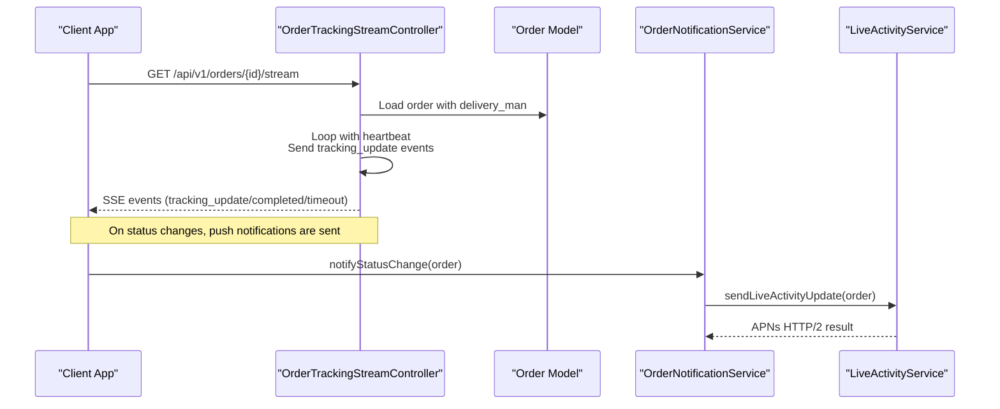

**Diagram sources**
- [OrderTrackingStreamController.php:19-101](file://app/Http/Controllers/Api/V1/OrderTrackingStreamController.php#L19-L101)
- [OrderNotificationService.php:86-122](file://app/Services/OrderNotificationService.php#L86-L122)
- [LiveActivityService.php:35-37](file://app/Services/LiveActivityService.php#L35-L37)

## Detailed Component Analysis

### SSE Streaming Endpoint
- Endpoint: GET /api/v1/orders/{id}/stream
- Throttled to 60 requests per minute per IP
- Streams order tracking updates as Server-Sent Events
- Heartbeat messages keep connections alive
- Terminates on terminal statuses (delivered, canceled, failed, refunded)
- Access control via user ownership, guest phone number, or guest ID

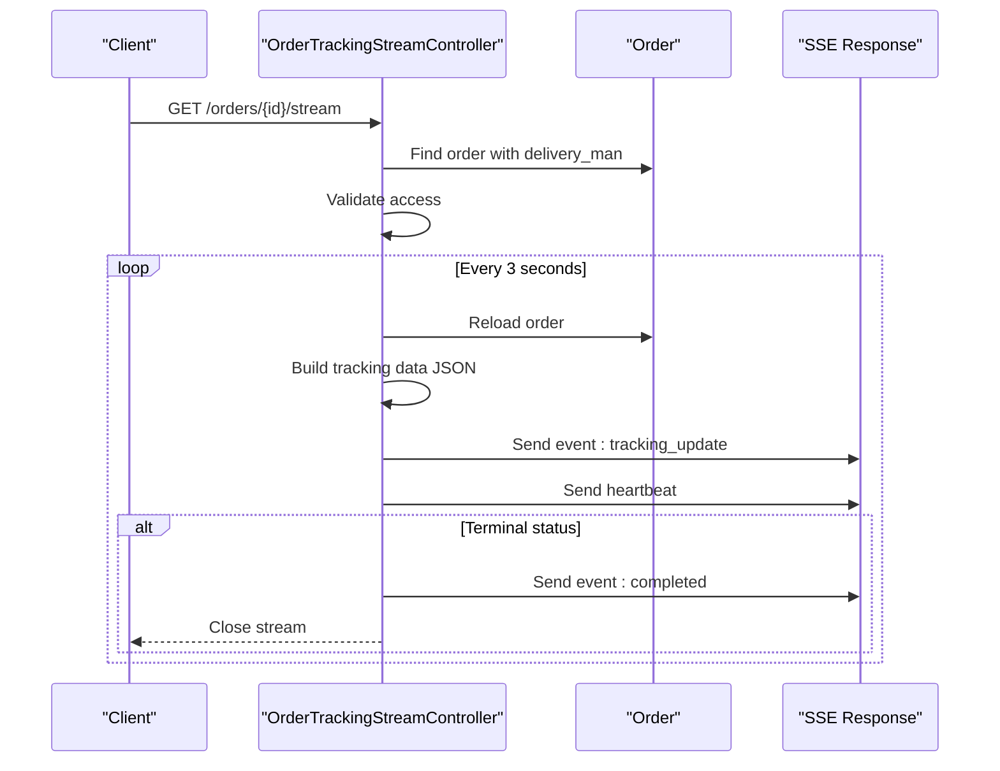

**Diagram sources**
- [OrderTrackingStreamController.php:19-101](file://app/Http/Controllers/Api/V1/OrderTrackingStreamController.php#L19-L101)
- [routes/web.php:248-252](file://routes/web.php#L248-L252)

**Section sources**
- [OrderTrackingStreamController.php:19-101](file://app/Http/Controllers/Api/V1/OrderTrackingStreamController.php#L19-L101)
- [routes/web.php:248-252](file://routes/web.php#L248-L252)

### Live Activity Token Management
- Endpoint: POST /api/v1/customer/live-activity-token
- Validates order_id and push_token
- Upserts LiveActivityToken with platform set to ios
- Used to push APNs Live Activity updates

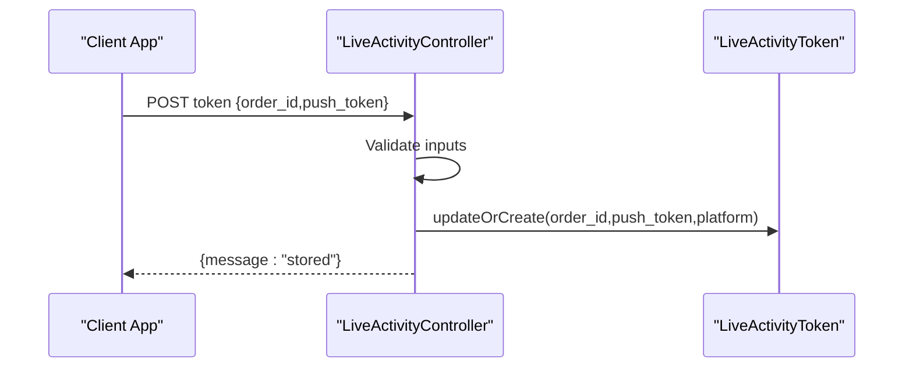

**Diagram sources**
- [LiveActivityController.php:20-41](file://app/Http/Controllers/Api/V1/LiveActivityController.php#L20-L41)
- [create_live_activity_tokens_table.php:14-24](file://database/migrations/2026_03_22_000001_create_live_activity_tokens_table.php#L14-L24)

**Section sources**
- [LiveActivityController.php:20-41](file://app/Http/Controllers/Api/V1/LiveActivityController.php#L20-L41)
- [LiveActivityToken.php:1-31](file://app/Models/LiveActivityToken.php#L1-L31)
- [create_live_activity_tokens_table.php:14-24](file://database/migrations/2026_03_22_000001_create_live_activity_tokens_table.php#L14-L24)

### Live Activity Updates via APNs
- OrderNotificationService sends Live Activity updates when a token exists
- Determines end vs update based on terminal statuses
- Delegates APNs HTTP/2 push to LiveActivityService
- Uses JWT-based credentials configured in services config

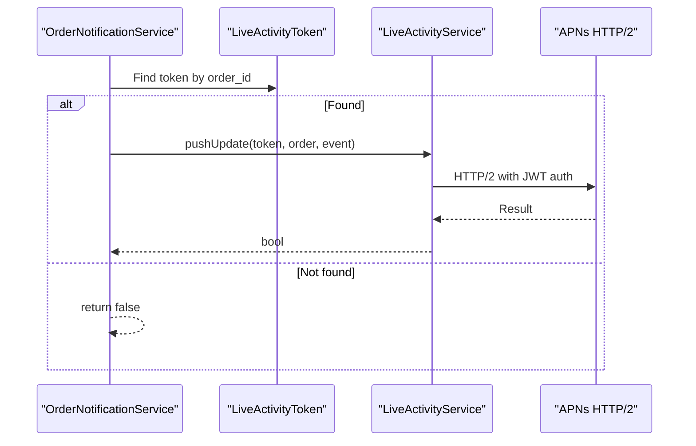

**Diagram sources**
- [OrderNotificationService.php:177-196](file://app/Services/OrderNotificationService.php#L177-L196)
- [LiveActivityService.php:35-37](file://app/Services/LiveActivityService.php#L35-L37)

**Section sources**
- [OrderNotificationService.php:177-196](file://app/Services/OrderNotificationService.php#L177-L196)
- [LiveActivityService.php:22-37](file://app/Services/LiveActivityService.php#L22-L37)

### Order Status Updates and Notifications
- OrderStatusService validates transitions and performs atomic updates
- Triggers Helpers::send_order_notification on success
- OrderNotificationService builds display titles/subtitles and sends push notifications
- Supports proximity-based “nearby” and “arrived” sub-status updates

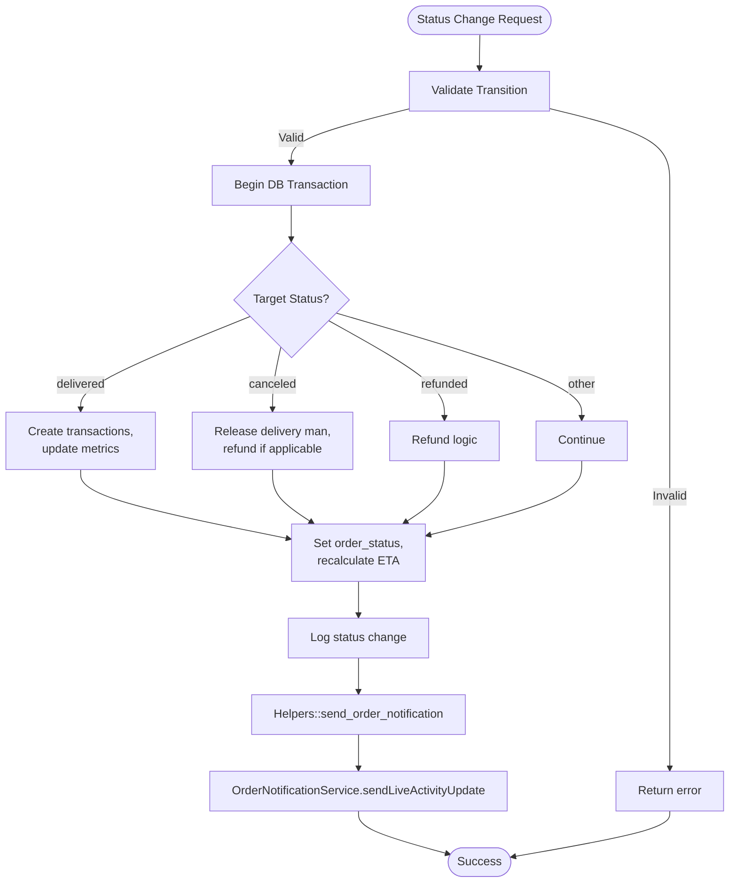

**Diagram sources**
- [OrderStatusService.php:89-156](file://app/Services/OrderStatusService.php#L89-L156)
- [OrderStatusService.php:158-266](file://app/Services/OrderStatusService.php#L158-L266)
- [OrderNotificationService.php:86-122](file://app/Services/OrderNotificationService.php#L86-L122)

**Section sources**
- [OrderStatusService.php:26-78](file://app/Services/OrderStatusService.php#L26-L78)
- [OrderStatusService.php:89-156](file://app/Services/OrderStatusService.php#L89-L156)
- [OrderStatusService.php:158-266](file://app/Services/OrderStatusService.php#L158-L266)
- [OrderNotificationService.php:86-122](file://app/Services/OrderNotificationService.php#L86-L122)

### Tracking History and Access Control
- Endpoint: GET /api/v1/orders/{id}/tracking-history
- Paginates OrderTrackingLog entries for an order
- Access control supports logged-in owners, guest phone number matching, and guest_id for guest orders

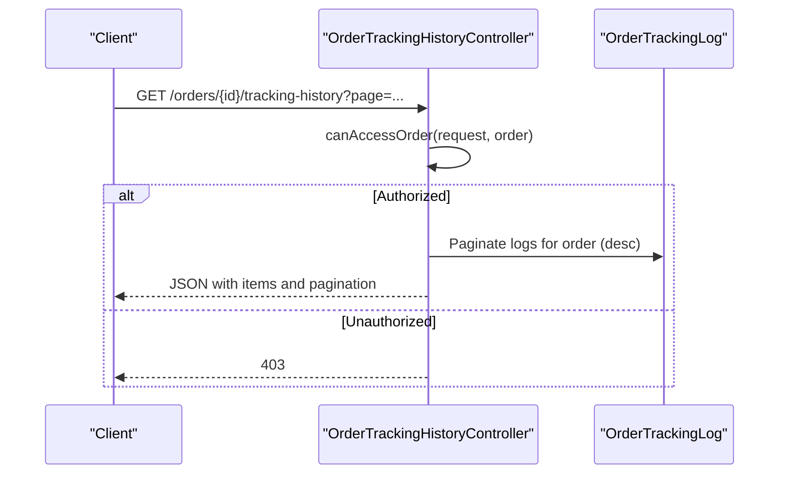

**Diagram sources**
- [OrderTrackingHistoryController.php:20-60](file://app/Http/Controllers/Api/V1/OrderTrackingHistoryController.php#L20-L60)
- [OrderTrackingHistoryController.php:65-101](file://app/Http/Controllers/Api/V1/OrderTrackingHistoryController.php#L65-L101)

**Section sources**
- [OrderTrackingHistoryController.php:20-60](file://app/Http/Controllers/Api/V1/OrderTrackingHistoryController.php#L20-L60)
- [OrderTrackingHistoryController.php:65-101](file://app/Http/Controllers/Api/V1/OrderTrackingHistoryController.php#L65-L101)

### Proximity-Based Notifications
- OrderTrackingService logs driver locations and triggers proximity checks
- OrderNotificationService calculates distance and promotes sub-status to “nearby” when within 500m
- Sends push notification for “nearby” and “arrived” stages

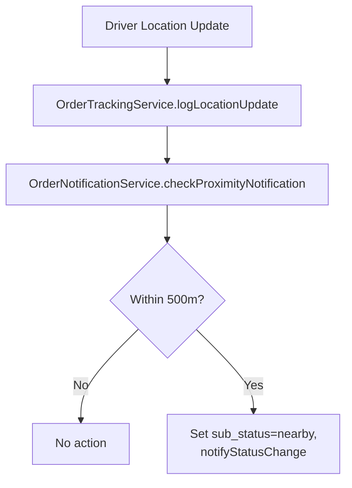

**Diagram sources**
- [OrderTrackingService.php:28-50](file://app/Services/OrderTrackingService.php#L28-L50)
- [OrderNotificationService.php:252-283](file://app/Services/OrderNotificationService.php#L252-L283)

**Section sources**
- [OrderTrackingService.php:28-50](file://app/Services/OrderTrackingService.php#L28-L50)
- [OrderNotificationService.php:252-283](file://app/Services/OrderNotificationService.php#L252-L283)

### WebSocket Delivery Location Handler
- DMLocationSocketHandler receives driver location updates via WebSocket
- Verifies app key and records delivery history
- Provides a foundation for real-time driver location broadcasting (not used for order tracking streaming)

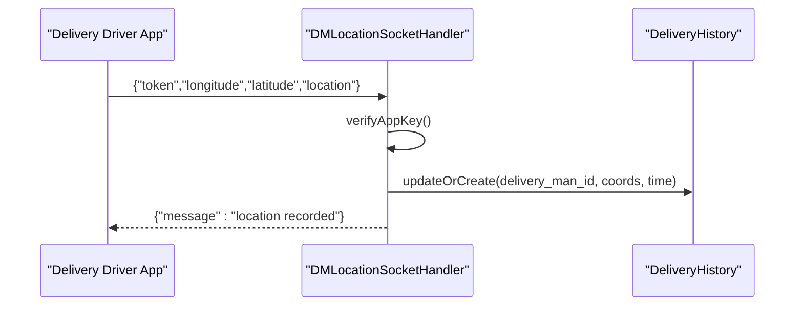

**Diagram sources**
- [DMLocationSocketHandler.php:19-43](file://app/WebSockets/Handler/DMLocationSocketHandler.php#L19-L43)

**Section sources**
- [DMLocationSocketHandler.php:19-43](file://app/WebSockets/Handler/DMLocationSocketHandler.php#L19-L43)

## Dependency Analysis
- Controllers depend on models and services for data retrieval and business logic
- OrderNotificationService composes NotificationTrait and helpers for push delivery
- OrderStatusService centralizes transition validation and audit logging
- LiveActivityService depends on APNs configuration and JWT credentials

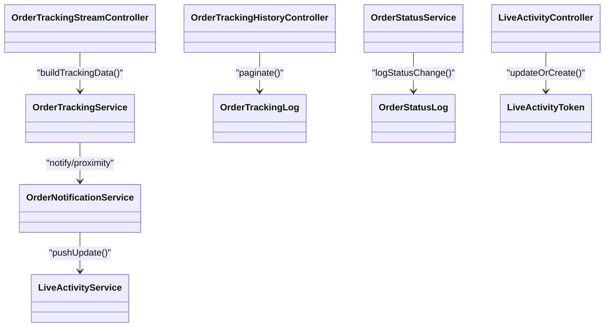

**Diagram sources**
- [OrderTrackingStreamController.php:106-114](file://app/Http/Controllers/Api/V1/OrderTrackingStreamController.php#L106-L114)
- [OrderTrackingHistoryController.php:44-46](file://app/Http/Controllers/Api/V1/OrderTrackingHistoryController.php#L44-L46)
- [LiveActivityController.php:29-36](file://app/Http/Controllers/Api/V1/LiveActivityController.php#L29-L36)
- [OrderTrackingService.php:14-18](file://app/Services/OrderTrackingService.php#L14-L18)
- [OrderNotificationService.php:177-196](file://app/Services/OrderNotificationService.php#L177-L196)
- [OrderStatusService.php:313-338](file://app/Services/OrderStatusService.php#L313-L338)

**Section sources**
- [OrderTrackingStreamController.php:106-114](file://app/Http/Controllers/Api/V1/OrderTrackingStreamController.php#L106-L114)
- [OrderTrackingHistoryController.php:44-46](file://app/Http/Controllers/Api/V1/OrderTrackingHistoryController.php#L44-L46)
- [LiveActivityController.php:29-36](file://app/Http/Controllers/Api/V1/LiveActivityController.php#L29-L36)
- [OrderTrackingService.php:14-18](file://app/Services/OrderTrackingService.php#L14-L18)
- [OrderNotificationService.php:177-196](file://app/Services/OrderNotificationService.php#L177-L196)
- [OrderStatusService.php:313-338](file://app/Services/OrderStatusService.php#L313-L338)

## Performance Considerations
- SSE streaming: Heartbeat and periodic reload prevent stale data; connection terminates after terminal statuses or timeout
- Throttling: Streaming endpoint is throttled to reduce load
- Database queries: Minimal refresh per cycle; hash-based deduplication avoids redundant events
- Proximity checks: Distance calculation is O(1) per update; avoid frequent recalculations by batching driver updates
- Live Activity updates: APNs HTTP/2 push is asynchronous; failures are logged and do not block main flow

[No sources needed since this section provides general guidance]

## Troubleshooting Guide
- SSE connection closes unexpectedly:
  - Check terminal status conditions and heartbeat presence
  - Verify access control parameters (user ownership, guest phone normalization)
- No Live Activity updates:
  - Confirm LiveActivityToken exists for the order
  - Validate APNs configuration and JWT credentials
- Proximity notifications not triggering:
  - Ensure order is in picked_up stage and sub_status is not already nearby/arrived
  - Verify delivery address coordinates are present
- Status transitions failing:
  - Confirm the requested transition is defined in configuration
  - Check transaction rollback logs for exceptions

**Section sources**
- [OrderTrackingStreamController.php:28-30](file://app/Http/Controllers/Api/V1/OrderTrackingStreamController.php#L28-L30)
- [OrderTrackingStreamController.php:44-48](file://app/Http/Controllers/Api/V1/OrderTrackingStreamController.php#L44-L48)
- [OrderNotificationService.php:177-196](file://app/Services/OrderNotificationService.php#L177-L196)
- [LiveActivityService.php:22-37](file://app/Services/LiveActivityService.php#L22-L37)
- [OrderNotificationService.php:252-283](file://app/Services/OrderNotificationService.php#L252-L283)
- [OrderStatusService.php:94-99](file://app/Services/OrderStatusService.php#L94-L99)
- [order.php:66-79](file://config/order.php#L66-L79)

## Conclusion
The system combines SSE for real-time order tracking, robust status transition validation, and iOS Live Activity integration for persistent progress updates. Proximity-based notifications and ETA-aware messaging enhance the customer experience. The modular design separates concerns across controllers, services, and models, enabling maintainability and scalability.

[No sources needed since this section summarizes without analyzing specific files]

## Appendices

### Order Status Timeline Visualization
- Use OrderStatusLog to retrieve chronological status changes
- Display previous_status, new_status, updated_by, reason, and timestamp
- Ideal for admin dashboards and customer support

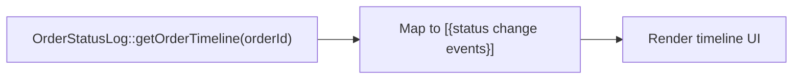

**Diagram sources**
- [OrderStatusLog.php:95-110](file://app/Models/OrderStatusLog.php#L95-L110)

**Section sources**
- [OrderStatusLog.php:95-110](file://app/Models/OrderStatusLog.php#L95-L110)
- [OrderStatusService.php:343-346](file://app/Services/OrderStatusService.php#L343-L346)

### Real-Time Customer Notifications
- Push notifications are sent on status changes and proximity triggers
- Rich payload includes order_id, type, and image for client-side rendering
- Live Activity updates complement push notifications on iOS

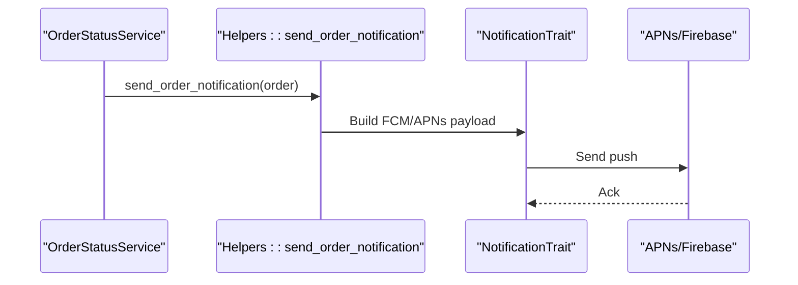

**Diagram sources**
- [OrderStatusService.php:138-142](file://app/Services/OrderStatusService.php#L138-L142)
- [helpers.php:1410-1439](file://app/CentralLogics/helpers.php#L1410-L1439)
- [NotificationTrait.php:34-63](file://app/Traits/NotificationTrait.php#L34-L63)

**Section sources**
- [OrderStatusService.php:138-142](file://app/Services/OrderStatusService.php#L138-L142)
- [helpers.php:1410-1439](file://app/CentralLogics/helpers.php#L1410-L1439)
- [NotificationTrait.php:34-63](file://app/Traits/NotificationTrait.php#L34-L63)