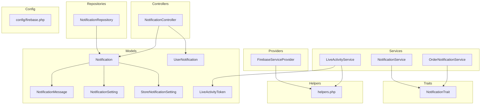
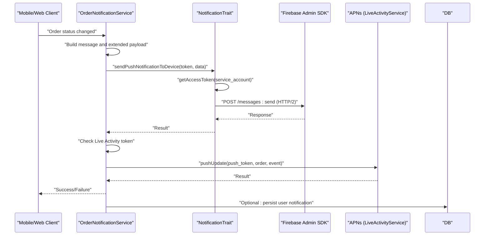
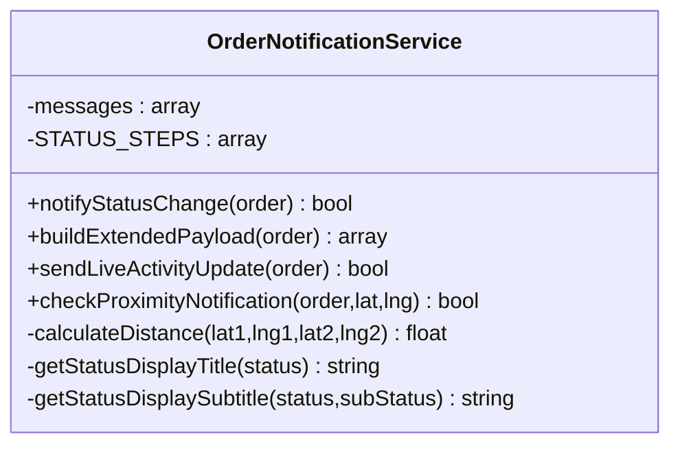
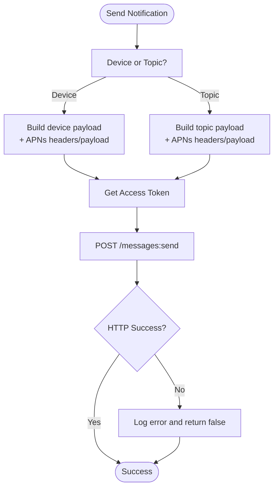
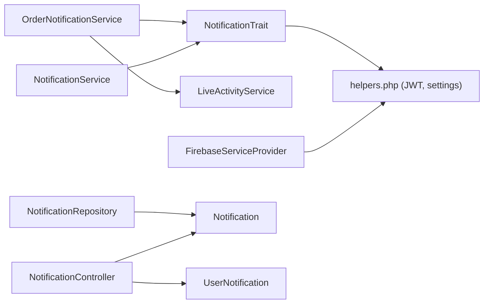

# Push Notification System

<cite>
**Referenced Files in This Document**
- [OrderNotificationService.php](file://app/Services/OrderNotificationService.php)
- [NotificationTrait.php](file://app/Traits/NotificationTrait.php)
- [FirebaseServiceProvider.php](file://app/Providers/FirebaseServiceProvider.php)
- [firebase.php](file://config/firebase.php)
- [helpers.php](file://app/CentralLogics/helpers.php)
- [LiveActivityService.php](file://app/Services/LiveActivityService.php)
- [LiveActivityToken.php](file://app/Models/LiveActivityToken.php)
- [Notification.php](file://app/Models/Notification.php)
- [NotificationMessage.php](file://app/Models/NotificationMessage.php)
- [NotificationSetting.php](file://app/Models/NotificationSetting.php)
- [StoreNotificationSetting.php](file://app/Models/StoreNotificationSetting.php)
- [UserNotification.php](file://app/Models/UserNotification.php)
- [NotificationService.php](file://app/Services/NotificationService.php)
- [NotificationRepository.php](file://app/Repositories/NotificationRepository.php)
- [NotificationController.php](file://app/Http/Controllers/Api/V1/NotificationController.php)
- [NotificationDataSetUpTrait.php](file://app/Traits/NotificationDataSetUpTrait.php)
</cite>

## Table of Contents
1. [Introduction](#introduction)
2. [Project Structure](#project-structure)
3. [Core Components](#core-components)
4. [Architecture Overview](#architecture-overview)
5. [Detailed Component Analysis](#detailed-component-analysis)
6. [Dependency Analysis](#dependency-analysis)
7. [Performance Considerations](#performance-considerations)
8. [Troubleshooting Guide](#troubleshooting-guide)
9. [Conclusion](#conclusion)
10. [Appendices](#appendices)

## Introduction
This document describes the push notification system implementation for real-time messaging to mobile devices and web browsers. It covers Firebase Cloud Messaging (FCM) integration, notification templates and formatting, delivery mechanisms for order confirmations, status updates, and promotional alerts. It documents the OrderNotificationService for centralized order-related notifications, the Notification model for storing notification history, and related services and traits for cross-platform delivery, including iOS Live Activities via APNs. It also outlines scheduling, batch sending, user preference management, and examples of notification triggers and custom payload handling.

## Project Structure
The notification system spans several Laravel components:
- Services: centralized logic for order notifications and generic notifications
- Traits: reusable FCM/APNs payload building and HTTP transport
- Providers: Firebase service container binding
- Models: persistence for notifications, user-specific records, and settings
- Repositories: CRUD and filtering for notifications
- Controllers: API endpoints for retrieving notifications
- Configuration: Firebase project settings and credentials

**Diagram sources**
- [OrderNotificationService.php:1-312](file://app/Services/OrderNotificationService.php#L1-L312)
- [NotificationTrait.php:1-285](file://app/Traits/NotificationTrait.php#L1-L285)
- [FirebaseServiceProvider.php:1-45](file://app/Providers/FirebaseServiceProvider.php#L1-L45)
- [firebase.php:1-183](file://config/firebase.php#L1-L183)
- [helpers.php:1309-1471](file://app/CentralLogics/helpers.php#L1309-L1471)
- [LiveActivityService.php:1-37](file://app/Services/LiveActivityService.php#L1-L37)
- [LiveActivityToken.php:1-22](file://app/Models/LiveActivityToken.php#L1-L22)
- [Notification.php:1-142](file://app/Models/Notification.php#L1-L142)
- [UserNotification.php:1-22](file://app/Models/UserNotification.php#L1-L22)
- [NotificationMessage.php:1-17](file://app/Models/NotificationMessage.php#L1-L17)
- [NotificationSetting.php:1-15](file://app/Models/NotificationSetting.php#L1-L15)
- [StoreNotificationSetting.php:1-19](file://app/Models/StoreNotificationSetting.php#L1-L19)
- [NotificationService.php:1-64](file://app/Services/NotificationService.php#L1-L64)
- [NotificationRepository.php:1-90](file://app/Repositories/NotificationRepository.php#L1-L90)
- [NotificationController.php:1-40](file://app/Http/Controllers/Api/V1/NotificationController.php#L1-L40)

**Section sources**
- [OrderNotificationService.php:1-312](file://app/Services/OrderNotificationService.php#L1-L312)
- [NotificationTrait.php:1-285](file://app/Traits/NotificationTrait.php#L1-L285)
- [FirebaseServiceProvider.php:1-45](file://app/Providers/FirebaseServiceProvider.php#L1-L45)
- [firebase.php:1-183](file://config/firebase.php#L1-L183)
- [helpers.php:1309-1471](file://app/CentralLogics/helpers.php#L1309-L1471)
- [LiveActivityService.php:1-37](file://app/Services/LiveActivityService.php#L1-L37)
- [LiveActivityToken.php:1-22](file://app/Models/LiveActivityToken.php#L1-L22)
- [Notification.php:1-142](file://app/Models/Notification.php#L1-L142)
- [UserNotification.php:1-22](file://app/Models/UserNotification.php#L1-L22)
- [NotificationMessage.php:1-17](file://app/Models/NotificationMessage.php#L1-L17)
- [NotificationSetting.php:1-15](file://app/Models/NotificationSetting.php#L1-L15)
- [StoreNotificationSetting.php:1-19](file://app/Models/StoreNotificationSetting.php#L1-L19)
- [NotificationService.php:1-64](file://app/Services/NotificationService.php#L1-L64)
- [NotificationRepository.php:1-90](file://app/Repositories/NotificationRepository.php#L1-L90)
- [NotificationController.php:1-40](file://app/Http/Controllers/Api/V1/NotificationController.php#L1-L40)

## Core Components
- OrderNotificationService: centralizes order lifecycle notifications, builds rich payloads, and integrates with Live Activities for iOS.
- NotificationTrait: encapsulates FCM HTTP transport, JWT token generation, and cross-platform payload formatting for topics and device tokens.
- FirebaseServiceProvider: binds Firebase Messaging using service account credentials stored in business settings.
- LiveActivityService: pushes APNs updates for iOS Live Activities with JWT-based authentication and environment configuration.
- NotificationService and NotificationRepository: manage promotional and administrative notifications, including topic-based distribution and CRUD operations.
- Models: Notification, UserNotification, NotificationMessage, NotificationSetting, StoreNotificationSetting, LiveActivityToken support persistence and preferences.
- NotificationController: exposes API endpoint to fetch customer notifications scoped by zones.

**Section sources**
- [OrderNotificationService.php:86-122](file://app/Services/OrderNotificationService.php#L86-L122)
- [NotificationTrait.php:10-129](file://app/Traits/NotificationTrait.php#L10-L129)
- [NotificationTrait.php:131-213](file://app/Traits/NotificationTrait.php#L131-L213)
- [NotificationTrait.php:215-248](file://app/Traits/NotificationTrait.php#L215-L248)
- [FirebaseServiceProvider.php:14-34](file://app/Providers/FirebaseServiceProvider.php#L14-L34)
- [LiveActivityService.php:35-36](file://app/Services/LiveActivityService.php#L35-L36)
- [NotificationService.php:45-60](file://app/Services/NotificationService.php#L45-L60)
- [NotificationRepository.php:20-74](file://app/Repositories/NotificationRepository.php#L20-L74)
- [Notification.php:26-141](file://app/Models/Notification.php#L26-L141)
- [UserNotification.php:8-21](file://app/Models/UserNotification.php#L8-L21)
- [NotificationMessage.php:8-16](file://app/Models/NotificationMessage.php#L8-L16)
- [NotificationSetting.php:8-14](file://app/Models/NotificationSetting.php#L8-L14)
- [StoreNotificationSetting.php:8-18](file://app/Models/StoreNotificationSetting.php#L8-L18)
- [LiveActivityToken.php:1-22](file://app/Models/LiveActivityToken.php#L1-L22)
- [NotificationController.php:13-37](file://app/Http/Controllers/Api/V1/NotificationController.php#L13-L37)

## Architecture Overview
The system uses Firebase Admin credentials to authenticate and send FCM messages via HTTP/2. For iOS Live Activities, APNs is used separately with JWT authentication. Order notifications are enriched with ETA, store/delivery info, and progress indicators. Promotional notifications leverage topic-based distribution.

**Diagram sources**
- [OrderNotificationService.php:86-122](file://app/Services/OrderNotificationService.php#L86-L122)
- [OrderNotificationService.php:177-196](file://app/Services/OrderNotificationService.php#L177-L196)
- [NotificationTrait.php:215-248](file://app/Traits/NotificationTrait.php#L215-L248)
- [LiveActivityService.php:35-36](file://app/Services/LiveActivityService.php#L35-L36)

## Detailed Component Analysis

### OrderNotificationService
Responsibilities:
- Maps order status/sub-status to localized message templates
- Builds rich data payloads for background UI updates
- Sends device-specific notifications via FCM
- Triggers iOS Live Activity updates when applicable
- Proximity-based “nearby” notifications using Haversine distance

Key behaviors:
- Status mapping and display titles/subtitles
- Extended payload fields: status, sub_status, ETA minutes/text, store/delivery info, progress/step, display title/subtitle
- Live Activity end vs update events based on order lifecycle
- Proximity detection threshold and sub-status updates

**Diagram sources**
- [OrderNotificationService.php:14-312](file://app/Services/OrderNotificationService.php#L14-L312)

**Section sources**
- [OrderNotificationService.php:18-81](file://app/Services/OrderNotificationService.php#L18-L81)
- [OrderNotificationService.php:86-122](file://app/Services/OrderNotificationService.php#L86-L122)
- [OrderNotificationService.php:133-172](file://app/Services/OrderNotificationService.php#L133-L172)
- [OrderNotificationService.php:177-196](file://app/Services/OrderNotificationService.php#L177-L196)
- [OrderNotificationService.php:252-283](file://app/Services/OrderNotificationService.php#L252-L283)
- [OrderNotificationService.php:288-302](file://app/Services/OrderNotificationService.php#L288-L302)

### NotificationTrait (FCM Transport and Payload Builder)
Responsibilities:
- Build topic/device FCM payloads with platform-specific fields (Android channel, APNs headers/payload)
- Send HTTP/2 requests to FCM using project-scoped JWT access tokens
- Generate access tokens from service account credentials

Delivery mechanisms:
- Topic-based and device-token-based notifications
- Cross-platform payload normalization for Android and iOS
- Error logging and graceful failure handling

**Diagram sources**
- [NotificationTrait.php:10-129](file://app/Traits/NotificationTrait.php#L10-L129)
- [NotificationTrait.php:131-213](file://app/Traits/NotificationTrait.php#L131-L213)
- [NotificationTrait.php:215-248](file://app/Traits/NotificationTrait.php#L215-L248)

**Section sources**
- [NotificationTrait.php:10-129](file://app/Traits/NotificationTrait.php#L10-L129)
- [NotificationTrait.php:131-213](file://app/Traits/NotificationTrait.php#L131-L213)
- [NotificationTrait.php:215-248](file://app/Traits/NotificationTrait.php#L215-L248)

### FirebaseServiceProvider and Configuration
- Binds Firebase Messaging using a service account extracted from business settings
- Configuration supports credentials auto-discovery and logging options

**Section sources**
- [FirebaseServiceProvider.php:14-34](file://app/Providers/FirebaseServiceProvider.php#L14-L34)
- [firebase.php:16-181](file://config/firebase.php#L16-L181)

### LiveActivityService (iOS APNs)
- Sends APNs HTTP/2 updates for iOS Live Activities
- Requires APNs team/key/bundle/environment configuration
- Supports “update” and “end” events based on order lifecycle

**Section sources**
- [LiveActivityService.php:22-36](file://app/Services/LiveActivityService.php#L22-L36)

### NotificationService and NotificationRepository
- NotificationService handles promotional/admin notifications, image upload, and topic derivation
- NotificationRepository manages CRUD, search, pagination, and export lists

**Section sources**
- [NotificationService.php:11-60](file://app/Services/NotificationService.php#L11-L60)
- [NotificationRepository.php:20-88](file://app/Repositories/NotificationRepository.php#L20-L88)

### NotificationController (API)
- Returns active customer notifications filtered by zone(s) and recent timestamps
- Merges global notifications with user-specific records

**Section sources**
- [NotificationController.php:13-37](file://app/Http/Controllers/Api/V1/NotificationController.php#L13-L37)

### Models and Settings
- Notification: stores title, description, image, target, zone scoping, and computed full image URL
- UserNotification: stores per-user notification payloads as JSON
- NotificationMessage: translation-enabled message entity
- NotificationSetting and StoreNotificationSetting: enable/disable push notifications per event and per store/module
- LiveActivityToken: associates order to APNs Live Activity push token

**Section sources**
- [Notification.php:26-141](file://app/Models/Notification.php#L26-L141)
- [UserNotification.php:8-21](file://app/Models/UserNotification.php#L8-L21)
- [NotificationMessage.php:8-16](file://app/Models/NotificationMessage.php#L8-L16)
- [NotificationSetting.php:8-14](file://app/Models/NotificationSetting.php#L8-L14)
- [StoreNotificationSetting.php:8-18](file://app/Models/StoreNotificationSetting.php#L8-L18)
- [LiveActivityToken.php:1-22](file://app/Models/LiveActivityToken.php#L1-L22)

## Dependency Analysis
- OrderNotificationService depends on NotificationTrait for transport and on LiveActivityService for iOS updates
- NotificationTrait depends on helpers for JWT token retrieval and on business settings for credentials
- FirebaseServiceProvider supplies Firebase Messaging instances via service account
- NotificationService and NotificationRepository coordinate promotional notifications and topic routing
- NotificationController aggregates Notification and UserNotification models

**Diagram sources**
- [OrderNotificationService.php:16-16](file://app/Services/OrderNotificationService.php#L16-L16)
- [NotificationTrait.php:272-283](file://app/Traits/NotificationTrait.php#L272-L283)
- [FirebaseServiceProvider.php:14-34](file://app/Providers/FirebaseServiceProvider.php#L14-L34)
- [NotificationService.php:1-10](file://app/Services/NotificationService.php#L1-L10)
- [NotificationRepository.php:14-18](file://app/Repositories/NotificationRepository.php#L14-L18)
- [NotificationController.php:6-8](file://app/Http/Controllers/Api/V1/NotificationController.php#L6-L8)

**Section sources**
- [OrderNotificationService.php:16-16](file://app/Services/OrderNotificationService.php#L16-L16)
- [NotificationTrait.php:272-283](file://app/Traits/NotificationTrait.php#L272-L283)
- [FirebaseServiceProvider.php:14-34](file://app/Providers/FirebaseServiceProvider.php#L14-L34)
- [NotificationService.php:1-10](file://app/Services/NotificationService.php#L1-L10)
- [NotificationRepository.php:14-18](file://app/Repositories/NotificationRepository.php#L14-L18)
- [NotificationController.php:6-8](file://app/Http/Controllers/Api/V1/NotificationController.php#L6-L8)

## Performance Considerations
- Prefer device-token delivery for targeted, high-priority order updates to minimize bandwidth and avoid topic fan-out costs.
- Use extended payload fields to reduce client-side API calls for background updates.
- Cache and reuse access tokens within the hour window to reduce JWT generation overhead.
- Batch promotional notifications by topic to reduce repeated sends; use NotificationService’s topic derivation for zone-wide broadcasts.
- Limit proximity checks to necessary intervals to avoid excessive distance calculations.

## Troubleshooting Guide
Common issues and resolutions:
- Missing Firebase project_id or invalid service account: verify business settings and ensure the service file content is present and correct.
- APNs authentication failures: confirm APNs team_id, key_id, private_key, bundle_id, and environment configuration.
- Live Activity push failures: check order status lifecycle and ensure a valid LiveActivityToken exists for the order.
- HTTP/2 request errors: inspect logs for status codes and error bodies returned by FCM.

**Section sources**
- [NotificationTrait.php:220-247](file://app/Traits/NotificationTrait.php#L220-L247)
- [LiveActivityService.php:35-36](file://app/Services/LiveActivityService.php#L35-L36)
- [OrderNotificationService.php:192-195](file://app/Services/OrderNotificationService.php#L192-L195)

## Conclusion
The system provides a robust, centralized push notification pipeline integrating FCM for Android/iOS and APNs for iOS Live Activities. OrderNotificationService encapsulates order lifecycle messaging with rich payloads and proximity-aware triggers. NotificationService and repositories support scalable promotional and administrative notifications. With proper configuration and monitoring, the system delivers timely, cross-platform notifications to customers.

## Appendices

### Notification Templates and Message Formatting
- Order status templates: localized titles and body text mapped to status keys
- Extended payload fields: status, sub_status, ETA minutes/text, store/delivery info, progress/step, display title/subtitle
- Cross-platform payloads: Android channel ID, APNs headers/payload, mutable-content for rich notifications

**Section sources**
- [OrderNotificationService.php:33-81](file://app/Services/OrderNotificationService.php#L33-L81)
- [OrderNotificationService.php:133-172](file://app/Services/OrderNotificationService.php#L133-L172)
- [NotificationTrait.php:34-127](file://app/Traits/NotificationTrait.php#L34-L127)
- [NotificationTrait.php:164-210](file://app/Traits/NotificationTrait.php#L164-L210)

### Delivery Mechanisms
- Device token delivery: direct push to a single device token
- Topic delivery: broadcast to topic-based subscriptions (customer/delivery-man/store)
- iOS Live Activity: APNs HTTP/2 updates for ongoing order state

**Section sources**
- [NotificationTrait.php:10-129](file://app/Traits/NotificationTrait.php#L10-L129)
- [NotificationTrait.php:131-213](file://app/Traits/NotificationTrait.php#L131-L213)
- [LiveActivityService.php:35-36](file://app/Services/LiveActivityService.php#L35-L36)

### Notification Scheduling and Batch Sending
- Promotional notifications: derive topic names per zone/customer type and send via NotificationService
- Batch operations: use NotificationRepository for paginated lists and exportable datasets

**Section sources**
- [NotificationService.php:45-60](file://app/Services/NotificationService.php#L45-L60)
- [NotificationRepository.php:35-53](file://app/Repositories/NotificationRepository.php#L35-L53)

### User Preference Management
- NotificationSetting and StoreNotificationSetting: enable/disable push notifications per event and per store/module
- NotificationDataSetUpTrait: seeds default notification setups for admin and stores

**Section sources**
- [NotificationSetting.php:8-14](file://app/Models/NotificationSetting.php#L8-L14)
- [StoreNotificationSetting.php:8-18](file://app/Models/StoreNotificationSetting.php#L8-L18)
- [NotificationDataSetUpTrait.php:426-458](file://app/Traits/NotificationDataSetUpTrait.php#L426-L458)

### Examples of Notification Triggers
- Order status change: confirmed, processing, handover, picked_up, delivered
- Sub-status triggers: preparing, packaging, ready, en_route, nearby, arrived
- Proximity trigger: driver within 500m threshold updates sub_status and sends notification

**Section sources**
- [OrderNotificationService.php:86-122](file://app/Services/OrderNotificationService.php#L86-L122)
- [OrderNotificationService.php:252-283](file://app/Services/OrderNotificationService.php#L252-L283)

### Custom Payload Handling
- Order-specific fields: order_id, order_type, type, module_id, zone_id
- Click action and sound fields for deep-linking and UX consistency
- Image field for rich notifications

**Section sources**
- [NotificationTrait.php:34-127](file://app/Traits/NotificationTrait.php#L34-L127)
- [NotificationTrait.php:164-210](file://app/Traits/NotificationTrait.php#L164-L210)

### Cross-Platform Compatibility
- Android: channelId “waddy”, sound, image via fcm_options
- iOS: APNs headers with apns-priority, mutable-content, content-available, sound
- Web: click_action and data payload for browser handling

**Section sources**
- [NotificationTrait.php:57-80](file://app/Traits/NotificationTrait.php#L57-L80)
- [NotificationTrait.php:101-124](file://app/Traits/NotificationTrait.php#L101-L124)
- [NotificationTrait.php:185-208](file://app/Traits/NotificationTrait.php#L185-L208)