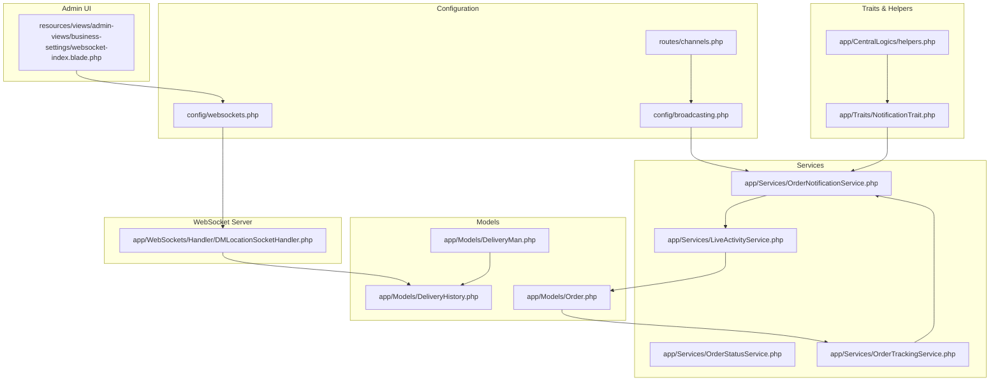
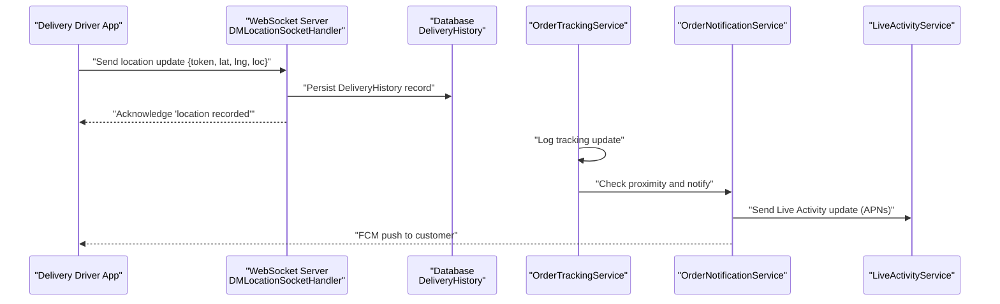
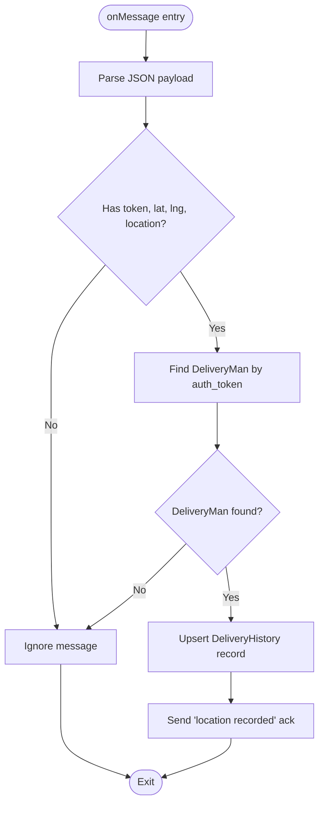
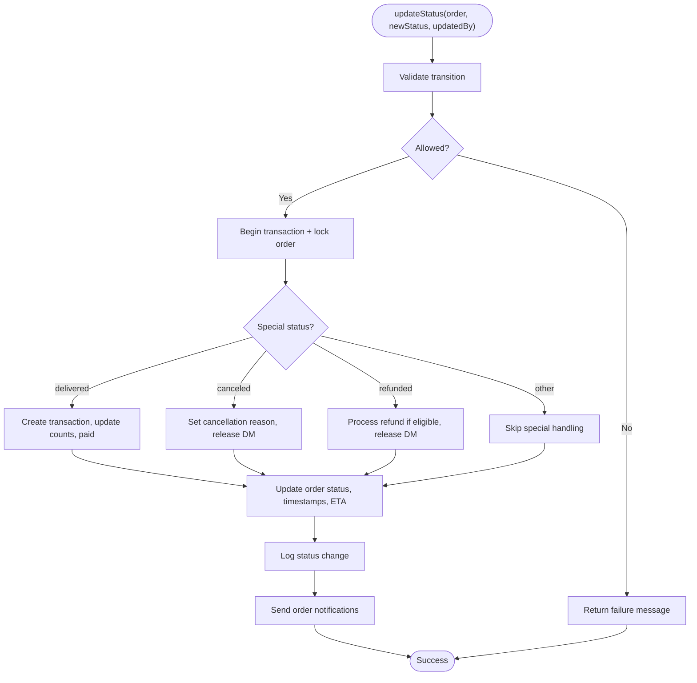
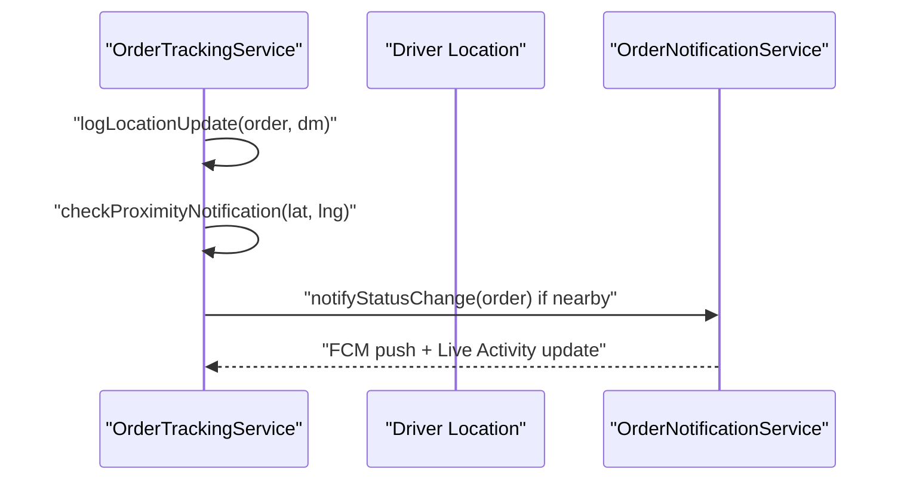
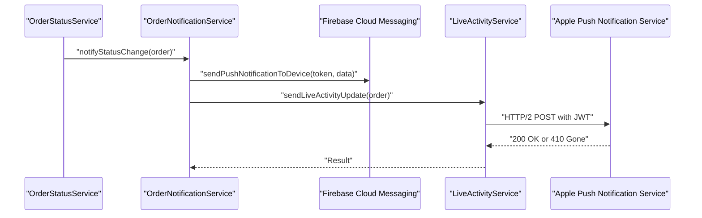
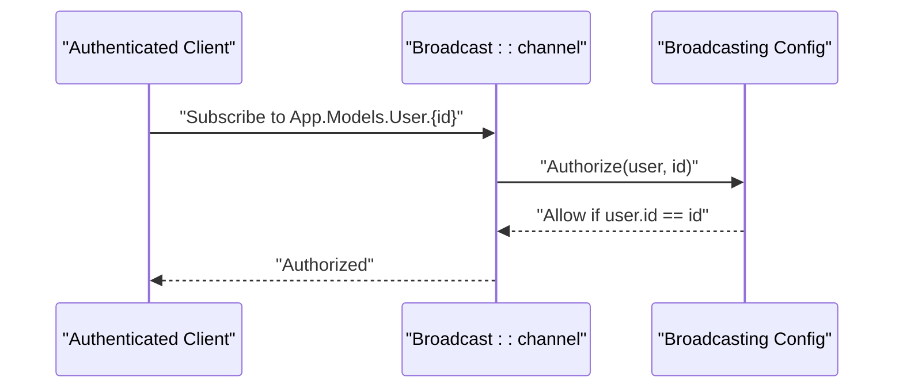
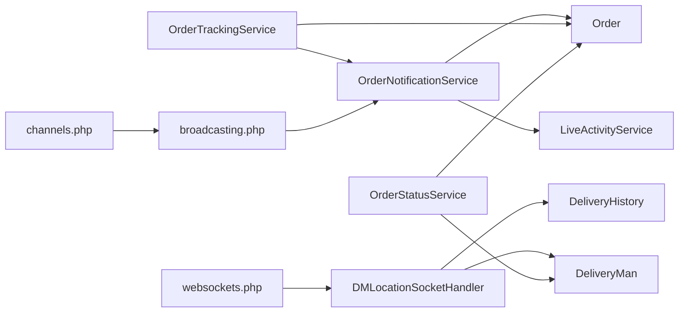

# Real-time Features

<cite>
**Referenced Files in This Document**
- [websockets.php](file://config/websockets.php)
- [broadcasting.php](file://config/broadcasting.php)
- [channels.php](file://routes/channels.php)
- [DMLocationSocketHandler.php](file://app/WebSockets/Handler/DMLocationSocketHandler.php)
- [LiveActivityService.php](file://app/Services/LiveActivityService.php)
- [OrderNotificationService.php](file://app/Services/OrderNotificationService.php)
- [OrderTrackingService.php](file://app/Services/OrderTrackingService.php)
- [OrderStatusService.php](file://app/Services/OrderStatusService.php)
- [DeliveryMan.php](file://app/Models/DeliveryMan.php)
- [DeliveryHistory.php](file://app/Models/DeliveryHistory.php)
- [Order.php](file://app/Models/Order.php)
- [NotificationTrait.php](file://app/Traits/NotificationTrait.php)
- [helpers.php](file://app/CentralLogics/helpers.php)
- [websocket-index.blade.php](file://resources/views/admin-views/business-settings/websocket-index.blade.php)
</cite>

## Table of Contents
1. [Introduction](#introduction)
2. [Project Structure](#project-structure)
3. [Core Components](#core-components)
4. [Architecture Overview](#architecture-overview)
5. [Detailed Component Analysis](#detailed-component-analysis)
6. [Dependency Analysis](#dependency-analysis)
7. [Performance Considerations](#performance-considerations)
8. [Troubleshooting Guide](#troubleshooting-guide)
9. [Conclusion](#conclusion)
10. [Appendices](#appendices)

## Introduction
This document explains the real-time features implementation using Laravel WebSockets and the Beyondcode Laravel WebSockets package. It covers live location tracking for delivery personnel, real-time order status updates, and push notification systems. It documents WebSocket connection handling, message broadcasting, and event-driven architecture. It also details live activity tracking, order stream updates, and customer-delivery person communication features, including performance considerations, scaling strategies, and client-side integration patterns for mobile and web applications.

## Project Structure
The real-time stack integrates:
- WebSocket server configuration and handler for delivery location updates
- Push notification services for Android (FCM) and iOS (APNs Live Activity)
- Order lifecycle services for status transitions and proximity-based notifications
- Broadcasting channels for secure user-specific subscriptions
- Admin UI to enable/disable WebSocket and configure endpoint settings

**Diagram sources**
- [websockets.php:1-142](file://config/websockets.php#L1-L142)
- [broadcasting.php:1-65](file://config/broadcasting.php#L1-L65)
- [channels.php:1-19](file://routes/channels.php#L1-L19)
- [DMLocationSocketHandler.php:1-83](file://app/WebSockets/Handler/DMLocationSocketHandler.php#L1-L83)
- [OrderNotificationService.php:1-312](file://app/Services/OrderNotificationService.php#L1-L312)
- [OrderStatusService.php:1-348](file://app/Services/OrderStatusService.php#L1-L348)
- [OrderTrackingService.php:1-124](file://app/Services/OrderTrackingService.php#L1-L124)
- [LiveActivityService.php:1-191](file://app/Services/LiveActivityService.php#L1-L191)
- [DeliveryMan.php:1-234](file://app/Models/DeliveryMan.php#L1-L234)
- [DeliveryHistory.php:1-22](file://app/Models/DeliveryHistory.php#L1-L22)
- [Order.php:1-358](file://app/Models/Order.php#L1-L358)
- [NotificationTrait.php](file://app/Traits/NotificationTrait.php)
- [helpers.php:1436-1471](file://app/CentralLogics/helpers.php#L1436-L1471)
- [websocket-index.blade.php:1-95](file://resources/views/admin-views/business-settings/websocket-index.blade.php#L1-L95)

**Section sources**
- [websockets.php:1-142](file://config/websockets.php#L1-L142)
- [broadcasting.php:1-65](file://config/broadcasting.php#L1-L65)
- [channels.php:1-19](file://routes/channels.php#L1-L19)
- [DMLocationSocketHandler.php:1-83](file://app/WebSockets/Handler/DMLocationSocketHandler.php#L1-L83)
- [OrderNotificationService.php:1-312](file://app/Services/OrderNotificationService.php#L1-L312)
- [OrderStatusService.php:1-348](file://app/Services/OrderStatusService.php#L1-L348)
- [OrderTrackingService.php:1-124](file://app/Services/OrderTrackingService.php#L1-L124)
- [LiveActivityService.php:1-191](file://app/Services/LiveActivityService.php#L1-L191)
- [DeliveryMan.php:1-234](file://app/Models/DeliveryMan.php#L1-L234)
- [DeliveryHistory.php:1-22](file://app/Models/DeliveryHistory.php#L1-L22)
- [Order.php:1-358](file://app/Models/Order.php#L1-L358)
- [NotificationTrait.php](file://app/Traits/NotificationTrait.php)
- [helpers.php:1436-1471](file://app/CentralLogics/helpers.php#L1436-L1471)
- [websocket-index.blade.php:1-95](file://resources/views/admin-views/business-settings/websocket-index.blade.php#L1-L95)

## Core Components
- WebSocket server configuration and handler:
  - Server port, SSL, statistics, and channel manager are configured.
  - A custom WebSocket handler receives delivery location updates and persists them.
- Push notification services:
  - Order status notifications to customers via FCM.
  - iOS Live Activity updates via APNs HTTP/2 with JWT.
- Order lifecycle services:
  - Validated status transitions with atomic updates and audit logging.
  - Proximity-based sub-status updates and tracking history.
- Broadcasting and channels:
  - Secure per-user channel authorization for event broadcasting.
- Admin UI:
  - Toggle and configure WebSocket endpoint for delivery location recording.

**Section sources**
- [websockets.php:1-142](file://config/websockets.php#L1-L142)
- [DMLocationSocketHandler.php:1-83](file://app/WebSockets/Handler/DMLocationSocketHandler.php#L1-L83)
- [OrderNotificationService.php:1-312](file://app/Services/OrderNotificationService.php#L1-L312)
- [LiveActivityService.php:1-191](file://app/Services/LiveActivityService.php#L1-L191)
- [OrderStatusService.php:1-348](file://app/Services/OrderStatusService.php#L1-L348)
- [OrderTrackingService.php:1-124](file://app/Services/OrderTrackingService.php#L1-L124)
- [channels.php:1-19](file://routes/channels.php#L1-L19)
- [websocket-index.blade.php:1-95](file://resources/views/admin-views/business-settings/websocket-index.blade.php#L1-L95)

## Architecture Overview
The system combines a WebSocket server for live delivery location updates and Laravel’s event broadcasting for order status notifications. Delivery drivers connect via WebSocket to publish location updates, which are persisted and can trigger proximity notifications. The backend validates order status transitions atomically, sends push notifications to customers, and updates iOS Live Activity widgets.

**Diagram sources**
- [DMLocationSocketHandler.php:1-83](file://app/WebSockets/Handler/DMLocationSocketHandler.php#L1-L83)
- [DeliveryHistory.php:1-22](file://app/Models/DeliveryHistory.php#L1-L22)
- [OrderTrackingService.php:1-124](file://app/Services/OrderTrackingService.php#L1-L124)
- [OrderNotificationService.php:1-312](file://app/Services/OrderNotificationService.php#L1-L312)
- [LiveActivityService.php:1-191](file://app/Services/LiveActivityService.php#L1-L191)

## Detailed Component Analysis

### WebSocket Server and Handler
- Configuration:
  - Port, SSL, statistics logging, allowed origins, and channel manager are defined.
  - Apps array defines a single app with client message disabling and statistics enabling.
- Handler behavior:
  - Validates presence of token, longitude, latitude, and location.
  - Resolves delivery man by auth token and upserts latest location.
  - Sends acknowledgment back to the client.
  - Verifies app key via query parameter and generates a socket identifier.

**Diagram sources**
- [DMLocationSocketHandler.php:1-83](file://app/WebSockets/Handler/DMLocationSocketHandler.php#L1-L83)
- [DeliveryHistory.php:1-22](file://app/Models/DeliveryHistory.php#L1-L22)

**Section sources**
- [websockets.php:1-142](file://config/websockets.php#L1-L142)
- [DMLocationSocketHandler.php:1-83](file://app/WebSockets/Handler/DMLocationSocketHandler.php#L1-L83)

### Order Status Management
- Transition validation:
  - Maintains a configurable state machine of allowed transitions.
  - Validates new status against current status.
- Atomic updates:
  - Uses database transactions and row-level locking to prevent race conditions.
  - Handles special cases for delivered/canceled/refunded with financial and inventory adjustments.
- Audit trail:
  - Logs status changes with metadata for compliance and analytics.
- OTP verification:
  - Rate-limited OTP checks using cache with decay windows.

**Diagram sources**
- [OrderStatusService.php:1-348](file://app/Services/OrderStatusService.php#L1-L348)

**Section sources**
- [OrderStatusService.php:1-348](file://app/Services/OrderStatusService.php#L1-L348)

### Order Tracking and Proximity Notifications
- Tracking log:
  - Records driver position and metadata with each update.
  - Triggers proximity checks when coordinates are present.
- Current tracking data:
  - Builds a snapshot of order and driver details for clients.
- Proximity logic:
  - Calculates distance to delivery address using Haversine formula.
  - Promotes sub-status to “nearby” and sends a notification when within 500m.

**Diagram sources**
- [OrderTrackingService.php:1-124](file://app/Services/OrderTrackingService.php#L1-L124)
- [OrderNotificationService.php:1-312](file://app/Services/OrderNotificationService.php#L1-L312)

**Section sources**
- [OrderTrackingService.php:1-124](file://app/Services/OrderTrackingService.php#L1-L124)
- [OrderNotificationService.php:1-312](file://app/Services/OrderNotificationService.php#L1-L312)

### Push Notifications: FCM and APNs Live Activity
- FCM notifications:
  - Uses a trait to construct FCM payloads with rich data for background updates.
  - Includes extended payload fields for status, ETA, store/driver info, and display text.
- iOS Live Activity:
  - Sends APNs HTTP/2 updates with JWT authentication.
  - Supports “update” and “end” events; cleans invalid tokens on 410 responses.
  - Integrates with order status service to push Live Activity updates.

**Diagram sources**
- [OrderNotificationService.php:1-312](file://app/Services/OrderNotificationService.php#L1-L312)
- [LiveActivityService.php:1-191](file://app/Services/LiveActivityService.php#L1-L191)
- [NotificationTrait.php](file://app/Traits/NotificationTrait.php)
- [helpers.php:1436-1471](file://app/CentralLogics/helpers.php#L1436-L1471)

**Section sources**
- [OrderNotificationService.php:1-312](file://app/Services/OrderNotificationService.php#L1-L312)
- [LiveActivityService.php:1-191](file://app/Services/LiveActivityService.php#L1-L191)
- [NotificationTrait.php](file://app/Traits/NotificationTrait.php)
- [helpers.php:1436-1471](file://app/CentralLogics/helpers.php#L1436-L1471)

### Broadcasting Channels
- Per-user channel authorization ensures only authenticated users can subscribe to their own notifications.
- Broadcasting configuration supports multiple drivers (pusher, ably, redis, log, null).

**Diagram sources**
- [channels.php:1-19](file://routes/channels.php#L1-L19)
- [broadcasting.php:1-65](file://config/broadcasting.php#L1-L65)

**Section sources**
- [channels.php:1-19](file://routes/channels.php#L1-L19)
- [broadcasting.php:1-65](file://config/broadcasting.php#L1-L65)

### Admin UI for WebSocket Settings
- Provides toggles and inputs to enable/disable WebSocket and set endpoint URL/port.
- Integrates with business settings to control whether WebSocket records driver locations.

**Section sources**
- [websocket-index.blade.php:1-95](file://resources/views/admin-views/business-settings/websocket-index.blade.php#L1-L95)

## Dependency Analysis
- Handler depends on:
  - DeliveryMan and DeliveryHistory models for persistence.
  - Beyondcode app key verification and socket ID generation.
- Services depend on:
  - Order, DeliveryMan, and OrderTrackingLog models.
  - NotificationTrait and central helpers for push delivery.
  - LiveActivityService for iOS Live Activity updates.
- Configuration dependencies:
  - websockets.php for server runtime.
  - broadcasting.php for event broadcasting driver selection.
  - channels.php for per-user authorization.

**Diagram sources**
- [DMLocationSocketHandler.php:1-83](file://app/WebSockets/Handler/DMLocationSocketHandler.php#L1-L83)
- [DeliveryHistory.php:1-22](file://app/Models/DeliveryHistory.php#L1-L22)
- [DeliveryMan.php:1-234](file://app/Models/DeliveryMan.php#L1-L234)
- [OrderNotificationService.php:1-312](file://app/Services/OrderNotificationService.php#L1-L312)
- [LiveActivityService.php:1-191](file://app/Services/LiveActivityService.php#L1-L191)
- [OrderTrackingService.php:1-124](file://app/Services/OrderTrackingService.php#L1-L124)
- [OrderStatusService.php:1-348](file://app/Services/OrderStatusService.php#L1-L348)
- [Order.php:1-358](file://app/Models/Order.php#L1-L358)
- [websockets.php:1-142](file://config/websockets.php#L1-L142)
- [broadcasting.php:1-65](file://config/broadcasting.php#L1-L65)
- [channels.php:1-19](file://routes/channels.php#L1-L19)

**Section sources**
- [DMLocationSocketHandler.php:1-83](file://app/WebSockets/Handler/DMLocationSocketHandler.php#L1-L83)
- [OrderNotificationService.php:1-312](file://app/Services/OrderNotificationService.php#L1-L312)
- [OrderStatusService.php:1-348](file://app/Services/OrderStatusService.php#L1-L348)
- [OrderTrackingService.php:1-124](file://app/Services/OrderTrackingService.php#L1-L124)
- [websockets.php:1-142](file://config/websockets.php#L1-L142)
- [broadcasting.php:1-65](file://config/broadcasting.php#L1-L65)
- [channels.php:1-19](file://routes/channels.php#L1-L19)

## Performance Considerations
- WebSocket throughput:
  - Tune max request size and statistics logging intervals.
  - Consider SSL termination offloading and reverse proxy tuning.
- Database writes:
  - DeliveryHistory upserts are frequent; ensure indexing on delivery_man_id and timestamps.
  - Batch or throttle high-frequency updates if needed.
- Notification volume:
  - Use targeted tokens and avoid redundant pushes.
  - Cache ETA calculations and limit repeated proximity checks.
- Concurrency:
  - Scale WebSocket server horizontally behind a load balancer.
  - Use Redis-backed broadcasting for multi-instance deployments.
- Client-side:
  - Debounce location updates and send aggregated batches.
  - Implement exponential backoff for reconnection and retry.

## Troubleshooting Guide
- WebSocket handler errors:
  - Missing app key or invalid token will cause exceptions; verify app configuration and query parameters.
  - No-op on malformed messages; ensure clients send required fields.
- APNs Live Activity failures:
  - 410 responses indicate invalid tokens; the service removes them automatically.
  - Missing APNs credentials disable Live Activity updates; configure services config.
- Order status transitions:
  - Invalid transitions return failure; check configured state machine.
  - OTP attempts are rate-limited; verify cache configuration.
- Proximity notifications:
  - Requires valid delivery address coordinates; ensure order data is complete.
  - Distance calculation uses spherical geometry; confirm coordinate precision.

**Section sources**
- [DMLocationSocketHandler.php:1-83](file://app/WebSockets/Handler/DMLocationSocketHandler.php#L1-L83)
- [LiveActivityService.php:1-191](file://app/Services/LiveActivityService.php#L1-L191)
- [OrderStatusService.php:1-348](file://app/Services/OrderStatusService.php#L1-L348)
- [OrderNotificationService.php:1-312](file://app/Services/OrderNotificationService.php#L1-L312)

## Conclusion
The system leverages Laravel WebSockets for live delivery location updates and event-driven order lifecycle management with robust status transitions, proximity-based notifications, and cross-platform push delivery to Android and iOS. With proper configuration, scaling, and client-side batching, it delivers responsive, real-time experiences for customers and delivery personnel.

## Appendices

### Client-side Integration Patterns
- Mobile:
  - Establish WebSocket connection with appKey query parameter.
  - Send periodic location updates with token, lat, lng, and location string.
  - Subscribe to user-specific channels for order status events.
- Web:
  - Use FCM SDK to receive order status notifications and Live Activity updates on supported platforms.
  - Implement retry/backoff and handle network interruptions gracefully.

### Configuration Checklist
- Enable WebSocket in admin UI and set URL/port.
- Configure broadcasting driver (pusher/redis/log/null) based on deployment.
- Set up APNs credentials for iOS Live Activity.
- Ensure database indexes on foreign keys used by tracking and notifications.