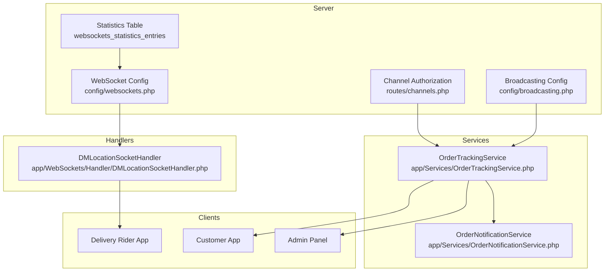
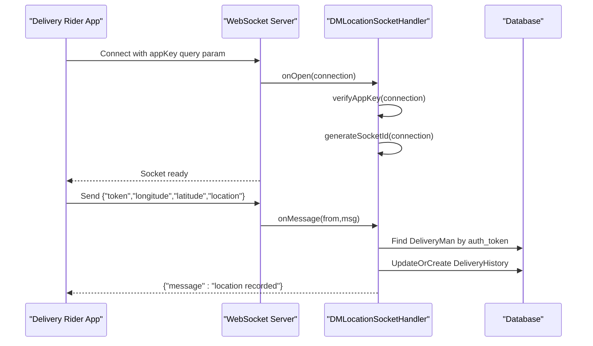
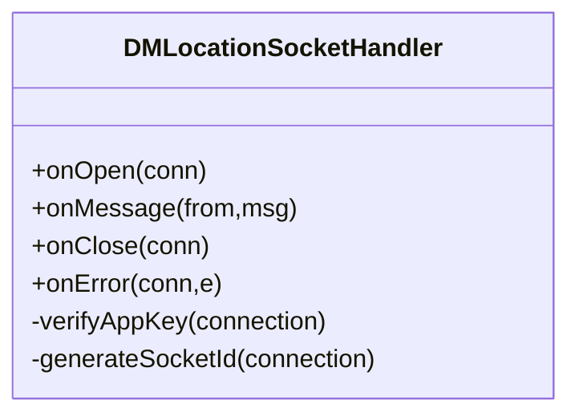
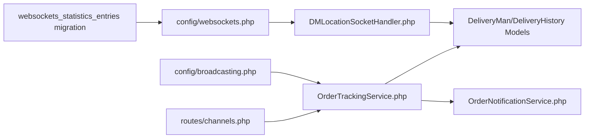

# WebSocket Implementation

<cite>
**Referenced Files in This Document**
- [websockets.php](file://config/websockets.php)
- [broadcasting.php](file://config/broadcasting.php)
- [channels.php](file://routes/channels.php)
- [DMLocationSocketHandler.php](file://app/WebSockets/Handler/DMLocationSocketHandler.php)
- [0000_00_00_000000_create_websockets_statistics_entries_table.php](file://database/migrations/0000_00_00_000000_create_websockets_statistics_entries_table.php)
- [OrderTrackingService.php](file://app/Services/OrderTrackingService.php)
- [OrderNotificationService.php](file://app/Services/OrderNotificationService.php)
- [OrderTrackingStreamController.php](file://app/Http/Controllers/Api/V1/OrderTrackingStreamController.php)
- [websocket-index.blade.php](file://resources/views/admin-views/business-settings/websocket-index.blade.php)
</cite>

## Table of Contents
1. [Introduction](#introduction)
2. [Project Structure](#project-structure)
3. [Core Components](#core-components)
4. [Architecture Overview](#architecture-overview)
5. [Detailed Component Analysis](#detailed-component-analysis)
6. [Dependency Analysis](#dependency-analysis)
7. [Performance Considerations](#performance-considerations)
8. [Troubleshooting Guide](#troubleshooting-guide)
9. [Conclusion](#conclusion)
10. [Appendices](#appendices)

## Introduction
This document explains the WebSocket implementation powered by the Beyondcode Laravel WebSockets package. It covers server configuration, connection lifecycle, message processing, and security mechanisms. It documents the DMLocationSocketHandler for delivery person location tracking, including authentication via appKey verification and socket ID generation. It also outlines client-side connection patterns, real-time data synchronization, and examples of event broadcasting and room-based messaging for order tracking.

## Project Structure
The WebSocket stack integrates:
- Server configuration via config/websockets.php
- Broadcasting configuration via config/broadcasting.php
- Channel authorization via routes/channels.php
- A custom WebSocket handler for delivery location updates
- Database statistics table for server metrics
- Services for order tracking and notifications
- SSE controller for order tracking streams

**Diagram sources**
- [websockets.php:1-142](file://config/websockets.php#L1-L142)
- [broadcasting.php:1-65](file://config/broadcasting.php#L1-L65)
- [channels.php:1-19](file://routes/channels.php#L1-L19)
- [DMLocationSocketHandler.php:1-83](file://app/WebSockets/Handler/DMLocationSocketHandler.php#L1-L83)
- [0000_00_00_000000_create_websockets_statistics_entries_table.php:1-36](file://database/migrations/0000_00_00_000000_create_websockets_statistics_entries_table.php#L1-L36)
- [OrderTrackingService.php:1-124](file://app/Services/OrderTrackingService.php#L1-L124)
- [OrderNotificationService.php:1-312](file://app/Services/OrderNotificationService.php#L1-L312)

**Section sources**
- [websockets.php:1-142](file://config/websockets.php#L1-L142)
- [broadcasting.php:1-65](file://config/broadcasting.php#L1-L65)
- [channels.php:1-19](file://routes/channels.php#L1-L19)
- [DMLocationSocketHandler.php:1-83](file://app/WebSockets/Handler/DMLocationSocketHandler.php#L1-L83)
- [0000_00_00_000000_create_websockets_statistics_entries_table.php:1-36](file://database/migrations/0000_00_00_000000_create_websockets_statistics_entries_table.php#L1-L36)
- [OrderTrackingService.php:1-124](file://app/Services/OrderTrackingService.php#L1-L124)
- [OrderNotificationService.php:1-312](file://app/Services/OrderNotificationService.php#L1-L312)

## Core Components
- WebSocket server configuration: port, apps, SSL, statistics, channel manager, middleware, and allowed origins.
- Broadcasting configuration: driver selection and credentials for external providers.
- Channel authorization: per-user channel access control.
- DMLocationSocketHandler: validates appKey, generates socket IDs, and processes delivery location updates.
- Statistics table: persists server metrics for monitoring.
- OrderTrackingService and OrderNotificationService: manage order tracking data and push notifications.
- SSE controller: streams order tracking updates to clients.

**Section sources**
- [websockets.php:1-142](file://config/websockets.php#L1-L142)
- [broadcasting.php:1-65](file://config/broadcasting.php#L1-L65)
- [channels.php:1-19](file://routes/channels.php#L1-L19)
- [DMLocationSocketHandler.php:16-81](file://app/WebSockets/Handler/DMLocationSocketHandler.php#L16-L81)
- [0000_00_00_000000_create_websockets_statistics_entries_table.php:14-24](file://database/migrations/0000_00_00_000000_create_websockets_statistics_entries_table.php#L14-L24)
- [OrderTrackingService.php:12-124](file://app/Services/OrderTrackingService.php#L12-L124)
- [OrderNotificationService.php:14-312](file://app/Services/OrderNotificationService.php#L14-L312)

## Architecture Overview
The system combines Beyondcode Laravel WebSockets for real-time messaging with Laravel’s broadcasting and channel authorization. Delivery riders connect with appKey verification and receive socket IDs. Location updates are validated and persisted, while order tracking leverages services and notifications for real-time customer/admin visibility.

**Diagram sources**
- [DMLocationSocketHandler.php:46-81](file://app/WebSockets/Handler/DMLocationSocketHandler.php#L46-L81)
- [DMLocationSocketHandler.php:19-43](file://app/WebSockets/Handler/DMLocationSocketHandler.php#L19-L43)

**Section sources**
- [DMLocationSocketHandler.php:16-81](file://app/WebSockets/Handler/DMLocationSocketHandler.php#L16-L81)

## Detailed Component Analysis

### WebSocket Server Configuration
- Port and dashboard: configurable via environment variables.
- Apps: defines app identity, keys, secret, path, capacity, client message enablement, and statistics enablement.
- Allowed origins: restricts host access.
- Max request size: protects against oversized frames.
- Path: route registration path for the WebSocket service.
- Middleware: includes dashboard authorization.
- Statistics: model, logger, interval, retention, and DNS lookup settings.
- SSL: optional local certificate, private key, and passphrase.
- Channel manager: in-memory channel persistence by default.

Operational implications:
- Enable statistics to monitor peak connections and message counts.
- Configure SSL for production deployments.
- Disable client-to-client messages if not needed.

**Section sources**
- [websockets.php:10-141](file://config/websockets.php#L10-L141)

### Broadcasting Configuration
- Default driver is controlled by BROADCAST_DRIVER environment variable.
- Supported drivers include pusher, ably, redis, log, and null.
- Pusher configuration requires key, secret, app id, cluster, and TLS flag.

Operational implications:
- Choose appropriate driver for your infrastructure.
- Ensure credentials match the configured apps in websockets.php.

**Section sources**
- [broadcasting.php:18-62](file://config/broadcasting.php#L18-L62)

### Channel Authorization
- Defines per-user channel access for authenticated users.
- Used for secure subscription to user-specific channels.

Operational implications:
- Extend authorization logic to support order-specific channels if needed.

**Section sources**
- [channels.php:16-18](file://routes/channels.php#L16-L18)

### DMLocationSocketHandler
Responsibilities:
- Authentication via appKey verification using QueryParameters and App::findByKey.
- Socket ID generation for each connection.
- Message processing: decode JSON payload, validate presence of token, longitude, latitude, and location.
- Delivery person lookup by auth_token and persist/update location history.
- Respond to client with a success message upon successful recording.

Lifecycle hooks:
- onOpen: verify appKey and generate socketId.
- onMessage: process location update.
- onClose/onError: placeholders for future implementation.

Security considerations:
- Enforce appKey validation to prevent unauthorized access.
- Validate payload fields before processing.
- Consider rate limiting and input sanitization.

**Diagram sources**
- [DMLocationSocketHandler.php:16-81](file://app/WebSockets/Handler/DMLocationSocketHandler.php#L16-L81)

**Section sources**
- [DMLocationSocketHandler.php:16-81](file://app/WebSockets/Handler/DMLocationSocketHandler.php#L16-L81)

### Statistics and Metrics
- Migration creates a table to store server statistics entries.
- Statistics logger records metrics and flushes periodically.

Operational implications:
- Enable statistics in websockets.php to capture metrics.
- Monitor peak connection counts and message volumes.

**Section sources**
- [0000_00_00_000000_create_websockets_statistics_entries_table.php:14-24](file://database/migrations/0000_00_00_000000_create_websockets_statistics_entries_table.php#L14-L24)
- [websockets.php:76-106](file://config/websockets.php#L76-L106)

### Order Tracking Services
- OrderTrackingService: logs location updates, builds tracking history, computes current tracking data, and updates sub-status with optional notifications.
- OrderNotificationService: manages status-based push notifications, constructs extended payloads for background updates, and handles Live Activity updates.

Operational implications:
- Use OrderTrackingService to maintain historical tracking logs.
- Use OrderNotificationService to keep customers informed of order progress.

**Section sources**
- [OrderTrackingService.php:12-124](file://app/Services/OrderTrackingService.php#L12-L124)
- [OrderNotificationService.php:14-312](file://app/Services/OrderNotificationService.php#L14-L312)

### SSE-Based Order Tracking Stream
- Controller streams order tracking updates to clients using Server-Sent Events (SSE).
- Sends tracking_update events with serialized data and heartbeat messages.
- Stops streaming on terminal statuses and detects client disconnections.

Operational implications:
- Ideal for browser-based clients requiring long-lived updates.
- Combine with WebSocket for mobile apps needing bidirectional real-time updates.

**Section sources**
- [OrderTrackingStreamController.php:47-101](file://app/Http/Controllers/Api/V1/OrderTrackingStreamController.php#L47-L101)

### Admin Settings for WebSocket
- Blade view exposes fields for enabling WebSocket and configuring URL and port.
- Integrates with business settings for runtime toggling.

Operational implications:
- Allow administrators to enable/disable and configure WebSocket server settings.

**Section sources**
- [websocket-index.blade.php:22-95](file://resources/views/admin-views/business-settings/websocket-index.blade.php#L22-L95)

## Dependency Analysis

**Diagram sources**
- [websockets.php:1-142](file://config/websockets.php#L1-L142)
- [broadcasting.php:1-65](file://config/broadcasting.php#L1-L65)
- [channels.php:1-19](file://routes/channels.php#L1-L19)
- [DMLocationSocketHandler.php:1-83](file://app/WebSockets/Handler/DMLocationSocketHandler.php#L1-L83)
- [0000_00_00_000000_create_websockets_statistics_entries_table.php:1-36](file://database/migrations/0000_00_00_000000_create_websockets_statistics_entries_table.php#L1-L36)
- [OrderTrackingService.php:1-124](file://app/Services/OrderTrackingService.php#L1-L124)
- [OrderNotificationService.php:1-312](file://app/Services/OrderNotificationService.php#L1-L312)

**Section sources**
- [websockets.php:1-142](file://config/websockets.php#L1-L142)
- [broadcasting.php:1-65](file://config/broadcasting.php#L1-L65)
- [channels.php:1-19](file://routes/channels.php#L1-L19)
- [DMLocationSocketHandler.php:1-83](file://app/WebSockets/Handler/DMLocationSocketHandler.php#L1-L83)
- [0000_00_00_000000_create_websockets_statistics_entries_table.php:1-36](file://database/migrations/0000_00_00_000000_create_websockets_statistics_entries_table.php#L1-L36)
- [OrderTrackingService.php:1-124](file://app/Services/OrderTrackingService.php#L1-L124)
- [OrderNotificationService.php:1-312](file://app/Services/OrderNotificationService.php#L1-L312)

## Performance Considerations
- Statistics logging interval: tune interval_in_seconds for desired granularity vs overhead.
- Max request size: adjust max_request_size_in_kb to accommodate larger payloads.
- Channel manager: ArrayChannelManager is suitable for single-instance deployments; consider persistent managers for clustered environments.
- Payload validation: ensure minimal JSON payloads to reduce bandwidth and parsing overhead.
- Rate limiting: implement per-connection rate limits in handlers to prevent abuse.

[No sources needed since this section provides general guidance]

## Troubleshooting Guide
Common issues and resolutions:
- Unknown appKey errors: verify appKey query parameter and ensure app credentials match websockets.php apps configuration.
- Connection refused: confirm WebSocket server port and allowed origins configuration.
- No statistics recorded: enable statistics and verify statistics logger configuration.
- SSE not updating: ensure Content-Type and caching headers are set correctly and heartbeat messages are sent.

**Section sources**
- [DMLocationSocketHandler.php:62-72](file://app/WebSockets/Handler/DMLocationSocketHandler.php#L62-L72)
- [websockets.php:76-106](file://config/websockets.php#L76-L106)
- [OrderTrackingStreamController.php:94-100](file://app/Http/Controllers/Api/V1/OrderTrackingStreamController.php#L94-L100)

## Conclusion
The Beyondcode Laravel WebSockets integration provides a robust foundation for real-time communication. The DMLocationSocketHandler demonstrates secure, appKey-verified connections with socket ID generation and efficient location update processing. Combined with order tracking services and SSE streaming, the system supports comprehensive real-time delivery visibility for riders, customers, and administrators.

[No sources needed since this section summarizes without analyzing specific files]

## Appendices

### Client-Side Connection and Message Formatting
- Connection establishment: connect to the WebSocket server path defined in websockets.php with appKey as a query parameter.
- Message format: JSON payload containing token, longitude, latitude, and location.
- Response handling: expect a success message upon successful recording.

**Section sources**
- [DMLocationSocketHandler.php:19-43](file://app/WebSockets/Handler/DMLocationSocketHandler.php#L19-L43)
- [websockets.php:62](file://config/websockets.php#L62)

### Real-Time Data Synchronization Patterns
- SSE streaming: use the SSE controller to stream tracking updates to browsers.
- Notifications: leverage OrderNotificationService for push notifications and Live Activity updates.

**Section sources**
- [OrderTrackingStreamController.php:47-101](file://app/Http/Controllers/Api/V1/OrderTrackingStreamController.php#L47-L101)
- [OrderNotificationService.php:86-122](file://app/Services/OrderNotificationService.php#L86-L122)

### Examples: Event Broadcasting and Room-Based Messaging
- Broadcasting: configure broadcasting driver and use Laravel’s broadcasting APIs to emit events.
- Channel authorization: restrict access to user-specific channels via routes/channels.php.
- Room-based messaging: extend channel authorization to order-specific channels for targeted updates.

**Section sources**
- [broadcasting.php:31-62](file://config/broadcasting.php#L31-L62)
- [channels.php:16-18](file://routes/channels.php#L16-L18)