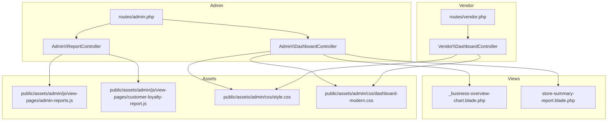
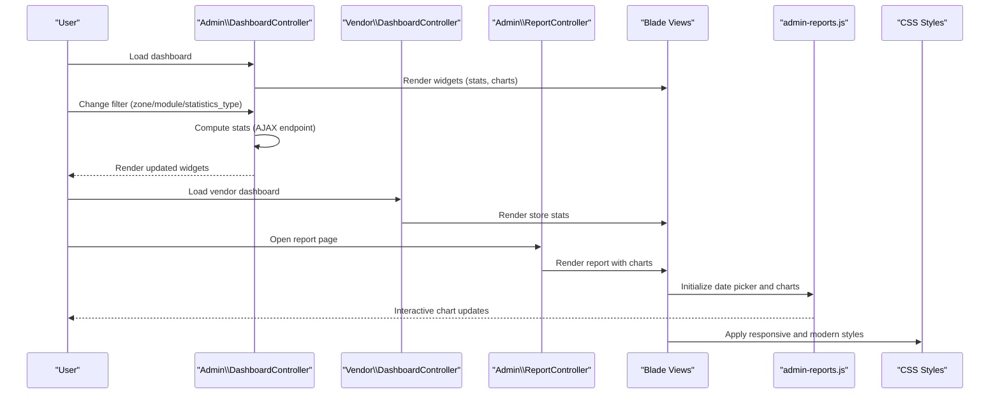
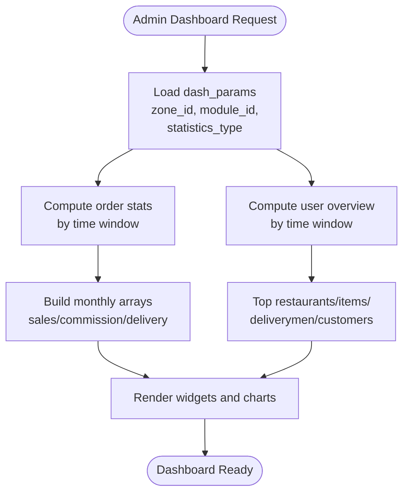
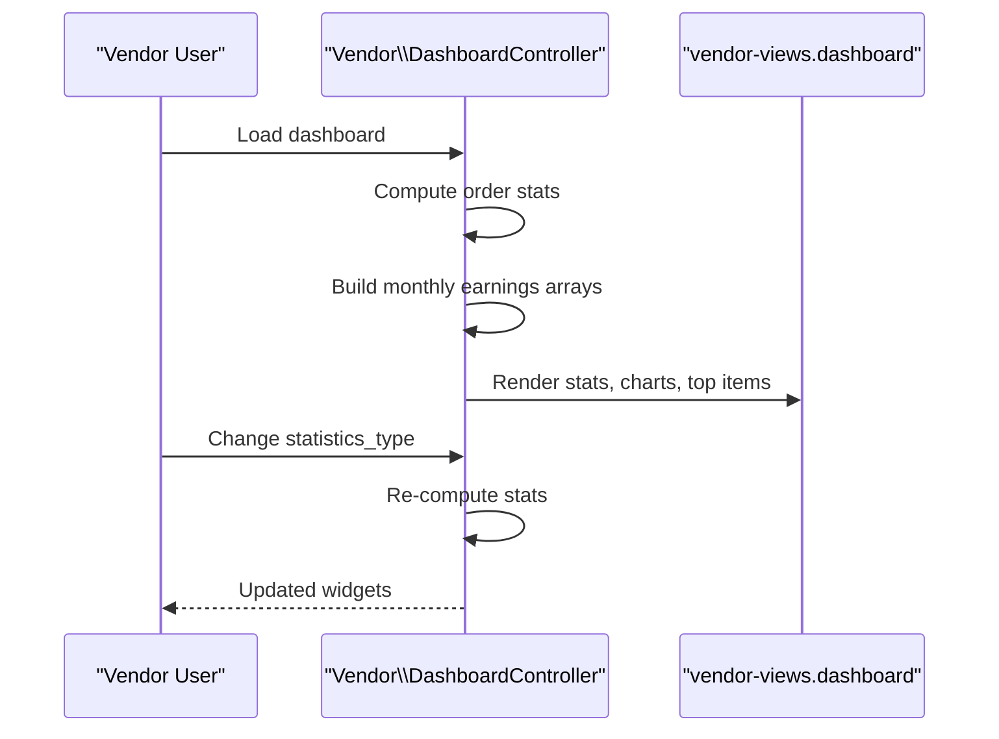
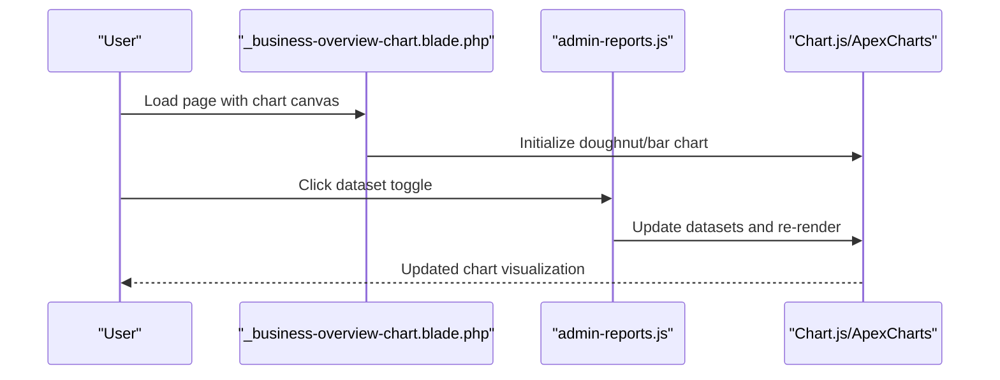
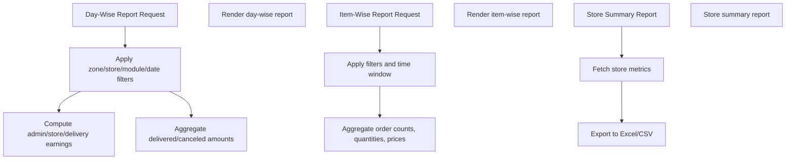
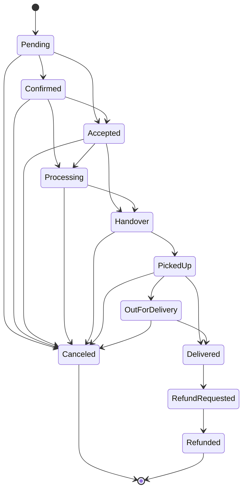
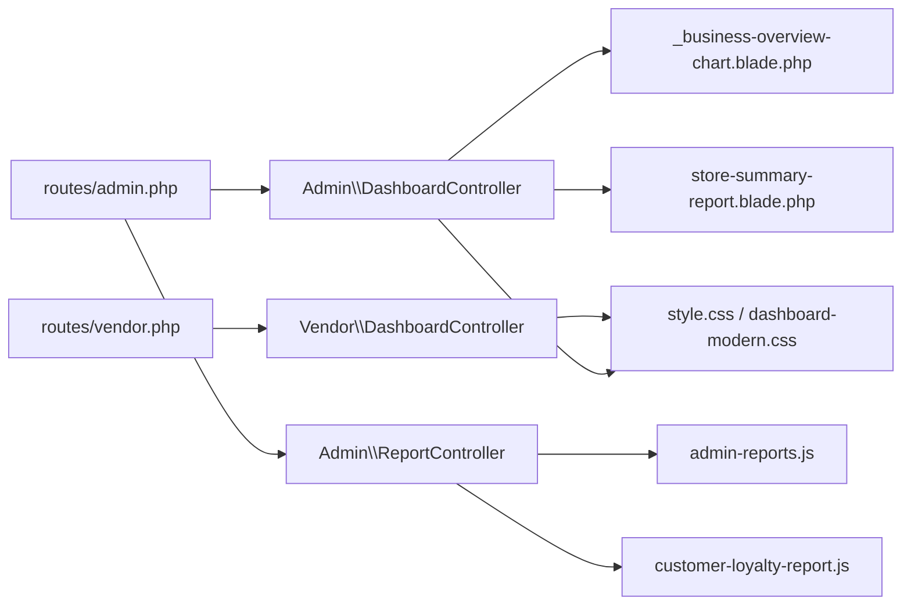

# Business Dashboard

<cite>
**Referenced Files in This Document**
- [DashboardController.php](file://app/Http/Controllers/Admin/DashboardController.php)
- [ReportController.php](file://app/Http/Controllers/Admin/ReportController.php)
- [DashboardController.php](file://app/Http/Controllers/Vendor/DashboardController.php)
- [_business-overview-chart.blade.php](file://resources/views/admin-views/partials/_business-overview-chart.blade.php)
- [store-summary-report.blade.php](file://resources/views/admin-views/report/store-summary-report.blade.php)
- [admin-reports.js](file://public/assets/admin/js/view-pages/admin-reports.js)
- [customer-loyalty-report.js](file://public/assets/admin/js/view-pages/customer-loyalty-report.js)
- [admin-reports.js](file://public/assets/admin/js/view-pages/admin-reports.js)
- [admin.css](file://public/assets/admin/css/style.css)
- [dashboard-modern.css](file://public/assets/admin/css/dashboard-modern.css)
- [admin.php](file://routes/admin.php)
- [vendor.php](file://routes/vendor.php)
- [OrderStatusService.php](file://app/Services/OrderStatusService.php)
- [websockets.blade.php](file://resources/views/admin-views/business-settings/websocket-index.blade.php)
</cite>

## Table of Contents
1. [Introduction](#introduction)
2. [Project Structure](#project-structure)
3. [Core Components](#core-components)
4. [Architecture Overview](#architecture-overview)
5. [Detailed Component Analysis](#detailed-component-analysis)
6. [Dependency Analysis](#dependency-analysis)
7. [Performance Considerations](#performance-considerations)
8. [Troubleshooting Guide](#troubleshooting-guide)
9. [Conclusion](#conclusion)
10. [Appendices](#appendices)

## Introduction
This document describes the business dashboard system that powers real-time performance metrics, key business indicators, and interactive charts for administrators and vendors. It covers dashboard widgets for sales analytics, revenue tracking, order volume, customer acquisition, and delivery performance. It also documents customizable dashboard layouts, widget configurations, real-time data updates, integration with business intelligence tools, automated reporting, personalization, permission-based views, and mobile-responsive design considerations.

## Project Structure
The dashboard system spans backend controllers, Blade templates, JavaScript assets, CSS stylesheets, and routing definitions. The Admin and Vendor controllers compute KPIs and render modular dashboard views. Charts are rendered via Chart.js and ApexCharts integrations initialized in JavaScript assets. Reporting routes enable exporting reports to Excel/CSV.

**Diagram sources**
- [DashboardController.php:220-251](file://app/Http/Controllers/Admin/DashboardController.php#L220-L251)
- [ReportController.php:40-49](file://app/Http/Controllers/Admin/ReportController.php#L40-L49)
- [DashboardController.php:18-74](file://app/Http/Controllers/Vendor/DashboardController.php#L18-L74)
- [_business-overview-chart.blade.php:1-44](file://resources/views/admin-views/partials/_business-overview-chart.blade.php#L1-L44)
- [store-summary-report.blade.php:112-142](file://resources/views/admin-views/report/store-summary-report.blade.php#L112-L142)
- [admin-reports.js:1-205](file://public/assets/admin/js/view-pages/admin-reports.js#L1-L205)
- [customer-loyalty-report.js:39-72](file://public/assets/admin/js/view-pages/customer-loyalty-report.js#L39-L72)
- [admin.php:738-753](file://routes/admin.php#L738-L753)
- [vendor.php:290-306](file://routes/vendor.php#L290-L306)

**Section sources**
- [DashboardController.php:220-251](file://app/Http/Controllers/Admin/DashboardController.php#L220-L251)
- [ReportController.php:40-49](file://app/Http/Controllers/Admin/ReportController.php#L40-L49)
- [DashboardController.php:18-74](file://app/Http/Controllers/Vendor/DashboardController.php#L18-L74)
- [_business-overview-chart.blade.php:1-44](file://resources/views/admin-views/partials/_business-overview-chart.blade.php#L1-L44)
- [store-summary-report.blade.php:112-142](file://resources/views/admin-views/report/store-summary-report.blade.php#L112-L142)
- [admin-reports.js:1-205](file://public/assets/admin/js/view-pages/admin-reports.js#L1-L205)
- [customer-loyalty-report.js:39-72](file://public/assets/admin/js/view-pages/customer-loyalty-report.js#L39-L72)
- [admin.php:738-753](file://routes/admin.php#L738-L753)
- [vendor.php:290-306](file://routes/vendor.php#L290-L306)

## Core Components
- Admin Dashboard Controller: Computes order statistics, user overview, top performers, and monthly earnings. Provides AJAX endpoints to refresh dashboard widgets dynamically.
- Vendor Dashboard Controller: Computes store-specific order stats, earnings, and top items. Includes stock warning logic and JSON endpoints for live stats.
- Report Controller: Generates day-wise, item-wise, and store summary reports with export capabilities to Excel/CSV. Supports date filters and module/zone scoping.
- Blade Views: Render charts and KPI cards. Business overview chart uses Chart.js; store summary report uses ApexCharts initialization.
- JavaScript Assets: Initialize date pickers, dynamic charts, and matrix calendars. Provide dataset switching for interactive charts.
- CSS Stylesheets: Provide modern card designs, responsive adjustments, and dashboard-specific styling for both light and modern themes.

**Section sources**
- [DashboardController.php:220-364](file://app/Http/Controllers/Admin/DashboardController.php#L220-L364)
- [DashboardController.php:18-214](file://app/Http/Controllers/Vendor/DashboardController.php#L18-L214)
- [ReportController.php:42-584](file://app/Http/Controllers/Admin/ReportController.php#L42-L584)
- [_business-overview-chart.blade.php:1-44](file://resources/views/admin-views/partials/_business-overview-chart.blade.php#L1-L44)
- [store-summary-report.blade.php:112-142](file://resources/views/admin-views/report/store-summary-report.blade.php#L112-L142)
- [admin-reports.js:1-205](file://public/assets/admin/js/view-pages/admin-reports.js#L1-L205)
- [admin.css:7693-7710](file://public/assets/admin/css/style.css#L7693-L7710)
- [dashboard-modern.css:113-1157](file://public/assets/admin/css/dashboard-modern.css#L113-L1157)

## Architecture Overview
The dashboard architecture follows a controller-driven rendering pattern with AJAX endpoints for dynamic widget updates. Data aggregation occurs in controllers using Eloquent queries scoped by module, zone, and time filters. Charts are initialized client-side with Chart.js and ApexCharts, and datasets can be switched dynamically via JavaScript.

**Diagram sources**
- [DashboardController.php:220-364](file://app/Http/Controllers/Admin/DashboardController.php#L220-L364)
- [DashboardController.php:18-214](file://app/Http/Controllers/Vendor/DashboardController.php#L18-L214)
- [ReportController.php:42-584](file://app/Http/Controllers/Admin/ReportController.php#L42-L584)
- [admin-reports.js:1-205](file://public/assets/admin/js/view-pages/admin-reports.js#L1-L205)
- [admin.css:7693-7710](file://public/assets/admin/css/style.css#L7693-L7710)
- [dashboard-modern.css:113-1157](file://public/assets/admin/css/dashboard-modern.css#L113-L1157)

## Detailed Component Analysis

### Admin Dashboard Widgets
- Order Statistics Widget: Aggregates counts for pending, accepted, preparing, picked-up, delivered, canceled, refund requested, refunded, total orders, new items/stores/customers. Supports time windows: today, this week, this month, this year, overall.
- User Overview Widget: Counts customers, stores, and delivery men by overall, this month, this year, and this week.
- Monthly Earnings Graph: Builds monthly arrays for total sales, admin commission, and delivery commission across 12 months.
- Top Performers: Retrieves top restaurants, items, delivery men, customers, and popular stores via aggregated queries.

**Diagram sources**
- [DashboardController.php:366-588](file://app/Http/Controllers/Admin/DashboardController.php#L366-L588)
- [DashboardController.php:590-633](file://app/Http/Controllers/Admin/DashboardController.php#L590-L633)
- [DashboardController.php:636-800](file://app/Http/Controllers/Admin/DashboardController.php#L636-L800)

**Section sources**
- [DashboardController.php:366-588](file://app/Http/Controllers/Admin/DashboardController.php#L366-L588)
- [DashboardController.php:590-633](file://app/Http/Controllers/Admin/DashboardController.php#L590-L633)
- [DashboardController.php:636-800](file://app/Http/Controllers/Admin/DashboardController.php#L636-L800)

### Vendor Dashboard Widgets
- Store Order Stats: Computes confirmed, cooking, ready-for-delivery, item-on-the-way, delivered, refunded, scheduled, and total orders for the logged-in store.
- Earnings and Commission: Builds monthly arrays for store earnings and admin commission across 12 months.
- Top Items: Retrieves top selling and most rated items.
- Stock Warnings: Highlights low stock items based on store configuration.

**Diagram sources**
- [DashboardController.php:18-214](file://app/Http/Controllers/Vendor/DashboardController.php#L18-L214)

**Section sources**
- [DashboardController.php:18-214](file://app/Http/Controllers/Vendor/DashboardController.php#L18-L214)

### Real-Time Performance Metrics and Charts
- Business Overview Chart: Renders a doughnut chart for food, review, and wishlist metrics using Chart.js.
- Store Summary Report: Initializes ApexCharts bar chart with dynamic datasets and date range picker integration.
- Dynamic Dataset Switching: JavaScript toggles between datasets and updates chart visuals without reload.

**Diagram sources**
- [_business-overview-chart.blade.php:1-44](file://resources/views/admin-views/partials/_business-overview-chart.blade.php#L1-L44)
- [store-summary-report.blade.php:112-142](file://resources/views/admin-views/report/store-summary-report.blade.php#L112-L142)
- [admin-reports.js:66-74](file://public/assets/admin/js/view-pages/admin-reports.js#L66-L74)

**Section sources**
- [_business-overview-chart.blade.php:1-44](file://resources/views/admin-views/partials/_business-overview-chart.blade.php#L1-L44)
- [store-summary-report.blade.php:112-142](file://resources/views/admin-views/report/store-summary-report.blade.php#L112-L142)
- [admin-reports.js:66-74](file://public/assets/admin/js/view-pages/admin-reports.js#L66-L74)

### Sales Analytics and Revenue Tracking
- Day-Wise Transactions: Filters transactions by zone, store, module, and date range; computes admin/store/delivery earnings and aggregates delivered/canceled amounts.
- Item-Wise Reports: Aggregates item-level order counts, quantities, and prices across time windows.
- Store Summary Reports: Provides store-wise sales, order, and expense summaries with export to Excel/CSV.

**Diagram sources**
- [ReportController.php:51-261](file://app/Http/Controllers/Admin/ReportController.php#L51-L261)
- [ReportController.php:586-742](file://app/Http/Controllers/Admin/ReportController.php#L586-L742)
- [ReportController.php:744-800](file://app/Http/Controllers/Admin/ReportController.php#L744-L800)

**Section sources**
- [ReportController.php:51-261](file://app/Http/Controllers/Admin/ReportController.php#L51-L261)
- [ReportController.php:586-742](file://app/Http/Controllers/Admin/ReportController.php#L586-L742)
- [ReportController.php:744-800](file://app/Http/Controllers/Admin/ReportController.php#L744-L800)

### Order Volume and Delivery Performance
- Order Status Service: Centralized service for validating transitions, updating order status atomically, recalculating estimated delivery time, logging status changes, and sending notifications.
- Dispatch Dashboard: Provides availability and status metrics for delivery men and integrates with live dispatch workflows.

**Diagram sources**
- [OrderStatusService.php:26-42](file://app/Services/OrderStatusService.php#L26-L42)
- [OrderStatusService.php:89-156](file://app/Services/OrderStatusService.php#L89-L156)

**Section sources**
- [OrderStatusService.php:26-42](file://app/Services/OrderStatusService.php#L26-L42)
- [OrderStatusService.php:89-156](file://app/Services/OrderStatusService.php#L89-L156)

### Customizable Dashboard Layouts and Widget Configurations
- Modular Partials: Dashboard renders modular partials for order stats, charts, and lists, enabling flexible layout composition.
- Parameterized Filters: dash_params session stores zone/module/time filters; AJAX endpoints update widgets based on user selections.
- Theme and Responsiveness: Modern CSS provides glassmorphism-style cards and responsive breakpoints for mobile devices.

**Section sources**
- [DashboardController.php:220-364](file://app/Http/Controllers/Admin/DashboardController.php#L220-L364)
- [dashboard-modern.css:113-1157](file://public/assets/admin/css/dashboard-modern.css#L113-L1157)
- [admin.css:7693-7710](file://public/assets/admin/css/style.css#L7693-L7710)

### Real-Time Data Updates and WebSockets
- WebSocket Settings: Business settings page supports enabling/disabling WebSocket and configuring URL/port for real-time updates.
- Integration Point: WebSocket configuration can be leveraged to push live updates to dashboard widgets.

**Section sources**
- [websockets.blade.php:1-80](file://resources/views/admin-views/business-settings/websocket-index.blade.php#L1-L80)

### Integration with Business Intelligence Tools and Automated Reporting
- Reporting Routes: Admin and Vendor routes expose endpoints for generating and exporting reports.
- Export Formats: Excel and CSV exports for transaction, item, order, and store reports.
- Date Range Pickers: Predefined ranges (Today, Last 7 Days, Last 30 Days, This Month, Last Month) streamline report generation.

**Section sources**
- [admin.php:738-753](file://routes/admin.php#L738-L753)
- [vendor.php:290-306](file://routes/vendor.php#L290-L306)
- [admin-reports.js:40-54](file://public/assets/admin/js/view-pages/admin-reports.js#L40-L54)

### Personalization and Permission-Based Views
- Role Permissions: Custom role editing includes a dashboard permission flag to control access to dashboard features per role.
- Module-Based Views: Controllers adapt views based on the current module type (e.g., rental, parcel, food).

**Section sources**
- [vendor-views/custom-role/edit.blade.php:119-135](file://resources/views/vendor-views/custom-role/edit.blade.php#L119-L135)
- [DashboardController.php:237-249](file://app/Http/Controllers/Admin/DashboardController.php#L237-L249)

### Mobile-Responsive Design Considerations
- Responsive Breakpoints: CSS adjusts card paddings, font sizes, and spacing for small screens.
- Modern Card Design: Elevated cards with subtle shadows and rounded corners improve readability on mobile.

**Section sources**
- [dashboard-modern.css:748-764](file://public/assets/admin/css/dashboard-modern.css#L748-L764)
- [admin.css:7985-7992](file://public/assets/admin/css/style.css#L7985-L7992)

## Dependency Analysis
The dashboard system exhibits clear separation of concerns:
- Controllers depend on models and scopes for data aggregation.
- Blade views depend on Chart.js and ApexCharts initialization scripts.
- JavaScript assets depend on HS components for date pickers and chart initializers.
- Routing defines entry points for dashboard and report pages.

**Diagram sources**
- [DashboardController.php:220-251](file://app/Http/Controllers/Admin/DashboardController.php#L220-L251)
- [_business-overview-chart.blade.php:1-44](file://resources/views/admin-views/partials/_business-overview-chart.blade.php#L1-L44)
- [store-summary-report.blade.php:112-142](file://resources/views/admin-views/report/store-summary-report.blade.php#L112-L142)
- [ReportController.php:42-584](file://app/Http/Controllers/Admin/ReportController.php#L42-L584)
- [admin-reports.js:1-205](file://public/assets/admin/js/view-pages/admin-reports.js#L1-L205)
- [customer-loyalty-report.js:39-72](file://public/assets/admin/js/view-pages/customer-loyalty-report.js#L39-L72)
- [admin.php:738-753](file://routes/admin.php#L738-L753)
- [vendor.php:290-306](file://routes/vendor.php#L290-L306)

**Section sources**
- [DashboardController.php:220-251](file://app/Http/Controllers/Admin/DashboardController.php#L220-L251)
- [ReportController.php:42-584](file://app/Http/Controllers/Admin/ReportController.php#L42-L584)
- [admin.php:738-753](file://routes/admin.php#L738-L753)
- [vendor.php:290-306](file://routes/vendor.php#L290-L306)

## Performance Considerations
- Efficient Aggregation: Controllers use grouped and filtered queries to compute KPIs, minimizing N+1 queries.
- Pagination and Limits: Reports and top performer lists use pagination and take limits to control payload size.
- Client-Side Rendering: Charts initialize once and update datasets dynamically to reduce server requests.
- Responsive Optimization: CSS media queries ensure optimal rendering on smaller screens without heavy computations.

[No sources needed since this section provides general guidance]

## Troubleshooting Guide
- Invalid Date Range: Date picker validation prevents invalid from/to selections and displays user-friendly error messages.
- Chart Initialization Failures: Ensure Chart.js and ApexCharts libraries are loaded and HS components are initialized before attempting to render charts.
- Permission Denied: Verify role permissions for dashboard access and module-specific features.
- WebSocket Not Updating: Confirm WebSocket settings (URL/port/status) are configured correctly in business settings.

**Section sources**
- [admin-reports.js:190-204](file://public/assets/admin/js/view-pages/admin-reports.js#L190-L204)
- [websockets.blade.php:1-80](file://resources/views/admin-views/business-settings/websocket-index.blade.php#L1-L80)

## Conclusion
The business dashboard system delivers a robust, modular, and responsive solution for monitoring sales analytics, revenue tracking, order volume, customer acquisition, and delivery performance. Its AJAX-driven widgets, integrated reporting, and theme-aware styling provide an efficient and personalized experience for administrators and vendors alike.

[No sources needed since this section summarizes without analyzing specific files]

## Appendices
- Key Endpoints:
  - Admin dashboard: GET admin.dashboard
  - Admin order stats: GET admin.dashboard.order
  - Admin zone change: GET admin.dashboard.zone
  - Admin user overview: GET admin.dashboard.user-overview
  - Admin commission overview: GET admin.dashboard.commission-overview
  - Store summary report: GET admin.report.store-wise-report
  - Vendor dashboard: GET vendor.dashboard
  - Vendor store data: GET vendor.dashboard.store-data

**Section sources**
- [admin.php:738-753](file://routes/admin.php#L738-L753)
- [vendor.php:290-306](file://routes/vendor.php#L290-L306)