# Customer Analytics and Insights

<cite>
**Referenced Files in This Document**
- [CustomerController.php](file://app/Http/Controllers/Api/V1/CustomerController.php)
- [customer.php](file://app/CentralLogics/customer.php)
- [User.php](file://app/Models/User.php)
- [Order.php](file://app/Models/Order.php)
- [WalletTransaction.php](file://app/Models/WalletTransaction.php)
- [LoyaltyPointTransaction.php](file://app/Models/LoyaltyPointTransaction.php)
- [WalletBonus.php](file://app/Models/WalletBonus.php)
- [CustomerListExport.php](file://app/Exports/CustomerListExport.php)
- [customer-list.blade.php](file://resources/views/file-exports/customer-list.blade.php)
- [dashboard-users.blade.php](file://resources/views/admin-views/dashboard-users.blade.php)
- [DashboardController.php](file://app/Http/Controllers/Admin/DashboardController.php)
- [api.php](file://routes/api/v1/api.php)
- [ConfigController.php](file://app/Http/Controllers/Api/V1/ConfigController.php)
- [customer-index.blade.php](file://resources/views/admin-views/business-settings/customer-index.blade.php)
</cite>

## Table of Contents
1. [Introduction](#introduction)
2. [Project Structure](#project-structure)
3. [Core Components](#core-components)
4. [Architecture Overview](#architecture-overview)
5. [Detailed Component Analysis](#detailed-component-analysis)
6. [Dependency Analysis](#dependency-analysis)
7. [Performance Considerations](#performance-considerations)
8. [Troubleshooting Guide](#troubleshooting-guide)
9. [Conclusion](#conclusion)
10. [Appendices](#appendices)

## Introduction
This document describes the customer analytics and insights system, focusing on customer segmentation, purchase behavior analysis, lifetime value calculations, retention metrics, acquisition tracking, churn prediction foundations, RFM analysis implementation, customer journey mapping, preference analysis, personalized marketing insights, customer support analytics, satisfaction scoring, and referral program tracking. It also covers data privacy considerations, customer data enrichment, and CRM integration patterns present in the codebase.

## Project Structure
The analytics and insights capabilities are implemented across:
- API controllers for customer data retrieval, preferences, and cross-system synchronization
- Central logic services for financial and loyalty accounting
- Domain models representing customers, orders, wallets, and loyalty points
- Admin dashboards and exports for reporting and growth visualization
- Configuration endpoints exposing feature flags and policies

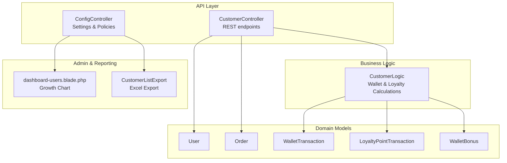

**Diagram sources**
- [CustomerController.php:176-206](file://app/Http/Controllers/Api/V1/CustomerController.php#L176-L206)
- [customer.php:16-80](file://app/CentralLogics/customer.php#L16-L80)
- [User.php:103-114](file://app/Models/User.php#L103-L114)
- [Order.php:118-126](file://app/Models/Order.php#L118-L126)
- [WalletTransaction.php:14-22](file://app/Models/WalletTransaction.php#L14-L22)
- [LoyaltyPointTransaction.php:10-16](file://app/Models/LoyaltyPointTransaction.php#L10-L16)
- [WalletBonus.php:52-59](file://app/Models/WalletBonus.php#L52-L59)
- [dashboard-users.blade.php:139-162](file://resources/views/admin-views/dashboard-users.blade.php#L139-L162)
- [CustomerListExport.php:32-37](file://app/Exports/CustomerListExport.php#L32-L37)

**Section sources**
- [api.php:333-346](file://routes/api/v1/api.php#L333-L346)
- [CustomerController.php:176-206](file://app/Http/Controllers/Api/V1/CustomerController.php#L176-L206)
- [customer.php:16-80](file://app/CentralLogics/customer.php#L16-L80)
- [User.php:103-114](file://app/Models/User.php#L103-L114)
- [Order.php:118-126](file://app/Models/Order.php#L118-L126)
- [WalletTransaction.php:14-22](file://app/Models/WalletTransaction.php#L14-L22)
- [LoyaltyPointTransaction.php:10-16](file://app/Models/LoyaltyPointTransaction.php#L10-L16)
- [WalletBonus.php:52-59](file://app/Models/WalletBonus.php#L52-L59)
- [dashboard-users.blade.php:139-162](file://resources/views/admin-views/dashboard-users.blade.php#L139-L162)
- [CustomerListExport.php:32-37](file://app/Exports/CustomerListExport.php#L32-L37)

## Core Components
- Customer profile and preferences: retrieval, interest updates, visibility toggles, and cross-system synchronization
- Purchase behavior and order lifecycle: order counts, statuses, and module-type filtering
- Financial accounts: wallet transactions and bonuses
- Loyalty points: accrual, conversion, and point-to-wallet redemptions
- Growth and acquisition: new customer trends visualization
- Referral program: configuration and reward mechanics
- Export and reporting: customer lists and summary statistics

**Section sources**
- [CustomerController.php:176-206](file://app/Http/Controllers/Api/V1/CustomerController.php#L176-L206)
- [CustomerController.php:209-232](file://app/Http/Controllers/Api/V1/CustomerController.php#L209-L232)
- [CustomerController.php:234-244](file://app/Http/Controllers/Api/V1/CustomerController.php#L234-L244)
- [CustomerController.php:263-305](file://app/Http/Controllers/Api/V1/CustomerController.php#L263-L305)
- [CustomerController.php:307-321](file://app/Http/Controllers/Api/V1/CustomerController.php#L307-L321)
- [CustomerController.php:323-336](file://app/Http/Controllers/Api/V1/CustomerController.php#L323-L336)
- [customer.php:16-80](file://app/CentralLogics/customer.php#L16-L80)
- [customer.php:82-126](file://app/CentralLogics/customer.php#L82-L126)
- [customer.php:128-151](file://app/CentralLogics/customer.php#L128-L151)
- [User.php:103-114](file://app/Models/User.php#L103-L114)
- [Order.php:206-214](file://app/Models/Order.php#L206-L214)
- [Order.php:241-249](file://app/Models/Order.php#L241-L249)
- [Order.php:297-302](file://app/Models/Order.php#L297-L302)
- [Order.php:311-314](file://app/Models/Order.php#L311-L314)
- [dashboard-users.blade.php:139-162](file://resources/views/admin-views/dashboard-users.blade.php#L139-L162)
- [customer-index.blade.php:126-137](file://resources/views/admin-views/business-settings/customer-index.blade.php#L126-L137)

## Architecture Overview
The system integrates REST APIs, central business logic, domain models, and admin UI/reporting. The CustomerController exposes endpoints for customer-centric analytics and personalization. Central logic encapsulates financial and loyalty computations. Models define relationships and scopes for order lifecycle and customer segmentation. Admin views render growth charts and summaries.

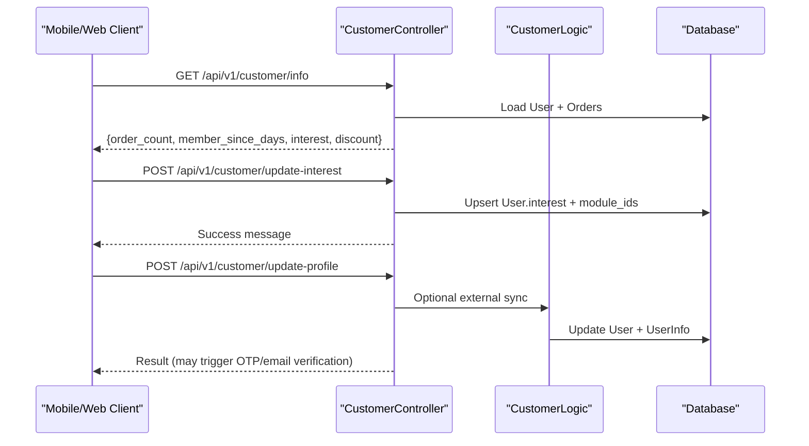

**Diagram sources**
- [api.php:333-346](file://routes/api/v1/api.php#L333-L346)
- [CustomerController.php:176-206](file://app/Http/Controllers/Api/V1/CustomerController.php#L176-L206)
- [CustomerController.php:209-232](file://app/Http/Controllers/Api/V1/CustomerController.php#L209-L232)
- [CustomerController.php:376-475](file://app/Http/Controllers/Api/V1/CustomerController.php#L376-L475)
- [customer.php:16-80](file://app/CentralLogics/customer.php#L16-L80)

## Detailed Component Analysis

### Customer Profile and Preferences
- Retrieves customer metadata, order count, membership duration, selected modules, and eligibility for first-order discounts.
- Updates customer interests and module selections for preference-driven personalization.
- Toggles phone visibility and manages Firebase push tokens.
- Supports cross-system customer synchronization via external endpoints.

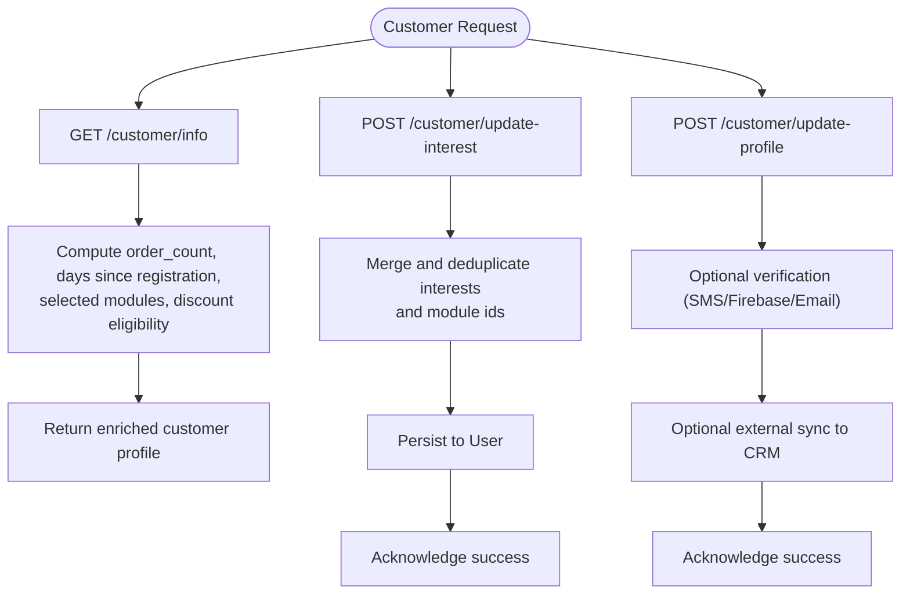

**Diagram sources**
- [CustomerController.php:176-206](file://app/Http/Controllers/Api/V1/CustomerController.php#L176-L206)
- [CustomerController.php:209-232](file://app/Http/Controllers/Api/V1/CustomerController.php#L209-L232)
- [CustomerController.php:376-475](file://app/Http/Controllers/Api/V1/CustomerController.php#L376-L475)
- [api.php:333-346](file://routes/api/v1/api.php#L333-L346)

**Section sources**
- [CustomerController.php:176-206](file://app/Http/Controllers/Api/V1/CustomerController.php#L176-L206)
- [CustomerController.php:209-232](file://app/Http/Controllers/Api/V1/CustomerController.php#L209-L232)
- [CustomerController.php:234-244](file://app/Http/Controllers/Api/V1/CustomerController.php#L234-L244)
- [CustomerController.php:246-261](file://app/Http/Controllers/Api/V1/CustomerController.php#L246-L261)
- [CustomerController.php:263-305](file://app/Http/Controllers/Api/V1/CustomerController.php#L263-L305)
- [CustomerController.php:307-321](file://app/Http/Controllers/Api/V1/CustomerController.php#L307-L321)
- [CustomerController.php:323-336](file://app/Http/Controllers/Api/V1/CustomerController.php#L323-L336)
- [CustomerController.php:461-472](file://app/Http/Controllers/Api/V1/CustomerController.php#L461-L472)

### Purchase Behavior and Order Lifecycle
- Provides order lists and details for behavioral analysis.
- Uses model scopes to segment orders by status (preparing, ongoing, delivered, canceled, refunded) and type (store, parcel, pos).
- Computes derived metrics such as order count and membership duration for cohort analysis.

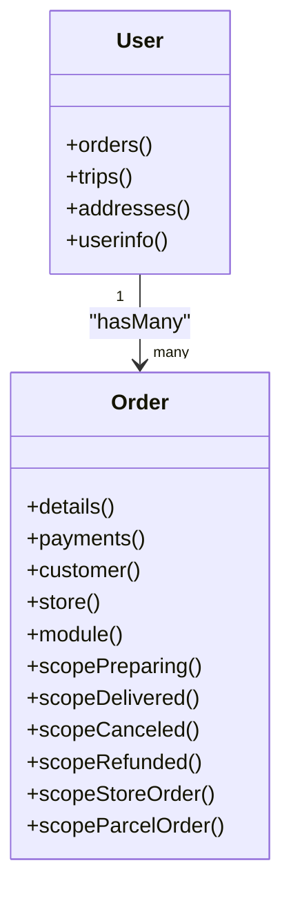

**Diagram sources**
- [User.php:103-114](file://app/Models/User.php#L103-L114)
- [Order.php:118-126](file://app/Models/Order.php#L118-L126)
- [Order.php:206-214](file://app/Models/Order.php#L206-L214)
- [Order.php:241-249](file://app/Models/Order.php#L241-L249)
- [Order.php:297-302](file://app/Models/Order.php#L297-L302)
- [Order.php:311-314](file://app/Models/Order.php#L311-L314)

**Section sources**
- [CustomerController.php:152-174](file://app/Http/Controllers/Api/V1/CustomerController.php#L152-L174)
- [Order.php:206-214](file://app/Models/Order.php#L206-L214)
- [Order.php:241-249](file://app/Models/Order.php#L241-L249)
- [Order.php:297-302](file://app/Models/Order.php#L297-L302)
- [Order.php:311-314](file://app/Models/Order.php#L311-L314)

### Financial Accounts and Wallet Transactions
- Creates wallet transactions for various event types (add funds, refunds, loyalty points, referrals, partial payments).
- Calculates wallet bonuses based on active bonus campaigns with percentage and amount tiers.
- Maintains balance and audit trail via WalletTransaction model.

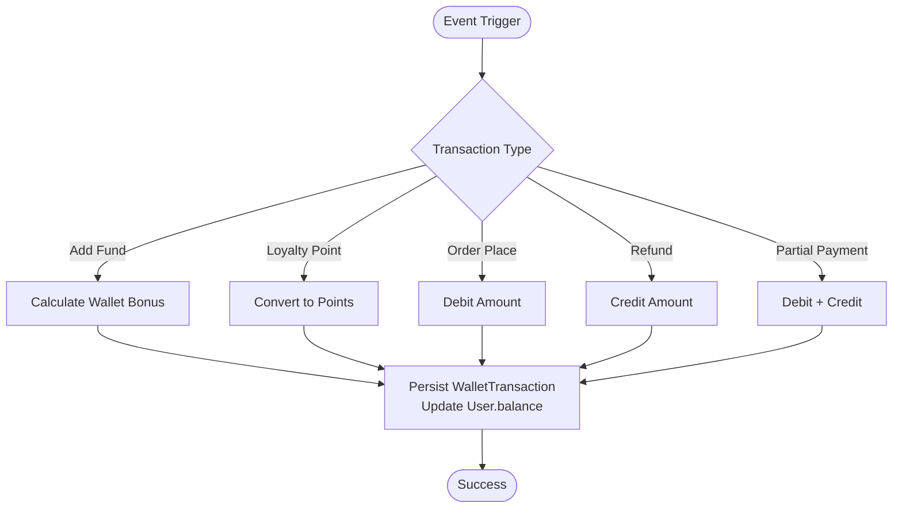

**Diagram sources**
- [customer.php:16-80](file://app/CentralLogics/customer.php#L16-L80)
- [customer.php:128-151](file://app/CentralLogics/customer.php#L128-L151)
- [WalletTransaction.php:14-22](file://app/Models/WalletTransaction.php#L14-L22)
- [WalletBonus.php:52-59](file://app/Models/WalletBonus.php#L52-L59)

**Section sources**
- [customer.php:16-80](file://app/CentralLogics/customer.php#L16-L80)
- [customer.php:128-151](file://app/CentralLogics/customer.php#L128-L151)
- [WalletTransaction.php:14-22](file://app/Models/WalletTransaction.php#L14-L22)
- [WalletBonus.php:107-123](file://app/Models/WalletBonus.php#L107-L123)

### Loyalty Points and Redemption
- Accrues points based on purchase value and configured exchange rate.
- Supports redemption of points to wallet with debit entries.
- Tracks balances and history via LoyaltyPointTransaction.

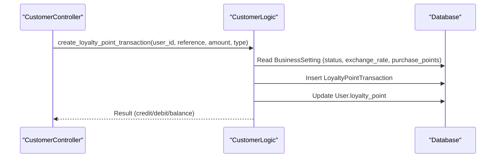

**Diagram sources**
- [customer.php:82-126](file://app/CentralLogics/customer.php#L82-L126)
- [LoyaltyPointTransaction.php:10-16](file://app/Models/LoyaltyPointTransaction.php#L10-L16)

**Section sources**
- [customer.php:82-126](file://app/CentralLogics/customer.php#L82-L126)
- [LoyaltyPointTransaction.php:10-16](file://app/Models/LoyaltyPointTransaction.php#L10-L16)

### Customer Acquisition Tracking and Growth Visualization
- Admin dashboard renders a customer growth area chart using monthly new customer ratios.
- Backend aggregates counts across time slices for visualization.

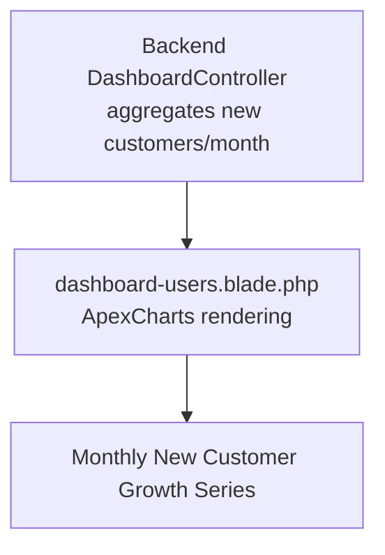

**Diagram sources**
- [dashboard-users.blade.php:582-629](file://resources/views/admin-views/dashboard-users.blade.php#L582-L629)
- [DashboardController.php:494-514](file://app/Http/Controllers/Admin/DashboardController.php#L494-L514)

**Section sources**
- [dashboard-users.blade.php:139-162](file://resources/views/admin-views/dashboard-users.blade.php#L139-L162)
- [dashboard-users.blade.php:582-629](file://resources/views/admin-views/dashboard-users.blade.php#L582-L629)
- [DashboardController.php:494-514](file://app/Http/Controllers/Admin/DashboardController.php#L494-L514)

### Referral Program Tracking
- Admin settings expose referral earning status and configuration.
- Frontend displays copy-to-action messaging for who shares and who uses the code.
- Backend supports referral-related wallet transactions via CustomerLogic.

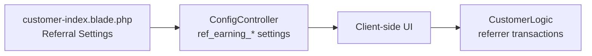

**Diagram sources**
- [customer-index.blade.php:126-137](file://resources/views/admin-views/business-settings/customer-index.blade.php#L126-L137)
- [customer-index.blade.php:306-359](file://resources/views/admin-views/business-settings/customer-index.blade.php#L306-L359)
- [ConfigController.php:250-254](file://app/Http/Controllers/Api/V1/ConfigController.php#L250-L254)
- [customer.php:32-37](file://app/CentralLogics/customer.php#L32-L37)

**Section sources**
- [customer-index.blade.php:126-137](file://resources/views/admin-views/business-settings/customer-index.blade.php#L126-L137)
- [customer-index.blade.php:306-359](file://resources/views/admin-views/business-settings/customer-index.blade.php#L306-L359)
- [ConfigController.php:250-254](file://app/Http/Controllers/Api/V1/ConfigController.php#L250-L254)
- [customer.php:32-37](file://app/CentralLogics/customer.php#L32-L37)

### Customer Support Analytics and Satisfaction Scoring
- Review reminder workflow identifies eligible orders for post-delivery feedback.
- Cancels review reminders to prevent repeated prompts.

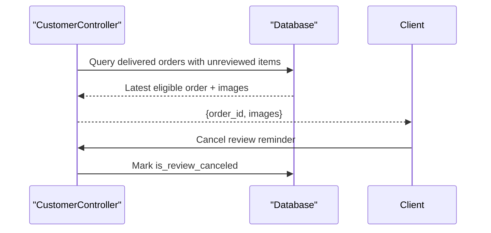

**Diagram sources**
- [CustomerController.php:338-372](file://app/Http/Controllers/Api/V1/CustomerController.php#L338-L372)

**Section sources**
- [CustomerController.php:338-372](file://app/Http/Controllers/Api/V1/CustomerController.php#L338-L372)

### Data Export and Reporting
- Excel export of customer lists with counts and status breakdowns.
- Blade template renders totals and active/inactive customer metrics.

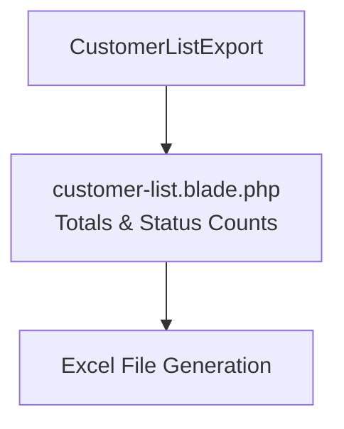

**Diagram sources**
- [CustomerListExport.php:32-37](file://app/Exports/CustomerListExport.php#L32-L37)
- [customer-list.blade.php:1-18](file://resources/views/file-exports/customer-list.blade.php#L1-L18)

**Section sources**
- [CustomerListExport.php:32-37](file://app/Exports/CustomerListExport.php#L32-L37)
- [customer-list.blade.php:1-18](file://resources/views/file-exports/customer-list.blade.php#L1-L18)

## Dependency Analysis
- CustomerController depends on User and Order models for analytics and on CustomerLogic for financial/loyalty operations.
- CustomerLogic depends on WalletTransaction, LoyaltyPointTransaction, WalletBonus, and BusinessSetting.
- Admin dashboard components depend on backend aggregation and frontend ApexCharts rendering.
- Export pipeline depends on Blade templates and Excel exporter concerns.

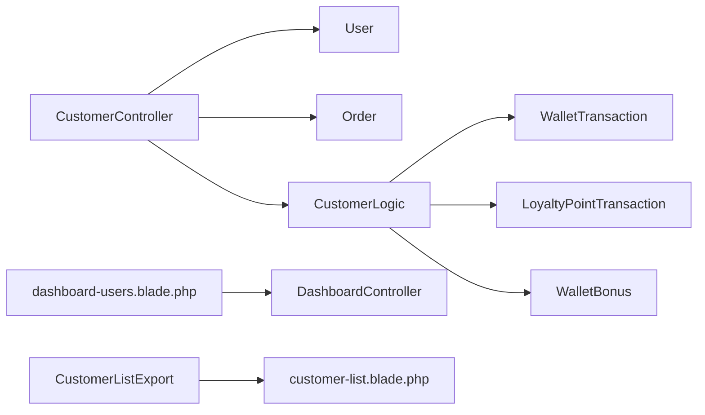

**Diagram sources**
- [CustomerController.php:176-206](file://app/Http/Controllers/Api/V1/CustomerController.php#L176-L206)
- [customer.php:16-80](file://app/CentralLogics/customer.php#L16-L80)
- [User.php:103-114](file://app/Models/User.php#L103-L114)
- [Order.php:118-126](file://app/Models/Order.php#L118-L126)
- [dashboard-users.blade.php:139-162](file://resources/views/admin-views/dashboard-users.blade.php#L139-L162)
- [DashboardController.php:494-514](file://app/Http/Controllers/Admin/DashboardController.php#L494-L514)
- [CustomerListExport.php:32-37](file://app/Exports/CustomerListExport.php#L32-L37)
- [customer-list.blade.php:1-18](file://resources/views/file-exports/customer-list.blade.php#L1-L18)

**Section sources**
- [CustomerController.php:176-206](file://app/Http/Controllers/Api/V1/CustomerController.php#L176-L206)
- [customer.php:16-80](file://app/CentralLogics/customer.php#L16-L80)
- [User.php:103-114](file://app/Models/User.php#L103-L114)
- [Order.php:118-126](file://app/Models/Order.php#L118-L126)
- [dashboard-users.blade.php:139-162](file://resources/views/admin-views/dashboard-users.blade.php#L139-L162)
- [DashboardController.php:494-514](file://app/Http/Controllers/Admin/DashboardController.php#L494-L514)
- [CustomerListExport.php:32-37](file://app/Exports/CustomerListExport.php#L32-L37)
- [customer-list.blade.php:1-18](file://resources/views/file-exports/customer-list.blade.php#L1-L18)

## Performance Considerations
- Prefer scoped queries on Order (e.g., preparing, delivered, canceled) to minimize dataset sizes for analytics.
- Use pagination for address and order lists to avoid large payloads.
- Cache frequently accessed business settings (e.g., loyalty and referral configurations) to reduce repeated reads.
- Batch external CRM updates to limit network overhead.
- Index frequently filtered columns (user_id, order_status, created_at) in analytics-heavy queries.

## Troubleshooting Guide
- OTP/email verification failures: check verification endpoints and thresholds for temporary blocks and hit counts.
- Cross-system synchronization: validate external configuration keys and tokens before initiating requests.
- Export formatting: adjust styles and column widths in the export class to match report requirements.
- Dashboard growth chart: confirm backend aggregation returns expected monthly counts and frontend chart options are properly populated.

**Section sources**
- [CustomerController.php:478-513](file://app/Http/Controllers/Api/V1/CustomerController.php#L478-L513)
- [CustomerController.php:514-542](file://app/Http/Controllers/Api/V1/CustomerController.php#L514-L542)
- [CustomerController.php:647-693](file://app/Http/Controllers/Api/V1/CustomerController.php#L647-L693)
- [CustomerController.php:461-472](file://app/Http/Controllers/Api/V1/CustomerController.php#L461-L472)
- [CustomerListExport.php:53-84](file://app/Exports/CustomerListExport.php#L53-L84)
- [dashboard-users.blade.php:582-629](file://resources/views/admin-views/dashboard-users.blade.php#L582-L629)

## Conclusion
The system provides a solid foundation for customer analytics and insights, including profile enrichment, purchase behavior tracking, financial and loyalty accounting, acquisition visualization, referral configuration, and support workflows. To enhance predictive capabilities (churn, RFM), extend the existing scopes and central logic with cohort and recency/frequency/monetary calculations, and integrate machine learning models via scheduled jobs and external APIs.

## Appendices
- Privacy and data protection: ensure compliance with data minimization, consent mechanisms, and secure handling of identifiers (phone, email). Use masked fields where appropriate and enforce access controls on sensitive endpoints.
- CRM integration: leverage the external update endpoints to synchronize customer profiles across systems, validating tokens and base URLs before data transfer.