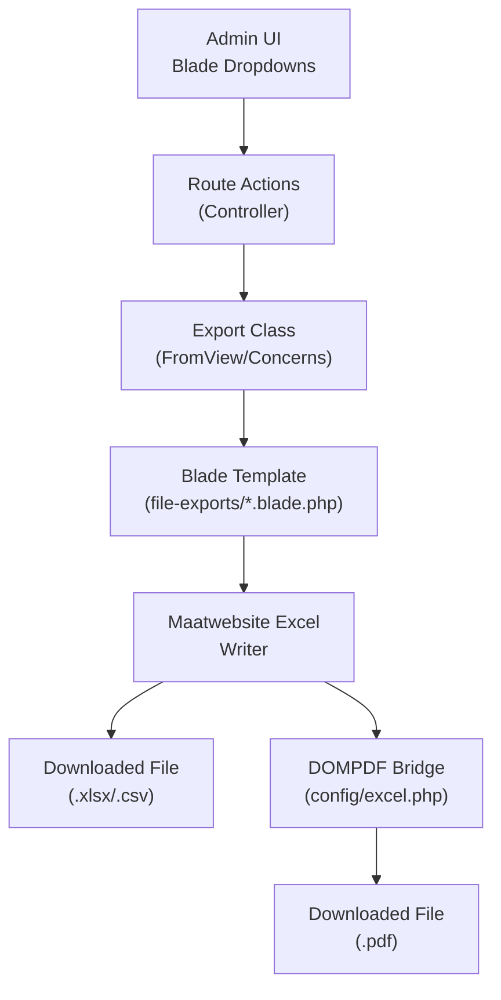
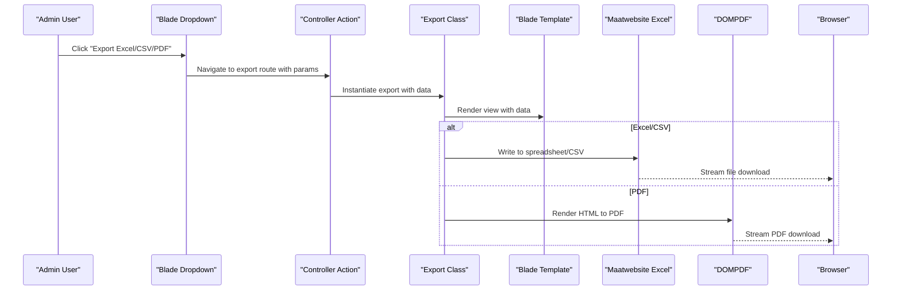
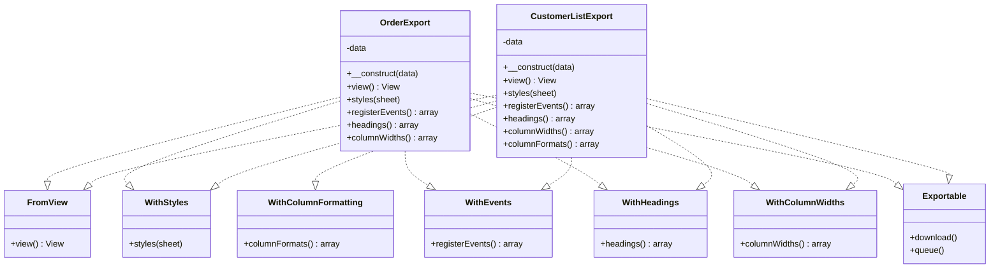
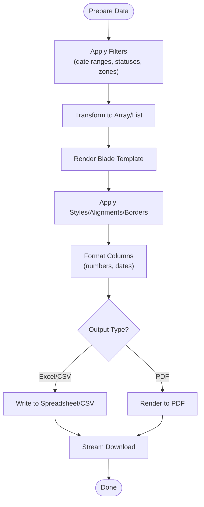
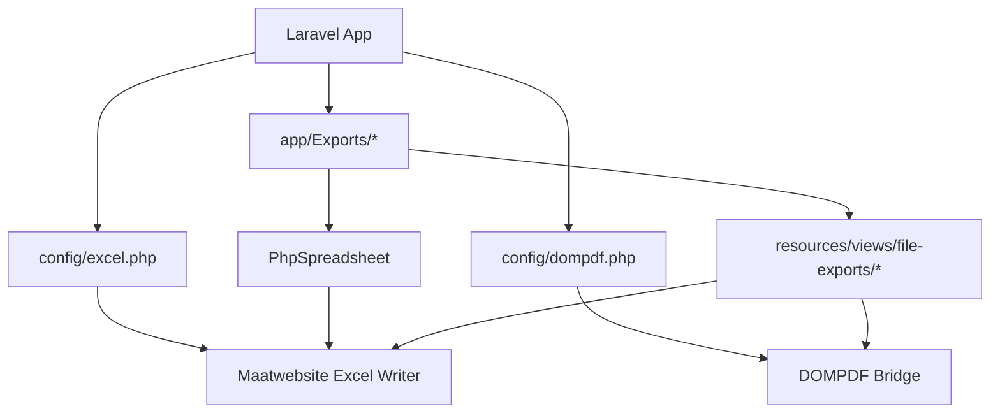

# Export System and Data Download

<cite>
**Referenced Files in This Document**
- [excel.php](file://config/excel.php)
- [dompdf.php](file://config/dompdf.php)
- [ImportExportTrait.php](file://app/Traits/ImportExportTrait.php)
- [CustomerListExport.php](file://app/Exports/CustomerListExport.php)
- [OrderExport.php](file://app/Exports/OrderExport.php)
- [customer-list.blade.php](file://resources/views/file-exports/customer-list.blade.php)
- [order-export.blade.php](file://resources/views/file-exports/order-export.blade.php)
- [admin-views product list.blade.php](file://resources/views/admin-views/product/list.blade.php)
- [addon-category index.blade.php](file://resources/views/admin-views/addon/addon-category/index.blade.php)
- [order list.blade.php](file://resources/views/vendor-views/order/list.blade.php)
</cite>

## Table of Contents
1. [Introduction](#introduction)
2. [Project Structure](#project-structure)
3. [Core Components](#core-components)
4. [Architecture Overview](#architecture-overview)
5. [Detailed Component Analysis](#detailed-component-analysis)
6. [Dependency Analysis](#dependency-analysis)
7. [Performance Considerations](#performance-considerations)
8. [Troubleshooting Guide](#troubleshooting-guide)
9. [Conclusion](#conclusion)
10. [Appendices](#appendices)

## Introduction
This document describes the export system responsible for generating downloadable reports in Excel, CSV, and PDF formats. It covers supported export formats, batch processing, scheduled report delivery, data transformation and formatting, custom export templates, performance optimization for large datasets, export history tracking, security measures, access controls, automated workflows, and integration with external business intelligence tools and API-based export capabilities.

## Project Structure
The export system is implemented using Laravel with Blade templates and the Maatwebsite Excel library. Configuration files define export behavior, while controller actions and Blade views orchestrate data retrieval, transformation, and rendering. The system supports:
- Excel exports via Blade-rendered views and PhpSpreadsheet styling hooks
- CSV exports via CSV-specific configuration
- PDF exports via DOMPDF integration

**Diagram sources**
- [excel.php:189-191](file://config/excel.php#L189-L191)
- [dompdf.php:1-245](file://config/dompdf.php#L1-L245)
- [OrderExport.php:26-40](file://app/Exports/OrderExport.php#L26-L40)
- [customer-list.blade.php:1-94](file://resources/views/file-exports/customer-list.blade.php#L1-L94)
- [order-export.blade.php:1-103](file://resources/views/file-exports/order-export.blade.php#L1-L103)

**Section sources**
- [excel.php:1-334](file://config/excel.php#L1-L334)
- [dompdf.php:1-245](file://config/dompdf.php#L1-L245)

## Core Components
- Export configuration: Defines chunk sizes, CSV settings, worksheet properties, PDF driver selection, caching, and temporary file locations.
- Export classes: Implement Maatwebsite Excel concerns to render Blade templates into downloadable files.
- Blade templates: Provide structured HTML for Excel/PDF output, including metadata, headers, and tabular data.
- UI triggers: Provide export dropdowns and links to initiate exports for lists and reports.

Key responsibilities:
- Data transformation: Convert Eloquent collections or arrays into export-ready structures.
- Formatting: Apply styles, alignments, borders, and column widths via PhpSpreadsheet.
- Batch processing: Use chunked queries and streaming generators for large datasets.
- Security: Restrict exports to authorized users and sanitize inputs.
- Integration: Support Excel, CSV, and PDF outputs with consistent templates.

**Section sources**
- [excel.php:1-334](file://config/excel.php#L1-L334)
- [CustomerListExport.php:22-138](file://app/Exports/CustomerListExport.php#L22-L138)
- [OrderExport.php:26-133](file://app/Exports/OrderExport.php#L26-L133)
- [customer-list.blade.php:1-94](file://resources/views/file-exports/customer-list.blade.php#L1-L94)
- [order-export.blade.php:1-103](file://resources/views/file-exports/order-export.blade.php#L1-L103)

## Architecture Overview
The export pipeline follows a layered pattern:
- UI triggers export requests with filters and parameters.
- Controller routes handle the request and pass parameters to the export class.
- Export class renders a Blade template with prepared data.
- Excel writer converts the Blade-rendered HTML into spreadsheet or CSV.
- PDF writer converts HTML to PDF using DOMPDF.
- Downloads are streamed to the client.

**Diagram sources**
- [excel.php:189-191](file://config/excel.php#L189-L191)
- [OrderExport.php:26-40](file://app/Exports/OrderExport.php#L26-L40)
- [customer-list.blade.php:1-94](file://resources/views/file-exports/customer-list.blade.php#L1-L94)
- [order-export.blade.php:1-103](file://resources/views/file-exports/order-export.blade.php#L1-L103)

## Detailed Component Analysis

### Export Configuration and Drivers
- Excel configuration:
  - Chunk size for query-based exports
  - CSV delimiter, enclosure, line endings, encoding
  - Worksheet properties (creator, title, etc.)
  - PDF driver selection (DOMPDF, TCPDF, mPDF)
  - Cell caching and temporary file locations
- DOMPDF configuration:
  - Orientation, paper size, DPI
  - Font directories and caching
  - Security settings (remote access, PHP/Javascript)

These settings govern performance, compatibility, and security for all export outputs.

**Section sources**
- [excel.php:1-334](file://config/excel.php#L1-L334)
- [dompdf.php:1-245](file://config/dompdf.php#L1-L245)

### Export Classes and Concerns
Export classes implement Maatwebsite Excel concerns to control rendering and formatting:
- FromView: Renders a Blade template
- WithStyles/ShouldAutoSize/WithColumnWidths: Applies styles and layout
- WithEvents: Hooks into sheet lifecycle events (e.g., AfterSheet)
- WithHeadings: Provides header metadata
- Exportable: Adds download capability

Examples:
- CustomerListExport: Applies bold fonts, fills, borders, merges, and alignments; defines column formats.
- OrderExport: Similar styling and layout for order data.

**Diagram sources**
- [CustomerListExport.php:22-138](file://app/Exports/CustomerListExport.php#L22-L138)
- [OrderExport.php:26-133](file://app/Exports/OrderExport.php#L26-L133)

**Section sources**
- [CustomerListExport.php:22-138](file://app/Exports/CustomerListExport.php#L22-L138)
- [OrderExport.php:26-133](file://app/Exports/OrderExport.php#L26-L133)

### Blade Templates for Export Content
Templates structure the exported content:
- customer-list.blade.php: Renders customer analytics, filter criteria, and a tabular list of customers.
- order-export.blade.php: Renders order list with filter criteria, headers, and computed totals.

These templates are rendered by export classes and consumed by Excel/PDF writers.

**Section sources**
- [customer-list.blade.php:1-94](file://resources/views/file-exports/customer-list.blade.php#L1-L94)
- [order-export.blade.php:1-103](file://resources/views/file-exports/order-export.blade.php#L1-L103)

### UI Triggers and Routing
Export actions are initiated from UI dropdowns:
- Product list page: Links to export items in Excel/CSV.
- Addon category list page: Links to export categories in Excel/CSV.
- Vendor order list page: Dropdown with Excel/CSV/PDF options.

These UI elements link to controller actions that prepare data and trigger exports.

**Section sources**
- [admin-views product list.blade.php:154-166](file://resources/views/admin-views/product/list.blade.php#L154-L166)
- [addon-category index.blade.php:140-154](file://resources/views/admin-views/addon/addon-category/index.blade.php#L140-L154)
- [order list.blade.php:65-87](file://resources/views/vendor-views/order/list.blade.php#L65-L87)

### Data Transformation and Formatting
- Data preparation: Controllers assemble filtered, paginated, or aggregated datasets and pass them to export classes.
- Blade rendering: Templates transform raw data into structured HTML tables with metadata.
- Styles and formatting: Export classes apply PhpSpreadsheet styles, borders, alignments, merges, and column widths.
- Column formatting: Numeric or currency-like fields can be formatted via number formats.

[No sources needed since this diagram shows conceptual workflow, not actual code structure]

### Batch Processing and Large Dataset Handling
- Chunked queries: Use configured chunk sizes to iterate over large result sets without loading everything into memory.
- Streaming generator: A trait-based generator yields items one by one to reduce memory footprint.
- Temporary files: Configure local and remote temporary paths for queued exports in distributed environments.
- Caching: Choose appropriate cell caching drivers (memory, illuminate, batch) to manage memory usage.

**Section sources**
- [excel.php:17-18](file://config/excel.php#L17-L18)
- [excel.php:243-245](file://config/excel.php#L243-L245)
- [excel.php:297-314](file://config/excel.php#L297-L314)
- [ImportExportTrait.php:7-13](file://app/Traits/ImportExportTrait.php#L7-L13)

### Scheduled Report Delivery
- Scheduled exports can be implemented by invoking export classes from scheduled tasks or queue workers.
- Parameters (filters, date ranges) can be persisted and reused to generate periodic reports.
- Delivery mechanisms include email attachments or saving to shared disks for BI tools to consume.

[No sources needed since this section provides general guidance]

### Export History Tracking
- Track export jobs using queues and job tables to record who triggered exports, parameters used, timestamps, and outcomes.
- Store generated files on a shared disk for auditability and retrieval by external BI systems.

[No sources needed since this section provides general guidance]

### Security Measures and Access Controls
- Restrict export endpoints to authenticated users with appropriate roles.
- Sanitize inputs and enforce parameter limits to prevent resource exhaustion.
- Limit export scope to permitted zones/modules and apply data visibility rules.
- Secure PDF rendering by disabling remote access and inline scripts where applicable.

**Section sources**
- [dompdf.php:210-231](file://config/dompdf.php#L210-L231)

### Automated Export Workflows
- Queue-based exports: Offload heavy exports to background jobs to avoid timeouts.
- Retry policies: Implement retries for transient failures.
- Notifications: Notify users or admins upon completion or failure.

[No sources needed since this section provides general guidance]

### Integration with External Business Intelligence Tools
- Provide API endpoints to programmatically trigger exports with parameters.
- Offer standardized CSV/XLSX outputs consumable by BI tools.
- Store files on shared disks or cloud storage for ingestion by external systems.

[No sources needed since this section provides general guidance]

## Dependency Analysis
The export system depends on:
- Laravel framework and Blade templating
- Maatwebsite Excel for spreadsheet/CSV generation
- DOMPDF bridge for PDF generation
- PhpSpreadsheet for advanced formatting and styling
- Queue system for batch and scheduled exports

**Diagram sources**
- [excel.php:1-334](file://config/excel.php#L1-L334)
- [dompdf.php:1-245](file://config/dompdf.php#L1-L245)
- [CustomerListExport.php:22-138](file://app/Exports/CustomerListExport.php#L22-L138)
- [OrderExport.php:26-133](file://app/Exports/OrderExport.php#L26-L133)

**Section sources**
- [excel.php:1-334](file://config/excel.php#L1-L334)
- [dompdf.php:1-245](file://config/dompdf.php#L1-L245)

## Performance Considerations
- Prefer chunked queries and streaming generators for large datasets.
- Use batch cell caching for very large spreadsheets.
- Minimize complex styling and merges to reduce rendering overhead.
- Optimize Blade templates to avoid excessive loops and computations.
- Leverage queues for long-running exports to prevent timeouts.

[No sources needed since this section provides general guidance]

## Troubleshooting Guide
Common issues and resolutions:
- Memory errors on large exports: Reduce chunk size, switch to batch caching, or stream via generators.
- Incorrect column widths or alignment: Verify WithColumnWidths and WithStyles implementations.
- PDF rendering problems: Confirm DOMPDF configuration and disable remote access if needed.
- Missing downloads: Ensure temporary file paths are writable and accessible across servers in queued environments.

**Section sources**
- [excel.php:243-245](file://config/excel.php#L243-L245)
- [excel.php:297-314](file://config/excel.php#L297-L314)
- [dompdf.php:210-231](file://config/dompdf.php#L210-L231)

## Conclusion
The export system leverages Laravel, Blade, and Maatwebsite Excel to deliver robust, customizable, and secure data downloads in Excel, CSV, and PDF formats. With chunked processing, configurable caching, and strong formatting hooks, it scales to large datasets while maintaining performance. Integrating queues and scheduled tasks enables automated workflows, and careful configuration ensures secure, auditable exports suitable for downstream BI consumption.

## Appendices
- Supported export formats: Excel (.xlsx/.xls), CSV, PDF
- Key configuration keys: chunk_size, csv settings, pdf driver, cache driver, temp paths
- Best practices: use chunked queries, streaming generators, and queues; apply minimal styling; sanitize inputs; restrict access

[No sources needed since this section provides general guidance]