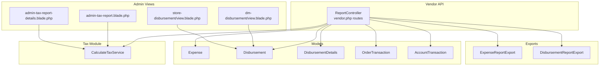
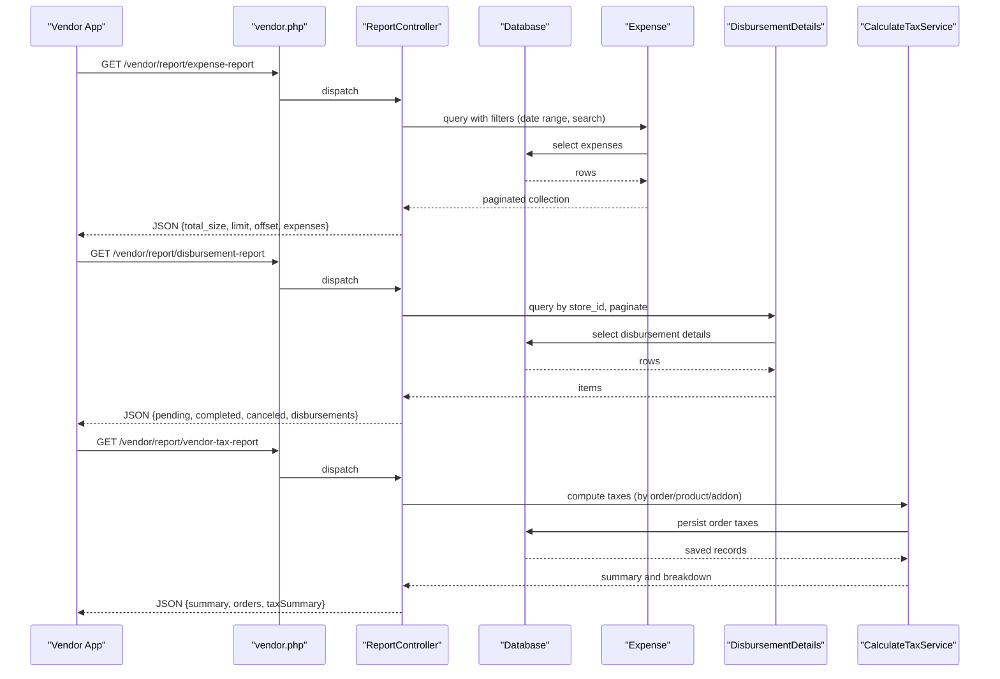
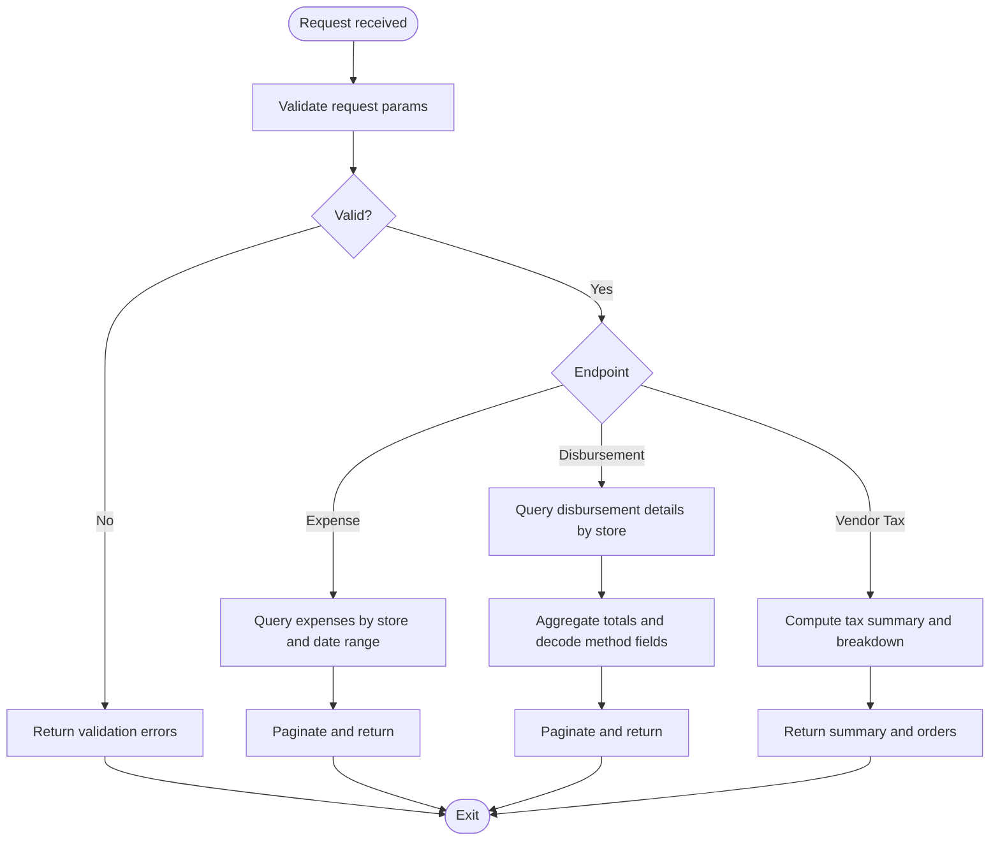
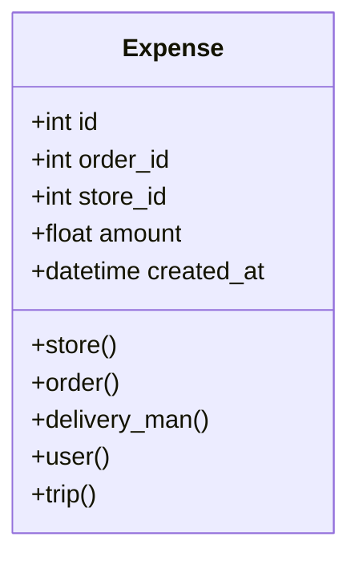
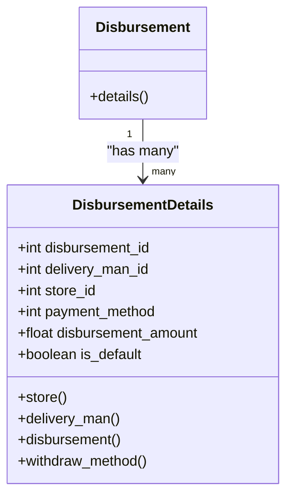
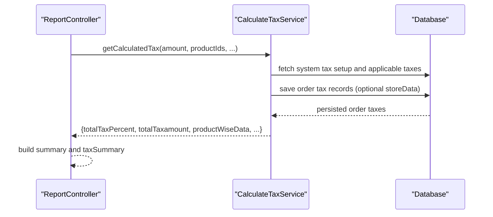
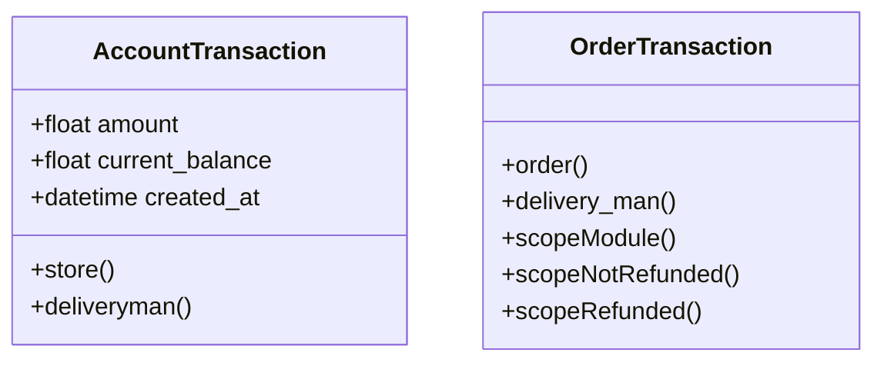
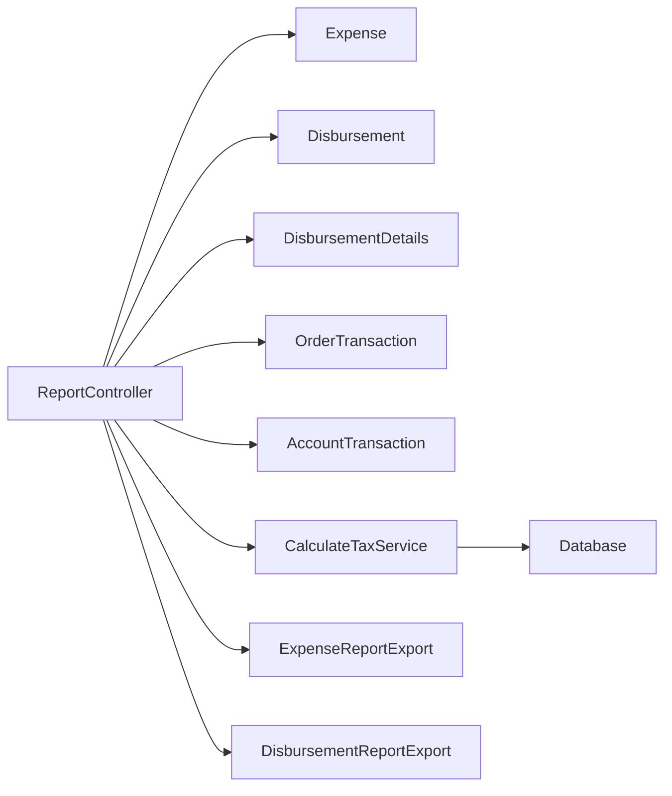

# Financial and Accounting Reports

<cite>
**Referenced Files in This Document**
- [ReportController.php](file://app/Http/Controllers/Api/V1/Vendor/ReportController.php)
- [Expense.php](file://app/Models/Expense.php)
- [Disbursement.php](file://app/Models/Disbursement.php)
- [DisbursementDetails.php](file://app/Models/DisbursementDetails.php)
- [OrderTransaction.php](file://app/Models/OrderTransaction.php)
- [AccountTransaction.php](file://app/Models/AccountTransaction.php)
- [ExpenseReportExport.php](file://app/Exports/ExpenseReportExport.php)
- [DisbursementReportExport.php](file://app/Exports/DisbursementReportExport.php)
- [CalculateTaxService.php](file://Modules/TaxModule/Services/CalculateTaxService.php)
- [vendor.php](file://routes/vendor.php)
- [admin-tax-report.blade.php](file://resources/views/admin-views/report/tax-report/admin-tax-report.blade.php)
- [admin-tax-report-details.blade.php](file://resources/views/admin-views/report/tax-report/admin-tax-report-details.blade.php)
- [expense-report.blade.php](file://resources/views/file-exports/expense-report.blade.php)
- [create.blade.php](file://resources/views/vendor-views/custom-role/create.blade.php)
- [view.blade.php (dm-disbursement)](file://resources/views/admin-views/dm-disbursement/view.blade.php)
- [view.blade.php (store-disbursement)](file://resources/views/admin-views/store-disbursement/view.blade.php)
- [admin_formatted_routes.json](file://public/admin_formatted_routes.json)
- [vendor.php (formatted routes)](file://public/vendor_formatted_routes.json)
- [SearchRoutingController.php](file://app/Http/Controllers/Admin/SearchRoutingController.php)
- [layouts sidebar transactions](file://resources/views/layouts/admin/partials/_sidebar_transactions.blade.php)
</cite>

## Table of Contents
1. [Introduction](#introduction)
2. [Project Structure](#project-structure)
3. [Core Components](#core-components)
4. [Architecture Overview](#architecture-overview)
5. [Detailed Component Analysis](#detailed-component-analysis)
6. [Dependency Analysis](#dependency-analysis)
7. [Performance Considerations](#performance-considerations)
8. [Troubleshooting Guide](#troubleshooting-guide)
9. [Conclusion](#conclusion)
10. [Appendices](#appendices)

## Introduction
This document describes the financial and accounting reporting capabilities implemented in the system, focusing on:
- Expense tracking and reporting
- Disbursement reports for vendors and delivery personnel
- Profit and loss and cash flow perspectives grounded in transaction models
- Tax reporting and calculation via a dedicated tax module
- Financial reconciliation and audit trail support
- Budget vs actual and variance reporting foundations
- Integration points with admin and vendor panels, and export capabilities

The system exposes vendor-facing APIs for expense and disbursement reporting, integrates with a tax calculation service, and provides admin dashboards and exports for transparency and compliance.

## Project Structure
The financial reporting stack spans controllers, models, exports, and views, with routing configured for vendor modules and admin views.

**Diagram sources**
- [ReportController.php:19-208](file://app/Http/Controllers/Api/V1/Vendor/ReportController.php#L19-L208)
- [vendor.php:290-306](file://routes/vendor.php#L290-L306)
- [Expense.php:1-49](file://app/Models/Expense.php#L1-L49)
- [Disbursement.php:1-17](file://app/Models/Disbursement.php#L1-L17)
- [DisbursementDetails.php:1-41](file://app/Models/DisbursementDetails.php#L1-L41)
- [OrderTransaction.php:1-47](file://app/Models/OrderTransaction.php#L1-L47)
- [AccountTransaction.php:1-57](file://app/Models/AccountTransaction.php#L1-L57)
- [ExpenseReportExport.php:1-127](file://app/Exports/ExpenseReportExport.php#L1-L127)
- [DisbursementReportExport.php:1-107](file://app/Exports/DisbursementReportExport.php#L1-L107)
- [CalculateTaxService.php:1-325](file://Modules/TaxModule/Services/CalculateTaxService.php#L1-L325)
- [admin-tax-report.blade.php:68-294](file://resources/views/admin-views/report/tax-report/admin-tax-report.blade.php#L68-L294)
- [admin-tax-report-details.blade.php:47-68](file://resources/views/admin-views/report/tax-report/admin-tax-report-details.blade.php#L47-L68)
- [view.blade.php (dm-disbursement):1-21](file://resources/views/admin-views/dm-disbursement/view.blade.php#L1-L21)
- [view.blade.php (store-disbursement):1-21](file://resources/views/admin-views/store-disbursement/view.blade.php#L1-L21)

**Section sources**
- [ReportController.php:19-208](file://app/Http/Controllers/Api/V1/Vendor/ReportController.php#L19-L208)
- [vendor.php:290-306](file://routes/vendor.php#L290-L306)

## Core Components
- Vendor Report Controller: Provides vendor-facing endpoints for expense report, disbursement report, and vendor tax report with pagination, filtering, and summary aggregations.
- Expense model: Captures vendor expenses linked to stores, orders, delivery personnel, and optional trips.
- Disbursement and DisbursementDetails models: Represent disbursement batches and line items with withdrawal method linkage.
- OrderTransaction and AccountTransaction models: Support transactional history and reconciliation across stores and delivery personnel.
- Tax Calculation Service: Computes taxes by order/product/addon/category with configurable tax types and additional charges.
- Exports: Excel-based exports for expense and disbursement reports.
- Admin Views: Tax report summaries and disbursement detail pages for administrative oversight.

**Section sources**
- [ReportController.php:19-208](file://app/Http/Controllers/Api/V1/Vendor/ReportController.php#L19-L208)
- [Expense.php:1-49](file://app/Models/Expense.php#L1-L49)
- [Disbursement.php:1-17](file://app/Models/Disbursement.php#L1-L17)
- [DisbursementDetails.php:1-41](file://app/Models/DisbursementDetails.php#L1-L41)
- [OrderTransaction.php:1-47](file://app/Models/OrderTransaction.php#L1-L47)
- [AccountTransaction.php:1-57](file://app/Models/AccountTransaction.php#L1-L57)
- [ExpenseReportExport.php:1-127](file://app/Exports/ExpenseReportExport.php#L1-L127)
- [DisbursementReportExport.php:1-107](file://app/Exports/DisbursementReportExport.php#L1-L107)
- [CalculateTaxService.php:1-325](file://Modules/TaxModule/Services/CalculateTaxService.php#L1-L325)
- [admin-tax-report.blade.php:68-294](file://resources/views/admin-views/report/tax-report/admin-tax-report.blade.php#L68-L294)
- [admin-tax-report-details.blade.php:47-68](file://resources/views/admin-views/report/tax-report/admin-tax-report-details.blade.php#L47-L68)
- [view.blade.php (dm-disbursement):1-21](file://resources/views/admin-views/dm-disbursement/view.blade.php#L1-L21)
- [view.blade.php (store-disbursement):1-21](file://resources/views/admin-views/store-disbursement/view.blade.php#L1-L21)

## Architecture Overview
The vendor report controller orchestrates queries against domain models, aggregates summaries, and returns paginated results. The tax service encapsulates tax computation and persistence of order tax records. Admin views and exports provide visibility and auditability.

**Diagram sources**
- [vendor.php:290-306](file://routes/vendor.php#L290-L306)
- [ReportController.php:19-208](file://app/Http/Controllers/Api/V1/Vendor/ReportController.php#L19-L208)
- [Expense.php:1-49](file://app/Models/Expense.php#L1-L49)
- [DisbursementDetails.php:1-41](file://app/Models/DisbursementDetails.php#L1-L41)
- [CalculateTaxService.php:1-325](file://Modules/TaxModule/Services/CalculateTaxService.php#L1-L325)

## Detailed Component Analysis

### Vendor Report Controller
- Expense report: Validates pagination and date range, filters by vendor’s store, supports search on order IDs, and paginates results.
- Disbursement report: Aggregates pending/completed/canceled totals and returns paginated disbursement details with decoded withdrawal method fields.
- Vendor tax report: Computes order-level tax summaries and per-order tax breakdowns for a given period and store.

**Diagram sources**
- [ReportController.php:19-208](file://app/Http/Controllers/Api/V1/Vendor/ReportController.php#L19-L208)

**Section sources**
- [ReportController.php:19-208](file://app/Http/Controllers/Api/V1/Vendor/ReportController.php#L19-L208)

### Expense Tracking and Reporting
- Data model: Expense belongs to store, order, delivery man, user, and optionally a trip.
- API: Returns paginated expenses filtered by date range and optional search term.
- Export: Excel export view template for expense reports with merged headers and alignment.

**Diagram sources**
- [Expense.php:1-49](file://app/Models/Expense.php#L1-L49)

**Section sources**
- [Expense.php:1-49](file://app/Models/Expense.php#L1-L49)
- [ReportController.php:19-58](file://app/Http/Controllers/Api/V1/Vendor/ReportController.php#L19-L58)
- [ExpenseReportExport.php:1-127](file://app/Exports/ExpenseReportExport.php#L1-L127)
- [expense-report.blade.php:1-37](file://resources/views/file-exports/expense-report.blade.php#L1-L37)

### Disbursement Reports
- Data models: Disbursement has many DisbursementDetails; DisbursementDetails belong to store, delivery man, and withdrawal method.
- API: Returns aggregated totals by status and paginated details; decodes method fields for UI rendering.
- Admin views: Dedicated pages for delivery-man and store disbursement details.

**Diagram sources**
- [Disbursement.php:1-17](file://app/Models/Disbursement.php#L1-L17)
- [DisbursementDetails.php:1-41](file://app/Models/DisbursementDetails.php#L1-L41)

**Section sources**
- [Disbursement.php:1-17](file://app/Models/Disbursement.php#L1-L17)
- [DisbursementDetails.php:1-41](file://app/Models/DisbursementDetails.php#L1-L41)
- [ReportController.php:60-93](file://app/Http/Controllers/Api/V1/Vendor/ReportController.php#L60-L93)
- [DisbursementReportExport.php:1-107](file://app/Exports/DisbursementReportExport.php#L1-L107)
- [view.blade.php (dm-disbursement):1-21](file://resources/views/admin-views/dm-disbursement/view.blade.php#L1-L21)
- [view.blade.php (store-disbursement):1-21](file://resources/views/admin-views/store-disbursement/view.blade.php#L1-L21)

### Tax Reporting and Calculation
- Tax calculation service computes taxes by order, product, addon, or category depending on system configuration, persists order tax records, and returns structured results.
- Vendor tax report endpoint aggregates order counts, amounts, and total tax, and groups tax breakdowns by tax name and rate.

**Diagram sources**
- [CalculateTaxService.php:16-116](file://Modules/TaxModule/Services/CalculateTaxService.php#L16-L116)
- [ReportController.php:97-206](file://app/Http/Controllers/Api/V1/Vendor/ReportController.php#L97-L206)

**Section sources**
- [CalculateTaxService.php:1-325](file://Modules/TaxModule/Services/CalculateTaxService.php#L1-L325)
- [ReportController.php:97-206](file://app/Http/Controllers/Api/V1/Vendor/ReportController.php#L97-L206)
- [admin-tax-report.blade.php:68-294](file://resources/views/admin-views/report/tax-report/admin-tax-report.blade.php#L68-L294)
- [admin-tax-report-details.blade.php:47-68](file://resources/views/admin-views/report/tax-report/admin-tax-report-details.blade.php#L47-L68)

### Financial Reconciliation and Audit Trail
- AccountTransaction and OrderTransaction models capture movement and settlement data across stores and delivery personnel.
- Admin routes and sidebar entries expose provider and rental-related reporting for auditability.
- SearchRoutingController maps search keywords to relevant admin report routes, aiding audit trail navigation.

**Diagram sources**
- [AccountTransaction.php:1-57](file://app/Models/AccountTransaction.php#L1-L57)
- [OrderTransaction.php:1-47](file://app/Models/OrderTransaction.php#L1-L47)

**Section sources**
- [AccountTransaction.php:1-57](file://app/Models/AccountTransaction.php#L1-L57)
- [OrderTransaction.php:1-47](file://app/Models/OrderTransaction.php#L1-L47)
- [admin_formatted_routes.json:1033-1046](file://public/admin_formatted_routes.json#L1033-L1046)
- [layouts sidebar transactions:248-257](file://resources/views/layouts/admin/partials/_sidebar_transactions.blade.php#L248-L257)
- [SearchRoutingController.php:748-775](file://app/Http/Controllers/Admin/SearchRoutingController.php#L748-L775)

### Receipt Management and Automated Expense Categorization
- The system captures expenses with optional links to orders, stores, delivery personnel, and trips, enabling traceability.
- While explicit receipt upload and OCR categorization are not present in the analyzed files, the Expense model supports associations that can be extended to integrate with receipt management and categorization services.

**Section sources**
- [Expense.php:1-49](file://app/Models/Expense.php#L1-L49)

### Commission Calculations and Payout Processing
- Vendor tax report endpoints and summaries provide insights into earnings and tax liabilities, foundational for commission and payout planning.
- Disbursement details include withdrawal method metadata, supporting payout processing workflows.

**Section sources**
- [ReportController.php:97-206](file://app/Http/Controllers/Api/V1/Vendor/ReportController.php#L97-L206)
- [DisbursementDetails.php:1-41](file://app/Models/DisbursementDetails.php#L1-L41)

### Profit and Loss and Cash Flow Analysis
- Profit and loss: The vendor tax report aggregates total orders, total order amounts, and total tax, providing a basis for P&L computations.
- Cash flow: AccountTransaction and OrderTransaction models capture inflows/outflows and settlements, useful for cash flow monitoring.

**Section sources**
- [ReportController.php:97-206](file://app/Http/Controllers/Api/V1/Vendor/ReportController.php#L97-L206)
- [AccountTransaction.php:1-57](file://app/Models/AccountTransaction.php#L1-L57)
- [OrderTransaction.php:1-47](file://app/Models/OrderTransaction.php#L1-L47)

### Budget vs Actual and Variance Reporting
- The system provides expense and disbursement summaries and tax summaries that can be compared against budgets to derive variance reports.
- Export templates facilitate sharing and further analysis outside the platform.

**Section sources**
- [ExpenseReportExport.php:1-127](file://app/Exports/ExpenseReportExport.php#L1-L127)
- [DisbursementReportExport.php:1-107](file://app/Exports/DisbursementReportExport.php#L1-L107)
- [admin-tax-report.blade.php:68-294](file://resources/views/admin-views/report/tax-report/admin-tax-report.blade.php#L68-L294)

### Integration with Accounting Software and Compliance
- Admin routes and formatted route lists indicate integration points for broader reporting and compliance workflows.
- Exports and admin views support external auditing and regulatory submissions.

**Section sources**
- [admin_formatted_routes.json:1033-1046](file://public/admin_formatted_routes.json#L1033-L1046)
- [vendor.php (formatted routes):442-458](file://public/vendor_formatted_routes.json#L442-L458)

## Dependency Analysis
The vendor report controller depends on models and services to fulfill requests. The tax service encapsulates tax logic and persistence. Exports depend on Blade templates for rendering.

**Diagram sources**
- [ReportController.php:19-208](file://app/Http/Controllers/Api/V1/Vendor/ReportController.php#L19-L208)
- [Expense.php:1-49](file://app/Models/Expense.php#L1-L49)
- [Disbursement.php:1-17](file://app/Models/Disbursement.php#L1-L17)
- [DisbursementDetails.php:1-41](file://app/Models/DisbursementDetails.php#L1-L41)
- [OrderTransaction.php:1-47](file://app/Models/OrderTransaction.php#L1-L47)
- [AccountTransaction.php:1-57](file://app/Models/AccountTransaction.php#L1-L57)
- [ExpenseReportExport.php:1-127](file://app/Exports/ExpenseReportExport.php#L1-L127)
- [DisbursementReportExport.php:1-107](file://app/Exports/DisbursementReportExport.php#L1-L107)
- [CalculateTaxService.php:1-325](file://Modules/TaxModule/Services/CalculateTaxService.php#L1-L325)

**Section sources**
- [ReportController.php:19-208](file://app/Http/Controllers/Api/V1/Vendor/ReportController.php#L19-L208)

## Performance Considerations
- Pagination: All vendor report endpoints use pagination to manage payload sizes.
- Filtering: Date-range and keyword filters reduce dataset sizes early in queries.
- Aggregation: Disbursement totals are computed client-side from paginated collections; consider moving aggregation to the database for very large datasets.
- Export rendering: Exports rely on Blade templates and spreadsheet styling; ensure large datasets are handled efficiently by adjusting batch sizes and sheet configurations.

[No sources needed since this section provides general guidance]

## Troubleshooting Guide
- Validation failures: Vendor report endpoints validate required parameters; ensure limit, offset, and date range are provided correctly.
- Empty disbursement totals: Verify disbursement statuses and store ID filters.
- Tax computation errors: The tax service returns error details when exceptions occur; check logs for thrown messages.
- Export formatting: Confirm export templates and styles render as expected; adjust merged cells and alignments if needed.

**Section sources**
- [ReportController.php:19-208](file://app/Http/Controllers/Api/V1/Vendor/ReportController.php#L19-L208)
- [CalculateTaxService.php:107-116](file://Modules/TaxModule/Services/CalculateTaxService.php#L107-L116)

## Conclusion
The system provides a robust foundation for financial reporting with vendor-centric APIs, comprehensive tax calculation, and administrative oversight through views and exports. The models and services support reconciliation and audit trail needs, while the modular design enables extension for advanced analytics, receipt management, and automated categorization.

[No sources needed since this section summarizes without analyzing specific files]

## Appendices
- Module enablement: Vendor role creation includes toggles for expense and disbursement reports, indicating module availability.
- Admin navigation: Sidebar and route listings highlight provider and rental reporting for audit and compliance.

**Section sources**
- [create.blade.php:366-379](file://resources/views/vendor-views/custom-role/create.blade.php#L366-L379)
- [layouts sidebar transactions:248-257](file://resources/views/layouts/admin/partials/_sidebar_transactions.blade.php#L248-L257)
- [admin_formatted_routes.json:1033-1046](file://public/admin_formatted_routes.json#L1033-L1046)