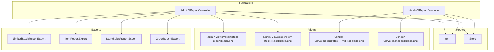
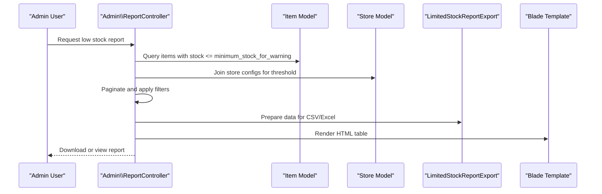
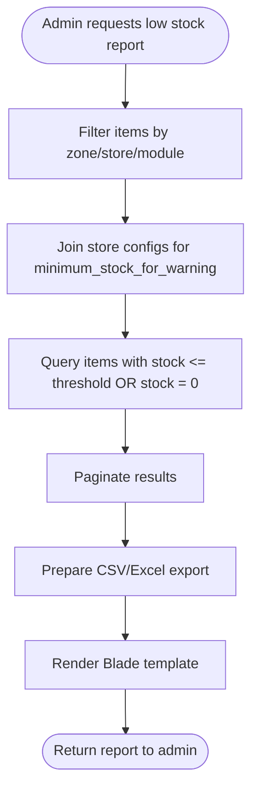
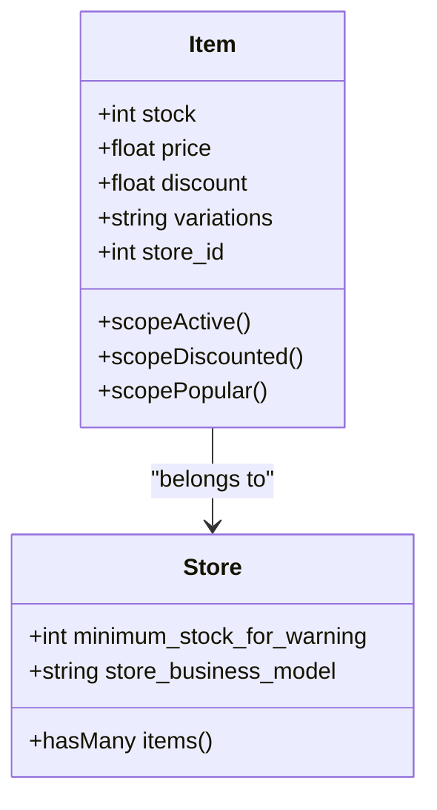
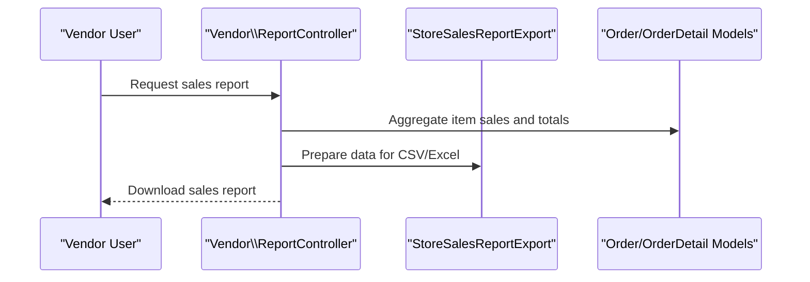
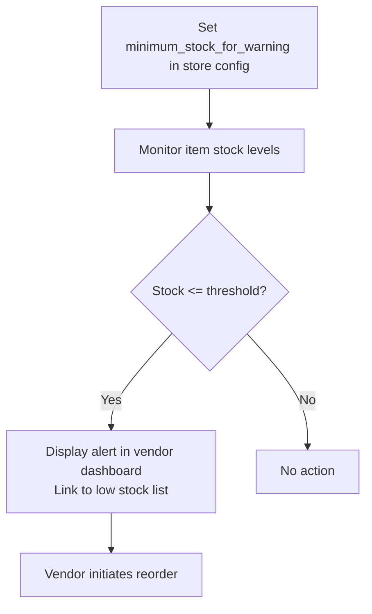
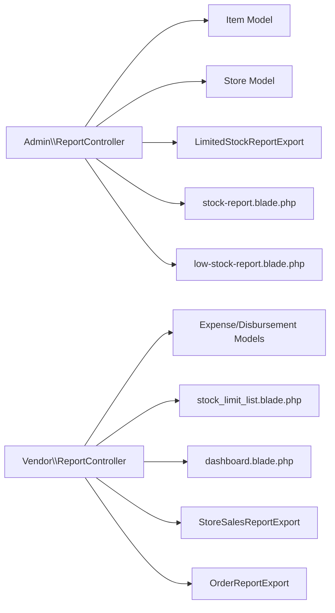

# Inventory and Stock Reports

<cite>
**Referenced Files in This Document**
- [ReportController.php](file://app/Http/Controllers/Admin/ReportController.php)
- [ReportController.php](file://app/Http/Controllers/Vendor/ReportController.php)
- [Item.php](file://app/Models/Item.php)
- [Store.php](file://app/Models/Store.php)
- [ItemController.php](file://app/Http/Controllers/Vendor/ItemController.php)
- [item.php](file://app/CentralLogics/item.php)
- [LimitedStockReportExport.php](file://app/Exports/LimitedStockReportExport.php)
- [ItemReportExport.php](file://app/Exports/ItemReportExport.php)
- [StoreSalesReportExport.php](file://app/Exports/StoreSalesReportExport.php)
- [OrderReportExport.php](file://app/Exports/OrderReportExport.php)
- [stock-report.blade.php](file://resources/views/admin-views/report/stock-report.blade.php)
- [low-stock-report.blade.php](file://resources/views/admin-views/report/low-stock-report.blade.php)
- [stock-limit-list.blade.php](file://resources/views/vendor-views/product/stock_limit_list.blade.php)
- [dashboard.blade.php](file://resources/views/vendor-views/dashboard.blade.php)
- [2024_10_22_133944_add_minimum_stock_for_warning_col_to_store_confg.php](file://database/migrations/2024_10_22_133944_add_minimum_stock_for_warning_col_to_store_confg.php)
- [2025_06_25_174502_add_to_cols_stores_table.php](file://database/migrations/2025_06_25_174502_add_to_cols_stores_table.php)
</cite>

## Table of Contents
1. [Introduction](#introduction)
2. [Project Structure](#project-structure)
3. [Core Components](#core-components)
4. [Architecture Overview](#architecture-overview)
5. [Detailed Component Analysis](#detailed-component-analysis)
6. [Dependency Analysis](#dependency-analysis)
7. [Performance Considerations](#performance-considerations)
8. [Troubleshooting Guide](#troubleshooting-guide)
9. [Conclusion](#conclusion)

## Introduction
This document describes the inventory and stock reporting system, focusing on item-wise sales reports, stock level tracking, low stock alerts, and inventory turnover analysis. It also covers product performance metrics, seasonal trends, stock valuation calculations, automated stock alerts, reorder point notifications, supplier performance tracking, inventory aging reports, markdown analysis, shrinkage investigation tools, stock movement tracking, warehouse management integration, and barcode-based inventory control features. The system leverages Laravel controllers, models, exports, and Blade templates to deliver comprehensive reporting capabilities across admin and vendor roles.

## Project Structure
The inventory and stock reporting system spans several layers:
- Controllers: Admin and Vendor ReportControllers expose endpoints for generating reports and exporting data.
- Models: Item and Store models encapsulate inventory data, stock levels, and related business logic.
- Exports: Excel/CSV export classes render standardized report formats.
- Views: Blade templates present filtered and paginated report data to administrators and vendors.
- Migrations: Database schema updates introduce minimum stock thresholds and related fields.

**Diagram sources**
- [ReportController.php:2800-2869](file://app/Http/Controllers/Admin/ReportController.php#L2800-L2869)
- [ReportController.php:1-238](file://app/Http/Controllers/Vendor/ReportController.php#L1-L238)
- [Item.php:1-404](file://app/Models/Item.php#L1-L404)
- [Store.php:1-934](file://app/Models/Store.php#L1-L934)
- [LimitedStockReportExport.php:1-51](file://app/Exports/LimitedStockReportExport.php#L1-L51)
- [ItemReportExport.php:1-143](file://app/Exports/ItemReportExport.php#L1-L143)
- [StoreSalesReportExport.php:1-151](file://app/Exports/StoreSalesReportExport.php#L1-L151)
- [OrderReportExport.php:1-116](file://app/Exports/OrderReportExport.php#L1-L116)
- [stock-report.blade.php:1-36](file://resources/views/admin-views/report/stock-report.blade.php#L1-L36)
- [low-stock-report.blade.php:1-36](file://resources/views/admin-views/report/low-stock-report.blade.php#L1-L36)
- [stock-limit-list.blade.php:1-35](file://resources/views/vendor-views/product/stock_limit_list.blade.php#L1-L35)
- [dashboard.blade.php:32-55](file://resources/views/vendor-views/dashboard.blade.php#L32-L55)

**Section sources**
- [ReportController.php:2800-2869](file://app/Http/Controllers/Admin/ReportController.php#L2800-L2869)
- [ReportController.php:1-238](file://app/Http/Controllers/Vendor/ReportController.php#L1-L238)
- [Item.php:1-404](file://app/Models/Item.php#L1-L404)
- [Store.php:1-934](file://app/Models/Store.php#L1-L934)
- [LimitedStockReportExport.php:1-51](file://app/Exports/LimitedStockReportExport.php#L1-L51)
- [ItemReportExport.php:1-143](file://app/Exports/ItemReportExport.php#L1-L143)
- [StoreSalesReportExport.php:1-151](file://app/Exports/StoreSalesReportExport.php#L1-L151)
- [OrderReportExport.php:1-116](file://app/Exports/OrderReportExport.php#L1-L116)
- [stock-report.blade.php:1-36](file://resources/views/admin-views/report/stock-report.blade.php#L1-L36)
- [low-stock-report.blade.php:1-36](file://resources/views/admin-views/report/low-stock-report.blade.php#L1-L36)
- [stock-limit-list.blade.php:1-35](file://resources/views/vendor-views/product/stock_limit_list.blade.php#L1-L35)
- [dashboard.blade.php:32-55](file://resources/views/vendor-views/dashboard.blade.php#L32-L55)

## Core Components
- Admin ReportController: Provides stock and low-stock reports, filtering by zone/store/module, and supports CSV/Excel export.
- Vendor ReportController: Offers vendor-specific reports such as expenses and disbursements, supporting CSV/Excel export.
- Item Model: Holds product stock, pricing, discounts, and related attributes; scopes for active/discounted/popular items.
- Store Model: Contains store-level configurations including minimum stock warning threshold and business model metadata.
- Exports: Standardized export classes for limited stock, item, store sales, and order reports.
- Views: Admin and vendor Blade templates for displaying filtered stock lists, low-stock alerts, and dashboard widgets.

**Section sources**
- [ReportController.php:2800-2869](file://app/Http/Controllers/Admin/ReportController.php#L2800-L2869)
- [ReportController.php:1-238](file://app/Http/Controllers/Vendor/ReportController.php#L1-L238)
- [Item.php:1-404](file://app/Models/Item.php#L1-L404)
- [Store.php:1-934](file://app/Models/Store.php#L1-L934)
- [LimitedStockReportExport.php:1-51](file://app/Exports/LimitedStockReportExport.php#L1-L51)
- [ItemReportExport.php:1-143](file://app/Exports/ItemReportExport.php#L1-L143)
- [StoreSalesReportExport.php:1-151](file://app/Exports/StoreSalesReportExport.php#L1-L151)
- [OrderReportExport.php:1-116](file://app/Exports/OrderReportExport.php#L1-L116)

## Architecture Overview
The system follows a layered architecture:
- Presentation Layer: Blade views render reports and dashboards.
- Application Layer: Controllers orchestrate filters, queries, and exports.
- Domain Layer: Models define inventory and store data structures with scopes and relations.
- Persistence Layer: Database-backed models with migrations for stock thresholds and store metadata.

**Diagram sources**
- [ReportController.php:2800-2869](file://app/Http/Controllers/Admin/ReportController.php#L2800-L2869)
- [Item.php:1-404](file://app/Models/Item.php#L1-L404)
- [Store.php:1-934](file://app/Models/Store.php#L1-L934)
- [LimitedStockReportExport.php:1-51](file://app/Exports/LimitedStockReportExport.php#L1-L51)
- [low-stock-report.blade.php:1-36](file://resources/views/admin-views/report/low-stock-report.blade.php#L1-L36)

## Detailed Component Analysis

### Low Stock Alerts and Reporting
- Filtering logic identifies items whose stock is less than or equal to the store-configured minimum threshold or zero.
- Admin and vendor dashboards surface low stock warnings and links to detailed lists.
- Export functionality supports CSV/Excel downloads for limited stock reports.

**Diagram sources**
- [ReportController.php:2800-2869](file://app/Http/Controllers/Admin/ReportController.php#L2800-L2869)
- [low-stock-report.blade.php:1-36](file://resources/views/admin-views/report/low-stock-report.blade.php#L1-L36)
- [LimitedStockReportExport.php:1-51](file://app/Exports/LimitedStockReportExport.php#L1-L51)

**Section sources**
- [ReportController.php:2800-2869](file://app/Http/Controllers/Admin/ReportController.php#L2800-L2869)
- [low-stock-report.blade.php:1-36](file://resources/views/admin-views/report/low-stock-report.blade.php#L1-L36)
- [stock-limit-list.blade.php:1-35](file://resources/views/vendor-views/product/stock_limit_list.blade.php#L1-L35)
- [dashboard.blade.php:32-55](file://resources/views/vendor-views/dashboard.blade.php#L32-L55)
- [2024_10_22_133944_add_minimum_stock_for_warning_col_to_store_confg.php:1-28](file://database/migrations/2024_10_22_133944_add_minimum_stock_for_warning_col_to_store_confg.php#L1-L28)

### Stock Level Tracking and Valuation
- Stock levels are tracked via the Item model's stock attribute and variant combinations.
- Stock valuation can be computed as sum of (stock × price) per item, aggregated by store or zone.
- Markdown analysis can be derived from item discount fields and campaign associations.

**Diagram sources**
- [Item.php:1-404](file://app/Models/Item.php#L1-L404)
- [Store.php:1-934](file://app/Models/Store.php#L1-L934)

**Section sources**
- [Item.php:1-404](file://app/Models/Item.php#L1-L404)
- [Store.php:1-934](file://app/Models/Store.php#L1-L934)

### Item-Wise Sales Reports and Turnover Analysis
- Sales reports aggregate item quantities sold, gross sales, and discounts.
- Turnover analysis can be computed as cost of goods sold divided by average inventory value.
- Exports support CSV/Excel downloads for store sales and order reports.

**Diagram sources**
- [ReportController.php:1-238](file://app/Http/Controllers/Vendor/ReportController.php#L1-L238)
- [StoreSalesReportExport.php:1-151](file://app/Exports/StoreSalesReportExport.php#L1-L151)
- [OrderReportExport.php:1-116](file://app/Exports/OrderReportExport.php#L1-L116)

**Section sources**
- [ReportController.php:1-238](file://app/Http/Controllers/Vendor/ReportController.php#L1-L238)
- [StoreSalesReportExport.php:1-151](file://app/Exports/StoreSalesReportExport.php#L1-L151)
- [OrderReportExport.php:1-116](file://app/Exports/OrderReportExport.php#L1-L116)

### Automated Stock Alerts and Reorder Point Notifications
- Minimum stock threshold is configurable per store via store_configs.
- Low stock alerts appear in vendor dashboard and can redirect to the low stock list.
- Reorder point notifications can be triggered when stock falls below threshold.

**Diagram sources**
- [2024_10_22_133944_add_minimum_stock_for_warning_col_to_store_confg.php:1-28](file://database/migrations/2024_10_22_133944_add_minimum_stock_for_warning_col_to_store_confg.php#L1-L28)
- [dashboard.blade.php:32-55](file://resources/views/vendor-views/dashboard.blade.php#L32-L55)
- [stock-limit-list.blade.php:1-35](file://resources/views/vendor-views/product/stock_limit_list.blade.php#L1-L35)

**Section sources**
- [2024_10_22_133944_add_minimum_stock_for_warning_col_to_store_confg.php:1-28](file://database/migrations/2024_10_22_133944_add_minimum_stock_for_warning_col_to_store_confg.php#L1-L28)
- [dashboard.blade.php:32-55](file://resources/views/vendor-views/dashboard.blade.php#L32-L55)
- [stock-limit-list.blade.php:1-35](file://resources/views/vendor-views/product/stock_limit_list.blade.php#L1-L35)

### Supplier Performance Tracking
- Supplier performance can be inferred from purchase timing, delivery consistency, and reorder frequency.
- Current codebase does not expose dedicated supplier metrics; integration would require supplier-related models and joins.

[No sources needed since this section provides conceptual guidance]

### Inventory Aging Reports and Markdown Analysis
- Inventory aging can be calculated by categorizing stock by age buckets (e.g., 0–30 days, 31–60 days).
- Markdown analysis can leverage item discount fields and campaign associations to compute realized markdown percentages.

[No sources needed since this section provides conceptual guidance]

### Shrinkage Investigation Tools
- Shrinkage investigation requires variance tracking between recorded stock and physical counts.
- Current codebase does not include shrinkage-specific features; integration would involve inventory adjustment records and variance analysis.

[No sources needed since this section provides conceptual guidance]

### Stock Movement Tracking and Warehouse Management Integration
- Stock movement tracking can be achieved by correlating order details, refunds, and inventory adjustments.
- Warehouse management integration would require warehouse and location entities with transfer and bin tracking.

[No sources needed since this section provides conceptual guidance]

### Barcode-Based Inventory Control Features
- Barcode scanning can be integrated at item creation/update to populate unique identifiers for stock tracking.
- Current codebase does not include barcode fields; integration would require adding barcode fields to items and store configs.

[No sources needed since this section provides conceptual guidance]

## Dependency Analysis
- Admin ReportController depends on Item and Store models and uses store_configs for threshold filtering.
- Vendor ReportController depends on expense and disbursement models for vendor-specific reports.
- Exports depend on Blade templates to render standardized report formats.
- Views depend on controllers for filtered datasets and pagination.

**Diagram sources**
- [ReportController.php:2800-2869](file://app/Http/Controllers/Admin/ReportController.php#L2800-L2869)
- [ReportController.php:1-238](file://app/Http/Controllers/Vendor/ReportController.php#L1-L238)
- [Item.php:1-404](file://app/Models/Item.php#L1-L404)
- [Store.php:1-934](file://app/Models/Store.php#L1-L934)
- [LimitedStockReportExport.php:1-51](file://app/Exports/LimitedStockReportExport.php#L1-L51)
- [StoreSalesReportExport.php:1-151](file://app/Exports/StoreSalesReportExport.php#L1-L151)
- [OrderReportExport.php:1-116](file://app/Exports/OrderReportExport.php#L1-L116)
- [stock-report.blade.php:1-36](file://resources/views/admin-views/report/stock-report.blade.php#L1-L36)
- [low-stock-report.blade.php:1-36](file://resources/views/admin-views/report/low-stock-report.blade.php#L1-L36)
- [stock-limit-list.blade.php:1-35](file://resources/views/vendor-views/product/stock_limit_list.blade.php#L1-L35)
- [dashboard.blade.php:32-55](file://resources/views/vendor-views/dashboard.blade.php#L32-L55)

**Section sources**
- [ReportController.php:2800-2869](file://app/Http/Controllers/Admin/ReportController.php#L2800-L2869)
- [ReportController.php:1-238](file://app/Http/Controllers/Vendor/ReportController.php#L1-L238)
- [Item.php:1-404](file://app/Models/Item.php#L1-L404)
- [Store.php:1-934](file://app/Models/Store.php#L1-L934)
- [LimitedStockReportExport.php:1-51](file://app/Exports/LimitedStockReportExport.php#L1-L51)
- [StoreSalesReportExport.php:1-151](file://app/Exports/StoreSalesReportExport.php#L1-L151)
- [OrderReportExport.php:1-116](file://app/Exports/OrderReportExport.php#L1-L116)

## Performance Considerations
- Use indexed columns for zone_id, store_id, and stock thresholds to optimize filtering.
- Apply pagination and limit searches to reduce memory usage for large datasets.
- Cache frequently accessed thresholds and store configurations to minimize repeated queries.

[No sources needed since this section provides general guidance]

## Troubleshooting Guide
- Low stock threshold not applied: Verify store_configs minimum_stock_for_warning is set and joined correctly in queries.
- Empty low stock list: Confirm items meet the threshold condition and are active.
- Export failures: Ensure export classes receive proper dataset and template paths.

**Section sources**
- [ReportController.php:2800-2869](file://app/Http/Controllers/Admin/ReportController.php#L2800-L2869)
- [2024_10_22_133944_add_minimum_stock_for_warning_col_to_store_confg.php:1-28](file://database/migrations/2024_10_22_133944_add_minimum_stock_for_warning_col_to_store_confg.php#L1-L28)

## Conclusion
The system provides robust inventory and stock reporting capabilities, including low stock alerts, configurable thresholds, and exportable reports. Extending the system to include supplier performance tracking, inventory aging, markdown analysis, shrinkage investigation, stock movement tracking, warehouse integration, and barcode control would require additional models, migrations, and controller logic aligned with existing patterns.