# Reporting and Analytics

<cite>
**Referenced Files in This Document**
- [ReportFilter.php](file://app/Traits/ReportFilter.php)
- [StoreSalesReportExport.php](file://app/Exports/StoreSalesReportExport.php)
- [ExpenseReportExport.php](file://app/Exports/ExpenseReportExport.php)
- [OrderReportExport.php](file://app/Exports/OrderReportExport.php)
- [store-summary-report.blade.php](file://resources/views/admin-views/report/store-summary-report.blade.php)
- [expense-report.blade.php](file://resources/views/admin-views/report/expense-report.blade.php)
- [dashboard-users.blade.php](file://resources/views/admin-views/dashboard-users.blade.php)
- [dashboard.blade.php](file://resources/views/admin-views/dashboard.blade.php)
- [_business-overview-chart.blade.php](file://resources/views/admin-views/partials/_business-overview-chart.blade.php)
- [customer-loyalty-transaction.blade.php](file://resources/views/file-exports/customer-loyalty-transaction.blade.php)
- [customer-list.blade.php](file://resources/views/file-exports/customer-list.blade.php)
- [disbursement-report.blade.php](file://resources/views/file-exports/disbursement-report.blade.php)
- [disbursement-vendor-report.blade.php](file://resources/views/file-exports/disbursement-vendor-report.blade.php)
- [AdminTaxReportController.php](file://app/Http/Controllers/Admin/AdminTaxReportController.php)
- [DashboardController.php](file://app/Http/Controllers/Admin/DashboardController.php)
- [SearchRoutingController.php](file://app/Http/Controllers/Admin/SearchRoutingController.php)
- [excel.php](file://config/excel.php)
- [dompdf.php](file://config/dompdf.php)
</cite>

## Table of Contents
1. [Introduction](#introduction)
2. [Project Structure](#project-structure)
3. [Core Components](#core-components)
4. [Architecture Overview](#architecture-overview)
5. [Detailed Component Analysis](#detailed-component-analysis)
6. [Dependency Analysis](#dependency-analysis)
7. [Performance Considerations](#performance-considerations)
8. [Troubleshooting Guide](#troubleshooting-guide)
9. [Conclusion](#conclusion)
10. [Appendices](#appendices)

## Introduction
This document describes the reporting and analytics system, covering business dashboards, performance metrics, financial reports, and export functionality. It explains how reports are generated, aggregated, filtered, visualized, exported, and distributed. Pre-built reports include store summaries, sales, expenses, customer analytics, and operational metrics. The system supports Excel and CSV exports, customizable date filters, and integrates with frontend charts and BI tools via standard export formats.

## Project Structure
The reporting system spans backend export classes, Blade report templates, controller logic for aggregations, and frontend visualization. Key areas:
- Backend exports: located under app/Exports for structured report generation.
- Frontend reports: Blade views under resources/views/admin-views/report and resources/views/file-exports for rendered exports.
- Filters and scopes: shared trait for applying date and relationship filters.
- Controllers: compute KPIs, aggregates, and pass data to views and exports.
- Configuration: export formats and rendering engines configured in config/excel.php and config/dompdf.php.

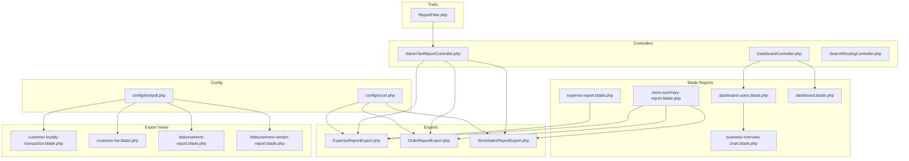

**Diagram sources**
- [AdminTaxReportController.php](file://app/Http/Controllers/Admin/AdminTaxReportController.php)
- [DashboardController.php](file://app/Http/Controllers/Admin/DashboardController.php)
- [SearchRoutingController.php](file://app/Http/Controllers/Admin/SearchRoutingController.php)
- [ReportFilter.php](file://app/Traits/ReportFilter.php)
- [ExpenseReportExport.php](file://app/Exports/ExpenseReportExport.php)
- [OrderReportExport.php](file://app/Exports/OrderReportExport.php)
- [StoreSalesReportExport.php](file://app/Exports/StoreSalesReportExport.php)
- [store-summary-report.blade.php](file://resources/views/admin-views/report/store-summary-report.blade.php)
- [expense-report.blade.php](file://resources/views/admin-views/report/expense-report.blade.php)
- [dashboard-users.blade.php](file://resources/views/admin-views/dashboard-users.blade.php)
- [dashboard.blade.php](file://resources/views/admin-views/dashboard.blade.php)
- [_business-overview-chart.blade.php](file://resources/views/admin-views/partials/_business-overview-chart.blade.php)
- [customer-loyalty-transaction.blade.php](file://resources/views/file-exports/customer-loyalty-transaction.blade.php)
- [customer-list.blade.php](file://resources/views/file-exports/customer-list.blade.php)
- [disbursement-report.blade.php](file://resources/views/file-exports/disbursement-report.blade.php)
- [disbursement-vendor-report.blade.php](file://resources/views/file-exports/disbursement-vendor-report.blade.php)
- [excel.php](file://config/excel.php)
- [dompdf.php](file://config/dompdf.php)

**Section sources**
- [ReportFilter.php:1-49](file://app/Traits/ReportFilter.php#L1-L49)
- [StoreSalesReportExport.php:1-151](file://app/Exports/StoreSalesReportExport.php#L1-L151)
- [ExpenseReportExport.php:1-127](file://app/Exports/ExpenseReportExport.php#L1-L127)
- [OrderReportExport.php:1-116](file://app/Exports/OrderReportExport.php#L1-L116)
- [store-summary-report.blade.php:1-447](file://resources/views/admin-views/report/store-summary-report.blade.php#L1-L447)
- [expense-report.blade.php:108-203](file://resources/views/admin-views/report/expense-report.blade.php#L108-L203)
- [dashboard-users.blade.php:139-634](file://resources/views/admin-views/dashboard-users.blade.php#L139-L634)
- [dashboard.blade.php:413-456](file://resources/views/admin-views/dashboard.blade.php#L413-L456)
- [_business-overview-chart.blade.php:1-44](file://resources/views/admin-views/partials/_business-overview-chart.blade.php#L1-L44)
- [customer-loyalty-transaction.blade.php:26-62](file://resources/views/file-exports/customer-loyalty-transaction.blade.php#L26-L62)
- [customer-list.blade.php:1-18](file://resources/views/file-exports/customer-list.blade.php#L1-L18)
- [disbursement-report.blade.php:2-23](file://resources/views/file-exports/disbursement-report.blade.php#L2-L23)
- [disbursement-vendor-report.blade.php:2-43](file://resources/views/file-exports/disbursement-vendor-report.blade.php#L2-L43)
- [AdminTaxReportController.php:597-629](file://app/Http/Controllers/Admin/AdminTaxReportController.php#L597-L629)
- [DashboardController.php:752-764](file://app/Http/Controllers/Admin/DashboardController.php#L752-L764)
- [SearchRoutingController.php:748-775](file://app/Http/Controllers/Admin/SearchRoutingController.php#L748-L775)
- [excel.php](file://config/excel.php)
- [dompdf.php](file://config/dompdf.php)

## Core Components
- ReportFilter trait: Provides reusable scopes to filter by date ranges and perform relationship-based searches across models.
- Export classes: Implement FromView and related concerns to render Blade templates into Excel/CSV with styling and alignment.
- Report Blade pages: Present dashboards, KPI cards, charts, and paginated tables with export dropdowns.
- Controllers: Compute aggregated metrics, apply filters, and pass data to views and exports.
- Export views: Dedicated Blade templates for PDF-based exports of lists and analytics.

Key capabilities:
- Date filters: this year, previous year, this month, this week, and custom date ranges.
- Relationship search: search across related model fields.
- Export formats: Excel and CSV via Laravel Excel; PDF via DOMPDF for specific lists.
- Visualizations: Chart.js and ApexCharts for interactive dashboards.

**Section sources**
- [ReportFilter.php:9-27](file://app/Traits/ReportFilter.php#L9-L27)
- [ReportFilter.php:29-42](file://app/Traits/ReportFilter.php#L29-L42)
- [StoreSalesReportExport.php:21-77](file://app/Exports/StoreSalesReportExport.php#L21-L77)
- [ExpenseReportExport.php:20-76](file://app/Exports/ExpenseReportExport.php#L20-L76)
- [OrderReportExport.php:18-76](file://app/Exports/OrderReportExport.php#L18-L76)
- [store-summary-report.blade.php:42-67](file://resources/views/admin-views/report/store-summary-report.blade.php#L42-L67)
- [expense-report.blade.php:108-119](file://resources/views/admin-views/report/expense-report.blade.php#L108-L119)
- [customer-loyalty-transaction.blade.php:26-62](file://resources/views/file-exports/customer-loyalty-transaction.blade.php#L26-L62)
- [customer-list.blade.php:1-18](file://resources/views/file-exports/customer-list.blade.php#L1-L18)
- [disbursement-report.blade.php:2-23](file://resources/views/file-exports/disbursement-report.blade.php#L2-L23)
- [disbursement-vendor-report.blade.php:2-43](file://resources/views/file-exports/disbursement-vendor-report.blade.php#L2-L43)

## Architecture Overview
The system follows a layered pattern:
- Presentation: Blade report pages and dashboards.
- Business logic: Controllers compute KPIs and apply filters.
- Data access: Eloquent queries with scopes from ReportFilter.
- Rendering: Blade templates for HTML/Excel/PDF exports.
- Configuration: Export engine settings in config files.

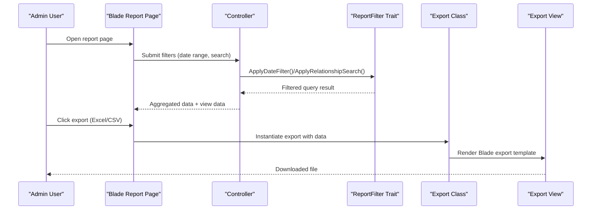

**Diagram sources**
- [store-summary-report.blade.php:242-261](file://resources/views/admin-views/report/store-summary-report.blade.php#L242-L261)
- [expense-report.blade.php:185-203](file://resources/views/admin-views/report/expense-report.blade.php#L185-L203)
- [ReportFilter.php:9-27](file://app/Traits/ReportFilter.php#L9-L27)
- [ExpenseReportExport.php:26-35](file://app/Exports/ExpenseReportExport.php#L26-L35)
- [OrderReportExport.php:23-31](file://app/Exports/OrderReportExport.php#L23-L31)
- [StoreSalesReportExport.php:27-35](file://app/Exports/StoreSalesReportExport.php#L27-L35)

## Detailed Component Analysis

### ReportFilter Trait
Provides two reusable scopes:
- ApplyDateFilter: supports custom date ranges, this year, this month, previous year, and this week.
- ApplyRelationShipSearch: performs OR-like searches across related model attributes.

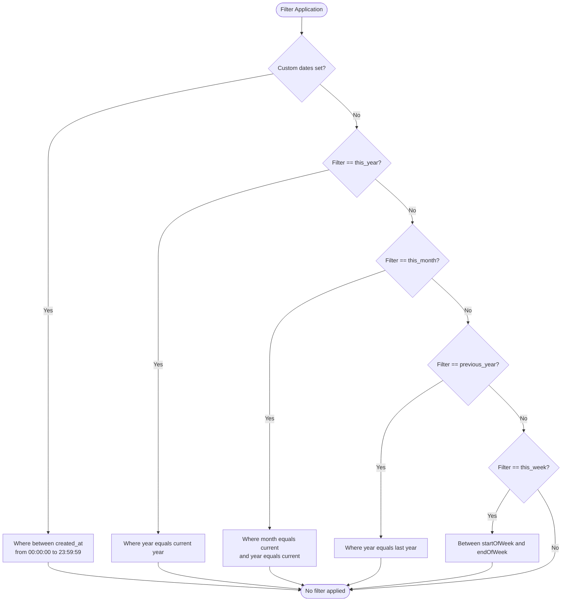

**Diagram sources**
- [ReportFilter.php:9-27](file://app/Traits/ReportFilter.php#L9-L27)

**Section sources**
- [ReportFilter.php:9-27](file://app/Traits/ReportFilter.php#L9-L27)
- [ReportFilter.php:29-42](file://app/Traits/ReportFilter.php#L29-L42)

### Store Sales Report Export
Implements Excel export with:
- FromView rendering a dedicated Blade export template.
- Styles, alignments, merged cells, borders, and dynamic image insertion per row.
- Column widths and auto-size behavior.

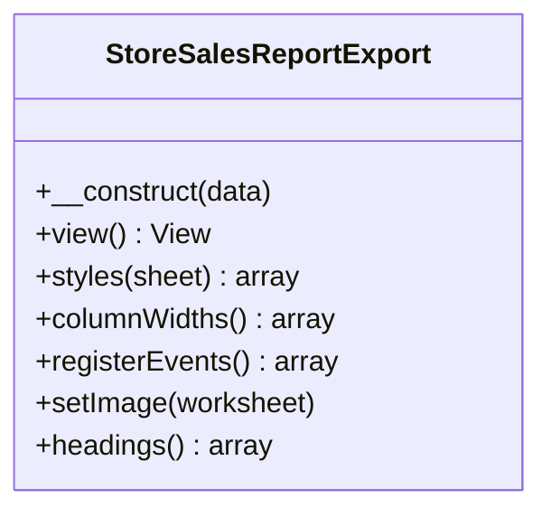

**Diagram sources**
- [StoreSalesReportExport.php:21-149](file://app/Exports/StoreSalesReportExport.php#L21-L149)

**Section sources**
- [StoreSalesReportExport.php:21-149](file://app/Exports/StoreSalesReportExport.php#L21-L149)

### Expense Report Export
Implements Excel export for expense analytics with:
- FromView rendering a dedicated Blade export template.
- Styles and alignment for header rows and data area.
- Merged cells and row height adjustments.

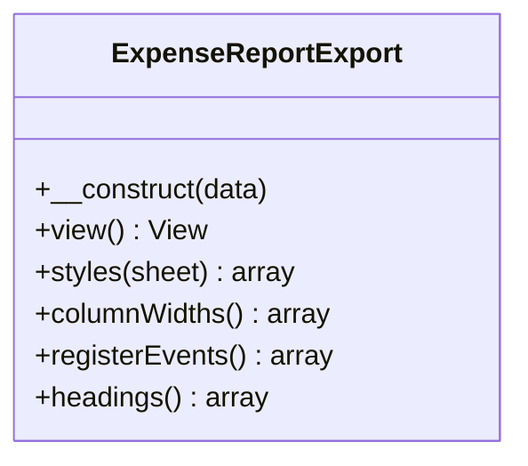

**Diagram sources**
- [ExpenseReportExport.php:20-124](file://app/Exports/ExpenseReportExport.php#L20-L124)

**Section sources**
- [ExpenseReportExport.php:20-124](file://app/Exports/ExpenseReportExport.php#L20-L124)

### Order Report Export
Implements Excel export for order analytics with:
- FromView rendering a dedicated Blade export template.
- Styles and alignment for header rows and data area.
- Merged cells and row height adjustments.

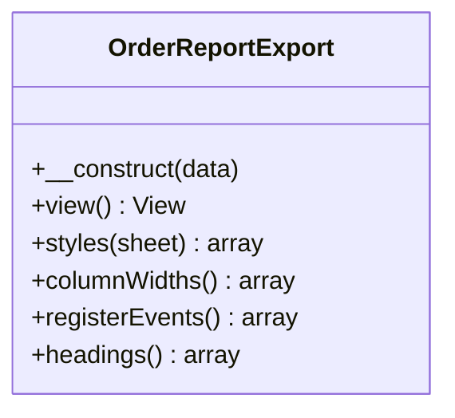

**Diagram sources**
- [OrderReportExport.php:18-114](file://app/Exports/OrderReportExport.php#L18-L114)

**Section sources**
- [OrderReportExport.php:18-114](file://app/Exports/OrderReportExport.php#L18-L114)

### Store Summary Report Page
Presents:
- Filter controls for time frames (all_time, this_year, previous_year, this_month, this_week).
- KPI cards for registered stores, total orders, and item counts.
- Bar chart for order counts by period.
- Doughnut chart for payment method distribution.
- Paginated table with completion/cancel/refund rates.
- Export dropdown for Excel/CSV.

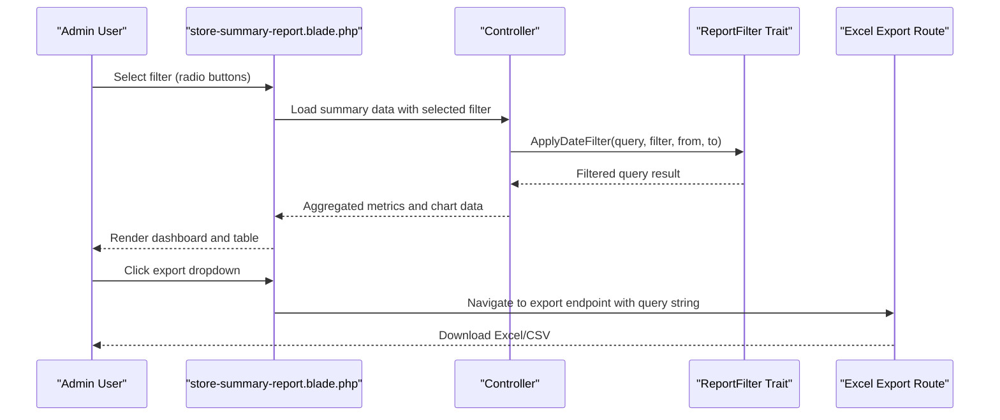

**Diagram sources**
- [store-summary-report.blade.php:42-67](file://resources/views/admin-views/report/store-summary-report.blade.php#L42-L67)
- [store-summary-report.blade.php:242-261](file://resources/views/admin-views/report/store-summary-report.blade.php#L242-L261)
- [ReportFilter.php:9-27](file://app/Traits/ReportFilter.php#L9-L27)

**Section sources**
- [store-summary-report.blade.php:42-67](file://resources/views/admin-views/report/store-summary-report.blade.php#L42-L67)
- [store-summary-report.blade.php:110-218](file://resources/views/admin-views/report/store-summary-report.blade.php#L110-L218)
- [store-summary-report.blade.php:242-261](file://resources/views/admin-views/report/store-summary-report.blade.php#L242-L261)

### Expense Report Page
Provides:
- Filter controls for predefined periods and custom date range.
- Export dropdown for Excel/CSV.

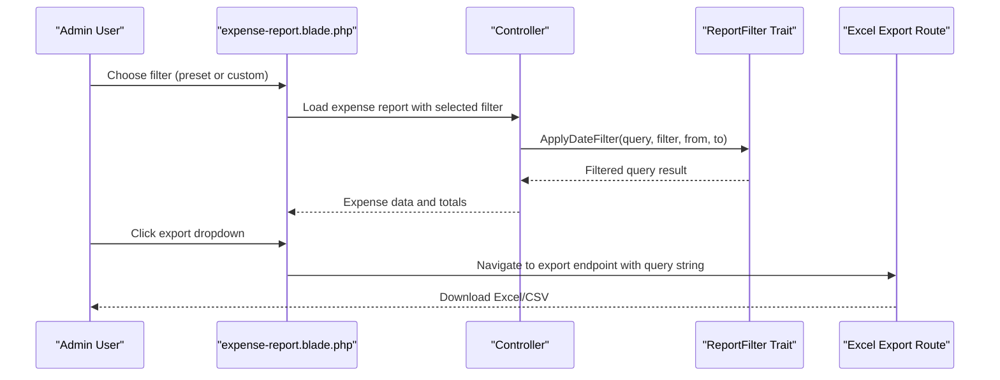

**Diagram sources**
- [expense-report.blade.php:108-119](file://resources/views/admin-views/report/expense-report.blade.php#L108-L119)
- [expense-report.blade.php:185-203](file://resources/views/admin-views/report/expense-report.blade.php#L185-L203)
- [ReportFilter.php:9-27](file://app/Traits/ReportFilter.php#L9-L27)

**Section sources**
- [expense-report.blade.php:108-119](file://resources/views/admin-views/report/expense-report.blade.php#L108-L119)
- [expense-report.blade.php:185-203](file://resources/views/admin-views/report/expense-report.blade.php#L185-L203)

### Dashboards and Visualizations
- User Growth Dashboard: Area chart showing monthly new customer growth.
- General Dashboard: Area chart for gross sale trends.
- Business Overview Partial: Doughnut chart for business segments.

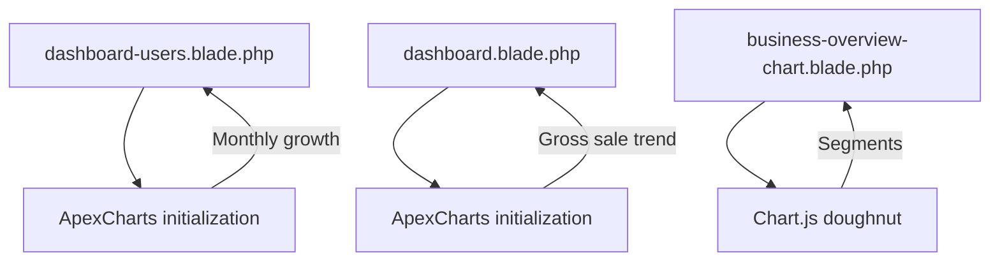

**Diagram sources**
- [dashboard-users.blade.php:582-634](file://resources/views/admin-views/dashboard-users.blade.php#L582-L634)
- [dashboard.blade.php:413-456](file://resources/views/admin-views/dashboard.blade.php#L413-L456)
- [_business-overview-chart.blade.php:14-43](file://resources/views/admin-views/partials/_business-overview-chart.blade.php#L14-L43)

**Section sources**
- [dashboard-users.blade.php:139-634](file://resources/views/admin-views/dashboard-users.blade.php#L139-L634)
- [dashboard.blade.php:413-456](file://resources/views/admin-views/dashboard.blade.php#L413-L456)
- [_business-overview-chart.blade.php:1-44](file://resources/views/admin-views/partials/_business-overview-chart.blade.php#L1-L44)

### Export Views for Lists and Analytics
- Customer Loyalty Transaction Export: Analytics summary and transaction table.
- Customer List Export: Counts for total, active, and inactive customers.
- Disbursement Reports: Filter criteria and date range display.
- Disbursement Vendor Report: Filter criteria and status display.

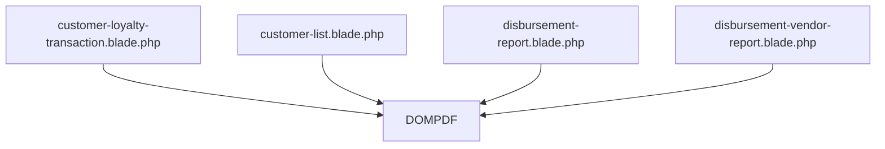

**Diagram sources**
- [customer-loyalty-transaction.blade.php:26-62](file://resources/views/file-exports/customer-loyalty-transaction.blade.php#L26-L62)
- [customer-list.blade.php:1-18](file://resources/views/file-exports/customer-list.blade.php#L1-L18)
- [disbursement-report.blade.php:2-23](file://resources/views/file-exports/disbursement-report.blade.php#L2-L23)
- [disbursement-vendor-report.blade.php:2-43](file://resources/views/file-exports/disbursement-vendor-report.blade.php#L2-L43)

**Section sources**
- [customer-loyalty-transaction.blade.php:26-62](file://resources/views/file-exports/customer-loyalty-transaction.blade.php#L26-L62)
- [customer-list.blade.php:1-18](file://resources/views/file-exports/customer-list.blade.php#L1-L18)
- [disbursement-report.blade.php:2-23](file://resources/views/file-exports/disbursement-report.blade.php#L2-L23)
- [disbursement-vendor-report.blade.php:2-43](file://resources/views/file-exports/disbursement-vendor-report.blade.php#L2-L43)

### Controllers: Aggregation and Filtering
- AdminTaxReportController: Computes tax amounts per transaction and aggregates totals for a given date range.
- DashboardController: Builds monthly commission overview for dashboards.
- SearchRoutingController: Routes search keywords to relevant report pages.

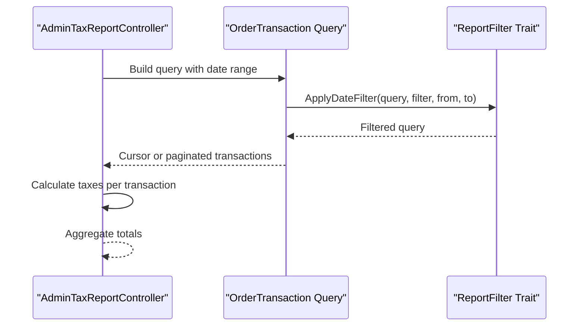

**Diagram sources**
- [AdminTaxReportController.php:597-629](file://app/Http/Controllers/Admin/AdminTaxReportController.php#L597-L629)
- [ReportFilter.php:9-27](file://app/Traits/ReportFilter.php#L9-L27)

**Section sources**
- [AdminTaxReportController.php:597-629](file://app/Http/Controllers/Admin/AdminTaxReportController.php#L597-L629)
- [DashboardController.php:752-764](file://app/Http/Controllers/Admin/DashboardController.php#L752-L764)
- [SearchRoutingController.php:748-775](file://app/Http/Controllers/Admin/SearchRoutingController.php#L748-L775)

## Dependency Analysis
- Export classes depend on Blade export templates for rendering.
- Report pages depend on controllers for data and on ReportFilter for query scoping.
- Visualization scripts depend on chart libraries loaded in Blade pages.
- Export functionality depends on Laravel Excel and DOMPDF configurations.

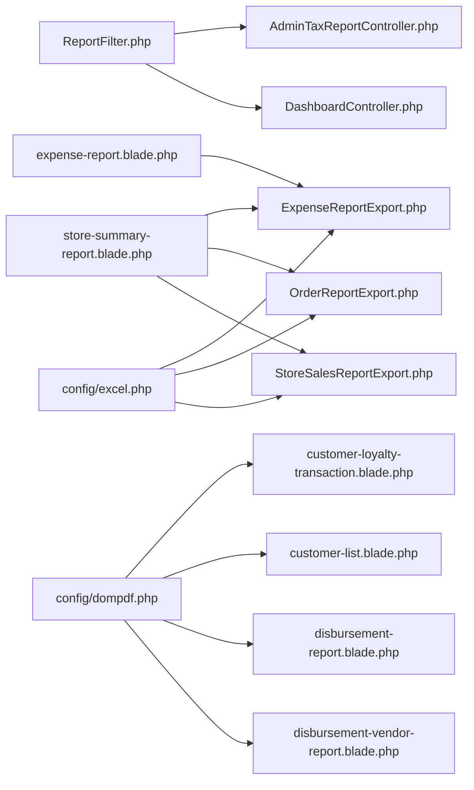

**Diagram sources**
- [ReportFilter.php:9-27](file://app/Traits/ReportFilter.php#L9-L27)
- [AdminTaxReportController.php:597-629](file://app/Http/Controllers/Admin/AdminTaxReportController.php#L597-L629)
- [DashboardController.php:752-764](file://app/Http/Controllers/Admin/DashboardController.php#L752-L764)
- [store-summary-report.blade.php:242-261](file://resources/views/admin-views/report/store-summary-report.blade.php#L242-L261)
- [expense-report.blade.php:185-203](file://resources/views/admin-views/report/expense-report.blade.php#L185-L203)
- [ExpenseReportExport.php:20-124](file://app/Exports/ExpenseReportExport.php#L20-L124)
- [OrderReportExport.php:18-116](file://app/Exports/OrderReportExport.php#L18-L116)
- [StoreSalesReportExport.php:21-149](file://app/Exports/StoreSalesReportExport.php#L21-L149)
- [excel.php](file://config/excel.php)
- [dompdf.php](file://config/dompdf.php)
- [customer-loyalty-transaction.blade.php:26-62](file://resources/views/file-exports/customer-loyalty-transaction.blade.php#L26-L62)
- [customer-list.blade.php:1-18](file://resources/views/file-exports/customer-list.blade.php#L1-L18)
- [disbursement-report.blade.php:2-23](file://resources/views/file-exports/disbursement-report.blade.php#L2-L23)
- [disbursement-vendor-report.blade.php:2-43](file://resources/views/file-exports/disbursement-vendor-report.blade.php#L2-L43)

**Section sources**
- [ReportFilter.php:9-27](file://app/Traits/ReportFilter.php#L9-L27)
- [ExpenseReportExport.php:20-124](file://app/Exports/ExpenseReportExport.php#L20-L124)
- [OrderReportExport.php:18-116](file://app/Exports/OrderReportExport.php#L18-L116)
- [StoreSalesReportExport.php:21-149](file://app/Exports/StoreSalesReportExport.php#L21-L149)
- [store-summary-report.blade.php:242-261](file://resources/views/admin-views/report/store-summary-report.blade.php#L242-L261)
- [expense-report.blade.php:185-203](file://resources/views/admin-views/report/expense-report.blade.php#L185-L203)
- [excel.php](file://config/excel.php)
- [dompdf.php](file://config/dompdf.php)

## Performance Considerations
- Prefer cursor-based iteration for large exports to reduce memory overhead.
- Use pagination for report listings to avoid heavy page loads.
- Minimize N+1 queries by eager-loading relations in report queries.
- Apply date filters early to reduce dataset size before aggregation.
- Leverage built-in Excel styling and alignment to avoid client-side rendering overhead.

[No sources needed since this section provides general guidance]

## Troubleshooting Guide
- Export downloads blank or corrupted files:
  - Verify Laravel Excel configuration and ensure proper headers are sent.
  - Confirm export view templates render without fatal errors.
- Charts not displaying:
  - Ensure chart libraries are loaded and DOM elements exist.
  - Check that data arrays passed to charts are non-empty.
- Incorrect date range filtering:
  - Validate filter parameters and confirm ApplyDateFilter usage in controllers.
- Export formats missing:
  - Confirm Excel and DOMPDF configurations are present and correct.

**Section sources**
- [excel.php](file://config/excel.php)
- [dompdf.php](file://config/dompdf.php)
- [ReportFilter.php:9-27](file://app/Traits/ReportFilter.php#L9-L27)
- [store-summary-report.blade.php:414-442](file://resources/views/admin-views/report/store-summary-report.blade.php#L414-L442)

## Conclusion
The reporting and analytics system combines robust backend aggregation, flexible date and relationship filtering, and rich frontend visualizations. It supports Excel and CSV exports for most analytical reports and PDF exports for specific lists. The modular design allows easy extension to new report types and integration with external BI tools via standardized export formats.

[No sources needed since this section summarizes without analyzing specific files]

## Appendices

### Pre-Built Reports and Capabilities
- Store Summary Report: Registered stores, total orders, items, payment method distribution, and export.
- Store Sales Report: Sales analytics with styled Excel export.
- Expense Report: Operational expense analytics with export.
- Customer Analytics: Customer list and loyalty transaction analytics.
- Operational Metrics: Dashboards for user growth, gross sales, and business segments.

**Section sources**
- [store-summary-report.blade.php:1-447](file://resources/views/admin-views/report/store-summary-report.blade.php#L1-L447)
- [StoreSalesReportExport.php:1-151](file://app/Exports/StoreSalesReportExport.php#L1-L151)
- [ExpenseReportExport.php:1-127](file://app/Exports/ExpenseReportExport.php#L1-L127)
- [customer-list.blade.php:1-18](file://resources/views/file-exports/customer-list.blade.php#L1-L18)
- [customer-loyalty-transaction.blade.php:26-62](file://resources/views/file-exports/customer-loyalty-transaction.blade.php#L26-L62)
- [dashboard-users.blade.php:139-634](file://resources/views/admin-views/dashboard-users.blade.php#L139-L634)
- [dashboard.blade.php:413-456](file://resources/views/admin-views/dashboard.blade.php#L413-L456)
- [_business-overview-chart.blade.php:1-44](file://resources/views/admin-views/partials/_business-overview-chart.blade.php#L1-L44)

### Export Formats and Distribution
- Excel: Implemented via Laravel Excel with styled sheets and merged cells.
- CSV: Provided alongside Excel for quick ingestion.
- PDF: Used for customer and disbursement reports via DOMPDF.
- Distribution: Export links embedded in report pages; users download files directly.

**Section sources**
- [ExpenseReportExport.php:20-124](file://app/Exports/ExpenseReportExport.php#L20-L124)
- [OrderReportExport.php:18-116](file://app/Exports/OrderReportExport.php#L18-L116)
- [StoreSalesReportExport.php:21-149](file://app/Exports/StoreSalesReportExport.php#L21-L149)
- [store-summary-report.blade.php:242-261](file://resources/views/admin-views/report/store-summary-report.blade.php#L242-L261)
- [expense-report.blade.php:185-203](file://resources/views/admin-views/report/expense-report.blade.php#L185-L203)
- [customer-loyalty-transaction.blade.php:26-62](file://resources/views/file-exports/customer-loyalty-transaction.blade.php#L26-L62)
- [customer-list.blade.php:1-18](file://resources/views/file-exports/customer-list.blade.php#L1-L18)
- [disbursement-report.blade.php:2-23](file://resources/views/file-exports/disbursement-report.blade.php#L2-L23)
- [disbursement-vendor-report.blade.php:2-43](file://resources/views/file-exports/disbursement-vendor-report.blade.php#L2-L43)
- [excel.php](file://config/excel.php)
- [dompdf.php](file://config/dompdf.php)

### Customization Options
- Date filters: this year, previous year, this month, this week, and custom ranges.
- Relationship search: search across related model fields.
- Export customization: adjust styles, column widths, and merged cells in export classes.
- Visualization customization: modify chart options and data bindings in Blade pages.

**Section sources**
- [ReportFilter.php:9-27](file://app/Traits/ReportFilter.php#L9-L27)
- [ReportFilter.php:29-42](file://app/Traits/ReportFilter.php#L29-L42)
- [StoreSalesReportExport.php:45-142](file://app/Exports/StoreSalesReportExport.php#L45-L142)
- [ExpenseReportExport.php:44-118](file://app/Exports/ExpenseReportExport.php#L44-L118)
- [OrderReportExport.php:43-108](file://app/Exports/OrderReportExport.php#L43-L108)
- [store-summary-report.blade.php:42-67](file://resources/views/admin-views/report/store-summary-report.blade.php#L42-L67)