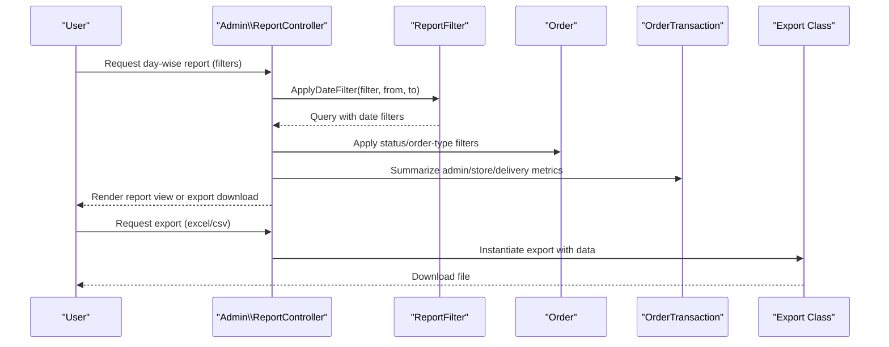
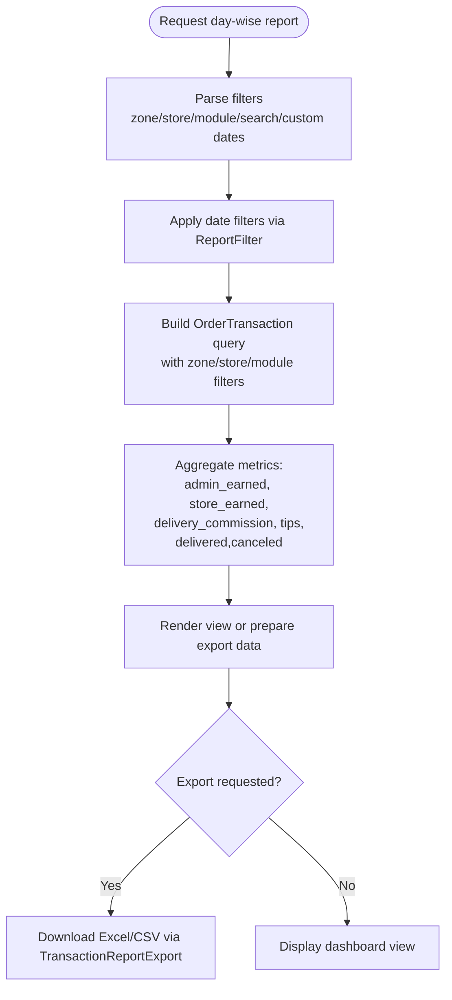
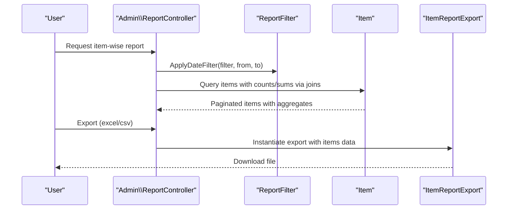
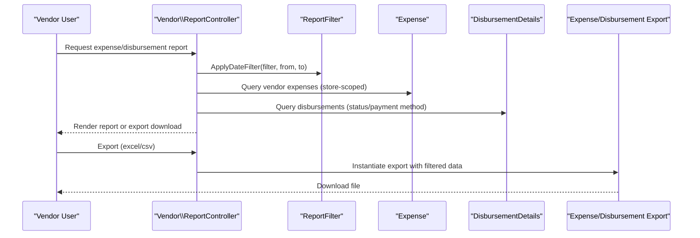
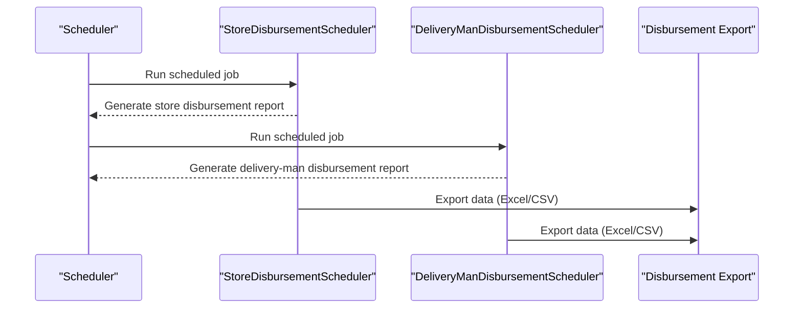
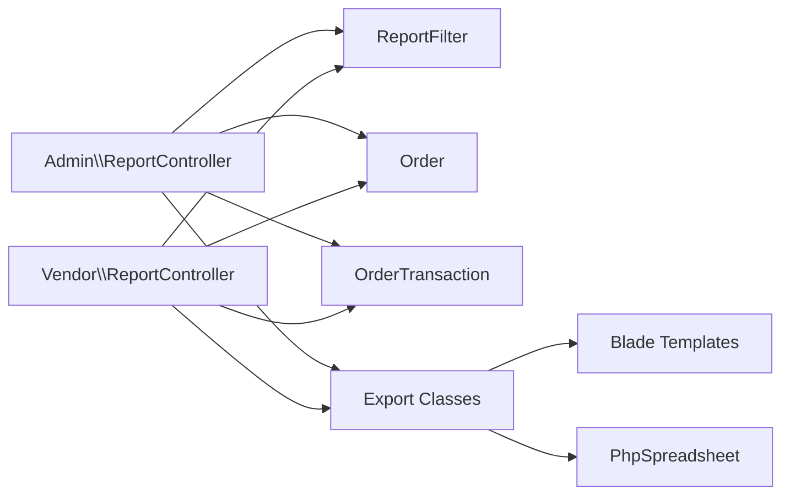

# Sales and Revenue Reports

<cite>
**Referenced Files in This Document**
- [ReportController.php](file://app/Http/Controllers/Admin/ReportController.php)
- [ReportController.php](file://app/Http/Controllers/Vendor/ReportController.php)
- [ReportFilter.php](file://app/Traits/ReportFilter.php)
- [OrderTransaction.php](file://app/Models/OrderTransaction.php)
- [Order.php](file://app/Models/Order.php)
- [StoreSalesReportExport.php](file://app/Exports/StoreSalesReportExport.php)
- [StoreOrderReportExport.php](file://app/Exports/StoreOrderReportExport.php)
- [TransactionReportExport.php](file://app/Exports/TransactionReportExport.php)
- [StoreSummaryReportExport.php](file://app/Exports/StoreSummaryReportExport.php)
- [StoreOrderTransactionExport.php](file://app/Exports/StoreOrderTransactionExport.php)
- [StoreOrderlistExport.php](file://app/Exports/StoreOrderlistExport.php)
- [StoreCashTransactionExport.php](file://app/Exports/StoreCashTransactionExport.php)
- [CollectCashTransactionExport.php](file://app/Exports/CollectCashTransactionExport.php)
- [ExpenseReportExport.php](file://app/Exports/ExpenseReportExport.php)
- [DisbursementReportExport.php](file://app/Exports/DisbursementReportExport.php)
- [DisbursementVendorReportExport.php](file://app/Exports/DisbursementVendorReportExport.php)
- [StoreWithdrawTransactionExport.php](file://app/Exports/StoreWithdrawTransactionExport.php)
- [StoreWiseWithdrawTransactionExport.php](file://app/Exports/StoreWiseWithdrawTransactionExport.php)
- [StoreEmployeeListExport.php](file://app/Exports/StoreEmployeeListExport.php)
- [StoreCategoryExport.php](file://app/Exports/StoreCategoryExport.php)
- [StoreSubCategoryExport.php](file://app/Exports/StoreSubCategoryExport.php)
- [StoreItemExport.php](file://app/Exports/StoreItemExport.php)
- [StoreListExport.php](file://app/Exports/StoreListExport.php)
- [ZoneExport.php](file://app/Exports/ZoneExport.php)
- [ModuleExport.php](file://app/Exports/ModuleExport.php)
- [OrderReportExport.php](file://app/Exports/OrderReportExport.php)
- [ItemReportExport.php](file://app/Exports/ItemReportExport.php)
- [DeliveryManEarningExport.php](file://app/Exports/DeliveryManEarningExport.php)
- [DeliverymanPaymentExport.php](file://app/Exports/DeliverymanPaymentExport.php)
- [DeliveryManListExport.php](file://app/Exports/DeliveryManListExport.php)
- [DeliveryManReviewExport.php](file://app/Exports/DeliveryManReviewExport.php)
- [SingleDeliveryManReviewExport.php](file://app/Exports/SingleDeliveryManReviewExport.php)
- [CustomerOrderExport.php](file://app/Exports/CustomerOrderExport.php)
- [CustomerWalletTransactionExport.php](file://app/Exports/CustomerWalletTransactionExport.php)
- [CustomerLoyaltyTransactionExport.php](file://app/Exports/CustomerLoyaltyTransactionExport.php)
- [AdminTaxReportExport.php](file://app/Exports/AdminTaxReportExport.php)
- [AdminTaxReportDetailsExport.php](file://app/Exports/AdminTaxReportDetailsExport.php)
- [VendorTaxExport.php](file://app/Exports/VendorTaxExport.php)
- [VendorWiseTaxExport.php](file://app/Exports/VendorWiseTaxExport.php)
- [ParcelWiseTaxExport.php](file://app/Exports/ParcelWiseTaxExport.php)
- [StoreDisbursementScheduler.php](file://app/Console/Commands/StoreDisbursementScheduler.php)
- [DeliveryManDisbursementScheduler.php](file://app/Console/Commands/DeliveryManDisbursementScheduler.php)
</cite>

## Table of Contents
1. [Introduction](#introduction)
2. [Project Structure](#project-structure)
3. [Core Components](#core-components)
4. [Architecture Overview](#architecture-overview)
5. [Detailed Component Analysis](#detailed-component-analysis)
6. [Dependency Analysis](#dependency-analysis)
7. [Performance Considerations](#performance-considerations)
8. [Troubleshooting Guide](#troubleshooting-guide)
9. [Conclusion](#conclusion)
10. [Appendices](#appendices)

## Introduction
This document describes the sales and revenue reporting system, focusing on daily, weekly, monthly, and yearly summaries; order report generation; revenue tracking across stores and zones; transaction statements; profit margin calculations; export capabilities (Excel and CSV); automated report scheduling; and custom date-range filtering. It also covers revenue breakdown by business modules, commission computations, comparative analysis features, report customization, data aggregation methods, and integration points with accounting systems.

## Project Structure
The reporting system spans controllers, traits, models, exports, and scheduled commands:
- Controllers: Admin and Vendor report controllers expose endpoints for generating reports and exporting data.
- Trait: A reusable filter trait encapsulates date-range and relationship search logic.
- Models: Order and OrderTransaction models define scopes and relationships used for aggregations.
- Exports: Multiple export classes render report data into Excel/CSV via Blade templates.
- Scheduled Commands: Console commands automate periodic disbursement-related reporting tasks.

```mermaid
graph TB
subgraph "Controllers"
AC["Admin\\ReportController"]
VC["Vendor\\ReportController"]
end
subgraph "Traits"
RF["ReportFilter"]
end
subgraph "Models"
OT["OrderTransaction"]
O["Order"]
end
subgraph "Exports"
TRX["TransactionReportExport"]
SSR["StoreSalesReportExport"]
SOR["StoreOrderReportExport"]
STR["StoreSummaryReportExport"]
SOT["StoreOrderTransactionExport"]
SOL["StoreOrderlistExport"]
SCT["StoreCashTransactionExport"]
CCT["CollectCashTransactionExport"]
ER["ExpenseReportExport"]
DR["DisbursementReportExport"]
DVR["DisbursementVendorReportExport"]
SWTE["StoreWithdrawTransactionExport"]
SWWTE["StoreWiseWithdrawTransactionExport"]
SEL["StoreEmployeeListExport"]
SCE["StoreCategoryExport"]
SSE["StoreSubCategoryExport"]
SIE["StoreItemExport"]
SLE["StoreListExport"]
ZE["ZoneExport"]
ME["ModuleExport"]
OR["OrderReportExport"]
IR["ItemReportExport"]
DME["DeliveryManEarningExport"]
DMP["DeliverymanPaymentExport"]
DML["DeliveryManListExport"]
DMRE["DeliveryManReviewExport"]
SDMRE["SingleDeliveryManReviewExport"]
COE["CustomerOrderExport"]
CWT["CustomerWalletTransactionExport"]
CLT["CustomerLoyaltyTransactionExport"]
ATE["AdminTaxReportExport"]
ATDE["AdminTaxReportDetailsExport"]
VTE["VendorTaxExport"]
VWTE["VendorWiseTaxExport"]
PWTE["ParcelWiseTaxExport"]
end
subgraph "Scheduled Commands"
SDS["StoreDisbursementScheduler"]
DDS["DeliveryManDisbursementScheduler"]
end
AC --> RF
VC --> RF
AC --> O
AC --> OT
VC --> O
VC --> OT
AC --> TRX
AC --> SSR
AC --> SOR
AC --> STR
AC --> SOT
AC --> SOL
AC --> SCT
AC --> CCT
AC --> ER
AC --> DR
AC --> SWTE
AC --> SWWTE
AC --> SEL
AC --> SCE
AC --> SSE
AC --> SIE
AC --> SLE
AC --> ZE
AC --> ME
AC --> OR
AC --> IR
AC --> DME
AC --> DMP
AC --> DML
AC --> DMRE
AC --> SDMRE
AC --> COE
AC --> CWT
AC --> CLT
AC --> ATE
AC --> ATDE
AC --> VTE
AC --> VWTE
AC --> PWTE
VC --> DVR
SDS --> DR
DDS --> DME
```



**Diagram sources**
- [ReportController.php:40-800](file://app/Http/Controllers/Admin/ReportController.php#L40-L800)
- [ReportController.php:16-238](file://app/Http/Controllers/Vendor/ReportController.php#L16-L238)
- [ReportFilter.php:7-49](file://app/Traits/ReportFilter.php#L7-L49)
- [OrderTransaction.php:9-47](file://app/Models/OrderTransaction.php#L9-L47)
- [Order.php:13-358](file://app/Models/Order.php#L13-L358)
- [StoreSalesReportExport.php:21-151](file://app/Exports/StoreSalesReportExport.php#L21-L151)
- [StoreOrderReportExport.php:20-134](file://app/Exports/StoreOrderReportExport.php#L20-L134)
- [TransactionReportExport.php:20-141](file://app/Exports/TransactionReportExport.php#L20-L141)
- [StoreSummaryReportExport.php](file://app/Exports/StoreSummaryReportExport.php)
- [StoreOrderTransactionExport.php](file://app/Exports/StoreOrderTransactionExport.php)
- [StoreOrderlistExport.php](file://app/Exports/StoreOrderlistExport.php)
- [StoreCashTransactionExport.php](file://app/Exports/StoreCashTransactionExport.php)
- [CollectCashTransactionExport.php](file://app/Exports/CollectCashTransactionExport.php)
- [ExpenseReportExport.php](file://app/Exports/ExpenseReportExport.php)
- [DisbursementReportExport.php](file://app/Exports/DisbursementReportExport.php)
- [DisbursementVendorReportExport.php](file://app/Exports/DisbursementVendorReportExport.php)
- [StoreWithdrawTransactionExport.php](file://app/Exports/StoreWithdrawTransactionExport.php)
- [StoreWiseWithdrawTransactionExport.php](file://app/Exports/StoreWiseWithdrawTransactionExport.php)
- [StoreEmployeeListExport.php](file://app/Exports/StoreEmployeeListExport.php)
- [StoreCategoryExport.php](file://app/Exports/StoreCategoryExport.php)
- [StoreSubCategoryExport.php](file://app/Exports/StoreSubCategoryExport.php)
- [StoreItemExport.php](file://app/Exports/StoreItemExport.php)
- [StoreListExport.php](file://app/Exports/StoreListExport.php)
- [ZoneExport.php](file://app/Exports/ZoneExport.php)
- [ModuleExport.php](file://app/Exports/ModuleExport.php)
- [OrderReportExport.php](file://app/Exports/OrderReportExport.php)
- [ItemReportExport.php](file://app/Exports/ItemReportExport.php)
- [DeliveryManEarningExport.php](file://app/Exports/DeliveryManEarningExport.php)
- [DeliverymanPaymentExport.php](file://app/Exports/DeliverymanPaymentExport.php)
- [DeliveryManListExport.php](file://app/Exports/DeliveryManListExport.php)
- [DeliveryManReviewExport.php](file://app/Exports/DeliveryManReviewExport.php)
- [SingleDeliveryManReviewExport.php](file://app/Exports/SingleDeliveryManReviewExport.php)
- [CustomerOrderExport.php](file://app/Exports/CustomerOrderExport.php)
- [CustomerWalletTransactionExport.php](file://app/Exports/CustomerWalletTransactionExport.php)
- [CustomerLoyaltyTransactionExport.php](file://app/Exports/CustomerLoyaltyTransactionExport.php)
- [AdminTaxReportExport.php](file://app/Exports/AdminTaxReportExport.php)
- [AdminTaxReportDetailsExport.php](file://app/Exports/AdminTaxReportDetailsExport.php)
- [VendorTaxExport.php](file://app/Exports/VendorTaxExport.php)
- [VendorWiseTaxExport.php](file://app/Exports/VendorWiseTaxExport.php)
- [ParcelWiseTaxExport.php](file://app/Exports/ParcelWiseTaxExport.php)
- [StoreDisbursementScheduler.php](file://app/Console/Commands/StoreDisbursementScheduler.php)
- [DeliveryManDisbursementScheduler.php](file://app/Console/Commands/DeliveryManDisbursementScheduler.php)

**Section sources**
- [ReportController.php:40-800](file://app/Http/Controllers/Admin/ReportController.php#L40-L800)
- [ReportController.php:16-238](file://app/Http/Controllers/Vendor/ReportController.php#L16-L238)
- [ReportFilter.php:7-49](file://app/Traits/ReportFilter.php#L7-L49)
- [OrderTransaction.php:9-47](file://app/Models/OrderTransaction.php#L9-L47)
- [Order.php:13-358](file://app/Models/Order.php#L13-L358)

## Core Components
- Admin Report Controller
  - Provides day-wise sales and revenue summaries, including admin commission, store earnings, delivery commission, and delivery tips.
  - Supports filters: all-time, this year, previous year, this month, and this week, plus custom date ranges.
  - Generates transaction statements and exports to Excel/CSV.
  - Includes item-wise report generation and export.
- Vendor Report Controller
  - Provides expense reports and disbursement reports for vendors, with export support.
- ReportFilter Trait
  - Encapsulates date-range filtering and relationship search logic for consistent reuse across queries.
- Order and OrderTransaction Models
  - Define scopes for module filtering, refunded/not-refunded, delivered/picked-up/delivered statuses, and date-range application.
- Export Classes
  - Render report data into Excel/CSV using Blade templates and apply styling/formatting.

**Section sources**
- [ReportController.php:40-800](file://app/Http/Controllers/Admin/ReportController.php#L40-L800)
- [ReportController.php:16-238](file://app/Http/Controllers/Vendor/ReportController.php#L16-L238)
- [ReportFilter.php:7-49](file://app/Traits/ReportFilter.php#L7-L49)
- [OrderTransaction.php:9-47](file://app/Models/OrderTransaction.php#L9-L47)
- [Order.php:13-358](file://app/Models/Order.php#L13-L358)

## Architecture Overview
The reporting pipeline follows a controller-driven flow:
- Controllers receive requests with optional filters (zone/store/module/date range).
- Queries leverage model scopes and the ReportFilter trait to apply filters.
- Aggregations compute revenue metrics (admin commission, store earnings, delivery fees, tips).
- Exports transform aggregated data into Excel/CSV via dedicated export classes.



**Diagram sources**
- [ReportController.php:51-261](file://app/Http/Controllers/Admin/ReportController.php#L51-L261)
- [ReportFilter.php:9-27](file://app/Traits/ReportFilter.php#L9-L27)
- [Order.php:13-358](file://app/Models/Order.php#L13-L358)
- [OrderTransaction.php:9-47](file://app/Models/OrderTransaction.php#L9-L47)
- [TransactionReportExport.php:20-141](file://app/Exports/TransactionReportExport.php#L20-L141)

## Detailed Component Analysis

### Admin Day-Wise Sales and Revenue
- Filters
  - Zone, store, module, and search keywords.
  - Predefined windows: all-time, this year, previous year, this month, this week.
  - Custom date range via from/to parameters.
- Metrics
  - Admin earned (commission minus delivery fee commission).
  - Store earned (net store amount).
  - Delivery commission and tips.
  - Delivered/canceled order amounts.
- Export
  - Excel and CSV downloads via TransactionReportExport.



**Diagram sources**
- [ReportController.php:51-261](file://app/Http/Controllers/Admin/ReportController.php#L51-L261)
- [ReportFilter.php:9-27](file://app/Traits/ReportFilter.php#L9-L27)
- [TransactionReportExport.php:20-141](file://app/Exports/TransactionReportExport.php#L20-L141)

**Section sources**
- [ReportController.php:51-261](file://app/Http/Controllers/Admin/ReportController.php#L51-L261)
- [ReportFilter.php:9-27](file://app/Traits/ReportFilter.php#L9-L27)
- [OrderTransaction.php:25-41](file://app/Models/OrderTransaction.php#L25-L41)
- [Order.php:246-270](file://app/Models/Order.php#L246-L270)

### Item-Wise Sales Report
- Filters
  - Zone, store, category, module, search keywords.
  - Date range windows and custom range.
- Aggregations
  - Orders count, total quantity sold, discount on items, and total price.
- Export
  - Excel and CSV via ItemReportExport.



**Diagram sources**
- [ReportController.php:586-742](file://app/Http/Controllers/Admin/ReportController.php#L586-L742)
- [ReportFilter.php:9-27](file://app/Traits/ReportFilter.php#L9-L27)
- [ItemReportExport.php](file://app/Exports/ItemReportExport.php)

**Section sources**
- [ReportController.php:586-742](file://app/Http/Controllers/Admin/ReportController.php#L586-L742)
- [ReportFilter.php:9-27](file://app/Traits/ReportFilter.php#L9-L27)

### Vendor Expense and Disbursement Reports
- Expense Report
  - Filters: vendor-created expenses, store-scoped, date range, keyword search.
  - Export: ExpenseReportExport.
- Disbursement Report
  - Filters: status, payment method, date range, keyword search.
  - Export: DisbursementVendorReportExport.



**Diagram sources**
- [ReportController.php:26-131](file://app/Http/Controllers/Vendor/ReportController.php#L26-L131)
- [ReportController.php:133-235](file://app/Http/Controllers/Vendor/ReportController.php#L133-L235)
- [ReportFilter.php:9-27](file://app/Traits/ReportFilter.php#L9-L27)
- [ExpenseReportExport.php](file://app/Exports/ExpenseReportExport.php)
- [DisbursementVendorReportExport.php](file://app/Exports/DisbursementVendorReportExport.php)

**Section sources**
- [ReportController.php:26-131](file://app/Http/Controllers/Vendor/ReportController.php#L26-L131)
- [ReportController.php:133-235](file://app/Http/Controllers/Vendor/ReportController.php#L133-L235)
- [ReportFilter.php:9-27](file://app/Traits/ReportFilter.php#L9-L27)

### Export Classes and Templates
- TransactionReportExport
  - Renders transaction-level statements with styling and merged cells.
- StoreSalesReportExport
  - Renders store-level sales with product images and formatting.
- StoreOrderReportExport
  - Renders order lists with formatting.
- StoreSummaryReportExport
  - Renders summary KPIs for stores.
- StoreOrderTransactionExport
  - Renders order transactions for stores.
- StoreOrderlistExport
  - Renders order lists for stores.
- StoreCashTransactionExport
  - Renders cash transactions for stores.
- CollectCashTransactionExport
  - Renders collected cash transactions.
- ExpenseReportExport
  - Renders vendor expense reports.
- DisbursementReportExport
  - Renders system disbursement reports.
- DisbursementVendorReportExport
  - Renders vendor disbursement reports.
- StoreWithdrawTransactionExport
  - Renders store withdrawal transactions.
- StoreWiseWithdrawTransactionExport
  - Renders store-wise withdrawal transactions.
- StoreEmployeeListExport
  - Renders employee lists for stores.
- StoreCategoryExport
  - Renders store categories.
- StoreSubCategoryExport
  - Renders store sub-categories.
- StoreItemExport
  - Renders store items.
- StoreListExport
  - Renders store lists.
- ZoneExport
  - Renders zones.
- ModuleExport
  - Renders modules.
- OrderReportExport
  - Renders order reports.
- ItemReportExport
  - Renders item reports.
- DeliveryManEarningExport
  - Renders delivery-man earnings.
- DeliverymanPaymentExport
  - Renders delivery-man payments.
- DeliveryManListExport
  - Renders delivery-man lists.
- DeliveryManReviewExport
  - Renders delivery-man reviews.
- SingleDeliveryManReviewExport
  - Renders single delivery-man reviews.
- CustomerOrderExport
  - Renders customer orders.
- CustomerWalletTransactionExport
  - Renders customer wallet transactions.
- CustomerLoyaltyTransactionExport
  - Renders customer loyalty transactions.
- AdminTaxReportExport
  - Renders admin tax reports.
- AdminTaxReportDetailsExport
  - Renders admin tax report details.
- VendorTaxExport
  - Renders vendor tax reports.
- VendorWiseTaxExport
  - Renders vendor-wise tax reports.
- ParcelWiseTaxExport
  - Renders parcel-wise tax reports.

```mermaid
classDiagram
class TransactionReportExport
class StoreSalesReportExport
class StoreOrderReportExport
class StoreSummaryReportExport
class StoreOrderTransactionExport
class StoreOrderlistExport
class StoreCashTransactionExport
class CollectCashTransactionExport
class ExpenseReportExport
class DisbursementReportExport
class DisbursementVendorReportExport
class StoreWithdrawTransactionExport
class StoreWiseWithdrawTransactionExport
class StoreEmployeeListExport
class StoreCategoryExport
class StoreSubCategoryExport
class StoreItemExport
class StoreListExport
class ZoneExport
class ModuleExport
class OrderReportExport
class ItemReportExport
class DeliveryManEarningExport
class DeliverymanPaymentExport
class DeliveryManListExport
class DeliveryManReviewExport
class SingleDeliveryManReviewExport
class CustomerOrderExport
class CustomerWalletTransactionExport
class CustomerLoyaltyTransactionExport
class AdminTaxReportExport
class AdminTaxReportDetailsExport
class VendorTaxExport
class VendorWiseTaxExport
class ParcelWiseTaxExport
TransactionReportExport --> "Blade template" : "renders"
StoreSalesReportExport --> "Blade template" : "renders"
StoreOrderReportExport --> "Blade template" : "renders"
StoreSummaryReportExport --> "Blade template" : "renders"
StoreOrderTransactionExport --> "Blade template" : "renders"
StoreOrderlistExport --> "Blade template" : "renders"
StoreCashTransactionExport --> "Blade template" : "renders"
CollectCashTransactionExport --> "Blade template" : "renders"
ExpenseReportExport --> "Blade template" : "renders"
DisbursementReportExport --> "Blade template" : "renders"
DisbursementVendorReportExport --> "Blade template" : "renders"
StoreWithdrawTransactionExport --> "Blade template" : "renders"
StoreWiseWithdrawTransactionExport --> "Blade template" : "renders"
StoreEmployeeListExport --> "Blade template" : "renders"
StoreCategoryExport --> "Blade template" : "renders"
StoreSubCategoryExport --> "Blade template" : "renders"
StoreItemExport --> "Blade template" : "renders"
StoreListExport --> "Blade template" : "renders"
ZoneExport --> "Blade template" : "renders"
ModuleExport --> "Blade template" : "renders"
OrderReportExport --> "Blade template" : "renders"
ItemReportExport --> "Blade template" : "renders"
DeliveryManEarningExport --> "Blade template" : "renders"
DeliverymanPaymentExport --> "Blade template" : "renders"
DeliveryManListExport --> "Blade template" : "renders"
DeliveryManReviewExport --> "Blade template" : "renders"
SingleDeliveryManReviewExport --> "Blade template" : "renders"
CustomerOrderExport --> "Blade template" : "renders"
CustomerWalletTransactionExport --> "Blade template" : "renders"
CustomerLoyaltyTransactionExport --> "Blade template" : "renders"
AdminTaxReportExport --> "Blade template" : "renders"
AdminTaxReportDetailsExport --> "Blade template" : "renders"
VendorTaxExport --> "Blade template" : "renders"
VendorWiseTaxExport --> "Blade template" : "renders"
ParcelWiseTaxExport --> "Blade template" : "renders"
```

**Diagram sources**
- [TransactionReportExport.php:20-141](file://app/Exports/TransactionReportExport.php#L20-L141)
- [StoreSalesReportExport.php:21-151](file://app/Exports/StoreSalesReportExport.php#L21-L151)
- [StoreOrderReportExport.php:20-134](file://app/Exports/StoreOrderReportExport.php#L20-L134)
- [StoreSummaryReportExport.php](file://app/Exports/StoreSummaryReportExport.php)
- [StoreOrderTransactionExport.php](file://app/Exports/StoreOrderTransactionExport.php)
- [StoreOrderlistExport.php](file://app/Exports/StoreOrderlistExport.php)
- [StoreCashTransactionExport.php](file://app/Exports/StoreCashTransactionExport.php)
- [CollectCashTransactionExport.php](file://app/Exports/CollectCashTransactionExport.php)
- [ExpenseReportExport.php](file://app/Exports/ExpenseReportExport.php)
- [DisbursementReportExport.php](file://app/Exports/DisbursementReportExport.php)
- [DisbursementVendorReportExport.php](file://app/Exports/DisbursementVendorReportExport.php)
- [StoreWithdrawTransactionExport.php](file://app/Exports/StoreWithdrawTransactionExport.php)
- [StoreWiseWithdrawTransactionExport.php](file://app/Exports/StoreWiseWithdrawTransactionExport.php)
- [StoreEmployeeListExport.php](file://app/Exports/StoreEmployeeListExport.php)
- [StoreCategoryExport.php](file://app/Exports/StoreCategoryExport.php)
- [StoreSubCategoryExport.php](file://app/Exports/StoreSubCategoryExport.php)
- [StoreItemExport.php](file://app/Exports/StoreItemExport.php)
- [StoreListExport.php](file://app/Exports/StoreListExport.php)
- [ZoneExport.php](file://app/Exports/ZoneExport.php)
- [ModuleExport.php](file://app/Exports/ModuleExport.php)
- [OrderReportExport.php](file://app/Exports/OrderReportExport.php)
- [ItemReportExport.php](file://app/Exports/ItemReportExport.php)
- [DeliveryManEarningExport.php](file://app/Exports/DeliveryManEarningExport.php)
- [DeliverymanPaymentExport.php](file://app/Exports/DeliverymanPaymentExport.php)
- [DeliveryManListExport.php](file://app/Exports/DeliveryManListExport.php)
- [DeliveryManReviewExport.php](file://app/Exports/DeliveryManReviewExport.php)
- [SingleDeliveryManReviewExport.php](file://app/Exports/SingleDeliveryManReviewExport.php)
- [CustomerOrderExport.php](file://app/Exports/CustomerOrderExport.php)
- [CustomerWalletTransactionExport.php](file://app/Exports/CustomerWalletTransactionExport.php)
- [CustomerLoyaltyTransactionExport.php](file://app/Exports/CustomerLoyaltyTransactionExport.php)
- [AdminTaxReportExport.php](file://app/Exports/AdminTaxReportExport.php)
- [AdminTaxReportDetailsExport.php](file://app/Exports/AdminTaxReportDetailsExport.php)
- [VendorTaxExport.php](file://app/Exports/VendorTaxExport.php)
- [VendorWiseTaxExport.php](file://app/Exports/VendorWiseTaxExport.php)
- [ParcelWiseTaxExport.php](file://app/Exports/ParcelWiseTaxExport.php)

**Section sources**
- [TransactionReportExport.php:20-141](file://app/Exports/TransactionReportExport.php#L20-L141)
- [StoreSalesReportExport.php:21-151](file://app/Exports/StoreSalesReportExport.php#L21-L151)
- [StoreOrderReportExport.php:20-134](file://app/Exports/StoreOrderReportExport.php#L20-L134)

### Automated Report Scheduling
- StoreDisbursementScheduler
  - Console command for automating store disbursement-related reporting tasks.
- DeliveryManDisbursementScheduler
  - Console command for automating delivery-man disbursement-related reporting tasks.



**Diagram sources**
- [StoreDisbursementScheduler.php](file://app/Console/Commands/StoreDisbursementScheduler.php)
- [DeliveryManDisbursementScheduler.php](file://app/Console/Commands/DeliveryManDisbursementScheduler.php)
- [DisbursementReportExport.php](file://app/Exports/DisbursementReportExport.php)
- [DisbursementVendorReportExport.php](file://app/Exports/DisbursementVendorReportExport.php)

**Section sources**
- [StoreDisbursementScheduler.php](file://app/Console/Commands/StoreDisbursementScheduler.php)
- [DeliveryManDisbursementScheduler.php](file://app/Console/Commands/DeliveryManDisbursementScheduler.php)

## Dependency Analysis
- Controllers depend on:
  - ReportFilter trait for consistent date-range filtering.
  - Order and OrderTransaction models for aggregations and scopes.
  - Export classes for rendering Excel/CSV.
- Exports depend on:
  - Blade templates under file-exports for rendering.
  - PhpSpreadsheet for styling and formatting.



**Diagram sources**
- [ReportController.php:40-800](file://app/Http/Controllers/Admin/ReportController.php#L40-L800)
- [ReportController.php:16-238](file://app/Http/Controllers/Vendor/ReportController.php#L16-L238)
- [ReportFilter.php:7-49](file://app/Traits/ReportFilter.php#L7-L49)
- [Order.php:13-358](file://app/Models/Order.php#L13-L358)
- [OrderTransaction.php:9-47](file://app/Models/OrderTransaction.php#L9-L47)

**Section sources**
- [ReportController.php:40-800](file://app/Http/Controllers/Admin/ReportController.php#L40-L800)
- [ReportController.php:16-238](file://app/Http/Controllers/Vendor/ReportController.php#L16-L238)
- [ReportFilter.php:7-49](file://app/Traits/ReportFilter.php#L7-L49)
- [Order.php:13-358](file://app/Models/Order.php#L13-L358)
- [OrderTransaction.php:9-47](file://app/Models/OrderTransaction.php#L9-L47)

## Performance Considerations
- Prefer pagination for large datasets to avoid memory spikes.
- Use targeted select clauses and joins to minimize query overhead.
- Apply date-range filters early to reduce dataset size.
- Leverage model scopes and global scopes judiciously to avoid N+1 queries.
- Batch exports should stream data when possible to reduce peak memory usage.

## Troubleshooting Guide
- Date Range Issues
  - Ensure custom from/to parameters are properly formatted and inclusive of full days.
  - Verify filter precedence: custom overrides predefined windows.
- Missing Metrics
  - Confirm refunded/not-refunded scopes are applied appropriately for accurate revenue computation.
- Export Failures
  - Validate export class instantiation with correct data arrays.
  - Check template availability under file-exports.
- Disbursement Reports
  - Confirm store ID resolution and withdrawal method filters.

**Section sources**
- [ReportController.php:51-261](file://app/Http/Controllers/Admin/ReportController.php#L51-L261)
- [ReportController.php:26-131](file://app/Http/Controllers/Vendor/ReportController.php#L26-L131)
- [OrderTransaction.php:30-41](file://app/Models/OrderTransaction.php#L30-L41)

## Conclusion
The reporting system provides robust, flexible, and exportable sales and revenue insights across daily, weekly, monthly, and yearly periods. It supports granular filtering by zone, store, module, and date ranges, and offers multiple export formats. Automated scheduling enhances operational efficiency, while modular exports enable integration with external accounting systems.

## Appendices
- Report Customization Options
  - Filters: zone, store, module, category, keyword search, date range windows, and custom ranges.
  - Export Formats: Excel and CSV.
  - Comparative Analysis: Compare delivered vs canceled amounts; compare metrics across time windows.
- Data Aggregation Methods
  - Aggregates computed via model relations and scopes; date filters applied consistently via ReportFilter.
- Integration with Accounting Systems
  - Export classes produce structured data suitable for import into accounting platforms; templates can be adapted to match required schemas.