# Payment Integration

<cite>
**Referenced Files in This Document**
- [Payment.php](file://app/Traits/Payment.php)
- [PaymentGatewayTrait.php](file://app/Traits/PaymentGatewayTrait.php)
- [Payment.php](file://app/Library/Payment.php)
- [SslCommerzPaymentController.php](file://app/Http/Controllers/SslCommerzPaymentController.php)
- [PaypalPaymentController.php](file://app/Http/Controllers/PaypalPaymentController.php)
- [PaymentRequest.php](file://app/Models/PaymentRequest.php)
- [SubscriptionPackage.php](file://app/Models/SubscriptionPackage.php)
- [StoreSubscription.php](file://app/Models/StoreSubscription.php)
- [SubscriptionTransaction.php](file://app/Models/SubscriptionTransaction.php)
- [SubscriptionBillingAndRefundHistory.php](file://app/Models/SubscriptionBillingAndRefundHistory.php)
- [2024_05_13_102547_create_subscription_packages_table.php](file://database/migrations/2024_05_13_102547_create_subscription_packages_table.php)
- [2024_05_13_102612_create_store_subscriptions_table.php](file://database/migrations/2024_05_13_102612_create_store_subscriptions_table.php)
- [2024_05_13_104250_create_subscription_transactions_table.php](file://database/migrations/2024_05_13_104250_create_subscription_transactions_table.php)
- [2024_05_22_115717_create_subscription_billing_and_refund_histories_table.php](file://database/migrations/2024_05_22_115717_create_subscription_billing_and_refund_histories_table.php)
- [AdminTaxReportController.php](file://app/Http/Controllers/Admin/AdminTaxReportController.php)
- [helpers.php](file://app/CentralLogics/helpers.php)
- [payment-failed.blade.php](file://resources/views/payment-failed.blade.php)
- [payment-canceled.blade.php](file://resources/views/payment-canceled.blade.php)
- [SslCommerzNotification.php](file://app/Library/SslCommerz/SslCommerzNotification.php)
</cite>

## Table of Contents
1. [Introduction](#introduction)
2. [Project Structure](#project-structure)
3. [Core Components](#core-components)
4. [Architecture Overview](#architecture-overview)
5. [Detailed Component Analysis](#detailed-component-analysis)
6. [Dependency Analysis](#dependency-analysis)
7. [Performance Considerations](#performance-considerations)
8. [Troubleshooting Guide](#troubleshooting-guide)
9. [Conclusion](#conclusion)
10. [Appendices](#appendices)

## Introduction
This document explains the payment integration for subscription billing, covering payment gateway orchestration, transaction handling, billing cycles, recurring payment setup, failed payment handling, subscription transaction recording, payment verification, refund processing, webhook handling, and analytics/reconciliation. It focuses on the Laravel-based backend modules and controllers that power payment requests, provider-specific integrations, and subscription lifecycle management.

## Project Structure
The payment integration spans several layers:
- Payment orchestration traits and library classes
- Provider-specific controllers implementing payment flows
- Payment request persistence and verification
- Subscription models and billing/refund history
- Migrations defining the schema for subscription and payment records
- Views for payment failure/cancellation feedback

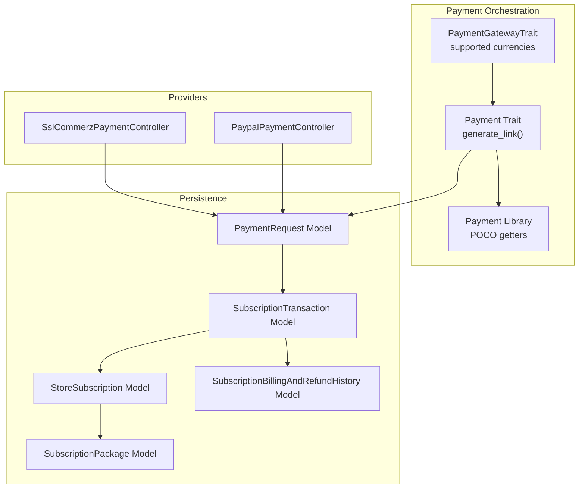

**Diagram sources**
- [Payment.php:12-82](file://app/Traits/Payment.php#L12-L82)
- [Payment.php:20-95](file://app/Library/Payment.php#L20-L95)
- [PaymentGatewayTrait.php:8-341](file://app/Traits/PaymentGatewayTrait.php#L8-L341)
- [SslCommerzPaymentController.php:54-144](file://app/Http/Controllers/SslCommerzPaymentController.php#L54-L144)
- [PaypalPaymentController.php:62-138](file://app/Http/Controllers/PaypalPaymentController.php#L62-L138)
- [PaymentRequest.php:9-15](file://app/Models/PaymentRequest.php#L9-L15)
- [SubscriptionPackage.php:10-54](file://app/Models/SubscriptionPackage.php#L10-L54)
- [StoreSubscription.php:10-49](file://app/Models/StoreSubscription.php#L10-L49)
- [SubscriptionTransaction.php:9-45](file://app/Models/SubscriptionTransaction.php#L9-L45)
- [SubscriptionBillingAndRefundHistory.php:8-17](file://app/Models/SubscriptionBillingAndRefundHistory.php#L8-L17)

**Section sources**
- [Payment.php:12-82](file://app/Traits/Payment.php#L12-L82)
- [Payment.php:20-95](file://app/Library/Payment.php#L20-L95)
- [PaymentGatewayTrait.php:8-341](file://app/Traits/PaymentGatewayTrait.php#L8-L341)
- [SslCommerzPaymentController.php:54-144](file://app/Http/Controllers/SslCommerzPaymentController.php#L54-L144)
- [PaypalPaymentController.php:62-138](file://app/Http/Controllers/PaypalPaymentController.php#L62-L138)
- [PaymentRequest.php:9-15](file://app/Models/PaymentRequest.php#L9-L15)
- [SubscriptionPackage.php:10-54](file://app/Models/SubscriptionPackage.php#L10-L54)
- [StoreSubscription.php:10-49](file://app/Models/StoreSubscription.php#L10-L49)
- [SubscriptionTransaction.php:9-45](file://app/Models/SubscriptionTransaction.php#L9-L45)
- [SubscriptionBillingAndRefundHistory.php:8-17](file://app/Models/SubscriptionBillingAndRefundHistory.php#L8-L17)

## Core Components
- Payment orchestration trait: centralizes generating provider-specific payment links and persisting payment requests.
- Provider controllers: implement provider-specific flows (initiation, success, failure, cancellation).
- Payment request model: stores pre-flight payment metadata and hooks for post-transaction callbacks.
- Subscription models: define packages, active store subscriptions, transactions, and billing/refund histories.
- Payment gateway currency support: centralized mapping of supported currencies per provider.

**Section sources**
- [Payment.php:12-82](file://app/Traits/Payment.php#L12-L82)
- [Payment.php:20-95](file://app/Library/Payment.php#L20-L95)
- [SslCommerzPaymentController.php:54-144](file://app/Http/Controllers/SslCommerzPaymentController.php#L54-L144)
- [PaypalPaymentController.php:62-138](file://app/Http/Controllers/PaypalPaymentController.php#L62-L138)
- [PaymentRequest.php:9-15](file://app/Models/PaymentRequest.php#L9-L15)
- [SubscriptionPackage.php:10-54](file://app/Models/SubscriptionPackage.php#L10-L54)
- [StoreSubscription.php:10-49](file://app/Models/StoreSubscription.php#L10-L49)
- [SubscriptionTransaction.php:9-45](file://app/Models/SubscriptionTransaction.php#L9-L45)
- [SubscriptionBillingAndRefundHistory.php:8-17](file://app/Models/SubscriptionBillingAndRefundHistory.php#L8-L17)
- [PaymentGatewayTrait.php:8-341](file://app/Traits/PaymentGatewayTrait.php#L8-L341)

## Architecture Overview
The system orchestrates payments via a unified interface, persists a payment request, and delegates to provider-specific controllers. On completion, provider controllers mark the payment request as paid and invoke success hooks. Subscription-related flows update subscription status and record transactions and billing/refund histories.

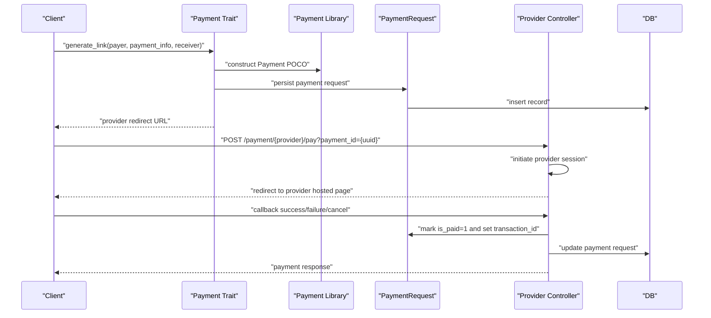

**Diagram sources**
- [Payment.php:12-82](file://app/Traits/Payment.php#L12-L82)
- [Payment.php:20-95](file://app/Library/Payment.php#L20-L95)
- [SslCommerzPaymentController.php:54-144](file://app/Http/Controllers/SslCommerzPaymentController.php#L54-L144)
- [PaypalPaymentController.php:62-138](file://app/Http/Controllers/PaypalPaymentController.php#L62-L138)
- [PaymentRequest.php:9-15](file://app/Models/PaymentRequest.php#L9-L15)

## Detailed Component Analysis

### Payment Orchestration and Provider Routing
- The Payment trait validates payment amount and additional data, persists a PaymentRequest, and resolves a provider-specific redirect route based on the selected payment method.
- The Payment library encapsulates payment metadata and exposes getters for downstream use by provider controllers.

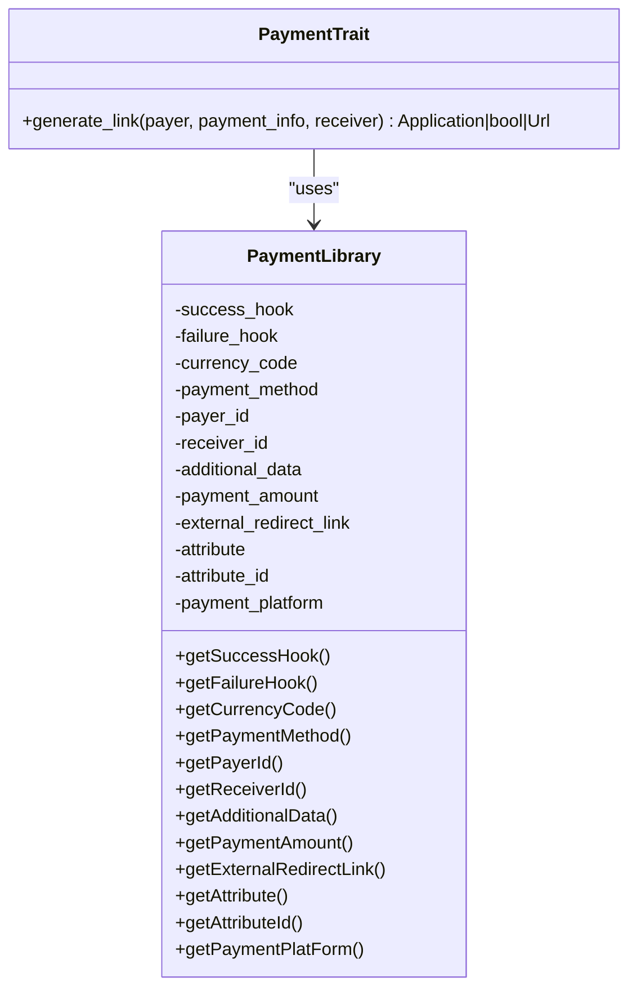

**Diagram sources**
- [Payment.php:12-82](file://app/Traits/Payment.php#L12-L82)
- [Payment.php:20-95](file://app/Library/Payment.php#L20-L95)

**Section sources**
- [Payment.php:12-82](file://app/Traits/Payment.php#L12-L82)
- [Payment.php:20-95](file://app/Library/Payment.php#L20-L95)

### Provider Integrations: SslCommerz and PayPal
- SslCommerz controller:
  - Loads provider configuration (live/test) and constructs a hosted session request.
  - Generates success/fail/cancel URLs with the payment request UUID.
  - Verifies hash signatures and marks the payment request as paid upon success.
  - Invokes success/failure hooks and returns a standardized response.
- PayPal controller:
  - Obtains an OAuth access token.
  - Creates an order with intent CAPTURE and captures it on success.
  - Updates the payment request and invokes hooks similarly.

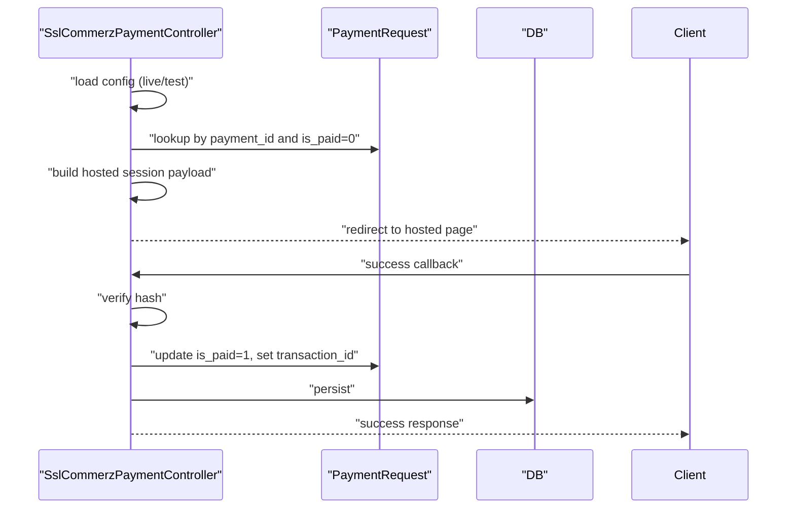

**Diagram sources**
- [SslCommerzPaymentController.php:54-144](file://app/Http/Controllers/SslCommerzPaymentController.php#L54-L144)
- [SslCommerzPaymentController.php:186-208](file://app/Http/Controllers/SslCommerzPaymentController.php#L186-L208)
- [PaymentRequest.php:9-15](file://app/Models/PaymentRequest.php#L9-L15)

**Section sources**
- [SslCommerzPaymentController.php:54-144](file://app/Http/Controllers/SslCommerzPaymentController.php#L54-L144)
- [SslCommerzPaymentController.php:186-208](file://app/Http/Controllers/SslCommerzPaymentController.php#L186-L208)
- [PaypalPaymentController.php:62-138](file://app/Http/Controllers/PaypalPaymentController.php#L62-L138)
- [PaypalPaymentController.php:152-198](file://app/Http/Controllers/PaypalPaymentController.php#L152-L198)

### Payment Verification and Security
- SslCommerz signature verification:
  - Reconstructs the signing hash from the returned payload and compares it against the provider’s signature.
  - Rejects tampered data and returns failure responses accordingly.
- Provider controllers update the PaymentRequest with transaction identifiers and invoke hooks for downstream actions.

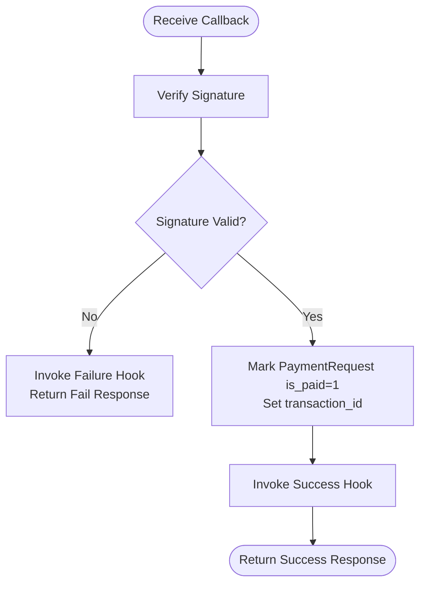

**Diagram sources**
- [SslCommerzPaymentController.php:147-184](file://app/Http/Controllers/SslCommerzPaymentController.php#L147-L184)
- [SslCommerzNotification.php:110-131](file://app/Library/SslCommerz/SslCommerzNotification.php#L110-L131)
- [SslCommerzPaymentController.php:186-208](file://app/Http/Controllers/SslCommerzPaymentController.php#L186-L208)

**Section sources**
- [SslCommerzPaymentController.php:147-184](file://app/Http/Controllers/SslCommerzPaymentController.php#L147-L184)
- [SslCommerzNotification.php:110-131](file://app/Library/SslCommerz/SslCommerzNotification.php#L110-L131)
- [SslCommerzPaymentController.php:186-208](file://app/Http/Controllers/SslCommerzPaymentController.php#L186-L208)

### Subscription Payment Processing and Billing Cycles
- Subscription models:
  - SubscriptionPackage defines plan features and validity.
  - StoreSubscription tracks active subscriptions and expiry dates.
  - SubscriptionTransaction records individual payments, package details, and validity.
  - SubscriptionBillingAndRefundHistory tracks pending bills and refunds.
- Subscription transaction recording and renewal:
  - Helpers coordinate updating store, creating subscription transactions, linking to store subscriptions, and marking pending billing entries as successful with a reference containing payment method and transaction ID.

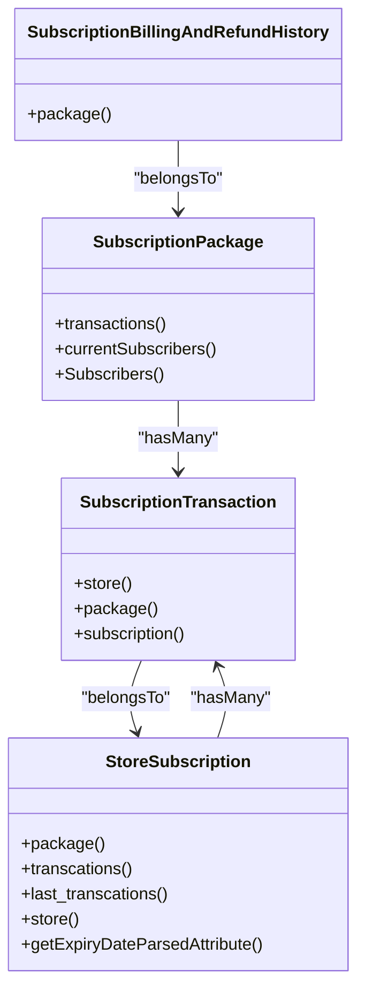

**Diagram sources**
- [SubscriptionPackage.php:10-54](file://app/Models/SubscriptionPackage.php#L10-L54)
- [StoreSubscription.php:10-57](file://app/Models/StoreSubscription.php#L10-L57)
- [SubscriptionTransaction.php:9-51](file://app/Models/SubscriptionTransaction.php#L9-L51)
- [SubscriptionBillingAndRefundHistory.php:8-17](file://app/Models/SubscriptionBillingAndRefundHistory.php#L8-L17)

**Section sources**
- [SubscriptionPackage.php:10-54](file://app/Models/SubscriptionPackage.php#L10-L54)
- [StoreSubscription.php:10-57](file://app/Models/StoreSubscription.php#L10-L57)
- [SubscriptionTransaction.php:9-51](file://app/Models/SubscriptionTransaction.php#L9-L51)
- [SubscriptionBillingAndRefundHistory.php:8-17](file://app/Models/SubscriptionBillingAndRefundHistory.php#L8-L17)
- [helpers.php:4016-4037](file://app/CentralLogics/helpers.php#L4016-L4037)

### Recurring Payments and Billing Cycles
- StoreSubscription maintains validity and expiry date parsing attributes, enabling cycle-based renewal logic.
- SubscriptionTransaction records paid amounts, validity, and package details for each billing period.
- Pending billing entries are updated to successful upon payment completion, ensuring accurate reconciliation.

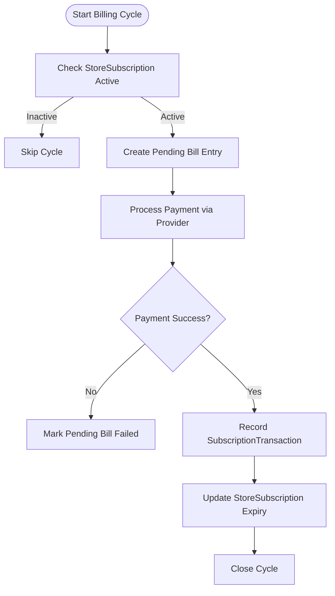

**Diagram sources**
- [StoreSubscription.php:54-56](file://app/Models/StoreSubscription.php#L54-L56)
- [SubscriptionTransaction.php:15-31](file://app/Models/SubscriptionTransaction.php#L15-L31)
- [helpers.php:4016-4037](file://app/CentralLogics/helpers.php#L4016-L4037)

**Section sources**
- [StoreSubscription.php:54-56](file://app/Models/StoreSubscription.php#L54-L56)
- [SubscriptionTransaction.php:15-31](file://app/Models/SubscriptionTransaction.php#L15-L31)
- [helpers.php:4016-4037](file://app/CentralLogics/helpers.php#L4016-L4037)

### Refund Processing and Billing History
- SubscriptionBillingAndRefundHistory tracks refund and pending bill entries with success flags and references.
- Refund flows can update these records to reflect refund decisions and outcomes.

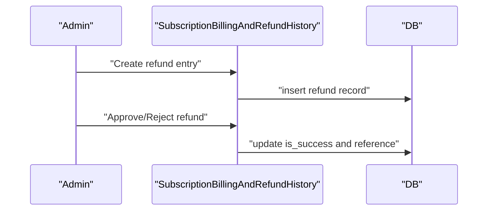

**Diagram sources**
- [SubscriptionBillingAndRefundHistory.php:8-17](file://app/Models/SubscriptionBillingAndRefundHistory.php#L8-L17)
- [2024_05_22_115717_create_subscription_billing_and_refund_histories_table.php:14-24](file://database/migrations/2024_05_22_115717_create_subscription_billing_and_refund_histories_table.php#L14-L24)

**Section sources**
- [SubscriptionBillingAndRefundHistory.php:8-17](file://app/Models/SubscriptionBillingAndRefundHistory.php#L8-L17)
- [2024_05_22_115717_create_subscription_billing_and_refund_histories_table.php:14-24](file://database/migrations/2024_05_22_115717_create_subscription_billing_and_refund_histories_table.php#L14-L24)

### Payment Method Support and Currency Mapping
- PaymentGatewayTrait enumerates supported currencies per provider, enabling dynamic selection and validation of payment methods and currencies.

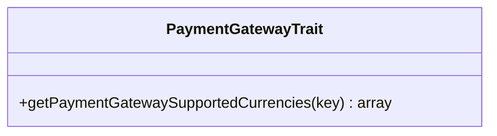

**Diagram sources**
- [PaymentGatewayTrait.php:8-341](file://app/Traits/PaymentGatewayTrait.php#L8-L341)

**Section sources**
- [PaymentGatewayTrait.php:8-341](file://app/Traits/PaymentGatewayTrait.php#L8-L341)

### Webhook Handling for Payment Updates
- Current controllers handle provider callbacks directly via success/failure/cancel endpoints and do not expose generic webhook endpoints.
- To integrate provider webhooks, add dedicated webhook endpoints in provider controllers to:
  - Verify webhook signatures
  - Parse event payloads
  - Update PaymentRequest and downstream entities
  - Log events for reconciliation

[No sources needed since this section provides general guidance]

### Payment Analytics and Reconciliation
- Subscription tax reporting aggregates paid amounts and computed tax per package and date range.
- SubscriptionBillingAndRefundHistory provides reconciliation entries with references for audit trails.

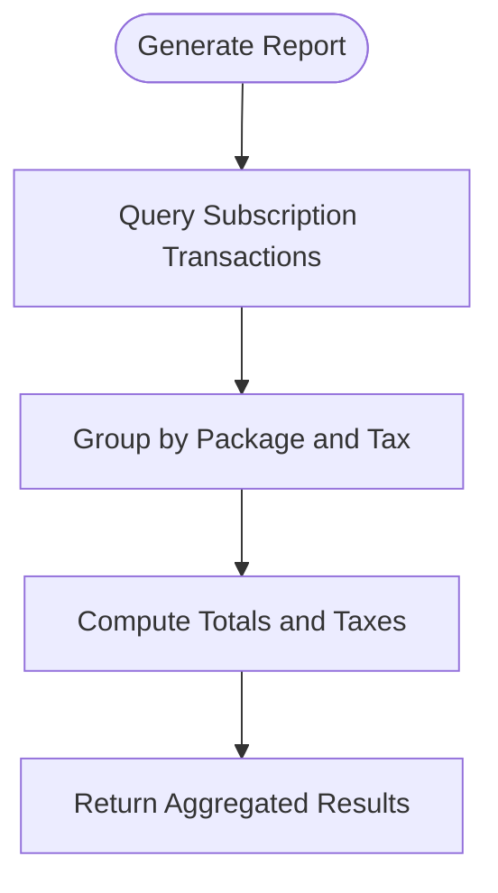

**Diagram sources**
- [AdminTaxReportController.php:103-140](file://app/Http/Controllers/Admin/AdminTaxReportController.php#L103-L140)

**Section sources**
- [AdminTaxReportController.php:103-140](file://app/Http/Controllers/Admin/AdminTaxReportController.php#L103-L140)
- [SubscriptionBillingAndRefundHistory.php:8-17](file://app/Models/SubscriptionBillingAndRefundHistory.php#L8-L17)

## Dependency Analysis
- Payment trait depends on Payment library and PaymentRequest model.
- Provider controllers depend on PaymentRequest and provider configuration.
- Subscription models form a cohesive domain with foreign keys linking packages, store subscriptions, and transactions.
- Billing/refund history complements transactions for reconciliation.

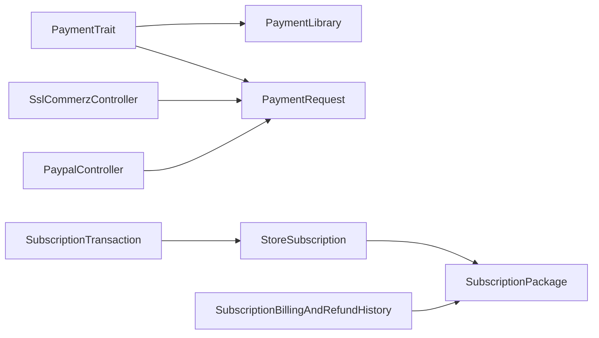

**Diagram sources**
- [Payment.php:12-82](file://app/Traits/Payment.php#L12-L82)
- [Payment.php:20-95](file://app/Library/Payment.php#L20-L95)
- [PaymentRequest.php:9-15](file://app/Models/PaymentRequest.php#L9-L15)
- [SslCommerzPaymentController.php:54-144](file://app/Http/Controllers/SslCommerzPaymentController.php#L54-L144)
- [PaypalPaymentController.php:62-138](file://app/Http/Controllers/PaypalPaymentController.php#L62-L138)
- [SubscriptionTransaction.php:9-45](file://app/Models/SubscriptionTransaction.php#L9-L45)
- [StoreSubscription.php:10-49](file://app/Models/StoreSubscription.php#L10-L49)
- [SubscriptionPackage.php:10-54](file://app/Models/SubscriptionPackage.php#L10-L54)
- [SubscriptionBillingAndRefundHistory.php:8-17](file://app/Models/SubscriptionBillingAndRefundHistory.php#L8-L17)

**Section sources**
- [Payment.php:12-82](file://app/Traits/Payment.php#L12-L82)
- [Payment.php:20-95](file://app/Library/Payment.php#L20-L95)
- [PaymentRequest.php:9-15](file://app/Models/PaymentRequest.php#L9-L15)
- [SslCommerzPaymentController.php:54-144](file://app/Http/Controllers/SslCommerzPaymentController.php#L54-L144)
- [PaypalPaymentController.php:62-138](file://app/Http/Controllers/PaypalPaymentController.php#L62-L138)
- [SubscriptionTransaction.php:9-45](file://app/Models/SubscriptionTransaction.php#L9-L45)
- [StoreSubscription.php:10-49](file://app/Models/StoreSubscription.php#L10-L49)
- [SubscriptionPackage.php:10-54](file://app/Models/SubscriptionPackage.php#L10-L54)
- [SubscriptionBillingAndRefundHistory.php:8-17](file://app/Models/SubscriptionBillingAndRefundHistory.php#L8-L17)

## Performance Considerations
- Minimize external provider API calls by caching provider configuration and tokens where appropriate.
- Batch reconciliation queries for subscription transactions and billing histories.
- Use database transactions for payment updates and subscription state changes to maintain consistency.

[No sources needed since this section provides general guidance]

## Troubleshooting Guide
- Payment initiation failures:
  - Validate provider configuration mode and credentials.
  - Ensure PaymentRequest exists and is unpaid before initiating.
- Callback verification failures:
  - Confirm signature verification logic matches provider requirements.
  - Check that success/failure hooks are callable and properly registered.
- Payment failure UI:
  - Payment failure and cancellation pages render simple messages; ensure routing to these pages is configured.

**Section sources**
- [SslCommerzPaymentController.php:54-144](file://app/Http/Controllers/SslCommerzPaymentController.php#L54-L144)
- [SslCommerzPaymentController.php:210-226](file://app/Http/Controllers/SslCommerzPaymentController.php#L210-L226)
- [payment-failed.blade.php:1-1](file://resources/views/payment-failed.blade.php#L1-L1)
- [payment-canceled.blade.php:1-1](file://resources/views/payment-canceled.blade.php#L1-L1)

## Conclusion
The payment integration centers on a robust Payment trait and provider controllers that standardize payment request creation, provider redirection, and post-payment updates. Subscription processing leverages dedicated models and billing history to manage billing cycles, renewals, and refunds. Extending webhook support and enhancing reconciliation reports will further strengthen the system’s reliability and auditability.

## Appendices

### Schema References
- Subscription packages table definition
- Store subscriptions table definition
- Subscription transactions table definition
- Subscription billing and refund histories table definition

**Section sources**
- [2024_05_13_102547_create_subscription_packages_table.php:14-24](file://database/migrations/2024_05_13_102547_create_subscription_packages_table.php#L14-L24)
- [2024_05_13_102612_create_store_subscriptions_table.php:14-24](file://database/migrations/2024_05_13_102612_create_store_subscriptions_table.php#L14-L24)
- [2024_05_13_104250_create_subscription_transactions_table.php:14-24](file://database/migrations/2024_05_13_104250_create_subscription_transactions_table.php#L14-L24)
- [2024_05_22_115717_create_subscription_billing_and_refund_histories_table.php:14-24](file://database/migrations/2024_05_22_115717_create_subscription_billing_and_refund_histories_table.php#L14-L24)