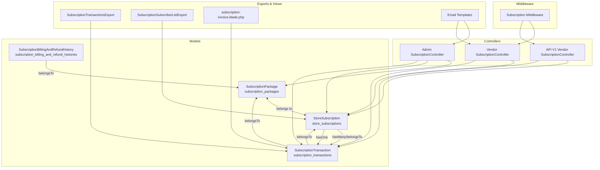
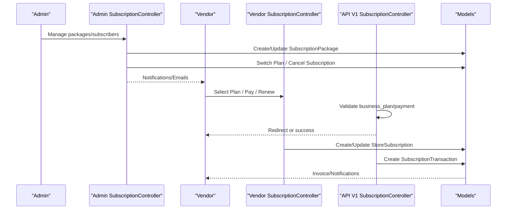
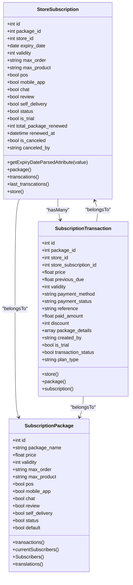
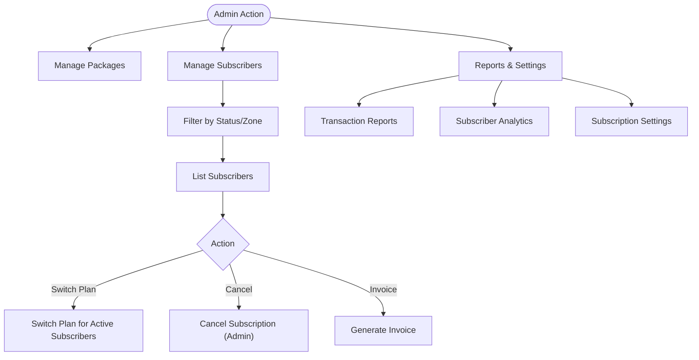
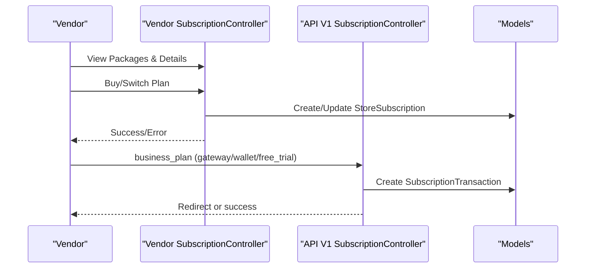
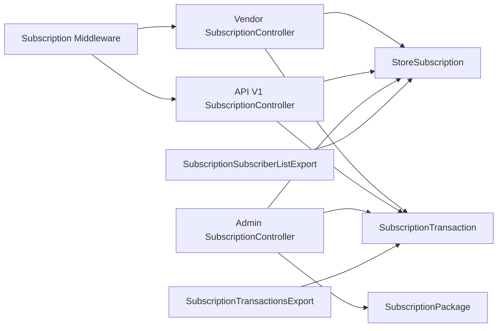
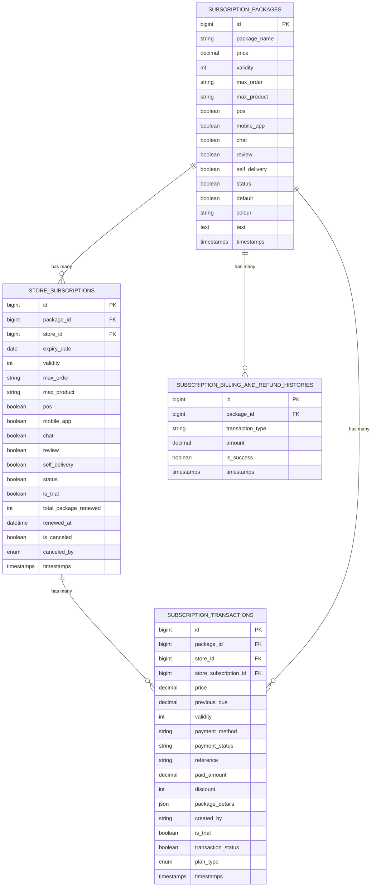

# Store Subscriptions

<cite>
**Referenced Files in This Document**
- [StoreSubscription.php](file://app/Models/StoreSubscription.php)
- [SubscriptionPackage.php](file://app/Models/SubscriptionPackage.php)
- [SubscriptionTransaction.php](file://app/Models/SubscriptionTransaction.php)
- [SubscriptionBillingAndRefundHistory.php](file://app/Models/SubscriptionBillingAndRefundHistory.php)
- [create_subscription_packages_table.php](file://database/migrations/2024_05_13_102547_create_subscription_packages_table.php)
- [create_store_subscriptions_table.php](file://database/migrations/2024_05_13_102612_create_store_subscriptions_table.php)
- [create_subscription_transactions_table.php](file://database/migrations/2024_05_13_104250_create_subscription_transactions_table.php)
- [SubscriptionController.php (Admin)](file://app/Http/Controllers/Admin/Subscription/SubscriptionController.php)
- [SubscriptionController.php (Vendor)](file://app/Http/Controllers/Vendor/SubscriptionController.php)
- [SubscriptionController.php (API V1)](file://app/Http/Controllers/Api/V1/Vendor/SubscriptionController.php)
- [Subscription.php (Middleware)](file://app/Http/Middleware/Subscription.php)
- [subscription-cancel-format.blade.php](file://resources/views/admin-views/business-settings/email-format-setting/store-email-formats/subscription-cancel-format.blade.php)
- [subscription-successful-format.blade.php](file://resources/views/admin-views/business-settings/email-format-setting/store-email-formats/subscription-successful-format.blade.php)
- [subscription-plan_upadte-format.blade.php](file://resources/views/admin-views/business-settings/email-format-setting/store-email-formats/subscription-plan_upadte-format.blade.php)
- [subscription-deadline-format.blade.php](file://resources/views/admin-views/business-settings/email-format-setting/store-email-formats/subscription-deadline-format.blade.php)
- [subscription-invoice.blade.php](file://resources/views/subscription-invoice.blade.php)
- [subscription-transactions.blade.php](file://resources/views/file-exports/subscription_transactions.blade.php)
- [subscription_subscriber_list.blade.php](file://resources/views/file-exports/subscription_subscriber_list.blade.php)
- [SubscriptionTransactionsExport.php](file://app/Exports/SubscriptionTransactionsExport.php)
- [SubscriptionSubscriberListExport.php](file://app/Exports/SubscriptionSubscriberListExport.php)
</cite>

## Table of Contents
1. [Introduction](#introduction)
2. [Project Structure](#project-structure)
3. [Core Components](#core-components)
4. [Architecture Overview](#architecture-overview)
5. [Detailed Component Analysis](#detailed-component-analysis)
6. [Dependency Analysis](#dependency-analysis)
7. [Performance Considerations](#performance-considerations)
8. [Troubleshooting Guide](#troubleshooting-guide)
9. [Conclusion](#conclusion)
10. [Appendices](#appendices)

## Introduction
This document explains the store subscription management system, focusing on subscription activation, plan changes, status tracking, and lifecycle management. It documents the StoreSubscription model and its relationships, subscription lifecycle events, renewal and cancellation workflows, vendor portal integration, automated renewal behavior, and analytics/reporting capabilities. It also covers payment history tracking, billing and refund handling, and administrative controls for managing packages and subscribers.

## Project Structure
The subscription system spans models, controllers, middleware, migrations, exports, and email templates. The following diagram shows the high-level structure and key interactions.

**Diagram sources**
- [SubscriptionPackage.php:10-89](file://app/Models/SubscriptionPackage.php#L10-L89)
- [StoreSubscription.php:10-57](file://app/Models/StoreSubscription.php#L10-L57)
- [SubscriptionTransaction.php:9-51](file://app/Models/SubscriptionTransaction.php#L9-L51)
- [SubscriptionBillingAndRefundHistory.php:8-17](file://app/Models/SubscriptionBillingAndRefundHistory.php#L8-L17)
- [SubscriptionController.php (Admin):31-995](file://app/Http/Controllers/Admin/Subscription/SubscriptionController.php#L31-L995)
- [SubscriptionController.php (Vendor):27-320](file://app/Http/Controllers/Vendor/SubscriptionController.php#L27-L320)
- [SubscriptionController.php (API V1):22-260](file://app/Http/Controllers/Api/V1/Vendor/SubscriptionController.php#L22-L260)
- [Subscription.php (Middleware):11-66](file://app/Http/Middleware/Subscription.php#L11-L66)
- [SubscriptionTransactionsExport.php](file://app/Exports/SubscriptionTransactionsExport.php)
- [SubscriptionSubscriberListExport.php](file://app/Exports/SubscriptionSubscriberListExport.php)
- [subscription-invoice.blade.php](file://resources/views/subscription-invoice.blade.php)
- [subscription-cancel-format.blade.php](file://resources/views/admin-views/business-settings/email-format-setting/store-email-formats/subscription-cancel-format.blade.php)
- [subscription-successful-format.blade.php](file://resources/views/admin-views/business-settings/email-format-setting/store-email-formats/subscription-successful-format.blade.php)
- [subscription-plan_upadte-format.blade.php](file://resources/views/admin-views/business-settings/email-format-setting/store-email-formats/subscription-plan_upadte-format.blade.php)
- [subscription-deadline-format.blade.php](file://resources/views/admin-views/business-settings/email-format-setting/store-email-formats/subscription-deadline-format.blade.php)

**Section sources**
- [create_subscription_packages_table.php:14-32](file://database/migrations/2024_05_13_102547_create_subscription_packages_table.php#L14-L32)
- [create_store_subscriptions_table.php:14-34](file://database/migrations/2024_05_13_102612_create_store_subscriptions_table.php#L14-L34)
- [create_subscription_transactions_table.php:15-35](file://database/migrations/2024_05_13_104250_create_subscription_transactions_table.php#L15-L35)

## Core Components
- SubscriptionPackage: Defines available subscription tiers, pricing, validity, feature flags, and internationalization support via translations.
- StoreSubscription: Tracks per-store subscription instances, including expiry date, validity, feature flags, status, trial flag, renewal counters, and cancellation metadata.
- SubscriptionTransaction: Records payment events, plan types (new, renew, free trial), amounts, discounts, and references.
- SubscriptionBillingAndRefundHistory: Captures billing adjustments and refund records linked to packages.

Key relationships:
- SubscriptionPackage has many StoreSubscription and SubscriptionTransaction.
- StoreSubscription belongs to SubscriptionPackage and has many SubscriptionTransaction entries.
- SubscriptionTransaction belongs to StoreSubscription and SubscriptionPackage.

**Section sources**
- [SubscriptionPackage.php:10-89](file://app/Models/SubscriptionPackage.php#L10-L89)
- [StoreSubscription.php:10-57](file://app/Models/StoreSubscription.php#L10-L57)
- [SubscriptionTransaction.php:9-51](file://app/Models/SubscriptionTransaction.php#L9-L51)
- [SubscriptionBillingAndRefundHistory.php:8-17](file://app/Models/SubscriptionBillingAndRefundHistory.php#L8-L17)

## Architecture Overview
The system integrates administrative and vendor-facing flows:
- Admin manages packages, subscribers, and reports; triggers plan switches and cancellations; sends notifications.
- Vendor selects plans, pays via gateway or wallet, renews, cancels, and reviews transactions.
- Middleware enforces feature permissions based on the active subscription.
- API endpoints support mobile/web integrations for plan selection and cancellation.

**Diagram sources**
- [SubscriptionController.php (Admin):31-995](file://app/Http/Controllers/Admin/Subscription/SubscriptionController.php#L31-L995)
- [SubscriptionController.php (Vendor):27-320](file://app/Http/Controllers/Vendor/SubscriptionController.php#L27-L320)
- [SubscriptionController.php (API V1):22-260](file://app/Http/Controllers/Api/V1/Vendor/SubscriptionController.php#L22-L260)
- [StoreSubscription.php:10-57](file://app/Models/StoreSubscription.php#L10-L57)
- [SubscriptionTransaction.php:9-51](file://app/Models/SubscriptionTransaction.php#L9-L51)

## Detailed Component Analysis

### StoreSubscription Model
Responsibilities:
- Tracks subscription lifecycle per store: status, expiry date, validity, feature flags, trial flag, renewal counters, cancellation metadata.
- Provides convenience accessors and relationships to package, transactions, and store.
- Applies zone scoping globally.

Lifecycle attributes:
- Status: active/expired/canceled.
- Expiry date: parsed accessor for downstream calculations.
- Renewal tracking: total_package_renewed and renewed_at.
- Cancellation: is_canceled and canceled_by (admin/store).

**Diagram sources**
- [StoreSubscription.php:10-57](file://app/Models/StoreSubscription.php#L10-L57)
- [SubscriptionPackage.php:10-89](file://app/Models/SubscriptionPackage.php#L10-L89)
- [SubscriptionTransaction.php:9-51](file://app/Models/SubscriptionTransaction.php#L9-L51)

**Section sources**
- [StoreSubscription.php:10-57](file://app/Models/StoreSubscription.php#L10-L57)
- [create_store_subscriptions_table.php:14-34](file://database/migrations/2024_05_13_102612_create_store_subscriptions_table.php#L14-L34)

### SubscriptionPackage Model
Responsibilities:
- Stores package metadata and feature flags.
- Provides scopes and localized name/text via translation morph.
- Aggregates subscriber counts and transaction summaries.

Key features:
- Global scope applies locale-specific translations.
- Helper attributes resolve translated values.

**Section sources**
- [SubscriptionPackage.php:10-89](file://app/Models/SubscriptionPackage.php#L10-L89)
- [create_subscription_packages_table.php:14-32](file://database/migrations/2024_05_13_102547_create_subscription_packages_table.php#L14-L32)

### SubscriptionTransaction Model
Responsibilities:
- Records each payment event with plan type, amounts, discounts, and references.
- Links to store, package, and optional store subscription record.

**Section sources**
- [SubscriptionTransaction.php:9-51](file://app/Models/SubscriptionTransaction.php#L9-L51)
- [create_subscription_transactions_table.php:15-35](file://database/migrations/2024_05_13_104250_create_subscription_transactions_table.php#L15-L35)

### SubscriptionBillingAndRefundHistory Model
Responsibilities:
- Tracks billing adjustments and refunds associated with packages.

**Section sources**
- [SubscriptionBillingAndRefundHistory.php:8-17](file://app/Models/SubscriptionBillingAndRefundHistory.php#L8-L17)

### Admin Subscription Management
Capabilities:
- Package CRUD with localization support.
- Subscriber listing with filters (active/expired/canceled/free trial), zone-based filtering, and analytics.
- Transaction reporting with date range and plan-type filters.
- Settings for deadline warnings, free trial configuration, and usage limits.
- Plan switching across all active subscribers of a package.
- Bulk cancellation with notifications.

**Diagram sources**
- [SubscriptionController.php (Admin):39-995](file://app/Http/Controllers/Admin/Subscription/SubscriptionController.php#L39-L995)

**Section sources**
- [SubscriptionController.php (Admin):39-995](file://app/Http/Controllers/Admin/Subscription/SubscriptionController.php#L39-L995)

### Vendor Portal Integration
Capabilities:
- View current subscription, available packages, and transaction history.
- Choose and pay for a plan via gateway or wallet.
- Cancel subscription and switch to commission model.
- Export transactions and view wallet refund transactions.

**Diagram sources**
- [SubscriptionController.php (Vendor):27-320](file://app/Http/Controllers/Vendor/SubscriptionController.php#L27-L320)
- [SubscriptionController.php (API V1):22-260](file://app/Http/Controllers/Api/V1/Vendor/SubscriptionController.php#L22-L260)

**Section sources**
- [SubscriptionController.php (Vendor):27-320](file://app/Http/Controllers/Vendor/SubscriptionController.php#L27-L320)
- [SubscriptionController.php (API V1):22-260](file://app/Http/Controllers/Api/V1/Vendor/SubscriptionController.php#L22-L260)

### Middleware Enforcement
The Subscription middleware enforces:
- Business model checks (commission vs. subscription).
- Unsubscribed or none states restrict actions.
- Feature permission checks based on subscription flags (reviews, POS, chat, self-delivery).

**Section sources**
- [Subscription.php (Middleware):11-66](file://app/Http/Middleware/Subscription.php#L11-L66)

### Subscription Lifecycle and Workflows

#### Activation
- New joiners select a plan and pay via gateway or wallet.
- Free trial option supported.
- On successful payment, a SubscriptionTransaction is recorded and StoreSubscription is created or updated accordingly.

**Section sources**
- [SubscriptionController.php (API V1):48-108](file://app/Http/Controllers/Api/V1/Vendor/SubscriptionController.php#L48-L108)
- [SubscriptionController.php (Vendor):156-196](file://app/Http/Controllers/Vendor/SubscriptionController.php#L156-L196)

#### Plan Changes (Upgrade/Downgrade)
- Admin can switch all active subscribers from one package to another or to commission.
- Vendor can change plan and receive pre-check results for disabled item counts and refund estimates.
- Pending bills are considered during plan change.

**Section sources**
- [SubscriptionController.php (Admin):740-775](file://app/Http/Controllers/Admin/Subscription/SubscriptionController.php#L740-L775)
- [SubscriptionController.php (API V1):229-258](file://app/Http/Controllers/Api/V1/Vendor/SubscriptionController.php#L229-L258)
- [SubscriptionController.php (Vendor):128-155](file://app/Http/Controllers/Vendor/SubscriptionController.php#L128-L155)

#### Renewals
- Renewal date is extended based on validity days.
- Renewal counter is incremented.
- Renewal transactions are recorded with plan_type "renew".

**Section sources**
- [create_store_subscriptions_table.php:18-30](file://database/migrations/2024_05_13_102612_create_store_subscriptions_table.php#L18-L30)
- [create_subscription_transactions_table.php:32-32](file://database/migrations/2024_05_13_104250_create_subscription_transactions_table.php#L32-L32)

#### Cancellations
- Admin or vendor can cancel; canceled_by indicates origin.
- Cancellation triggers notifications and updates status.
- Commission switch deactivates subscription.

**Section sources**
- [SubscriptionController.php (Admin):546-604](file://app/Http/Controllers/Admin/Subscription/SubscriptionController.php#L546-L604)
- [SubscriptionController.php (Vendor):52-109](file://app/Http/Controllers/Vendor/SubscriptionController.php#L52-L109)
- [create_store_subscriptions_table.php:31-33](file://database/migrations/2024_05_13_102612_create_store_subscriptions_table.php#L31-L33)

#### Grace Period Handling
- Admin settings define deadline warning days and messages.
- Expiration soon indicators help identify subscriptions nearing expiry.

**Section sources**
- [SubscriptionController.php (Admin):272-319](file://app/Http/Controllers/Admin/Subscription/SubscriptionController.php#L272-L319)

### Status Tracking and Monitoring
- StoreSubscription status reflects active/expired/canceled.
- Expiry date parsing supports downstream alerts and renewal triggers.
- Transaction plan_type distinguishes new, renew, free trial, and shifts.

**Section sources**
- [StoreSubscription.php:54-56](file://app/Models/StoreSubscription.php#L54-L56)
- [create_store_subscriptions_table.php:27-33](file://database/migrations/2024_05_13_102612_create_store_subscriptions_table.php#L27-L33)
- [create_subscription_transactions_table.php:32-32](file://database/migrations/2024_05_13_104250_create_subscription_transactions_table.php#L32-L32)

### Automated Renewal Workflows
- Renewal logic is driven by validity days and renewal counters.
- Renewal transactions are created upon successful payment or system-triggered renewal.
- Pending bills are considered during renewal.

**Section sources**
- [create_store_subscriptions_table.php:18-30](file://database/migrations/2024_05_13_102612_create_store_subscriptions_table.php#L18-L30)
- [create_subscription_transactions_table.php:32-32](file://database/migrations/2024_05_13_104250_create_subscription_transactions_table.php#L32-L32)

### Vendor Portal Integration Details
- Email templates for subscription events (cancel, successful, plan update, deadline, renew, shift).
- Invoice generation for transactions.
- Export of transactions and subscriber lists.

**Section sources**
- [subscription-cancel-format.blade.php](file://resources/views/admin-views/business-settings/email-format-setting/store-email-formats/subscription-cancel-format.blade.php)
- [subscription-successful-format.blade.php](file://resources/views/admin-views/business-settings/email-format-setting/store-email-formats/subscription-successful-format.blade.php)
- [subscription-plan_upadte-format.blade.php](file://resources/views/admin-views/business-settings/email-format-setting/store-email-formats/subscription-plan_upadte-format.blade.php)
- [subscription-deadline-format.blade.php](file://resources/views/admin-views/business-settings/email-format-setting/store-email-formats/subscription-deadline-format.blade.php)
- [subscription-invoice.blade.php](file://resources/views/subscription-invoice.blade.php)
- [subscription-transactions.blade.php](file://resources/views/file-exports/subscription_transactions.blade.php)
- [subscription_subscriber_list.blade.php](file://resources/views/file-exports/subscription_subscriber_list.blade.php)
- [SubscriptionTransactionsExport.php](file://app/Exports/SubscriptionTransactionsExport.php)
- [SubscriptionSubscriberListExport.php](file://app/Exports/SubscriptionSubscriberListExport.php)

## Dependency Analysis
- Models encapsulate domain logic and relationships.
- Controllers orchestrate business flows and delegate to helpers for payment and refund computations.
- Middleware enforces runtime policy based on subscription features.
- Exports and views depend on models for reporting.

**Diagram sources**
- [SubscriptionController.php (Vendor):27-320](file://app/Http/Controllers/Vendor/SubscriptionController.php#L27-L320)
- [SubscriptionController.php (API V1):22-260](file://app/Http/Controllers/Api/V1/Vendor/SubscriptionController.php#L22-L260)
- [SubscriptionController.php (Admin):31-995](file://app/Http/Controllers/Admin/Subscription/SubscriptionController.php#L31-L995)
- [Subscription.php (Middleware):11-66](file://app/Http/Middleware/Subscription.php#L11-L66)
- [SubscriptionTransactionsExport.php](file://app/Exports/SubscriptionTransactionsExport.php)
- [SubscriptionSubscriberListExport.php](file://app/Exports/SubscriptionSubscriberListExport.php)

**Section sources**
- [SubscriptionController.php (Vendor):27-320](file://app/Http/Controllers/Vendor/SubscriptionController.php#L27-L320)
- [SubscriptionController.php (API V1):22-260](file://app/Http/Controllers/Api/V1/Vendor/SubscriptionController.php#L22-L260)
- [SubscriptionController.php (Admin):31-995](file://app/Http/Controllers/Admin/Subscription/SubscriptionController.php#L31-L995)
- [Subscription.php (Middleware):11-66](file://app/Http/Middleware/Subscription.php#L11-L66)

## Performance Considerations
- Use pagination for subscriber and transaction listings to avoid heavy queries.
- Apply appropriate scopes and global scopes judiciously to limit result sets.
- Index frequently filtered columns (store_id, package_id, created_at, expiry_date) in migrations.
- Batch operations for plan switches to minimize repeated writes.

## Troubleshooting Guide
Common issues and resolutions:
- Insufficient wallet balance: Ensure wallet balance covers package price plus pending bills before initiating wallet payments.
- Feature access denied: Verify the active subscription includes the requested feature (reviews, POS, chat, self-delivery).
- Subscription expired/unsubscribed: Prompt users to renew or choose commission mode.
- Plan change conflicts: Check pending bills and disabled item counts returned by pre-check endpoints.

**Section sources**
- [SubscriptionController.php (Vendor):174-191](file://app/Http/Controllers/Vendor/SubscriptionController.php#L174-L191)
- [SubscriptionController.php (API V1):65-81](file://app/Http/Controllers/Api/V1/Vendor/SubscriptionController.php#L65-L81)
- [Subscription.php (Middleware):20-64](file://app/Http/Middleware/Subscription.php#L20-L64)

## Conclusion
The store subscription system provides a robust foundation for managing subscription lifecycles, enabling flexible plan choices, automated renewals, and comprehensive reporting. Administrative controls, vendor self-service, and middleware enforcement ensure consistent policy adherence while supporting scalable growth.

## Appendices

### Data Models Diagram

**Diagram sources**
- [create_subscription_packages_table.php:14-32](file://database/migrations/2024_05_13_102547_create_subscription_packages_table.php#L14-L32)
- [create_store_subscriptions_table.php:14-34](file://database/migrations/2024_05_13_102612_create_store_subscriptions_table.php#L14-L34)
- [create_subscription_transactions_table.php:15-35](file://database/migrations/2024_05_13_104250_create_subscription_transactions_table.php#L15-L35)
- [SubscriptionBillingAndRefundHistory.php:8-17](file://app/Models/SubscriptionBillingAndRefundHistory.php#L8-L17)