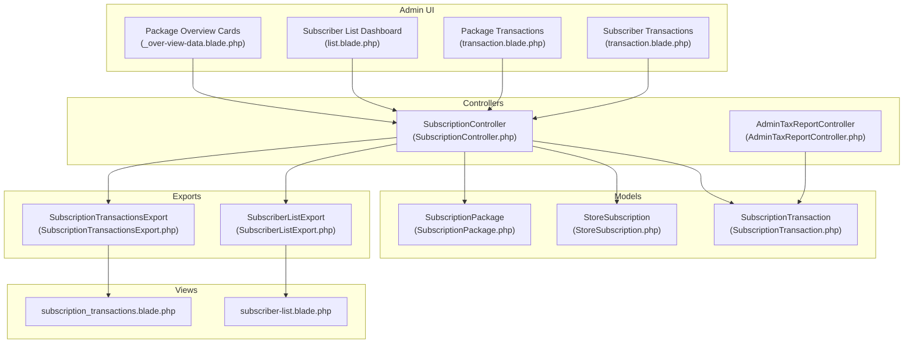
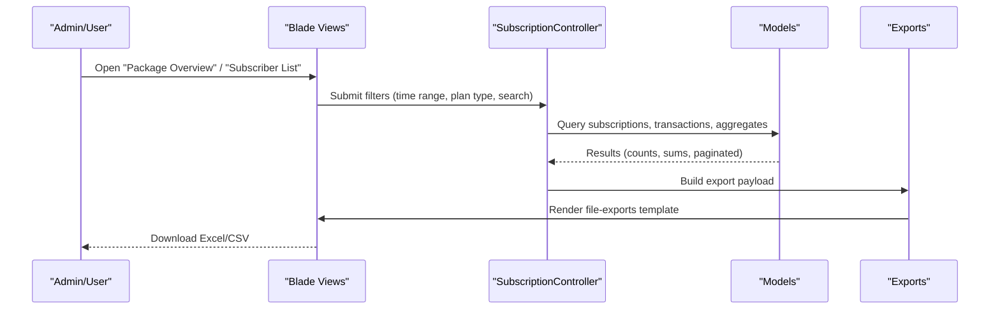
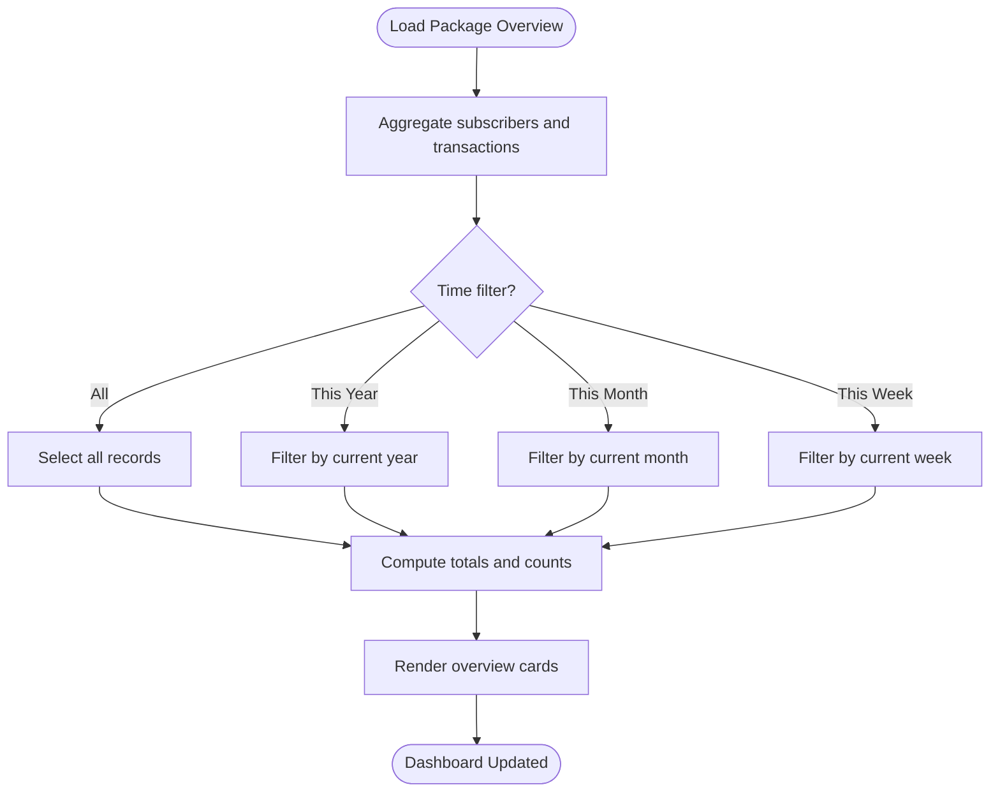
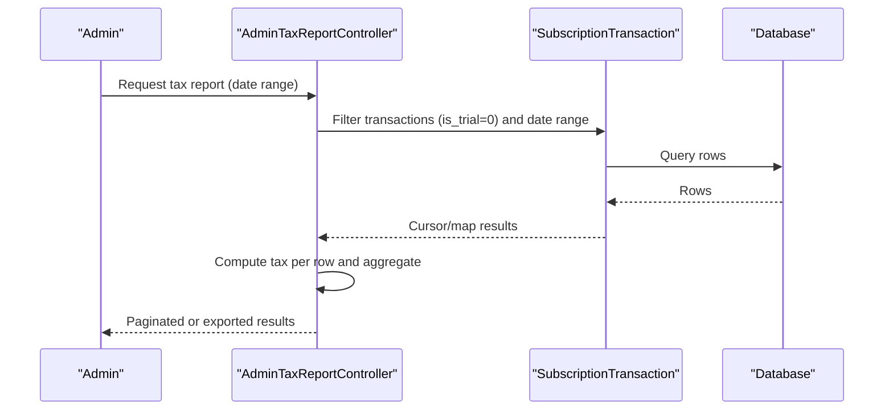
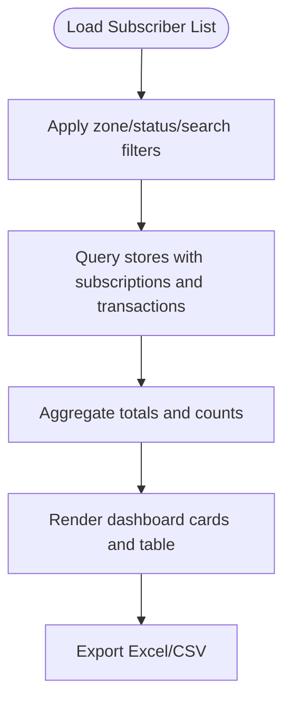
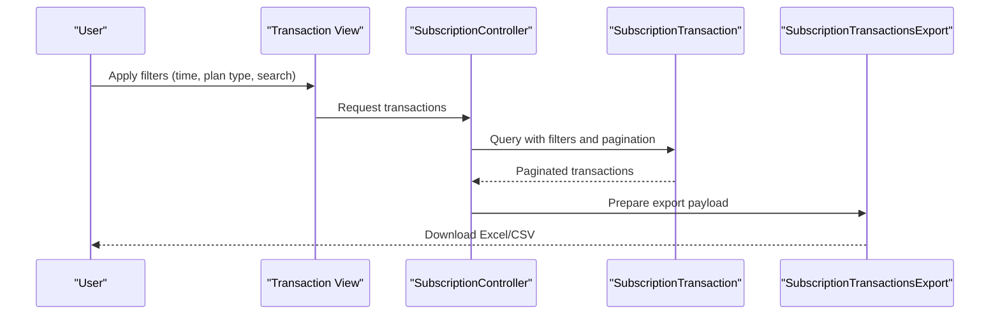
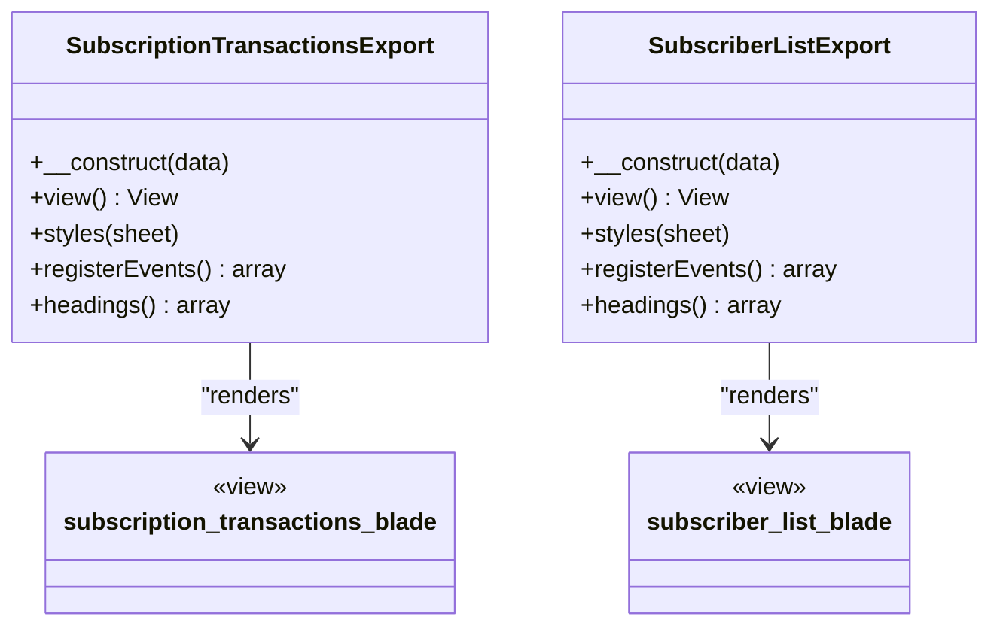
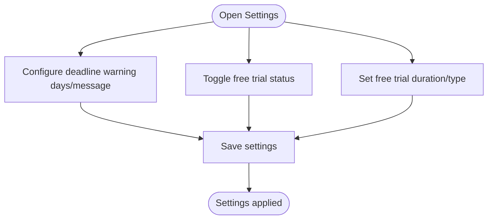
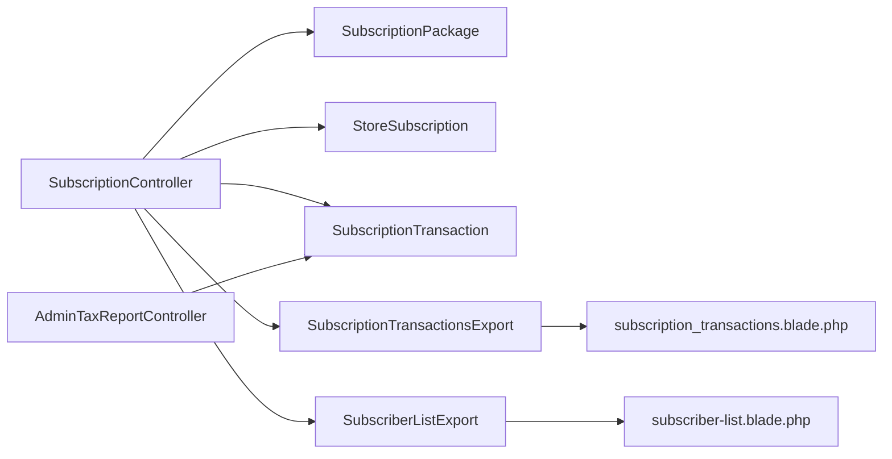

# Subscription Analytics

<cite>
**Referenced Files in This Document**
- [SubscriptionController.php](file://app/Http/Controllers/Admin/Subscription/SubscriptionController.php)
- [AdminTaxReportController.php](file://app/Http/Controllers/Admin/AdminTaxReportController.php)
- [SubscriptionPackage.php](file://app/Models/SubscriptionPackage.php)
- [StoreSubscription.php](file://app/Models/StoreSubscription.php)
- [SubscriptionTransaction.php](file://app/Models/SubscriptionTransaction.php)
- [SubscriptionTransactionsExport.php](file://app/Exports/SubscriptionTransactionsExport.php)
- [SubscriberListExport.php](file://app/Exports/SubscriberListExport.php)
- [subscription_transactions.blade.php](file://resources/views/file-exports/subscription_transactions.blade.php)
- [subscriber-list.blade.php](file://resources/views/file-exports/subscriber-list.blade.php)
- [package-details.blade.php](file://resources/views/admin-views/subscription/package/package-details.blade.php)
- [_over-view-data.blade.php](file://resources/views/admin-views/subscription/package/partial/_over-view-data.blade.php)
- [list.blade.php](file://resources/views/admin-views/subscription/subscriber/list.blade.php)
- [transaction.blade.php](file://resources/views/admin-views/subscription/package/transaction.blade.php)
- [transaction.blade.php](file://resources/views/admin-views/subscription/subscriber/transaction.blade.php)
- [transaction.blade.php](file://resources/views/vendor-views/subscription/subscriber/transaction.blade.php)
- [wallet-transaction.blade.php](file://resources/views/vendor-views/subscription/subscriber/wallet-transaction.blade.php)
- [admin/partials/_sidebar_settings.blade.php](file://resources/views/layouts/admin/partials/_sidebar_settings.blade.php)
- [admin_formatted_routes.json](file://public/admin_formatted_routes.json)
</cite>

## Table of Contents
1. [Introduction](#introduction)
2. [Project Structure](#project-structure)
3. [Core Components](#core-components)
4. [Architecture Overview](#architecture-overview)
5. [Detailed Component Analysis](#detailed-component-analysis)
6. [Dependency Analysis](#dependency-analysis)
7. [Performance Considerations](#performance-considerations)
8. [Troubleshooting Guide](#troubleshooting-guide)
9. [Conclusion](#conclusion)

## Introduction
This document explains the subscription reporting and analytics capabilities of the platform, focusing on revenue tracking, subscriber metrics, and business insights. It covers subscription transaction exports, revenue reports, subscriber acquisition analytics, reporting dashboards, churn analysis, lifetime value calculations, export functionality for subscription data (CSV generation), automated reporting schedules, and administrative tools for monitoring subscription performance and generating business intelligence.

## Project Structure
The subscription analytics feature spans controllers, models, exports, Blade templates, and admin navigation. Key areas:
- Controllers orchestrate analytics queries, filters, and exports.
- Models define relationships among packages, subscriptions, and transactions.
- Exports transform query results into downloadable spreadsheets.
- Views render dashboards, cards, and export dropdowns.
- Navigation exposes subscription management and reporting menus.

**Diagram sources**
- [SubscriptionController.php:272-319](file://app/Http/Controllers/Admin/Subscription/SubscriptionController.php#L272-L319)
- [AdminTaxReportController.php:103-140](file://app/Http/Controllers/Admin/AdminTaxReportController.php#L103-L140)
- [SubscriptionPackage.php:43-54](file://app/Models/SubscriptionPackage.php#L43-L54)
- [StoreSubscription.php:34-45](file://app/Models/StoreSubscription.php#L34-L45)
- [SubscriptionTransaction.php:34-45](file://app/Models/SubscriptionTransaction.php#L34-L45)
- [SubscriptionTransactionsExport.php:18-32](file://app/Exports/SubscriptionTransactionsExport.php#L18-L32)
- [SubscriberListExport.php:20-35](file://app/Exports/SubscriberListExport.php#L20-L35)
- [_over-view-data.blade.php:1-24](file://resources/views/admin-views/subscription/package/partial/_over-view-data.blade.php#L1-L24)
- [list.blade.php:37-57](file://resources/views/admin-views/subscription/subscriber/list.blade.php#L37-L57)
- [transaction.blade.php:130-144](file://resources/views/admin-views/subscription/package/transaction.blade.php#L130-L144)
- [transaction.blade.php:143-157](file://resources/views/admin-views/subscription/subscriber/transaction.blade.php#L143-L157)
- [transaction.blade.php:141-155](file://resources/views/vendor-views/subscription/subscriber/transaction.blade.php#L141-L155)
- [subscription_transactions.blade.php:1-107](file://resources/views/file-exports/subscription_transactions.blade.php#L1-L107)
- [subscriber-list.blade.php:1-26](file://resources/views/file-exports/subscriber-list.blade.php#L1-L26)

**Section sources**
- [SubscriptionController.php:39-84](file://app/Http/Controllers/Admin/Subscription/SubscriptionController.php#L39-L84)
- [admin/partials/_sidebar_settings.blade.php:160-191](file://resources/views/layouts/admin/partials/_sidebar_settings.blade.php#L160-L191)

## Core Components
- Subscription analytics dashboard cards: total subscribers, active subscriptions, expired subscriptions, and upcoming expirations.
- Revenue tracking: transaction counts, amounts, and tax computations.
- Subscriber acquisition analytics: subscriber lists, statuses (active/expired/canceled/free trial), and monthly paid amounts.
- Reporting dashboards: per-package and per-subscriber transaction views with filtering by time frames and plan types.
- Export functionality: Excel/CSV downloads for transactions and subscriber lists.
- Administrative tools: settings for free trial, deadline warnings, and plan switching.

**Section sources**
- [SubscriptionController.php:272-319](file://app/Http/Controllers/Admin/Subscription/SubscriptionController.php#L272-L319)
- [SubscriptionController.php:420-524](file://app/Http/Controllers/Admin/Subscription/SubscriptionController.php#L420-L524)
- [transaction.blade.php:130-144](file://resources/views/admin-views/subscription/package/transaction.blade.php#L130-L144)
- [transaction.blade.php:143-157](file://resources/views/admin-views/subscription/subscriber/transaction.blade.php#L143-L157)
- [transaction.blade.php:141-155](file://resources/views/vendor-views/subscription/subscriber/transaction.blade.php#L141-L155)

## Architecture Overview
The analytics pipeline integrates UI filters, controller queries, model relations, and export rendering.

**Diagram sources**
- [SubscriptionController.php:322-364](file://app/Http/Controllers/Admin/Subscription/SubscriptionController.php#L322-L364)
- [SubscriptionController.php:808-866](file://app/Http/Controllers/Admin/Subscription/SubscriptionController.php#L808-L866)
- [SubscriptionController.php:867-927](file://app/Http/Controllers/Admin/Subscription/SubscriptionController.php#L867-L927)
- [subscription_transactions.blade.php:1-107](file://resources/views/file-exports/subscription_transactions.blade.php#L1-L107)
- [subscriber-list.blade.php:1-26](file://resources/views/file-exports/subscriber-list.blade.php#L1-L26)

## Detailed Component Analysis

### Subscription Analytics Dashboard
- Overview cards display total subscribers, active subscriptions, expired subscriptions, and upcoming expiration alerts based on deadline warning days.
- Per-package statistics support filtering by all/this year/this month/this week.

**Diagram sources**
- [SubscriptionController.php:272-319](file://app/Http/Controllers/Admin/Subscription/SubscriptionController.php#L272-L319)
- [_over-view-data.blade.php:1-24](file://resources/views/admin-views/subscription/package/partial/_over-view-data.blade.php#L1-L24)
- [package-details.blade.php:39-73](file://resources/views/admin-views/subscription/package/package-details.blade.php#L39-L73)

**Section sources**
- [SubscriptionController.php:272-319](file://app/Http/Controllers/Admin/Subscription/SubscriptionController.php#L272-L319)
- [_over-view-data.blade.php:1-24](file://resources/views/admin-views/subscription/package/partial/_over-view-data.blade.php#L1-L24)
- [list.blade.php:37-57](file://resources/views/admin-views/subscription/subscriber/list.blade.php#L37-L57)

### Revenue Tracking and Tax Reports
- Revenue aggregates include total free trials, renewed transactions, and total paid amounts filtered by time frames.
- Tax computation aggregates paid amounts by configured taxes and computes tax amounts per transaction or aggregated totals.

**Diagram sources**
- [AdminTaxReportController.php:103-140](file://app/Http/Controllers/Admin/AdminTaxReportController.php#L103-L140)
- [AdminTaxReportController.php:380-405](file://app/Http/Controllers/Admin/AdminTaxReportController.php#L380-L405)

**Section sources**
- [SubscriptionController.php:298-316](file://app/Http/Controllers/Admin/Subscription/SubscriptionController.php#L298-L316)
- [AdminTaxReportController.php:103-140](file://app/Http/Controllers/Admin/AdminTaxReportController.php#L103-L140)
- [AdminTaxReportController.php:380-405](file://app/Http/Controllers/Admin/AdminTaxReportController.php#L380-L405)

### Subscriber Metrics and Acquisition Analytics
- Subscriber list supports filtering by zone, subscription status (active/expired/canceled/free trial), and search.
- Aggregates include total subscribers, active subscriptions, upcoming expiration, and expired inactive subscribers.
- Monthly paid amount and total transactions are computed for revenue attribution.

**Diagram sources**
- [SubscriptionController.php:420-524](file://app/Http/Controllers/Admin/Subscription/SubscriptionController.php#L420-L524)
- [list.blade.php:37-57](file://resources/views/admin-views/subscription/subscriber/list.blade.php#L37-L57)

**Section sources**
- [SubscriptionController.php:420-524](file://app/Http/Controllers/Admin/Subscription/SubscriptionController.php#L420-L524)
- [list.blade.php:37-57](file://resources/views/admin-views/subscription/subscriber/list.blade.php#L37-L57)

### Reporting Dashboards
- Package-level transaction dashboard: filter by time frame and plan type, paginate, and export.
- Subscriber-level transaction dashboard: filter by time frame and plan type, paginate, and export.

**Diagram sources**
- [transaction.blade.php:130-144](file://resources/views/admin-views/subscription/package/transaction.blade.php#L130-L144)
- [transaction.blade.php:143-157](file://resources/views/admin-views/subscription/subscriber/transaction.blade.php#L143-L157)
- [transaction.blade.php:141-155](file://resources/views/vendor-views/subscription/subscriber/transaction.blade.php#L141-L155)
- [SubscriptionController.php:808-866](file://app/Http/Controllers/Admin/Subscription/SubscriptionController.php#L808-L866)
- [SubscriptionController.php:929-982](file://app/Http/Controllers/Admin/Subscription/SubscriptionController.php#L929-L982)

**Section sources**
- [transaction.blade.php:130-144](file://resources/views/admin-views/subscription/package/transaction.blade.php#L130-L144)
- [transaction.blade.php:143-157](file://resources/views/admin-views/subscription/subscriber/transaction.blade.php#L143-L157)
- [transaction.blade.php:141-155](file://resources/views/vendor-views/subscription/subscriber/transaction.blade.php#L141-L155)
- [SubscriptionController.php:808-866](file://app/Http/Controllers/Admin/Subscription/SubscriptionController.php#L808-L866)
- [SubscriptionController.php:929-982](file://app/Http/Controllers/Admin/Subscription/SubscriptionController.php#L929-L982)

### Export Functionality and Automated Reporting
- Transaction exports: per package and per subscriber, supporting Excel and CSV.
- Subscriber list export: Excel and CSV for subscriber records.
- Export templates render standardized headers and rows for spreadsheets.

**Diagram sources**
- [SubscriptionTransactionsExport.php:18-116](file://app/Exports/SubscriptionTransactionsExport.php#L18-L116)
- [SubscriberListExport.php:20-110](file://app/Exports/SubscriberListExport.php#L20-L110)
- [subscription_transactions.blade.php:1-107](file://resources/views/file-exports/subscription_transactions.blade.php#L1-L107)
- [subscriber-list.blade.php:1-26](file://resources/views/file-exports/subscriber-list.blade.php#L1-L26)

**Section sources**
- [SubscriptionTransactionsExport.php:18-116](file://app/Exports/SubscriptionTransactionsExport.php#L18-L116)
- [SubscriberListExport.php:20-110](file://app/Exports/SubscriberListExport.php#L20-L110)
- [subscription_transactions.blade.php:1-107](file://resources/views/file-exports/subscription_transactions.blade.php#L1-L107)
- [subscriber-list.blade.php:1-26](file://resources/views/file-exports/subscriber-list.blade.php#L1-L26)
- [SubscriptionController.php:808-866](file://app/Http/Controllers/Admin/Subscription/SubscriptionController.php#L808-L866)
- [SubscriptionController.php:867-927](file://app/Http/Controllers/Admin/Subscription/SubscriptionController.php#L867-L927)
- [SubscriptionController.php:929-982](file://app/Http/Controllers/Admin/Subscription/SubscriptionController.php#L929-L982)

### Administrative Tools and Settings
- Subscription settings include deadline warning days/messages, free trial configuration, and usage limits.
- Navigation exposes subscription management and reporting menus for administrators.

**Diagram sources**
- [SubscriptionController.php:365-407](file://app/Http/Controllers/Admin/Subscription/SubscriptionController.php#L365-L407)
- [admin/partials/_sidebar_settings.blade.php:160-191](file://resources/views/layouts/admin/partials/_sidebar_settings.blade.php#L160-L191)
- [admin_formatted_routes.json:974-975](file://public/admin_formatted_routes.json#L974-L975)

**Section sources**
- [SubscriptionController.php:365-407](file://app/Http/Controllers/Admin/Subscription/SubscriptionController.php#L365-L407)
- [admin/partials/_sidebar_settings.blade.php:160-191](file://resources/views/layouts/admin/partials/_sidebar_settings.blade.php#L160-L191)
- [admin_formatted_routes.json:974-975](file://public/admin_formatted_routes.json#L974-L975)

## Dependency Analysis
- Controllers depend on models for aggregations and relations.
- Exports depend on Blade templates for rendering.
- Views depend on controllers for data and routes for exports.

**Diagram sources**
- [SubscriptionController.php:44-54](file://app/Http/Controllers/Admin/Subscription/SubscriptionController.php#L44-L54)
- [SubscriptionTransactionsExport.php:27-32](file://app/Exports/SubscriptionTransactionsExport.php#L27-L32)
- [SubscriberListExport.php:30-35](file://app/Exports/SubscriberListExport.php#L30-L35)
- [subscription_transactions.blade.php:1-107](file://resources/views/file-exports/subscription_transactions.blade.php#L1-L107)
- [subscriber-list.blade.php:1-26](file://resources/views/file-exports/subscriber-list.blade.php#L1-L26)
- [AdminTaxReportController.php:380-405](file://app/Http/Controllers/Admin/AdminTaxReportController.php#L380-L405)

**Section sources**
- [SubscriptionController.php:44-54](file://app/Http/Controllers/Admin/Subscription/SubscriptionController.php#L44-L54)
- [SubscriptionTransactionsExport.php:27-32](file://app/Exports/SubscriptionTransactionsExport.php#L27-L32)
- [SubscriberListExport.php:30-35](file://app/Exports/SubscriberListExport.php#L30-L35)
- [subscription_transactions.blade.php:1-107](file://resources/views/file-exports/subscription_transactions.blade.php#L1-L107)
- [subscriber-list.blade.php:1-26](file://resources/views/file-exports/subscriber-list.blade.php#L1-L26)
- [AdminTaxReportController.php:380-405](file://app/Http/Controllers/Admin/AdminTaxReportController.php#L380-L405)

## Performance Considerations
- Use time-range filters to limit dataset sizes for revenue and transaction queries.
- Prefer indexed columns (e.g., created_at, store_id, package_id) for efficient filtering.
- Batch exports should leverage cursor-based retrieval for large datasets to reduce memory overhead.
- Dashboard cards compute aggregates via grouped queries; keep filters explicit to avoid full-table scans.

## Troubleshooting Guide
- Export downloads fail: verify export routes and controller actions for correct MIME types and filenames.
- Empty reports: confirm selected time filters and plan types; ensure data exists within the chosen date range.
- Incorrect tax amounts: validate configured tax rates and date range selections in tax report generation.
- Navigation missing: check admin sidebar permissions and route availability for subscription management.

**Section sources**
- [SubscriptionController.php:808-866](file://app/Http/Controllers/Admin/Subscription/SubscriptionController.php#L808-L866)
- [SubscriptionController.php:867-927](file://app/Http/Controllers/Admin/Subscription/SubscriptionController.php#L867-L927)
- [AdminTaxReportController.php:103-140](file://app/Http/Controllers/Admin/AdminTaxReportController.php#L103-L140)

## Conclusion
The platform provides a comprehensive subscription analytics suite with real-time dashboards, granular transaction reporting, and robust export capabilities. Administrators can monitor subscriber health, revenue trends, and tax compliance, while exporting data for external analysis. Settings enable fine-tuning of trial periods, deadlines, and operational thresholds to support business intelligence and strategic decision-making.