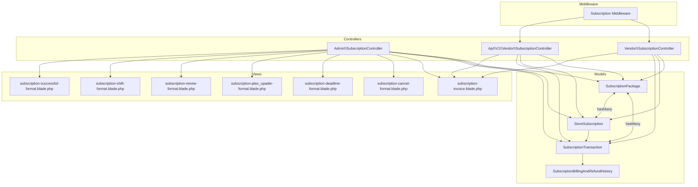
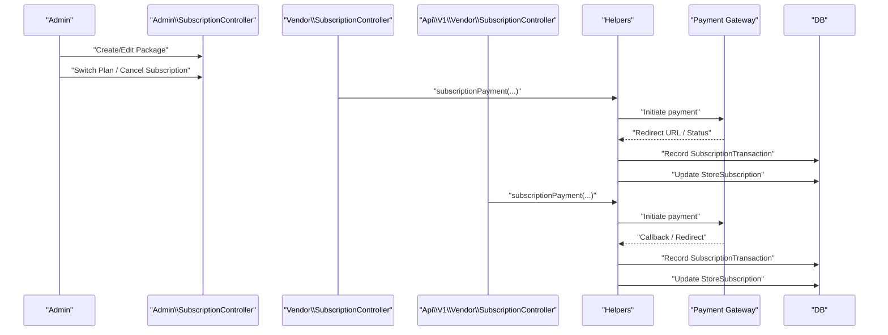
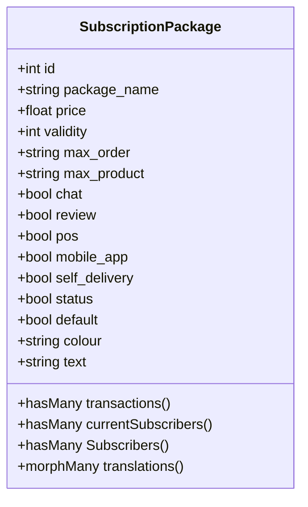
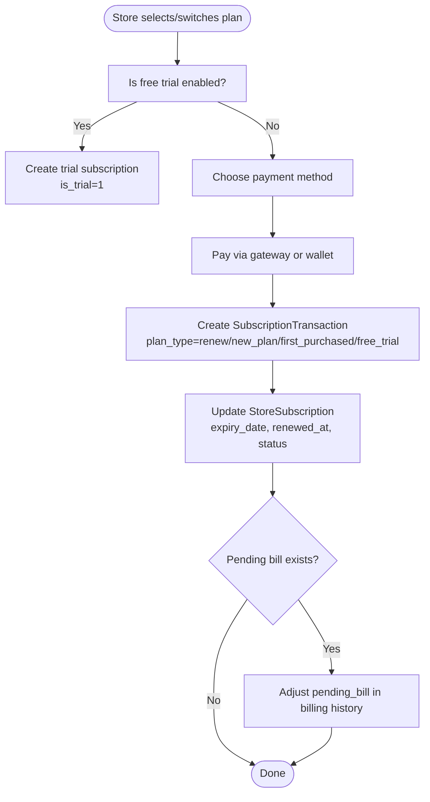
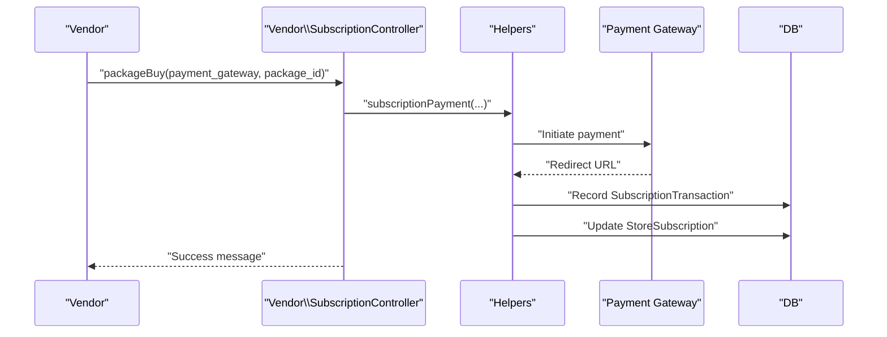
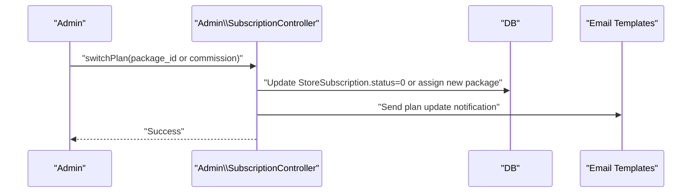
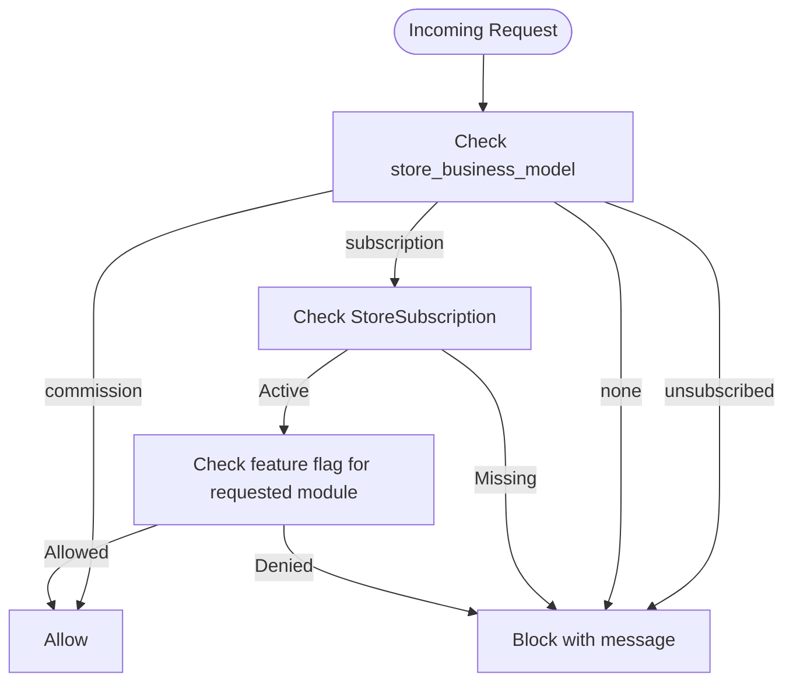
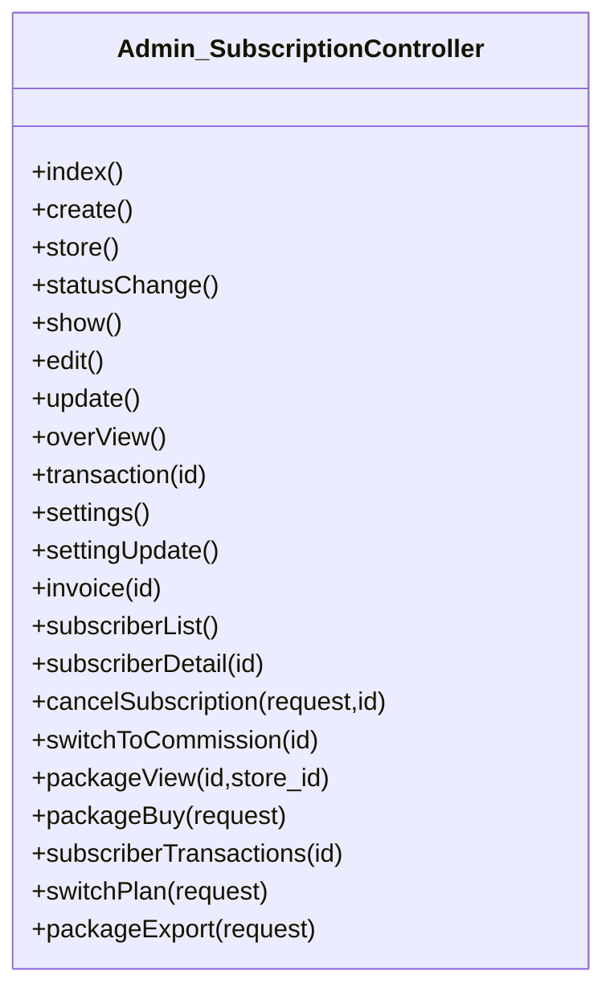
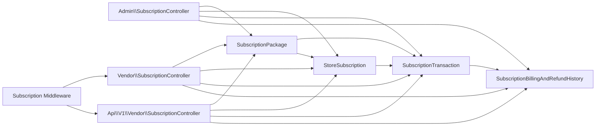

# Subscription Management

<cite>
**Referenced Files in This Document**
- [SubscriptionPackage.php](file://app/Models/SubscriptionPackage.php)
- [StoreSubscription.php](file://app/Models/StoreSubscription.php)
- [SubscriptionTransaction.php](file://app/Models/SubscriptionTransaction.php)
- [SubscriptionBillingAndRefundHistory.php](file://app/Models/SubscriptionBillingAndRefundHistory.php)
- [2024_05_13_102547_create_subscription_packages_table.php](file://database/migrations/2024_05_13_102547_create_subscription_packages_table.php)
- [2024_05_13_102612_create_store_subscriptions_table.php](file://database/migrations/2024_05_13_102612_create_store_subscriptions_table.php)
- [2024_05_13_104250_create_subscription_transactions_table.php](file://database/migrations/2024_05_13_104250_create_subscription_transactions_table.php)
- [2024_05_22_115717_create_subscription_billing_and_refund_histories_table.php](file://database/migrations/2024_05_22_115717_create_subscription_billing_and_refund_histories_table.php)
- [Admin SubscriptionController.php](file://app/Http/Controllers/Admin/Subscription/SubscriptionController.php)
- [Vendor SubscriptionController.php](file://app/Http/Controllers/Vendor/SubscriptionController.php)
- [API Vendor SubscriptionController.php](file://app/Http/Controllers/Api/V1/Vendor/SubscriptionController.php)
- [Subscription middleware](file://app/Http/Middleware/Subscription.php)
- [subscription-invoice.blade.php](file://resources/views/subscription-invoice.blade.php)
- [subscription-cancel-format.blade.php](file://resources/views/admin-views/business-settings/email-format-setting/store-email-formats/subscription-cancel-format.blade.php)
- [subscription-deadline-format.blade.php](file://resources/views/admin-views/business-settings/email-format-setting/store-email-formats/subscription-deadline-format.blade.php)
- [subscription-plan_upadte-format.blade.php](file://resources/views/admin-views/business-settings/email-format-setting/store-email-formats/subscription-plan_upadte-format.blade.php)
- [subscription-renew-format.blade.php](file://resources/views/admin-views/business-settings/email-format-setting/store-email-formats/subscription-renew-format.blade.php)
- [subscription-shift-format.blade.php](file://resources/views/admin-views/business-settings/email-format-setting/store-email-formats/subscription-shift-format.blade.php)
- [subscription-successful-format.blade.php](file://resources/views/admin-views/business-settings/email-format-setting/store-email-formats/subscription-successful-format.blade.php)
- [subscription_subscriber_list.blade.php](file://resources/views/file-exports/subscription_subscriber_list.blade.php)
- [subscription_transactions.blade.php](file://resources/views/file-exports/subscription_transactions.blade.php)
- [admin-subscription-tax-details-report.blade.php](file://resources/views/file-exports/admin-subscription-tax-details-report.blade.php)
</cite>

## Table of Contents
1. [Introduction](#introduction)
2. [Project Structure](#project-structure)
3. [Core Components](#core-components)
4. [Architecture Overview](#architecture-overview)
5. [Detailed Component Analysis](#detailed-component-analysis)
6. [Dependency Analysis](#dependency-analysis)
7. [Performance Considerations](#performance-considerations)
8. [Troubleshooting Guide](#troubleshooting-guide)
9. [Conclusion](#conclusion)
10. [Appendices](#appendices)

## Introduction
This document explains the subscription management system for stores, including business plan configurations, payment processing, renewal cycles, feature limitations, and administrative controls. It covers how subscription packages are created and managed, how store subscriptions are activated and upgraded/downgraded, how cancellations are processed, and how integrations with payment gateways and notifications work. It also documents reporting and analytics capabilities for business insights.

## Project Structure
The subscription system spans models, migrations, controllers, middleware, and views. The core domain entities are:
- SubscriptionPackage: defines available business plans and feature flags
- StoreSubscription: tracks individual store subscriptions and lifecycle
- SubscriptionTransaction: records billing events and payments
- SubscriptionBillingAndRefundHistory: tracks pending bills and refunds

**Diagram sources**
- [SubscriptionPackage.php:43-54](file://app/Models/SubscriptionPackage.php#L43-L54)
- [StoreSubscription.php:34-45](file://app/Models/StoreSubscription.php#L34-L45)
- [SubscriptionTransaction.php:34-45](file://app/Models/SubscriptionTransaction.php#L34-L45)
- [SubscriptionBillingAndRefundHistory.php:13-16](file://app/Models/SubscriptionBillingAndRefundHistory.php#L13-L16)
- [Admin SubscriptionController.php:44-58](file://app/Http/Controllers/Admin/Subscription/SubscriptionController.php#L44-L58)
- [Vendor SubscriptionController.php:39-49](file://app/Http/Controllers/Vendor/SubscriptionController.php#L39-L49)
- [API Vendor SubscriptionController.php:27-30](file://app/Http/Controllers/Api/V1/Vendor/SubscriptionController.php#L27-L30)
- [Subscription middleware:18-64](file://app/Http/Middleware/Subscription.php#L18-L64)
- [subscription-invoice.blade.php](file://resources/views/subscription-invoice.blade.php)
- [subscription-cancel-format.blade.php](file://resources/views/admin-views/business-settings/email-format-setting/store-email-formats/subscription-cancel-format.blade.php)
- [subscription-deadline-format.blade.php](file://resources/views/admin-views/business-settings/email-format-setting/store-email-formats/subscription-deadline-format.blade.php)
- [subscription-plan_upadte-format.blade.php](file://resources/views/admin-views/business-settings/email-format-setting/store-email-formats/subscription-plan_upadte-format.blade.php)
- [subscription-renew-format.blade.php](file://resources/views/admin-views/business-settings/email-format-setting/store-email-formats/subscription-renew-format.blade.php)
- [subscription-shift-format.blade.php](file://resources/views/admin-views/business-settings/email-format-setting/store-email-formats/subscription-shift-format.blade.php)
- [subscription-successful-format.blade.php](file://resources/views/admin-views/business-settings/email-format-setting/store-email-formats/subscription-successful-format.blade.php)

**Section sources**
- [2024_05_13_102547_create_subscription_packages_table.php:14-32](file://database/migrations/2024_05_13_102547_create_subscription_packages_table.php#L14-L32)
- [2024_05_13_102612_create_store_subscriptions_table.php:14-34](file://database/migrations/2024_05_13_102612_create_store_subscriptions_table.php#L14-L34)
- [2024_05_13_104250_create_subscription_transactions_table.php:15-35](file://database/migrations/2024_05_13_104250_create_subscription_transactions_table.php#L15-L35)
- [2024_05_22_115717_create_subscription_billing_and_refund_histories_table.php:14-24](file://database/migrations/2024_05_22_115717_create_subscription_billing_and_refund_histories_table.php#L14-L24)

## Core Components
- SubscriptionPackage: Defines plan metadata (price, validity, feature flags), internationalization via translations, and aggregates subscriber counts.
- StoreSubscription: Tracks per-store subscription state (status, expiry, renewal history, cancellation), links to package and store.
- SubscriptionTransaction: Records payment events (method, amount, status, plan type), ties to store and package.
- SubscriptionBillingAndRefundHistory: Tracks pending bills and refund entries for billing reconciliation.

**Section sources**
- [SubscriptionPackage.php:14-59](file://app/Models/SubscriptionPackage.php#L14-L59)
- [StoreSubscription.php:16-49](file://app/Models/StoreSubscription.php#L16-L49)
- [SubscriptionTransaction.php:15-49](file://app/Models/SubscriptionTransaction.php#L15-L49)
- [SubscriptionBillingAndRefundHistory.php:11-16](file://app/Models/SubscriptionBillingAndRefundHistory.php#L11-L16)

## Architecture Overview
The system integrates administrative and vendor-facing flows:
- Admin manages packages, subscribers, and reports; triggers plan switches and cancellations.
- Vendors select and pay for plans, renew, upgrade/downgrade, cancel, and view transactions.
- API endpoints support mobile/web onboarding and plan selection.
- Middleware enforces plan permissions and lifecycle checks.
- Email templates and notifications are configured for key lifecycle events.

**Diagram sources**
- [Admin SubscriptionController.php:91-134](file://app/Http/Controllers/Admin/Subscription/SubscriptionController.php#L91-L134)
- [Admin SubscriptionController.php:740-775](file://app/Http/Controllers/Admin/Subscription/SubscriptionController.php#L740-L775)
- [Vendor SubscriptionController.php:156-196](file://app/Http/Controllers/Vendor/SubscriptionController.php#L156-L196)
- [API Vendor SubscriptionController.php:56-92](file://app/Http/Controllers/Api/V1/Vendor/SubscriptionController.php#L56-L92)
- [SubscriptionTransaction.php:34-45](file://app/Models/SubscriptionTransaction.php#L34-L45)

## Detailed Component Analysis

### Subscription Packages and Pricing Strategies
- Packages define price, validity (days), feature flags (chat, review, pos, mobile_app, self_delivery), limits (max_order, max_product), and status.
- Internationalization is supported via translation records linked to the package.
- Admin can filter packages by module type (e.g., rental vs all) and export lists.

**Diagram sources**
- [SubscriptionPackage.php:14-89](file://app/Models/SubscriptionPackage.php#L14-L89)
- [2024_05_13_102547_create_subscription_packages_table.php:14-32](file://database/migrations/2024_05_13_102547_create_subscription_packages_table.php#L14-L32)

**Section sources**
- [Admin SubscriptionController.php:85-134](file://app/Http/Controllers/Admin/Subscription/SubscriptionController.php#L85-L134)
- [2024_05_13_102547_create_subscription_packages_table.php:14-32](file://database/migrations/2024_05_13_102547_create_subscription_packages_table.php#L14-L32)

### Store Subscription Lifecycle and Renewal Cycles
- StoreSubscription maintains status, expiry_date, validity, limits, trial flag, renewal timestamps, and cancellation metadata.
- Renewals and plan shifts update expiry_date and record SubscriptionTransaction entries with plan_type (renew/new_plan/first_purchased/free_trial).
- Billing and refund tracking is maintained in SubscriptionBillingAndRefundHistory for pending bills and refunds.

**Diagram sources**
- [StoreSubscription.php:16-32](file://app/Models/StoreSubscription.php#L16-L32)
- [2024_05_13_102612_create_store_subscriptions_table.php:14-34](file://database/migrations/2024_05_13_102612_create_store_subscriptions_table.php#L14-L34)
- [2024_05_13_104250_create_subscription_transactions_table.php:15-35](file://database/migrations/2024_05_13_104250_create_subscription_transactions_table.php#L15-L35)
- [2024_05_22_115717_create_subscription_billing_and_refund_histories_table.php:14-24](file://database/migrations/2024_05_22_115717_create_subscription_billing_and_refund_histories_table.php#L14-L24)

**Section sources**
- [StoreSubscription.php:16-49](file://app/Models/StoreSubscription.php#L16-L49)
- [SubscriptionTransaction.php:15-49](file://app/Models/SubscriptionTransaction.php#L15-L49)
- [SubscriptionBillingAndRefundHistory.php:11-16](file://app/Models/SubscriptionBillingAndRefundHistory.php#L11-L16)

### Payment Processing and Integration
- Admin and vendor flows support multiple payment gateways and wallet/manual payments.
- API endpoints support app/web platforms and return redirect URLs for external gateways.
- Successful payments trigger plan activation/upgrade and transaction recording.

**Diagram sources**
- [Vendor SubscriptionController.php:156-196](file://app/Http/Controllers/Vendor/SubscriptionController.php#L156-L196)
- [API Vendor SubscriptionController.php:56-92](file://app/Http/Controllers/Api/V1/Vendor/SubscriptionController.php#L56-L92)
- [SubscriptionTransaction.php:34-45](file://app/Models/SubscriptionTransaction.php#L34-L45)

**Section sources**
- [Admin SubscriptionController.php:650-694](file://app/Http/Controllers/Admin/Subscription/SubscriptionController.php#L650-L694)
- [Vendor SubscriptionController.php:156-196](file://app/Http/Controllers/Vendor/SubscriptionController.php#L156-L196)
- [API Vendor SubscriptionController.php:56-92](file://app/Http/Controllers/Api/V1/Vendor/SubscriptionController.php#L56-L92)

### Plan Upgrades/Downgrades and Cancellations
- Admin can switch all subscribers from one package to another or to commission mode.
- Vendors can cancel their subscription; admin can cancel on behalf of a store.
- Cancellations set is_canceled and canceled_by fields; notifications are sent via push/email templates.

**Diagram sources**
- [Admin SubscriptionController.php:740-775](file://app/Http/Controllers/Admin/Subscription/SubscriptionController.php#L740-L775)
- [subscription-plan_upadte-format.blade.php](file://resources/views/admin-views/business-settings/email-format-setting/store-email-formats/subscription-plan_upadte-format.blade.php)

**Section sources**
- [Admin SubscriptionController.php:546-604](file://app/Http/Controllers/Admin/Subscription/SubscriptionController.php#L546-L604)
- [Admin SubscriptionController.php:740-775](file://app/Http/Controllers/Admin/Subscription/SubscriptionController.php#L740-L775)

### Feature Limitations and Permission Enforcement
- Middleware checks store’s business model and subscription status, enforcing feature access based on package flags (chat, review, pos, self_delivery).
- If a store lacks a subscription or required features, requests are blocked with user feedback.

**Diagram sources**
- [Subscription middleware:18-64](file://app/Http/Middleware/Subscription.php#L18-L64)

**Section sources**
- [Subscription middleware:18-64](file://app/Http/Middleware/Subscription.php#L18-L64)

### Administrative Controls and Reporting
- Admin dashboard supports:
  - Package listing, creation, editing, activation/deactivation
  - Subscriber listing with filters (active/expired/canceled/free trial)
  - Transaction reporting with date range and plan type filters
  - Settings for free trial, deadline warnings, and usage thresholds
  - Export of subscriber lists and transactions
  - Invoice generation for transactions

**Diagram sources**
- [Admin SubscriptionController.php:39-84](file://app/Http/Controllers/Admin/Subscription/SubscriptionController.php#L39-L84)
- [Admin SubscriptionController.php:322-364](file://app/Http/Controllers/Admin/Subscription/SubscriptionController.php#L322-L364)
- [Admin SubscriptionController.php:420-525](file://app/Http/Controllers/Admin/Subscription/SubscriptionController.php#L420-L525)
- [Admin SubscriptionController.php:698-737](file://app/Http/Controllers/Admin/Subscription/SubscriptionController.php#L698-L737)

**Section sources**
- [Admin SubscriptionController.php:39-84](file://app/Http/Controllers/Admin/Subscription/SubscriptionController.php#L39-L84)
- [Admin SubscriptionController.php:322-364](file://app/Http/Controllers/Admin/Subscription/SubscriptionController.php#L322-L364)
- [Admin SubscriptionController.php:420-525](file://app/Http/Controllers/Admin/Subscription/SubscriptionController.php#L420-L525)
- [Admin SubscriptionController.php:698-737](file://app/Http/Controllers/Admin/Subscription/SubscriptionController.php#L698-L737)

### Notifications and Email Formats
- Email templates are provided for:
  - Subscription successful
  - Renewal
  - Plan update
  - Shift
  - Deadline warning
  - Cancellation
- These templates integrate with admin/vendor notification settings and push notifications.

**Section sources**
- [subscription-successful-format.blade.php](file://resources/views/admin-views/business-settings/email-format-setting/store-email-formats/subscription-successful-format.blade.php)
- [subscription-renew-format.blade.php](file://resources/views/admin-views/business-settings/email-format-setting/store-email-formats/subscription-renew-format.blade.php)
- [subscription-plan_upadte-format.blade.php](file://resources/views/admin-views/business-settings/email-format-setting/store-email-formats/subscription-plan_upadte-format.blade.php)
- [subscription-shift-format.blade.php](file://resources/views/admin-views/business-settings/email-format-setting/store-email-formats/subscription-shift-format.blade.php)
- [subscription-deadline-format.blade.php](file://resources/views/admin-views/business-settings/email-format-setting/store-email-formats/subscription-deadline-format.blade.php)
- [subscription-cancel-format.blade.php](file://resources/views/admin-views/business-settings/email-format-setting/store-email-formats/subscription-cancel-format.blade.php)

### Business Analytics and Reporting
- Admin can view package sales and revenue by week/month/year and filter by package.
- Subscriber analytics include total subscribers, active, expired soon, and transaction totals.
- Export capabilities for subscriber lists and transactions support Excel/CSV.

**Section sources**
- [Admin SubscriptionController.php:60-81](file://app/Http/Controllers/Admin/Subscription/SubscriptionController.php#L60-L81)
- [Admin SubscriptionController.php:263-319](file://app/Http/Controllers/Admin/Subscription/SubscriptionController.php#L263-L319)
- [Admin SubscriptionController.php:420-525](file://app/Http/Controllers/Admin/Subscription/SubscriptionController.php#L420-L525)
- [subscription_subscriber_list.blade.php](file://resources/views/file-exports/subscription_subscriber_list.blade.php)
- [subscription_transactions.blade.php](file://resources/views/file-exports/subscription_transactions.blade.php)
- [admin-subscription-tax-details-report.blade.php](file://resources/views/file-exports/admin-subscription-tax-details-report.blade.php)

## Dependency Analysis
- Models encapsulate relationships and scopes; controllers orchestrate business logic and integrate with Helpers for payment and plan changes.
- Middleware depends on store subscription flags to enforce feature access.
- Views render invoices and email templates; exports leverage dedicated view templates.

**Diagram sources**
- [SubscriptionPackage.php:43-54](file://app/Models/SubscriptionPackage.php#L43-L54)
- [StoreSubscription.php:34-45](file://app/Models/StoreSubscription.php#L34-L45)
- [SubscriptionTransaction.php:34-45](file://app/Models/SubscriptionTransaction.php#L34-L45)
- [SubscriptionBillingAndRefundHistory.php:13-16](file://app/Models/SubscriptionBillingAndRefundHistory.php#L13-L16)
- [Admin SubscriptionController.php:44-58](file://app/Http/Controllers/Admin/Subscription/SubscriptionController.php#L44-L58)
- [Vendor SubscriptionController.php:39-49](file://app/Http/Controllers/Vendor/SubscriptionController.php#L39-L49)
- [API Vendor SubscriptionController.php:27-30](file://app/Http/Controllers/Api/V1/Vendor/SubscriptionController.php#L27-L30)
- [Subscription middleware:18-64](file://app/Http/Middleware/Subscription.php#L18-L64)

**Section sources**
- [SubscriptionPackage.php:43-54](file://app/Models/SubscriptionPackage.php#L43-L54)
- [StoreSubscription.php:34-45](file://app/Models/StoreSubscription.php#L34-L45)
- [SubscriptionTransaction.php:34-45](file://app/Models/SubscriptionTransaction.php#L34-L45)
- [SubscriptionBillingAndRefundHistory.php:13-16](file://app/Models/SubscriptionBillingAndRefundHistory.php#L13-L16)
- [Admin SubscriptionController.php:44-58](file://app/Http/Controllers/Admin/Subscription/SubscriptionController.php#L44-L58)
- [Vendor SubscriptionController.php:39-49](file://app/Http/Controllers/Vendor/SubscriptionController.php#L39-L49)
- [API Vendor SubscriptionController.php:27-30](file://app/Http/Controllers/Api/V1/Vendor/SubscriptionController.php#L27-L30)
- [Subscription middleware:18-64](file://app/Http/Middleware/Subscription.php#L18-L64)

## Performance Considerations
- Use pagination for listing packages, subscribers, and transactions to avoid heavy queries.
- Apply selective filtering (date ranges, plan types) to reduce dataset sizes.
- Leverage indexed columns for foreign keys and frequently queried attributes (store_id, package_id, created_at).
- Cache frequently accessed package lists filtered by module type where appropriate.

## Troubleshooting Guide
- Subscription enforcement failures:
  - Verify store business model and subscription status; ensure StoreSubscription exists and is active.
  - Confirm feature flags match requested module in middleware checks.
- Payment issues:
  - Validate payment gateway availability and callback URLs.
  - Check SubscriptionTransaction records for payment_status and plan_type.
- Cancellations and plan switches:
  - Ensure canceled_by and is_canceled fields are set correctly.
  - Confirm notifications are enabled in admin/vendor settings.
- Reporting discrepancies:
  - Reconcile SubscriptionBillingAndRefundHistory entries for pending bills/refunds.
  - Verify BusinessSetting values for free trial and deadline warning days.

**Section sources**
- [Subscription middleware:18-64](file://app/Http/Middleware/Subscription.php#L18-L64)
- [Admin SubscriptionController.php:546-604](file://app/Http/Controllers/Admin/Subscription/SubscriptionController.php#L546-L604)
- [Admin SubscriptionController.php:740-775](file://app/Http/Controllers/Admin/Subscription/SubscriptionController.php#L740-L775)
- [SubscriptionTransaction.php:15-49](file://app/Models/SubscriptionTransaction.php#L15-L49)
- [SubscriptionBillingAndRefundHistory.php:11-16](file://app/Models/SubscriptionBillingAndRefundHistory.php#L11-L16)

## Conclusion
The subscription management system provides a robust foundation for managing store business plans, enforcing feature access, processing payments, automating renewals, and offering administrative oversight with reporting and notifications. By leveraging the provided controllers, middleware, and models, administrators and vendors can efficiently configure, monitor, and optimize subscription lifecycles.

## Appendices
- Invoice generation uses a dedicated view to produce PDFs for transactions.
- Email templates are organized under business-settings/email-format-setting for store-specific lifecycle events.

**Section sources**
- [subscription-invoice.blade.php](file://resources/views/subscription-invoice.blade.php)
- [subscription-cancel-format.blade.php](file://resources/views/admin-views/business-settings/email-format-setting/store-email-formats/subscription-cancel-format.blade.php)
- [subscription-deadline-format.blade.php](file://resources/views/admin-views/business-settings/email-format-setting/store-email-formats/subscription-deadline-format.blade.php)
- [subscription-plan_upadte-format.blade.php](file://resources/views/admin-views/business-settings/email-format-setting/store-email-formats/subscription-plan_upadte-format.blade.php)
- [subscription-renew-format.blade.php](file://resources/views/admin-views/business-settings/email-format-setting/store-email-formats/subscription-renew-format.blade.php)
- [subscription-shift-format.blade.php](file://resources/views/admin-views/business-settings/email-format-setting/store-email-formats/subscription-shift-format.blade.php)
- [subscription-successful-format.blade.php](file://resources/views/admin-views/business-settings/email-format-setting/store-email-formats/subscription-successful-format.blade.php)