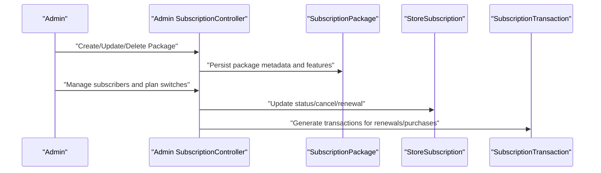
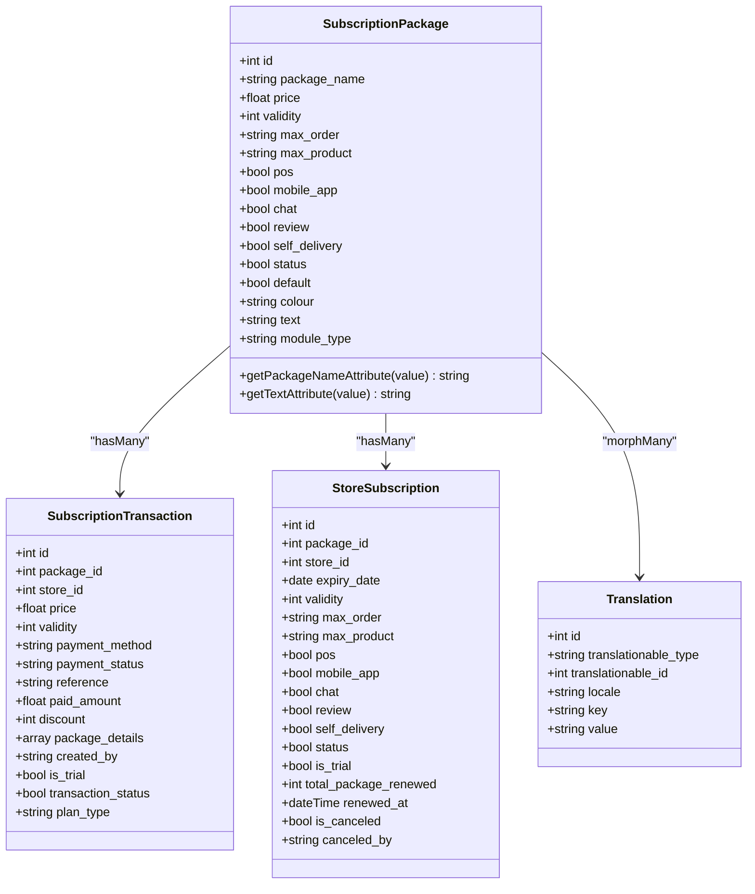
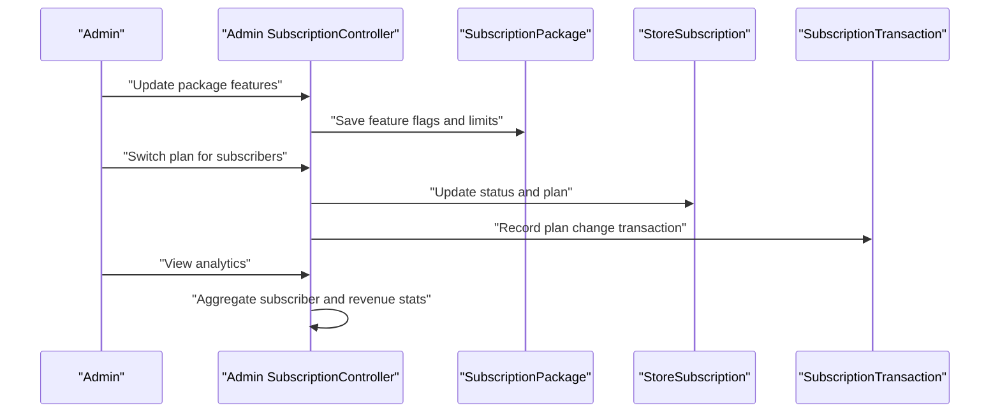
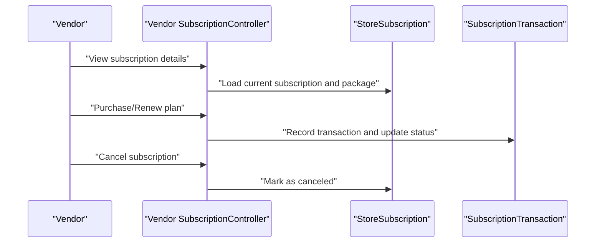
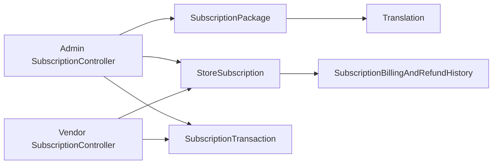

# Subscription Packages

<cite>
**Referenced Files in This Document**
- [SubscriptionPackage.php](file://app/Models/SubscriptionPackage.php)
- [SubscriptionPackage migration](file://database/migrations/2024_05_13_102547_create_subscription_packages_table.php)
- [StoreSubscription.php](file://app/Models/StoreSubscription.php)
- [StoreSubscription migration](file://database/migrations/2024_05_13_102612_create_store_subscriptions_table.php)
- [SubscriptionTransaction.php](file://app/Models/SubscriptionTransaction.php)
- [SubscriptionTransaction migration](file://database/migrations/2024_05_13_104250_create_subscription_transactions_table.php)
- [Store model migration](file://database/migrations/2024_05_13_170120_add_store_business_model_col_to_stores_table.php)
- [SubscriptionBillingAndRefundHistory.php](file://app/Models/SubscriptionBillingAndRefundHistory.php)
- [SubscriptionBillingAndRefundHistory migration](file://database/migrations/2024_05_22_115717_create_subscription_billing_and_refund_histories_table.php)
- [Admin SubscriptionController](file://app/Http/Controllers/Admin/Subscription/SubscriptionController.php)
- [Vendor SubscriptionController](file://app/Http/Controllers/Vendor/SubscriptionController.php)
- [Translation.php](file://app/Models/Translation.php)
</cite>

## Table of Contents
1. [Introduction](#introduction)
2. [Project Structure](#project-structure)
3. [Core Components](#core-components)
4. [Architecture Overview](#architecture-overview)
5. [Detailed Component Analysis](#detailed-component-analysis)
6. [Dependency Analysis](#dependency-analysis)
7. [Performance Considerations](#performance-considerations)
8. [Troubleshooting Guide](#troubleshooting-guide)
9. [Conclusion](#conclusion)

## Introduction
This document explains the subscription package management system used to manage recurring billing for stores under a subscription business model. It covers package creation and configuration, pricing and validity periods, feature access controls, package types (trial vs paid), default package assignment, business model support, translation system, status management, subscriber analytics, and administrative interfaces for configuration, pricing strategies, and feature enable/disable mechanisms.

## Project Structure
The subscription system spans models, migrations, controllers, and supporting services. Key areas:
- Models define domain entities and relationships
- Migrations define database schema
- Controllers implement admin and vendor workflows
- Translation model supports localized package metadata
- Billing/refund history tracks financial events

```mermaid
graph TB
subgraph "Models"
SP["SubscriptionPackage"]
SS["StoreSubscription"]
ST["SubscriptionTransaction"]
SBH["SubscriptionBillingAndRefundHistory"]
T["Translation"]
end
subgraph "Migrations"
MSP["subscription_packages"]
MSS["store_subscriptions"]
MST["subscription_transactions"]
MSBH["subscription_billing_and_refund_histories"]
end
subgraph "Controllers"
ASC["Admin SubscriptionController"]
VSC["Vendor SubscriptionController"]
end
SP --- T
SP <- --> ST
SP <- --> SS
SS --- ST
SS --- SBH
ASC -. admin ops .-> SP
ASC -. admin ops .-> SS
VSC -. vendor ops .-> SS
VSC -. vendor ops .-> ST
```

**Diagram sources**
- [SubscriptionPackage.php:10-89](file://app/Models/SubscriptionPackage.php#L10-L89)
- [StoreSubscription.php:10-57](file://app/Models/StoreSubscription.php#L10-L57)
- [SubscriptionTransaction.php:9-51](file://app/Models/SubscriptionTransaction.php#L9-L51)
- [SubscriptionBillingAndRefundHistory.php:8-17](file://app/Models/SubscriptionBillingAndRefundHistory.php#L8-L17)
- [SubscriptionPackage migration:14-32](file://database/migrations/2024_05_13_102547_create_subscription_packages_table.php#L14-L32)
- [StoreSubscription migration:14-34](file://database/migrations/2024_05_13_102612_create_store_subscriptions_table.php#L14-L34)
- [SubscriptionTransaction migration:15-34](file://database/migrations/2024_05_13_104250_create_subscription_transactions_table.php#L15-L34)
- [SubscriptionBillingAndRefundHistory migration:14-24](file://database/migrations/2024_05_22_115717_create_subscription_billing_and_refund_histories_table.php#L14-L24)
- [Admin SubscriptionController:31-995](file://app/Http/Controllers/Admin/Subscription/SubscriptionController.php#L31-L995)
- [Vendor SubscriptionController:27-320](file://app/Http/Controllers/Vendor/SubscriptionController.php#L27-L320)

**Section sources**
- [SubscriptionPackage.php:10-89](file://app/Models/SubscriptionPackage.php#L10-L89)
- [StoreSubscription.php:10-57](file://app/Models/StoreSubscription.php#L10-L57)
- [SubscriptionTransaction.php:9-51](file://app/Models/SubscriptionTransaction.php#L9-L51)
- [SubscriptionBillingAndRefundHistory.php:8-17](file://app/Models/SubscriptionBillingAndRefundHistory.php#L8-L17)
- [SubscriptionPackage migration:14-32](file://database/migrations/2024_05_13_102547_create_subscription_packages_table.php#L14-L32)
- [StoreSubscription migration:14-34](file://database/migrations/2024_05_13_102612_create_store_subscriptions_table.php#L14-L34)
- [SubscriptionTransaction migration:15-34](file://database/migrations/2024_05_13_104250_create_subscription_transactions_table.php#L15-L34)
- [SubscriptionBillingAndRefundHistory migration:14-24](file://database/migrations/2024_05_22_115717_create_subscription_billing_and_refund_histories_table.php#L14-L24)
- [Admin SubscriptionController:31-995](file://app/Http/Controllers/Admin/Subscription/SubscriptionController.php#L31-L995)
- [Vendor SubscriptionController:27-320](file://app/Http/Controllers/Vendor/SubscriptionController.php#L27-L320)

## Core Components
- SubscriptionPackage: Defines package metadata, pricing, validity, feature flags, translations, and relationships to transactions and subscriptions.
- StoreSubscription: Tracks per-store subscription instances, including expiry, limits, status, renewal counts, and cancellation state.
- SubscriptionTransaction: Records payment events, plan types, amounts, discounts, and references.
- SubscriptionBillingAndRefundHistory: Tracks pending bills and refunds for stores.
- Admin SubscriptionController: Provides admin UI and APIs for package management, analytics, subscriber management, plan switching, and settings.
- Vendor SubscriptionController: Provides vendor self-service for viewing subscriptions, transactions, switching to commission, and managing payments.

**Section sources**
- [SubscriptionPackage.php:10-89](file://app/Models/SubscriptionPackage.php#L10-L89)
- [StoreSubscription.php:10-57](file://app/Models/StoreSubscription.php#L10-L57)
- [SubscriptionTransaction.php:9-51](file://app/Models/SubscriptionTransaction.php#L9-L51)
- [SubscriptionBillingAndRefundHistory.php:8-17](file://app/Models/SubscriptionBillingAndRefundHistory.php#L8-L17)
- [Admin SubscriptionController:31-995](file://app/Http/Controllers/Admin/Subscription/SubscriptionController.php#L31-L995)
- [Vendor SubscriptionController:27-320](file://app/Http/Controllers/Vendor/SubscriptionController.php#L27-L320)

## Architecture Overview
The system separates administrative and vendor operations while sharing common models and migrations. Admins configure packages, manage subscribers, and view analytics. Vendors view their own subscription state, transactions, and can switch plans or cancel.



**Diagram sources**
- [Admin SubscriptionController:85-134](file://app/Http/Controllers/Admin/Subscription/SubscriptionController.php#L85-L134)
- [Admin SubscriptionController:158-262](file://app/Http/Controllers/Admin/Subscription/SubscriptionController.php#L158-L262)
- [Admin SubscriptionController:740-775](file://app/Http/Controllers/Admin/Subscription/SubscriptionController.php#L740-L775)
- [SubscriptionPackage.php:10-89](file://app/Models/SubscriptionPackage.php#L10-L89)
- [StoreSubscription.php:10-57](file://app/Models/StoreSubscription.php#L10-L57)
- [SubscriptionTransaction.php:9-51](file://app/Models/SubscriptionTransaction.php#L9-L51)

## Detailed Component Analysis

### SubscriptionPackage Model
- Purpose: Central definition of a subscription offering with pricing, validity, feature flags, and localization.
- Key attributes:
  - Pricing: price (float), validity (days)
  - Limits: max_order, max_product (strings allowing "unlimited")
  - Features: pos, mobile_app, chat, review, self_delivery (booleans)
  - Status and defaults: status, default, colour, text
  - Module scoping: module_type for multi-module support
- Relationships:
  - Transactions: one-to-many via package_id
  - Current subscribers: one-to-many filtered by status=1
  - Subscribers: one-to-many via package_id
  - Translations: polymorphic morphMany to Translation keyed by package_name/text
- Global scope: Automatically eager-loads translations for the current locale.



**Diagram sources**
- [SubscriptionPackage.php:10-89](file://app/Models/SubscriptionPackage.php#L10-L89)
- [Translation.php:8-31](file://app/Models/Translation.php#L8-L31)
- [SubscriptionTransaction.php:9-51](file://app/Models/SubscriptionTransaction.php#L9-L51)
- [StoreSubscription.php:10-57](file://app/Models/StoreSubscription.php#L10-L57)

**Section sources**
- [SubscriptionPackage.php:10-89](file://app/Models/SubscriptionPackage.php#L10-L89)
- [Translation.php:8-31](file://app/Models/Translation.php#L8-L31)

### StoreSubscription Model
- Purpose: Tracks individual store subscriptions, including expiry, limits, renewal history, and cancellation.
- Key attributes:
  - Expiry and validity
  - Feature flags mirroring package
  - Status, trial flag, renewal count, renewal timestamp
  - Cancellation state and who canceled
- Relationships:
  - Belongs to SubscriptionPackage
  - Has many transactions via store_id
  - Latest transaction accessor
  - Belongs to Store

**Section sources**
- [StoreSubscription.php:10-57](file://app/Models/StoreSubscription.php#L10-L57)

### SubscriptionTransaction Model
- Purpose: Records payment events for subscriptions, including plan type, amounts, discounts, and references.
- Key attributes:
  - Plan type enum: renew, new_plan, first_purchased, free_trial
  - Amounts: price, previous_due, paid_amount, discount
  - References: payment_method, payment_status, reference
  - Metadata: package_details JSON, created_by, is_trial, transaction_status
- Relationships:
  - Belongs to Store, SubscriptionPackage, StoreSubscription

**Section sources**
- [SubscriptionTransaction.php:9-51](file://app/Models/SubscriptionTransaction.php#L9-L51)

### SubscriptionBillingAndRefundHistory Model
- Purpose: Tracks pending bills and refunds for billing reconciliation and refund workflows.
- Key attributes:
  - Types: pending_bill, refund
  - Amounts and success flag
  - Reference and timestamps
- Relationship:
  - Belongs to SubscriptionPackage

**Section sources**
- [SubscriptionBillingAndRefundHistory.php:8-17](file://app/Models/SubscriptionBillingAndRefundHistory.php#L8-L17)

### Administrative Interfaces
- Package Management:
  - Create/update/delete packages with localized names and descriptions
  - Toggle activation/deactivation
  - Configure features (POS, mobile app, chat, review, self-delivery)
  - Set unlimited/max limits for orders/products
- Analytics:
  - Subscriber counts (total, active, expired, expiring soon)
  - Revenue metrics (free trials, renewals, total amount)
  - Filters by time windows (week/month/year/custom)
- Subscriber Management:
  - List subscribers by status (active/expired/canceled/free trial)
  - Cancel subscriptions (admin-initiated)
  - Switch plan across packages or to commission
  - Generate invoices and exports
- Settings:
  - Free trial configuration (status, duration, unit)
  - Deadline warning days/message
  - Max usage time threshold



**Diagram sources**
- [Admin SubscriptionController:158-262](file://app/Http/Controllers/Admin/Subscription/SubscriptionController.php#L158-L262)
- [Admin SubscriptionController:740-775](file://app/Http/Controllers/Admin/Subscription/SubscriptionController.php#L740-L775)
- [Admin SubscriptionController:263-319](file://app/Http/Controllers/Admin/Subscription/SubscriptionController.php#L263-L319)

**Section sources**
- [Admin SubscriptionController:39-84](file://app/Http/Controllers/Admin/Subscription/SubscriptionController.php#L39-L84)
- [Admin SubscriptionController:85-134](file://app/Http/Controllers/Admin/Subscription/SubscriptionController.php#L85-L134)
- [Admin SubscriptionController:158-262](file://app/Http/Controllers/Admin/Subscription/SubscriptionController.php#L158-L262)
- [Admin SubscriptionController:263-319](file://app/Http/Controllers/Admin/Subscription/SubscriptionController.php#L263-L319)
- [Admin SubscriptionController:365-407](file://app/Http/Controllers/Admin/Subscription/SubscriptionController.php#L365-L407)
- [Admin SubscriptionController:420-524](file://app/Http/Controllers/Admin/Subscription/SubscriptionController.php#L420-L524)
- [Admin SubscriptionController:546-622](file://app/Http/Controllers/Admin/Subscription/SubscriptionController.php#L546-L622)
- [Admin SubscriptionController:740-775](file://app/Http/Controllers/Admin/Subscription/SubscriptionController.php#L740-L775)

### Vendor Self-Service
- View subscription details, latest transactions, and plan options
- Initiate cancellation (store-initiated)
- Switch to commission model
- Purchase/renovate plan via selected payment gateway or wallet
- Export transactions and view wallet refund history



**Diagram sources**
- [Vendor SubscriptionController:29-49](file://app/Http/Controllers/Vendor/SubscriptionController.php#L29-L49)
- [Vendor SubscriptionController:156-196](file://app/Http/Controllers/Vendor/SubscriptionController.php#L156-L196)
- [Vendor SubscriptionController:52-109](file://app/Http/Controllers/Vendor/SubscriptionController.php#L52-L109)
- [StoreSubscription.php:10-57](file://app/Models/StoreSubscription.php#L10-L57)
- [SubscriptionTransaction.php:9-51](file://app/Models/SubscriptionTransaction.php#L9-L51)

**Section sources**
- [Vendor SubscriptionController:29-49](file://app/Http/Controllers/Vendor/SubscriptionController.php#L29-L49)
- [Vendor SubscriptionController:156-196](file://app/Http/Controllers/Vendor/SubscriptionController.php#L156-L196)
- [Vendor SubscriptionController:52-109](file://app/Http/Controllers/Vendor/SubscriptionController.php#L52-L109)
- [Vendor SubscriptionController:200-240](file://app/Http/Controllers/Vendor/SubscriptionController.php#L200-L240)
- [Vendor SubscriptionController:252-302](file://app/Http/Controllers/Vendor/SubscriptionController.php#L252-L302)
- [Vendor SubscriptionController:310-318](file://app/Http/Controllers/Vendor/SubscriptionController.php#L310-L318)

### Package Types and Business Model Support
- Trial vs Paid:
  - Free trial activation controlled via settings
  - Trial flag tracked on StoreSubscription and SubscriptionTransaction
- Business Model:
  - Stores marked with store_business_model indicating subscription/commission/unsubscribed
  - Admin can switch a store to commission and terminate subscription status
- Default Package Assignment:
  - Packages have a default flag; admin can manage default selection per module type

**Section sources**
- [Admin SubscriptionController:372-380](file://app/Http/Controllers/Admin/Subscription/SubscriptionController.php#L372-L380)
- [Store model migration:14-16](file://database/migrations/2024_05_13_170120_add_store_business_model_col_to_stores_table.php#L14-L16)
- [StoreSubscription.php:16-32](file://app/Models/StoreSubscription.php#L16-L32)
- [SubscriptionTransaction.php:15-31](file://app/Models/SubscriptionTransaction.php#L15-L31)

### Package Translation System
- Localization:
  - SubscriptionPackage supports translations via polymorphic morphMany to Translation
  - Accessors resolve localized package_name and text based on current locale
  - Admin creates/updates localized names/descriptions during package operations

**Section sources**
- [SubscriptionPackage.php:56-88](file://app/Models/SubscriptionPackage.php#L56-L88)
- [Translation.php:27-30](file://app/Models/Translation.php#L27-L30)
- [Admin SubscriptionController:130-131](file://app/Http/Controllers/Admin/Subscription/SubscriptionController.php#L130-L131)
- [Admin SubscriptionController:194-195](file://app/Http/Controllers/Admin/Subscription/SubscriptionController.php#L194-L195)

### Status Management and Subscriber Analytics
- Status toggles:
  - Package activation/deactivation
  - Store subscription status (active/expired)
  - Cancellation flags and reasons
- Analytics:
  - Subscriber counts by status and upcoming expiration window
  - Revenue breakdown by plan type and time filters
  - Exportable reports for transactions and subscribers

**Section sources**
- [Admin SubscriptionController:136-142](file://app/Http/Controllers/Admin/Subscription/SubscriptionController.php#L136-L142)
- [Admin SubscriptionController:272-319](file://app/Http/Controllers/Admin/Subscription/SubscriptionController.php#L272-L319)
- [Admin SubscriptionController:420-524](file://app/Http/Controllers/Admin/Subscription/SubscriptionController.php#L420-L524)

## Dependency Analysis
- Coupling:
  - SubscriptionPackage couples to Translation and to StoreSubscription/SubscriptionTransaction
  - StoreSubscription depends on SubscriptionPackage and SubscriptionTransaction
  - Controllers orchestrate model interactions and enforce validations
- Cohesion:
  - Controllers encapsulate admin/vendor workflows
  - Models encapsulate domain logic and relationships
- External integrations:
  - Payment gateway routing via helpers invoked by controllers
  - PDF invoice generation and exports handled by controllers/utilities



**Diagram sources**
- [Admin SubscriptionController:31-995](file://app/Http/Controllers/Admin/Subscription/SubscriptionController.php#L31-L995)
- [Vendor SubscriptionController:27-320](file://app/Http/Controllers/Vendor/SubscriptionController.php#L27-L320)
- [SubscriptionPackage.php:10-89](file://app/Models/SubscriptionPackage.php#L10-L89)
- [StoreSubscription.php:10-57](file://app/Models/StoreSubscription.php#L10-L57)
- [SubscriptionTransaction.php:9-51](file://app/Models/SubscriptionTransaction.php#L9-L51)
- [SubscriptionBillingAndRefundHistory.php:8-17](file://app/Models/SubscriptionBillingAndRefundHistory.php#L8-L17)
- [Translation.php:8-31](file://app/Models/Translation.php#L8-L31)

**Section sources**
- [Admin SubscriptionController:31-995](file://app/Http/Controllers/Admin/Subscription/SubscriptionController.php#L31-L995)
- [Vendor SubscriptionController:27-320](file://app/Http/Controllers/Vendor/SubscriptionController.php#L27-L320)

## Performance Considerations
- Indexing and filtering:
  - Use scopes and where clauses judiciously; leverage pagination for large datasets
  - Aggregate queries for analytics reduce round trips
- Casting and JSON:
  - Keep package_details minimal and indexed where possible
- Localization:
  - Global scope loads translations; avoid unnecessary eager-loading in hot paths
- Transactions:
  - Batch operations for plan switches and cancellations to minimize writes

## Troubleshooting Guide
- Validation failures:
  - Package creation/update validates presence of default locale name, numeric price/validity, and optional limits
- Insufficient wallet balance:
  - Wallet-based purchases require sufficient pending bill balance; otherwise, error messages guide corrective action
- Cancellation and plan switching:
  - Ensure store is eligible (not canceled/trial) before switching to commission
- Notifications:
  - Verify notification settings and push token availability before sending updates

**Section sources**
- [Admin SubscriptionController:91-134](file://app/Http/Controllers/Admin/Subscription/SubscriptionController.php#L91-L134)
- [Admin SubscriptionController:650-694](file://app/Http/Controllers/Admin/Subscription/SubscriptionController.php#L650-L694)
- [Vendor SubscriptionController:156-196](file://app/Http/Controllers/Vendor/SubscriptionController.php#L156-L196)
- [Vendor SubscriptionController:174-191](file://app/Http/Controllers/Vendor/SubscriptionController.php#L174-L191)

## Conclusion
The subscription package management system provides a robust foundation for recurring billing with flexible package configurations, multi-language support, and comprehensive administrative and vendor self-service capabilities. Admins can configure packages, monitor analytics, manage subscribers, and enforce business rules, while vendors can self-manage their subscriptions and payments. The modular design and clear separation of concerns facilitate maintainability and future enhancements.