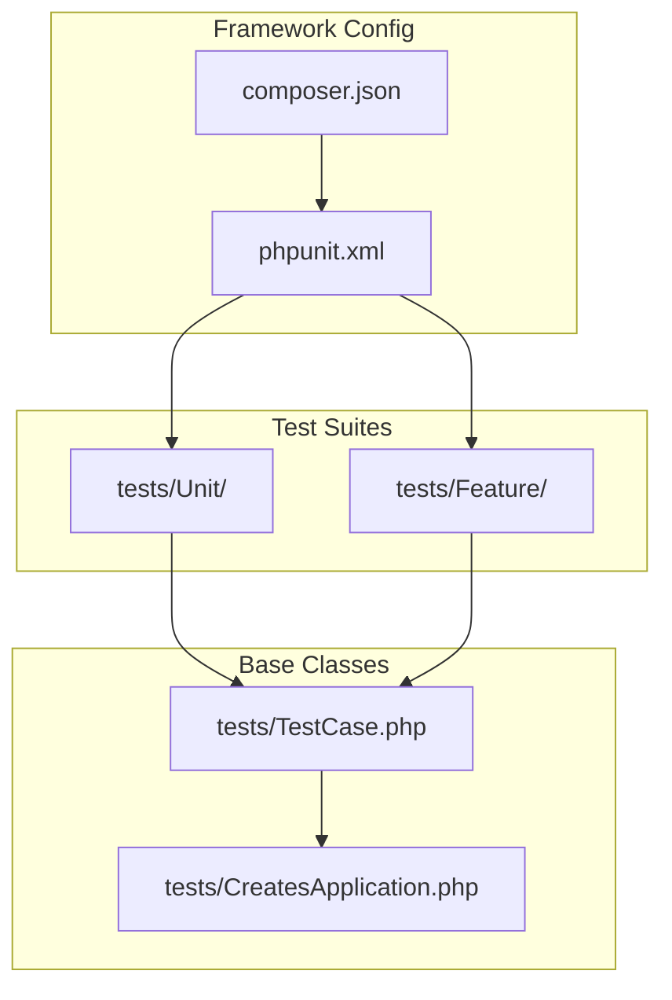
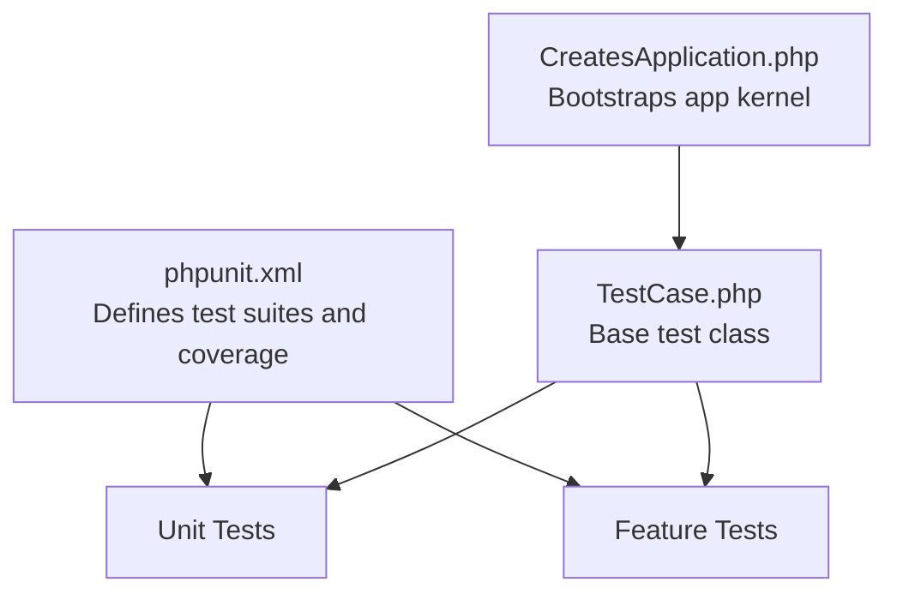
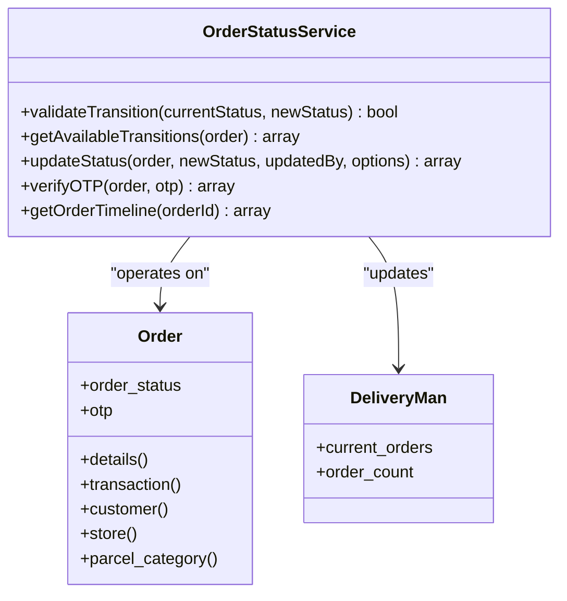
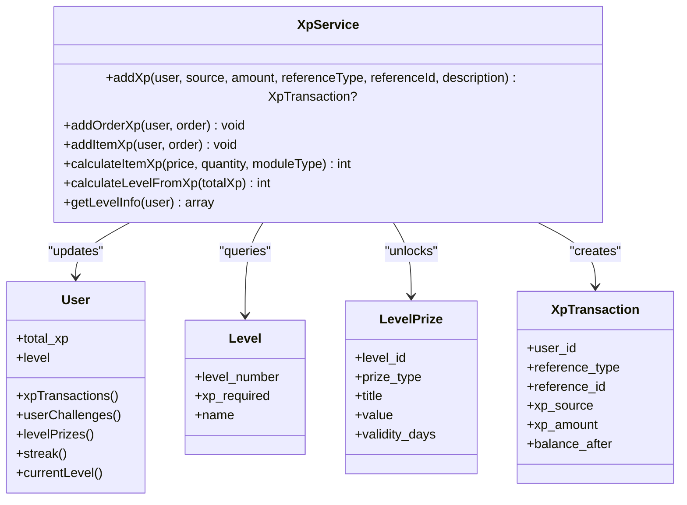
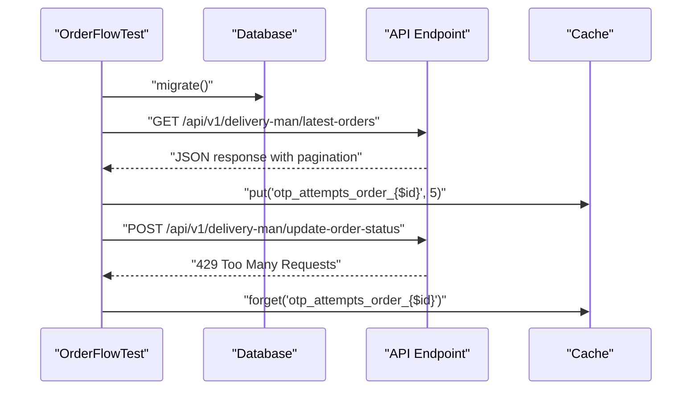
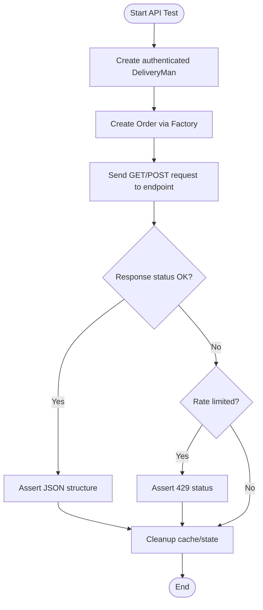
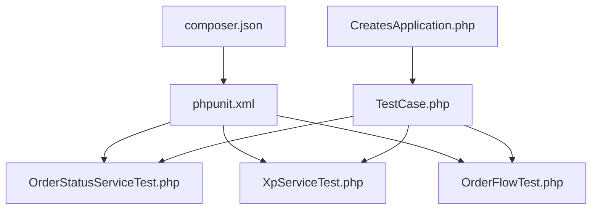

# Testing Strategy

<cite>
**Referenced Files in This Document**
- [phpunit.xml](file://phpunit.xml)
- [composer.json](file://composer.json)
- [tests/TestCase.php](file://tests/TestCase.php)
- [tests/CreatesApplication.php](file://tests/CreatesApplication.php)
- [tests/Feature/ExampleTest.php](file://tests/Feature/ExampleTest.php)
- [tests/Feature/OrderFlowTest.php](file://tests/Feature/OrderFlowTest.php)
- [tests/Unit/ExampleTest.php](file://tests/Unit/ExampleTest.php)
- [tests/Unit/OrderStatusServiceTest.php](file://tests/Unit/OrderStatusServiceTest.php)
- [tests/Unit/XpServiceTest.php](file://tests/Unit/XpServiceTest.php)
- [app/Services/OrderStatusService.php](file://app/Services/OrderStatusService.php)
- [app/Services/XpService.php](file://app/Services/XpService.php)
- [app/Models/Order.php](file://app/Models/Order.php)
- [app/Models/DeliveryMan.php](file://app/Models/DeliveryMan.php)
- [app/Models/OrderStatusLog.php](file://app/Models/OrderStatusLog.php)
- [app/Models/User.php](file://app/Models/User.php)
</cite>

## Table of Contents
1. [Introduction](#introduction)
2. [Project Structure](#project-structure)
3. [Core Components](#core-components)
4. [Architecture Overview](#architecture-overview)
5. [Detailed Component Analysis](#detailed-component-analysis)
6. [Dependency Analysis](#dependency-analysis)
7. [Performance Considerations](#performance-considerations)
8. [Troubleshooting Guide](#troubleshooting-guide)
9. [Conclusion](#conclusion)

## Introduction
This document provides a comprehensive testing strategy for the Laravel application, focusing on unit testing, feature testing, test coverage, and best practices. It covers the testing framework setup, test case organization, continuous integration practices, and methodologies for testing business logic, API endpoints, and integration scenarios. It also includes guidelines for writing effective tests, mocking dependencies, maintaining test suites, and extending strategies for performance, security, and regression testing.

## Project Structure
The testing infrastructure is organized under the `tests/` directory with two primary suites:
- Unit tests: Located in `tests/Unit/`, targeting isolated business logic and services.
- Feature tests: Located in `tests/Feature/`, validating end-to-end flows and API interactions.

The test harness is bootstrapped via a shared base class and trait that load the Laravel application kernel for each test run.

**Diagram sources**
- [phpunit.xml:7-14](file://phpunit.xml#L7-L14)
- [tests/TestCase.php:7-10](file://tests/TestCase.php#L7-L10)
- [tests/CreatesApplication.php:14-21](file://tests/CreatesApplication.php#L14-L21)
- [composer.json:78-82](file://composer.json#L78-L82)

**Section sources**
- [phpunit.xml:7-14](file://phpunit.xml#L7-L14)
- [tests/TestCase.php:7-10](file://tests/TestCase.php#L7-L10)
- [tests/CreatesApplication.php:14-21](file://tests/CreatesApplication.php#L14-L21)
- [composer.json:78-82](file://composer.json#L78-L82)

## Core Components
The testing suite currently includes:
- A minimal unit test example verifying a boolean assertion.
- A minimal feature test example asserting HTTP status on the homepage.
- A comprehensive feature test for order-related flows, including status logging, API pagination, concurrency checks, rate limiting, and timeline retrieval.
- Two focused unit tests for business services:
  - OrderStatusService: validates status transitions, OTP rate limiting, and available transitions.
  - XpService: validates XP calculations, level progression, duplicate prevention, and per-item XP computation.

These components exercise core business logic and demonstrate best practices such as database refresh, factory usage, and API assertions.

**Section sources**
- [tests/Unit/ExampleTest.php:14-17](file://tests/Unit/ExampleTest.php#L14-L17)
- [tests/Feature/ExampleTest.php:15-19](file://tests/Feature/ExampleTest.php#L15-L19)
- [tests/Feature/OrderFlowTest.php:27-57](file://tests/Feature/OrderFlowTest.php#L27-L57)
- [tests/Feature/OrderFlowTest.php:62-82](file://tests/Feature/OrderFlowTest.php#L62-L82)
- [tests/Feature/OrderFlowTest.php:87-109](file://tests/Feature/OrderFlowTest.php#L87-L109)
- [tests/Feature/OrderFlowTest.php:114-153](file://tests/Feature/OrderFlowTest.php#L114-L153)
- [tests/Feature/OrderFlowTest.php:158-191](file://tests/Feature/OrderFlowTest.php#L158-L191)
- [tests/Unit/OrderStatusServiceTest.php:19-39](file://tests/Unit/OrderStatusServiceTest.php#L19-L39)
- [tests/Unit/OrderStatusServiceTest.php:52-80](file://tests/Unit/OrderStatusServiceTest.php#L52-L80)
- [tests/Unit/OrderStatusServiceTest.php:85-100](file://tests/Unit/OrderStatusServiceTest.php#L85-L100)
- [tests/Unit/OrderStatusServiceTest.php:105-126](file://tests/Unit/OrderStatusServiceTest.php#L105-L126)
- [tests/Unit/XpServiceTest.php:22-39](file://tests/Unit/XpServiceTest.php#L22-L39)
- [tests/Unit/XpServiceTest.php:52-76](file://tests/Unit/XpServiceTest.php#L52-L76)
- [tests/Unit/XpServiceTest.php:81-119](file://tests/Unit/XpServiceTest.php#L81-L119)
- [tests/Unit/XpServiceTest.php:124-145](file://tests/Unit/XpServiceTest.php#L124-L145)
- [tests/Unit/XpServiceTest.php:150-167](file://tests/Unit/XpServiceTest.php#L150-L167)
- [tests/Unit/XpServiceTest.php:172-203](file://tests/Unit/XpServiceTest.php#L172-L203)
- [tests/Unit/XpServiceTest.php:208-257](file://tests/Unit/XpServiceTest.php#L208-L257)

## Architecture Overview
The testing architecture leverages Laravel's built-in testing capabilities:
- Bootstrap loads the application kernel.
- Environment variables configure drivers for caching, queues, sessions, and mail to ensure deterministic and fast test runs.
- Coverage includes the application code directory.

**Diagram sources**
- [phpunit.xml:15-19](file://phpunit.xml#L15-L19)
- [phpunit.xml:20-29](file://phpunit.xml#L20-L29)
- [tests/CreatesApplication.php:14-21](file://tests/CreatesApplication.php#L14-L21)
- [tests/TestCase.php:7-10](file://tests/TestCase.php#L7-L10)

**Section sources**
- [phpunit.xml:15-19](file://phpunit.xml#L15-L19)
- [phpunit.xml:20-29](file://phpunit.xml#L20-L29)
- [tests/CreatesApplication.php:14-21](file://tests/CreatesApplication.php#L14-L21)
- [tests/TestCase.php:7-10](file://tests/TestCase.php#L7-L10)

## Detailed Component Analysis

### OrderStatusService Testing
The OrderStatusService unit tests validate:
- Status transition validation rules.
- OTP verification with rate limiting behavior.
- Available transitions extraction from the order's current state.

**Diagram sources**
- [app/Services/OrderStatusService.php:51-78](file://app/Services/OrderStatusService.php#L51-L78)
- [app/Services/OrderStatusService.php:275-308](file://app/Services/OrderStatusService.php#L275-L308)
- [app/Models/Order.php:13-51](file://app/Models/Order.php#L13-L51)
- [app/Models/DeliveryMan.php:13-26](file://app/Models/DeliveryMan.php#L13-L26)

**Section sources**
- [tests/Unit/OrderStatusServiceTest.php:19-39](file://tests/Unit/OrderStatusServiceTest.php#L19-L39)
- [tests/Unit/OrderStatusServiceTest.php:52-80](file://tests/Unit/OrderStatusServiceTest.php#L52-L80)
- [tests/Unit/OrderStatusServiceTest.php:85-100](file://tests/Unit/OrderStatusServiceTest.php#L85-L100)
- [tests/Unit/OrderStatusServiceTest.php:105-126](file://tests/Unit/OrderStatusServiceTest.php#L105-L126)
- [app/Services/OrderStatusService.php:51-78](file://app/Services/OrderStatusService.php#L51-L78)
- [app/Services/OrderStatusService.php:275-308](file://app/Services/OrderStatusService.php#L275-L308)
- [app/Models/Order.php:13-51](file://app/Models/Order.php#L13-L51)
- [app/Models/DeliveryMan.php:13-26](file://app/Models/DeliveryMan.php#L13-L26)

### XpService Testing
The XpService unit tests validate:
- Level calculation from XP thresholds.
- Adding XP with duplicate prevention.
- Level-up unlocking of prizes.
- Per-item XP calculation with module multipliers.
- Transaction creation and integrity.

**Diagram sources**
- [app/Services/XpService.php:20-76](file://app/Services/XpService.php#L20-L76)
- [app/Services/XpService.php:81-116](file://app/Services/XpService.php#L81-L116)
- [app/Services/XpService.php:121-144](file://app/Services/XpService.php#L121-L144)
- [app/Services/XpService.php:150-166](file://app/Services/XpService.php#L150-L166)
- [app/Services/XpService.php:215-222](file://app/Services/XpService.php#L215-L222)
- [app/Services/XpService.php:291-312](file://app/Services/XpService.php#L291-L312)
- [app/Models/User.php:19-78](file://app/Models/User.php#L19-L78)
- [app/Models/User.php:137-172](file://app/Models/User.php#L137-L172)

**Section sources**
- [tests/Unit/XpServiceTest.php:22-39](file://tests/Unit/XpServiceTest.php#L22-L39)
- [tests/Unit/XpServiceTest.php:52-76](file://tests/Unit/XpServiceTest.php#L52-L76)
- [tests/Unit/XpServiceTest.php:81-119](file://tests/Unit/XpServiceTest.php#L81-L119)
- [tests/Unit/XpServiceTest.php:124-145](file://tests/Unit/XpServiceTest.php#L124-L145)
- [tests/Unit/XpServiceTest.php:150-167](file://tests/Unit/XpServiceTest.php#L150-L167)
- [tests/Unit/XpServiceTest.php:172-203](file://tests/Unit/XpServiceTest.php#L172-L203)
- [tests/Unit/XpServiceTest.php:208-257](file://tests/Unit/XpServiceTest.php#L208-L257)
- [app/Services/XpService.php:20-76](file://app/Services/XpService.php#L20-L76)
- [app/Services/XpService.php:81-116](file://app/Services/XpService.php#L81-L116)
- [app/Services/XpService.php:121-144](file://app/Services/XpService.php#L121-L144)
- [app/Services/XpService.php:150-166](file://app/Services/XpService.php#L150-L166)
- [app/Services/XpService.php:215-222](file://app/Services/XpService.php#L215-L222)
- [app/Services/XpService.php:291-312](file://app/Services/XpService.php#L291-L312)
- [app/Models/User.php:19-78](file://app/Models/User.php#L19-L78)
- [app/Models/User.php:137-172](file://app/Models/User.php#L137-L172)

### Feature Testing: Order Flow
The OrderFlow feature test demonstrates:
- Database migration and refresh for each test.
- API endpoint testing with JSON requests and response assertions.
- Factory-driven model creation and seeding.
- Cache-based rate limiting simulation.
- Audit trail validation via OrderStatusLog.

**Diagram sources**
- [tests/Feature/OrderFlowTest.php:16-22](file://tests/Feature/OrderFlowTest.php#L16-L22)
- [tests/Feature/OrderFlowTest.php:71-82](file://tests/Feature/OrderFlowTest.php#L71-L82)
- [tests/Feature/OrderFlowTest.php:130-153](file://tests/Feature/OrderFlowTest.php#L130-L153)

**Section sources**
- [tests/Feature/OrderFlowTest.php:16-22](file://tests/Feature/OrderFlowTest.php#L16-L22)
- [tests/Feature/OrderFlowTest.php:62-82](file://tests/Feature/OrderFlowTest.php#L62-L82)
- [tests/Feature/OrderFlowTest.php:114-153](file://tests/Feature/OrderFlowTest.php#L114-L153)

### API Testing Methodology
The feature tests illustrate robust API testing practices:
- Authentication tokens passed via query parameters.
- Pagination structure assertions.
- Concurrency and rate-limiting validations.
- Timeline retrieval and chronological ordering.

**Diagram sources**
- [tests/Feature/OrderFlowTest.php:62-82](file://tests/Feature/OrderFlowTest.php#L62-L82)
- [tests/Feature/OrderFlowTest.php:87-109](file://tests/Feature/OrderFlowTest.php#L87-L109)
- [tests/Feature/OrderFlowTest.php:114-153](file://tests/Feature/OrderFlowTest.php#L114-L153)

**Section sources**
- [tests/Feature/OrderFlowTest.php:62-82](file://tests/Feature/OrderFlowTest.php#L62-L82)
- [tests/Feature/OrderFlowTest.php:87-109](file://tests/Feature/OrderFlowTest.php#L87-L109)
- [tests/Feature/OrderFlowTest.php:114-153](file://tests/Feature/OrderFlowTest.php#L114-L153)

## Dependency Analysis
The testing suite depends on:
- Laravel's testing traits and base classes.
- PHPUnit for assertions and test discovery.
- Factories for model generation.
- Database refresh and migrations for isolation.
- Cache and configuration for rate limiting simulations.

**Diagram sources**
- [phpunit.xml:7-14](file://phpunit.xml#L7-L14)
- [composer.json:47-48](file://composer.json#L47-L48)
- [tests/TestCase.php:7-10](file://tests/TestCase.php#L7-L10)
- [tests/CreatesApplication.php:14-21](file://tests/CreatesApplication.php#L14-L21)
- [tests/Unit/OrderStatusServiceTest.php:5](file://tests/Unit/OrderStatusServiceTest.php#L5-L5)
- [tests/Unit/XpServiceTest.php:5](file://tests/Unit/XpServiceTest.php#L5-L5)
- [tests/Feature/OrderFlowTest.php:5](file://tests/Feature/OrderFlowTest.php#L5-L5)

**Section sources**
- [phpunit.xml:7-14](file://phpunit.xml#L7-L14)
- [composer.json:47-48](file://composer.json#L47-L48)
- [tests/TestCase.php:7-10](file://tests/TestCase.php#L7-L10)
- [tests/CreatesApplication.php:14-21](file://tests/CreatesApplication.php#L14-L21)
- [tests/Unit/OrderStatusServiceTest.php:5](file://tests/Unit/OrderStatusServiceTest.php#L5-L5)
- [tests/Unit/XpServiceTest.php:5](file://tests/Unit/XpServiceTest.php#L5-L5)
- [tests/Feature/OrderFlowTest.php:5](file://tests/Feature/OrderFlowTest.php#L5-L5)

## Performance Considerations
- Use array drivers for cache, queue, session, and mail to avoid external dependencies during tests.
- Keep database operations minimal; leverage RefreshDatabase to reset state efficiently.
- Prefer factory-generated data to reduce fixture overhead.
- Use targeted assertions to minimize expensive operations.

[No sources needed since this section provides general guidance]

## Troubleshooting Guide
Common issues and resolutions:
- Missing database tables: Use RefreshDatabase and migrate within setUp to ensure schema availability.
- Rate limiting failures: Verify cache keys and TTL; assert 429 responses when limits are hit.
- API structure mismatches: Use conditional assertions and mark incomplete when endpoints evolve.
- OTP attempts cleanup: Always clean cache after tests to prevent cross-test interference.

**Section sources**
- [tests/Feature/OrderFlowTest.php:16-22](file://tests/Feature/OrderFlowTest.php#L16-L22)
- [tests/Feature/OrderFlowTest.php:114-153](file://tests/Feature/OrderFlowTest.php#L114-L153)
- [tests/Unit/OrderStatusServiceTest.php:52-80](file://tests/Unit/OrderStatusServiceTest.php#L52-L80)

## Conclusion
The current testing suite establishes a solid foundation for unit and feature testing, with clear separation of concerns and practical validations of business logic and APIs. By expanding coverage, adopting mocking strategies, and integrating CI practices, the suite can evolve into a comprehensive quality assurance system. The included diagrams and references provide a roadmap for extending tests to cover performance, security, and regression scenarios while maintaining readability and maintainability.