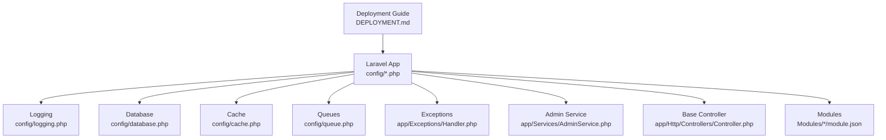
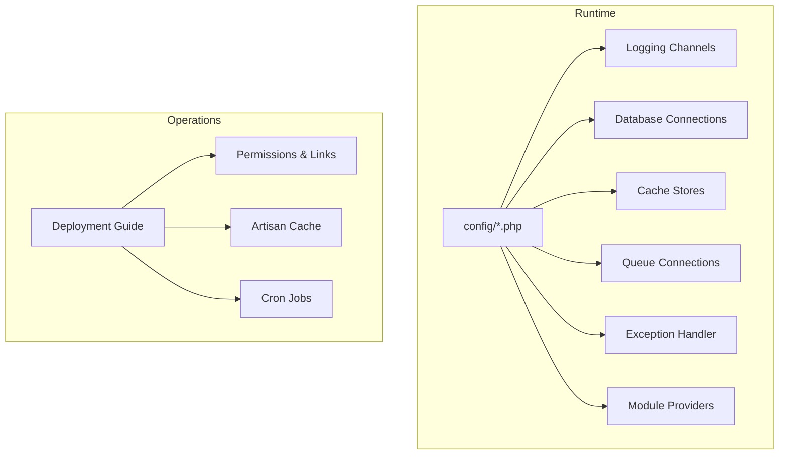
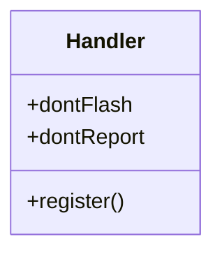
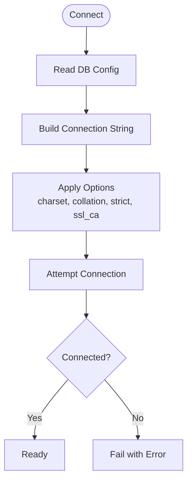
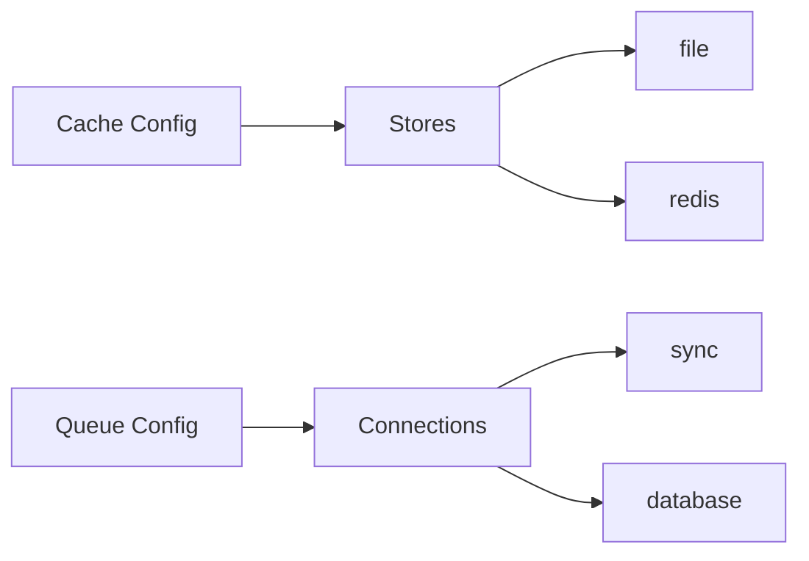
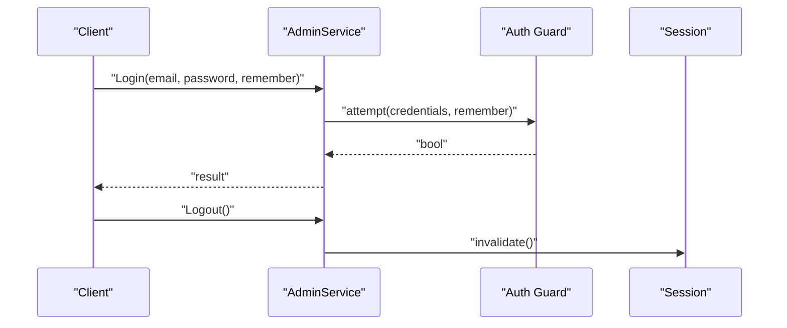
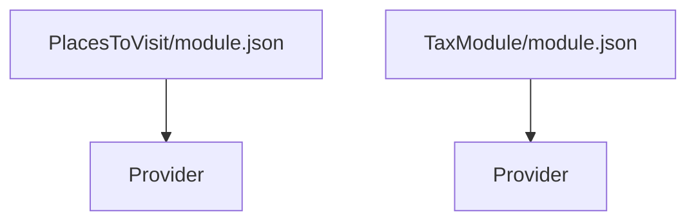
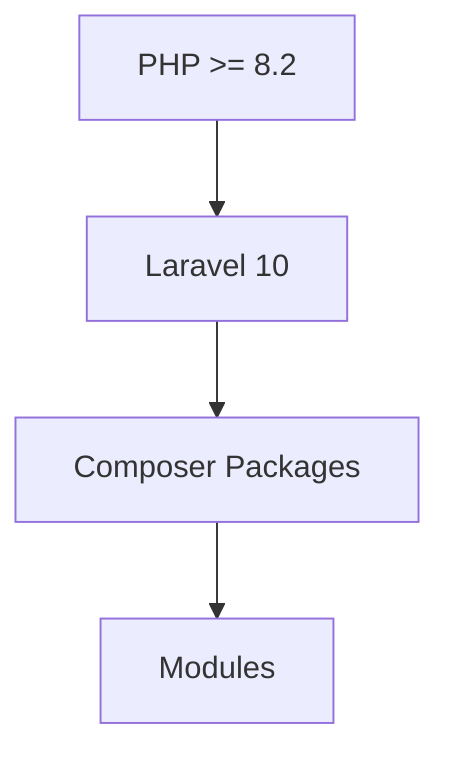

# Troubleshooting and FAQ

<cite>
**Referenced Files in This Document**
- [DEPLOYMENT.md](file://DEPLOYMENT.md)
- [README.md](file://README.md)
- [composer.json](file://composer.json)
- [config/app.php](file://config/app.php)
- [config/logging.php](file://config/logging.php)
- [config/database.php](file://config/database.php)
- [config/cache.php](file://config/cache.php)
- [config/queue.php](file://config/queue.php)
- [app/Exceptions/Handler.php](file://app/Exceptions/Handler.php)
- [app/Services/AdminService.php](file://app/Services/AdminService.php)
- [app/Http/Controllers/Controller.php](file://app/Http/Controllers/Controller.php)
- [Modules/PlacesToVisit/module.json](file://Modules/PlacesToVisit/module.json)
- [Modules/TaxModule/module.json](file://Modules/TaxModule/module.json)
</cite>

## Table of Contents
1. [Introduction](#introduction)
2. [Project Structure](#project-structure)
3. [Core Components](#core-components)
4. [Architecture Overview](#architecture-overview)
5. [Detailed Component Analysis](#detailed-component-analysis)
6. [Dependency Analysis](#dependency-analysis)
7. [Performance Considerations](#performance-considerations)
8. [Troubleshooting Guide](#troubleshooting-guide)
9. [Conclusion](#conclusion)
10. [Appendices](#appendices)

## Introduction
This document provides a comprehensive troubleshooting and FAQ guide for the backend system. It focuses on diagnosing and resolving common deployment issues, configuration problems, runtime errors, performance bottlenecks, and security considerations. It also includes practical steps for log analysis, monitoring setup, and proactive maintenance, along with escalation and support resources.

## Project Structure
The backend is a Laravel application with modular extensions. Key areas affecting troubleshooting include:
- Configuration: application, logging, database, cache, queues
- Error handling: centralized exception handler
- Modules: PlacesToVisit and TaxModule
- Deployment: Hostinger-specific guidance and operational steps

**Diagram sources**
- [config/app.php:1-243](file://config/app.php#L1-L243)
- [config/logging.php:1-106](file://config/logging.php#L1-L106)
- [config/database.php:1-148](file://config/database.php#L1-L148)
- [config/cache.php:1-108](file://config/cache.php#L1-L108)
- [config/queue.php:1-94](file://config/queue.php#L1-L94)
- [app/Exceptions/Handler.php:1-42](file://app/Exceptions/Handler.php#L1-L42)
- [app/Services/AdminService.php:1-23](file://app/Services/AdminService.php#L1-L23)
- [app/Http/Controllers/Controller.php:1-14](file://app/Http/Controllers/Controller.php#L1-L14)
- [Modules/PlacesToVisit/module.json:1-17](file://Modules/PlacesToVisit/module.json#L1-L17)
- [Modules/TaxModule/module.json:1-14](file://Modules/TaxModule/module.json#L1-L14)
- [DEPLOYMENT.md:1-292](file://DEPLOYMENT.md#L1-L292)

**Section sources**
- [DEPLOYMENT.md:1-292](file://DEPLOYMENT.md#L1-L292)
- [config/app.php:1-243](file://config/app.php#L1-L243)

## Core Components
- Logging subsystem: channels, levels, and outputs (single, daily, slack, syslog, stderr, papertrail, emergency).
- Database connectivity: MySQL defaults, charset/collation, strict mode, and SSL CA support.
- Cache and queues: drivers and prefixes; queue failed job storage.
- Exception handling: centralized handler with flash policy and report hooks.
- Admin authentication service: guard-based login and session invalidation.
- Base controller: shared traits for requests, validation, and dispatching.
- Modules: module.json descriptors for module providers and aliases.

**Section sources**
- [config/logging.php:1-106](file://config/logging.php#L1-L106)
- [config/database.php:1-148](file://config/database.php#L1-L148)
- [config/cache.php:1-108](file://config/cache.php#L1-L108)
- [config/queue.php:1-94](file://config/queue.php#L1-L94)
- [app/Exceptions/Handler.php:1-42](file://app/Exceptions/Handler.php#L1-L42)
- [app/Services/AdminService.php:1-23](file://app/Services/AdminService.php#L1-L23)
- [app/Http/Controllers/Controller.php:1-14](file://app/Http/Controllers/Controller.php#L1-L14)
- [Modules/PlacesToVisit/module.json:1-17](file://Modules/PlacesToVisit/module.json#L1-L17)
- [Modules/TaxModule/module.json:1-14](file://Modules/TaxModule/module.json#L1-L14)

## Architecture Overview
The system integrates configuration-driven components with a central exception handler and modular providers. Deployment is documented for Hostinger environments, including PHP version, permissions, and caching.

**Diagram sources**
- [config/app.php:1-243](file://config/app.php#L1-L243)
- [config/logging.php:1-106](file://config/logging.php#L1-L106)
- [config/database.php:1-148](file://config/database.php#L1-L148)
- [config/cache.php:1-108](file://config/cache.php#L1-L108)
- [config/queue.php:1-94](file://config/queue.php#L1-L94)
- [app/Exceptions/Handler.php:1-42](file://app/Exceptions/Handler.php#L1-L42)
- [Modules/PlacesToVisit/module.json:1-17](file://Modules/PlacesToVisit/module.json#L1-L17)
- [Modules/TaxModule/module.json:1-14](file://Modules/TaxModule/module.json#L1-L14)
- [DEPLOYMENT.md:1-292](file://DEPLOYMENT.md#L1-L292)

## Detailed Component Analysis

### Logging and Error Handling
- Logging channels: single, daily, slack, syslog, stderr, papertrail, stack, null, emergency.
- Levels: configurable via environment; defaults set in configuration.
- Exception handler: defines inputs not to flash and allows registration of reporting callbacks.

**Diagram sources**
- [app/Exceptions/Handler.php:1-42](file://app/Exceptions/Handler.php#L1-L42)

**Section sources**
- [config/logging.php:1-106](file://config/logging.php#L1-L106)
- [app/Exceptions/Handler.php:1-42](file://app/Exceptions/Handler.php#L1-L42)

### Database Connectivity
- Default connection: MySQL.
- Charset and collation defaults for utf8mb4.
- Strict mode enabled.
- Optional SSL CA configuration for MySQL.

**Diagram sources**
- [config/database.php:1-148](file://config/database.php#L1-L148)

**Section sources**
- [config/database.php:1-148](file://config/database.php#L1-L148)

### Cache and Queues
- Cache stores: file, database, memcached, redis, dynamodb, apc, array.
- Queue connections: sync, database, beanstalkd, sqs, redis.
- Failed jobs storage configured per environment.

**Diagram sources**
- [config/cache.php:1-108](file://config/cache.php#L1-L108)
- [config/queue.php:1-94](file://config/queue.php#L1-L94)

**Section sources**
- [config/cache.php:1-108](file://config/cache.php#L1-L108)
- [config/queue.php:1-94](file://config/queue.php#L1-L94)

### Authentication Flow (Admin)
- Guard-based login attempt with optional remember token.
- Session invalidation on logout.

**Diagram sources**
- [app/Services/AdminService.php:1-23](file://app/Services/AdminService.php#L1-L23)

**Section sources**
- [app/Services/AdminService.php:1-23](file://app/Services/AdminService.php#L1-L23)

### Modules
- Module manifests declare providers and aliases for modular functionality.

**Diagram sources**
- [Modules/PlacesToVisit/module.json:1-17](file://Modules/PlacesToVisit/module.json#L1-L17)
- [Modules/TaxModule/module.json:1-14](file://Modules/TaxModule/module.json#L1-L14)

**Section sources**
- [Modules/PlacesToVisit/module.json:1-17](file://Modules/PlacesToVisit/module.json#L1-L17)
- [Modules/TaxModule/module.json:1-14](file://Modules/TaxModule/module.json#L1-L14)

## Dependency Analysis
- PHP requirement: ^8.2 as per composer manifest.
- Laravel framework: ^10.0.
- Extensive third-party packages for payments, Excel, Firebase, spatial, and more.
- Modules extension via nwidart/laravel-modules.

**Diagram sources**
- [composer.json:1-131](file://composer.json#L1-L131)

**Section sources**
- [composer.json:1-131](file://composer.json#L1-L131)

## Performance Considerations
- PHP version and limits: Ensure Hostinger PHP version meets requirements and tune memory, execution time, and upload sizes as per deployment guide.
- Caching: Use config, route, and view caching in production; clear caches after deployments.
- Queueing: Prefer async drivers (database/redis) for heavy tasks; monitor failed jobs.
- Logging level: Set appropriate log level to reduce overhead in production.
- Database: Use utf8mb4 with proper indexes; enable strict mode; consider SSL CA for secure connections.

[No sources needed since this section provides general guidance]

## Troubleshooting Guide

### Common Deployment Issues
- 500 Internal Server Error
  - Check application logs and permissions.
  - Ensure storage and bootstrap/cache have correct permissions and ownership.
  - Reference: [DEPLOYMENT.md:237-247](file://DEPLOYMENT.md#L237-L247)

- Database Connection Error
  - Verify credentials and database existence.
  - Confirm user permissions.
  - Reference: [DEPLOYMENT.md:249-254](file://DEPLOYMENT.md#L249-L254)

- Routes Not Working
  - Clear and rebuild route cache.
  - Reference: [DEPLOYMENT.md:255-261](file://DEPLOYMENT.md#L255-L261)

- Storage Files Not Accessible
  - Recreate storage symlink.
  - Reference: [DEPLOYMENT.md:263-268](file://DEPLOYMENT.md#L263-L268)

- PHP Version and Limits
  - Set PHP 8.1+ and adjust memory, execution time, and upload sizes.
  - Reference: [DEPLOYMENT.md:173-183](file://DEPLOYMENT.md#L173-L183)

- Cron Jobs
  - Set up scheduled tasks for recurring jobs.
  - Reference: [DEPLOYMENT.md:199-210](file://DEPLOYMENT.md#L199-L210)

### Configuration Problems
- Application Key
  - Generate and set APP_KEY.
  - Reference: [DEPLOYMENT.md:109-113](file://DEPLOYMENT.md#L109-L113)

- Environment Variables
  - Ensure APP_ENV, APP_DEBUG, APP_URL, LOG_CHANNEL, LOG_LEVEL, DB_* are set.
  - Reference: [DEPLOYMENT.md:69-107](file://DEPLOYMENT.md#L69-L107)

- Cache and Storage
  - Create storage symlink and cache configuration/route/view.
  - Reference: [DEPLOYMENT.md:115-128](file://DEPLOYMENT.md#L115-L128)

### Runtime Errors and Logs
- Log Analysis
  - Use configured channels (single, daily, slack, syslog, stderr, papertrail).
  - Adjust LOG_LEVEL for verbosity.
  - Reference: [config/logging.php:1-106](file://config/logging.php#L1-L106)

- Exception Handling
  - Customize reporting and avoid flashing sensitive inputs.
  - Reference: [app/Exceptions/Handler.php:1-42](file://app/Exceptions/Handler.php#L1-L42)

- Application Debugging
  - Production: keep APP_DEBUG=false; rely on logs.
  - Reference: [config/app.php:30-44](file://config/app.php#L30-L44)

### Performance Bottlenecks
- Memory and Execution Time
  - Tune PHP limits as per deployment guide.
  - Reference: [DEPLOYMENT.md:173-183](file://DEPLOYMENT.md#L173-L183)

- Caching Strategy
  - Use file or redis cache; set prefix; clear cache after updates.
  - Reference: [config/cache.php:1-108](file://config/cache.php#L1-L108)

- Queue Optimization
  - Use async drivers; monitor failed jobs; retry policies.
  - Reference: [config/queue.php:1-94](file://config/queue.php#L1-L94)

- Database Tuning
  - Charset/collation, strict mode, SSL CA.
  - Reference: [config/database.php:1-148](file://config/database.php#L1-L148)

### Security Considerations
- Production Hardening
  - APP_DEBUG=false, strong secrets, SSL enabled.
  - Reference: [DEPLOYMENT.md:270-278](file://DEPLOYMENT.md#L270-L278)

- Secrets Management
  - Protect .env; do not commit secrets.
  - Reference: [DEPLOYMENT.md:280-285](file://DEPLOYMENT.md#L280-L285)

- Authentication
  - Guard-based admin login/logout; session invalidation.
  - Reference: [app/Services/AdminService.php:1-23](file://app/Services/AdminService.php#L1-L23)

### Monitoring Setup
- Logging Channels
  - Slack, syslog, stderr, papertrail for external monitoring.
  - Reference: [config/logging.php:1-106](file://config/logging.php#L1-L106)

- Health Checks
  - Endpoint testing as per deployment guide.
  - Reference: [DEPLOYMENT.md:190-197](file://DEPLOYMENT.md#L190-L197)

### Proactive Maintenance
- Regular Updates
  - Composer update and migrations after pulling changes.
  - Reference: [DEPLOYMENT.md:211-235](file://DEPLOYMENT.md#L211-L235)

- Permissions and Ownership
  - Maintain storage/bootstrap/cache permissions and ownership.
  - Reference: [DEPLOYMENT.md:140-150](file://DEPLOYMENT.md#L140-L150)

### Escalation and Support
- Hostinger Support
  - For hosting-related issues.
  - Reference: [DEPLOYMENT.md:280-285](file://DEPLOYMENT.md#L280-L285)

- Application Logs
  - Inspect storage/logs/laravel.log.
  - Reference: [DEPLOYMENT.md:237-247](file://DEPLOYMENT.md#L237-L247)

- GitHub Repository
  - For application-specific issues.
  - Reference: [DEPLOYMENT.md:280-285](file://DEPLOYMENT.md#L280-L285)

**Section sources**
- [DEPLOYMENT.md:1-292](file://DEPLOYMENT.md#L1-L292)
- [config/app.php:1-243](file://config/app.php#L1-L243)
- [config/logging.php:1-106](file://config/logging.php#L1-L106)
- [config/database.php:1-148](file://config/database.php#L1-L148)
- [config/cache.php:1-108](file://config/cache.php#L1-L108)
- [config/queue.php:1-94](file://config/queue.php#L1-L94)
- [app/Exceptions/Handler.php:1-42](file://app/Exceptions/Handler.php#L1-L42)
- [app/Services/AdminService.php:1-23](file://app/Services/AdminService.php#L1-L23)

## Conclusion
This guide consolidates deployment, configuration, runtime diagnostics, performance tuning, and security practices for the backend. Use the deployment guide for environment setup, leverage logging and exception handling for diagnostics, and apply caching/queue/database best practices for performance. Follow the escalation paths for timely resolution.

[No sources needed since this section summarizes without analyzing specific files]

## Appendices

### Quick Reference: Key Commands and Paths
- Generate app key: [DEPLOYMENT.md:109-113](file://DEPLOYMENT.md#L109-L113)
- Storage symlink: [DEPLOYMENT.md:115-128](file://DEPLOYMENT.md#L115-L128)
- Route cache: [DEPLOYMENT.md:115-128](file://DEPLOYMENT.md#L115-L128)
- Migrations: [DEPLOYMENT.md:130-138](file://DEPLOYMENT.md#L130-L138)
- Cron setup: [DEPLOYMENT.md:199-210](file://DEPLOYMENT.md#L199-L210)
- Logs location: [DEPLOYMENT.md:237-247](file://DEPLOYMENT.md#L237-L247)

**Section sources**
- [DEPLOYMENT.md:1-292](file://DEPLOYMENT.md#L1-L292)