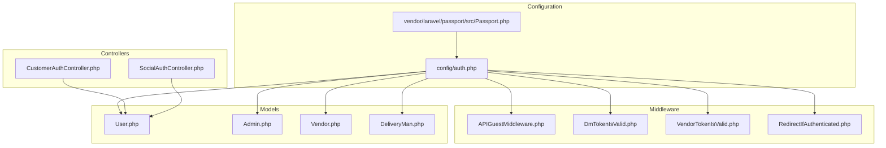
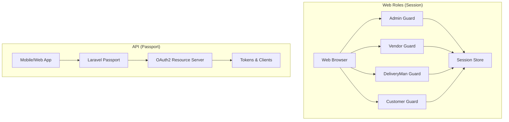
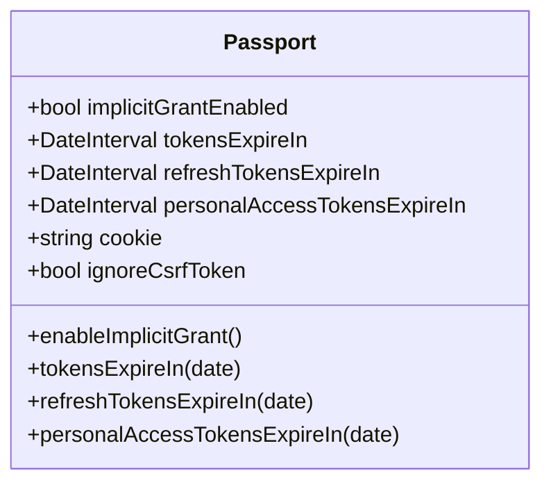
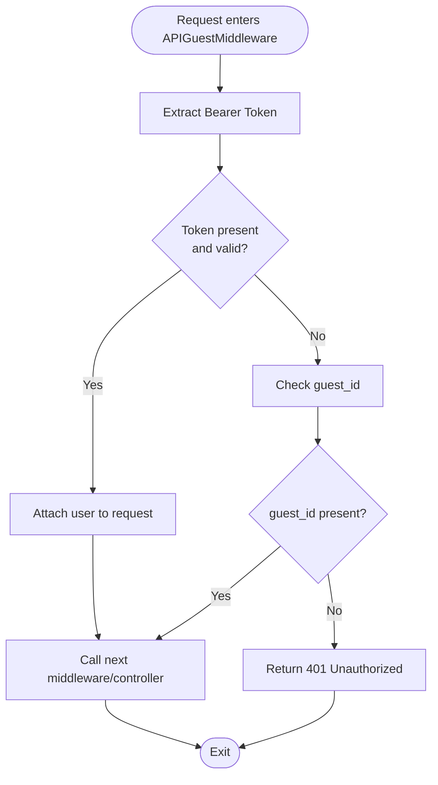
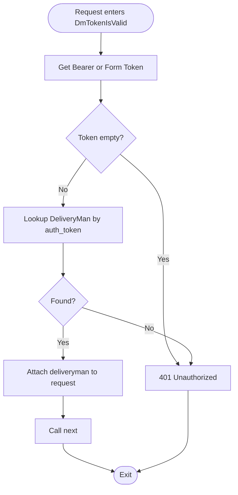
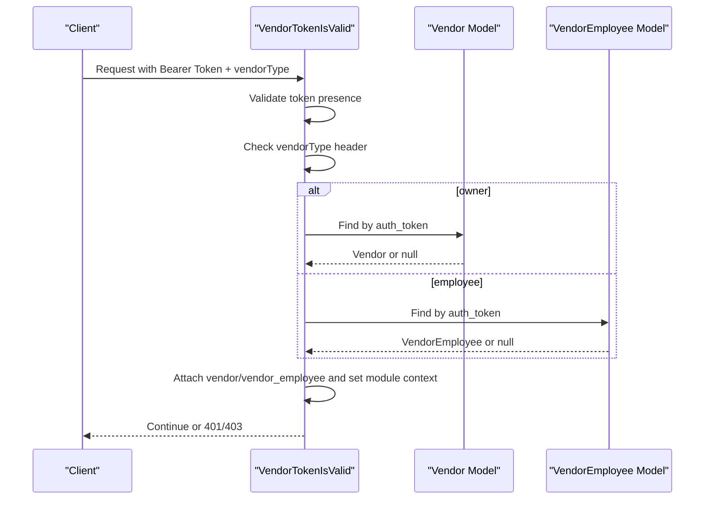
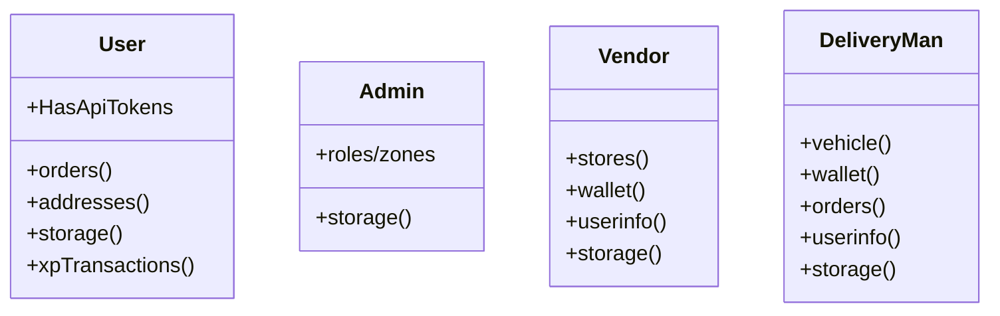
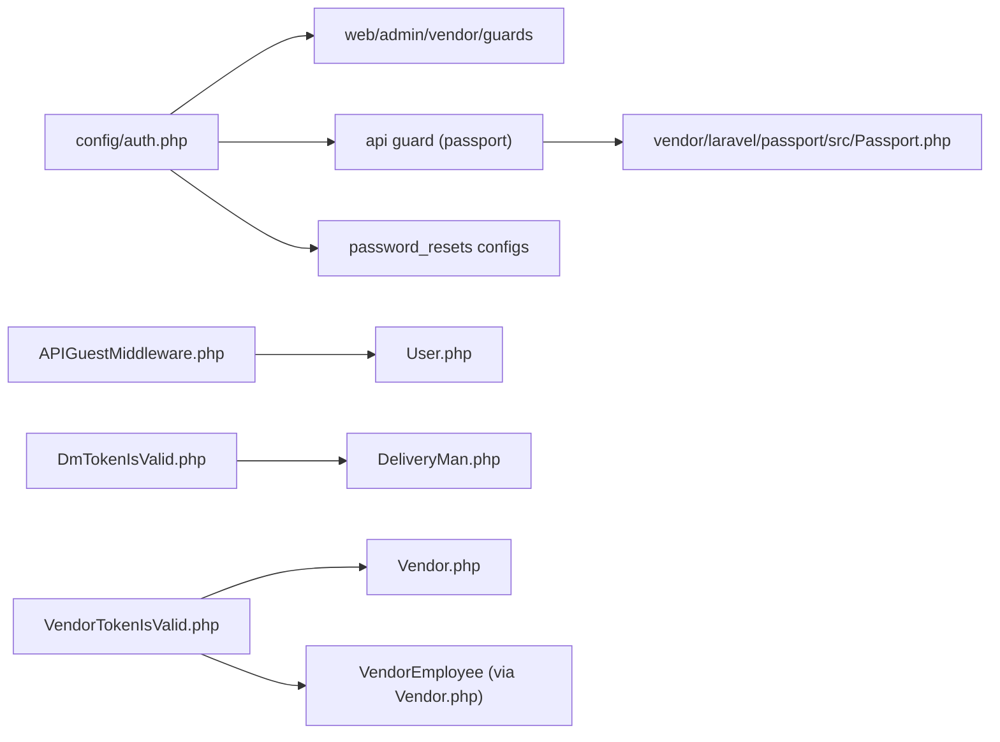

# Authentication System

<cite>
**Referenced Files in This Document**
- [auth.php](file://config/auth.php)
- [AuthServiceProvider.php](file://app/Providers/AuthServiceProvider.php)
- [APIGuestMiddleware.php](file://app/Http/Middleware/APIGuestMiddleware.php)
- [DmTokenIsValid.php](file://app/Http/Middleware/DmTokenIsValid.php)
- [VendorTokenIsValid.php](file://app/Http/Middleware/VendorTokenIsValid.php)
- [RedirectIfAuthenticated.php](file://app/Http/Middleware/RedirectIfAuthenticated.php)
- [User.php](file://app/Models/User.php)
- [Admin.php](file://app/Models/Admin.php)
- [Vendor.php](file://app/Models/Vendor.php)
- [DeliveryMan.php](file://app/Models/DeliveryMan.php)
- [CustomerAuthController.php](file://app/Http/Controllers/Api/V1/Auth/CustomerAuthController.php)
- [SocialAuthController.php](file://app/Http/Controllers/Api/V1/Auth/SocialAuthController.php)
- [Passport.php](file://vendor/laravel/passport/src/Passport.php)
</cite>

## Table of Contents
1. [Introduction](#introduction)
2. [Project Structure](#project-structure)
3. [Core Components](#core-components)
4. [Architecture Overview](#architecture-overview)
5. [Detailed Component Analysis](#detailed-component-analysis)
6. [Dependency Analysis](#dependency-analysis)
7. [Performance Considerations](#performance-considerations)
8. [Troubleshooting Guide](#troubleshooting-guide)
9. [Conclusion](#conclusion)

## Introduction
This document describes the authentication system of the application, focusing on:
- Multi-factor authentication patterns and guest access
- Token-based authentication via Laravel Passport for API clients
- Session-based authentication for web roles (admin, vendor, delivery personnel)
- JWT token handling and refresh mechanisms
- Login/logout flows, password reset procedures, and OTP verification processes
- Practical middleware usage for enforcing authentication
- Security considerations and integration points for external authentication providers and social login

## Project Structure
Authentication spans configuration, middleware, models, controllers, and third-party packages:
- Configuration defines guards/providers/password resets
- Middleware enforces authentication and validates tokens for specific roles
- Models implement authentication traits and expose relations
- Controllers implement API endpoints for authentication and social login
- Passport provides OAuth2 server capabilities and token lifetimes

**Diagram sources**
- [auth.php:1-180](file://config/auth.php#L1-L180)
- [Passport.php:1-759](file://vendor/laravel/passport/src/Passport.php#L1-L759)
- [APIGuestMiddleware.php:1-33](file://app/Http/Middleware/APIGuestMiddleware.php#L1-L33)
- [DmTokenIsValid.php:1-41](file://app/Http/Middleware/DmTokenIsValid.php#L1-L41)
- [VendorTokenIsValid.php:1-68](file://app/Http/Middleware/VendorTokenIsValid.php#L1-L68)
- [RedirectIfAuthenticated.php:1-44](file://app/Http/Middleware/RedirectIfAuthenticated.php#L1-L44)
- [User.php:1-279](file://app/Models/User.php#L1-L279)
- [Admin.php:1-149](file://app/Models/Admin.php#L1-L149)
- [Vendor.php:1-146](file://app/Models/Vendor.php#L1-L146)
- [DeliveryMan.php:1-234](file://app/Models/DeliveryMan.php#L1-L234)
- [CustomerAuthController.php](file://app/Http/Controllers/Api/V1/Auth/CustomerAuthController.php)
- [SocialAuthController.php](file://app/Http/Controllers/Api/V1/Auth/SocialAuthController.php)

**Section sources**
- [auth.php:1-180](file://config/auth.php#L1-L180)
- [Passport.php:1-759](file://vendor/laravel/passport/src/Passport.php#L1-L759)

## Core Components
- Guards and providers:
  - Session guards for web roles: web, admin, vendor, vendor_employee, customer, delivery_men
  - API guard using Passport for OAuth2
- Providers:
  - Eloquent providers for User, Admin, Vendor, VendorEmployee, DeliveryMan
  - Database provider for DeliveryMen
- Password reset configuration per user type with expiration and throttling
- Middleware:
  - APIGuestMiddleware: allows authenticated API requests or guest_id
  - DmTokenIsValid: validates bearer token against DeliveryMan.auth_token
  - VendorTokenIsValid: validates bearer token against Vendor/VendorEmployee.auth_token and sets module context
  - RedirectIfAuthenticated: redirects authenticated users away from login pages
- Models:
  - User: HasApiTokens trait for Passport
  - Admin, Vendor, DeliveryMan: standard Authenticatable
- Controllers:
  - CustomerAuthController and SocialAuthController implement authentication flows

**Section sources**
- [auth.php:38-164](file://config/auth.php#L38-L164)
- [APIGuestMiddleware.php:17-31](file://app/Http/Middleware/APIGuestMiddleware.php#L17-L31)
- [DmTokenIsValid.php:19-39](file://app/Http/Middleware/DmTokenIsValid.php#L19-L39)
- [VendorTokenIsValid.php:20-66](file://app/Http/Middleware/VendorTokenIsValid.php#L20-L66)
- [RedirectIfAuthenticated.php:20-42](file://app/Http/Middleware/RedirectIfAuthenticated.php#L20-L42)
- [User.php:16](file://app/Models/User.php#L16)
- [Admin.php:31](file://app/Models/Admin.php#L31)
- [Vendor.php:14](file://app/Models/Vendor.php#L14)
- [DeliveryMan.php:13](file://app/Models/DeliveryMan.php#L13)

## Architecture Overview
The system supports two primary authentication modes:
- Session-based authentication for web roles (admin, vendor, delivery_men, customer)
- Token-based authentication for APIs using Passport OAuth2

**Diagram sources**
- [auth.php:38-71](file://config/auth.php#L38-L71)
- [auth.php:90-115](file://config/auth.php#L90-L115)
- [auth.php:132-164](file://config/auth.php#L132-L164)
- [Passport.php:15-120](file://vendor/laravel/passport/src/Passport.php#L15-L120)

## Detailed Component Analysis

### Guards and Providers
- Guards:
  - web, admin, vendor, vendor_employee, customer, delivery_men use session driver
  - api uses passport driver
- Providers:
  - users: Eloquent User model
  - admins: Eloquent Admin model
  - vendors: Eloquent Vendor model
  - vendor_employees: Eloquent VendorEmployee model
  - delivery_men: database table delivery_men
- Password resets:
  - Separate configs per user type with expire and throttle

**Section sources**
- [auth.php:38-115](file://config/auth.php#L38-L115)
- [auth.php:132-164](file://config/auth.php#L132-L164)

### Passport Configuration and Token Lifetimes
- Passport exposes configuration for:
  - Access token lifetime
  - Refresh token lifetime
  - Personal access token lifetime
  - Implicit grant enablement
  - Cookie settings and CSRF behavior
- These settings govern token validity and refresh flows in the API guard.

**Diagram sources**
- [Passport.php:15-120](file://vendor/laravel/passport/src/Passport.php#L15-L120)

**Section sources**
- [Passport.php:282-325](file://vendor/laravel/passport/src/Passport.php#L282-L325)
- [Passport.php:299-308](file://vendor/laravel/passport/src/Passport.php#L299-L308)
- [Passport.php:316-325](file://vendor/laravel/passport/src/Passport.php#L316-L325)

### API Guest Access Pattern
- APIGuestMiddleware:
  - Accepts requests with a valid bearer token linked to an API user
  - Allows guest_id-based anonymous access
  - Returns 401 Unauthorized otherwise

**Diagram sources**
- [APIGuestMiddleware.php:17-31](file://app/Http/Middleware/APIGuestMiddleware.php#L17-L31)

**Section sources**
- [APIGuestMiddleware.php:17-31](file://app/Http/Middleware/APIGuestMiddleware.php#L17-L31)

### Delivery Man Token Validation
- DmTokenIsValid:
  - Validates bearer token or form token against DeliveryMan.auth_token
  - Attaches deliveryman to request or rejects with 401

**Diagram sources**
- [DmTokenIsValid.php:19-39](file://app/Http/Middleware/DmTokenIsValid.php#L19-L39)

**Section sources**
- [DmTokenIsValid.php:19-39](file://app/Http/Middleware/DmTokenIsValid.php#L19-L39)

### Vendor/Vendor Employee Token Validation and Module Context
- VendorTokenIsValid:
  - Requires vendorType header
  - Validates bearer token against Vendor or VendorEmployee.auth_token
  - Sets module context based on vendor/store relationship
  - Rejects with 401/403 as appropriate

**Diagram sources**
- [VendorTokenIsValid.php:20-66](file://app/Http/Middleware/VendorTokenIsValid.php#L20-L66)

**Section sources**
- [VendorTokenIsValid.php:20-66](file://app/Http/Middleware/VendorTokenIsValid.php#L20-L66)

### RedirectIfAuthenticated Middleware
- Redirects authenticated users away from login/register pages based on guard
- Default guard returns 404 JSON for authenticated web users

**Section sources**
- [RedirectIfAuthenticated.php:20-42](file://app/Http/Middleware/RedirectIfAuthenticated.php#L20-L42)

### Models and Authentication Traits
- User:
  - Uses HasApiTokens for Passport
  - Provides relations for orders, addresses, storages, XP system
- Admin, Vendor, DeliveryMan:
  - Standard Authenticatable with guard-specific relations and scopes

**Diagram sources**
- [User.php:16-279](file://app/Models/User.php#L16-L279)
- [Admin.php:31-149](file://app/Models/Admin.php#L31-L149)
- [Vendor.php:14-146](file://app/Models/Vendor.php#L14-L146)
- [DeliveryMan.php:13-234](file://app/Models/DeliveryMan.php#L13-L234)

**Section sources**
- [User.php:16](file://app/Models/User.php#L16)
- [Admin.php:31](file://app/Models/Admin.php#L31)
- [Vendor.php:14](file://app/Models/Vendor.php#L14)
- [DeliveryMan.php:13](file://app/Models/DeliveryMan.php#L13)

### Controllers: Authentication Flows
- CustomerAuthController:
  - Implements customer login/logout and related flows
  - Integrates with User model and session/token guards
- SocialAuthController:
  - Implements social login flows
  - Integrates with User model and external provider callbacks

Note: Specific endpoint paths and method signatures are referenced below without code content.

**Section sources**
- [CustomerAuthController.php](file://app/Http/Controllers/Api/V1/Auth/CustomerAuthController.php)
- [SocialAuthController.php](file://app/Http/Controllers/Api/V1/Auth/SocialAuthController.php)

### Password Reset Procedures
- Password reset configuration:
  - Separate configs per guard/provider
  - Expiration and throttle values defined
- Implementation:
  - Use Laravel’s built-in password reset facilities with the configured providers
  - Tokens stored in password_resets table per provider

**Section sources**
- [auth.php:132-164](file://config/auth.php#L132-L164)

### OTP Verification Processes
- OTP-related tables and columns exist in migrations (e.g., phone verifications, password resets)
- Typical flow:
  - Generate OTP and store with temporary block time
  - Validate OTP during verification
  - Enforce rate limits and temporary blocks
- Integration points:
  - Middleware can enforce OTP checks before sensitive actions
  - Controllers coordinate OTP generation and validation

**Section sources**
- [auth.php:132-164](file://config/auth.php#L132-L164)

### Token Refresh Mechanisms
- Passport supports refresh tokens; token lifetimes are configurable
- Typical flow:
  - Client exchanges refresh token for new access token
  - Server validates refresh token and issues new access token
- Configuration:
  - Access token lifetime
  - Refresh token lifetime
  - Personal access token lifetime

**Section sources**
- [Passport.php:282-325](file://vendor/laravel/passport/src/Passport.php#L282-L325)
- [Passport.php:299-308](file://vendor/laravel/passport/src/Passport.php#L299-L308)
- [Passport.php:316-325](file://vendor/laravel/passport/src/Passport.php#L316-L325)

### JWT Token Handling
- Passport manages OAuth2 tokens; JWT specifics are handled internally
- Encryption key generation and cookie settings are configurable
- CSRF behavior can be adjusted for API consumption

**Section sources**
- [Passport.php:654-672](file://vendor/laravel/passport/src/Passport.php#L654-L672)
- [Passport.php:333-342](file://vendor/laravel/passport/src/Passport.php#L333-L342)
- [Passport.php:350-355](file://vendor/laravel/passport/src/Passport.php#L350-L355)

### Guest User Access Patterns
- APIGuestMiddleware enables guest_id-based anonymous access
- Useful for cart persistence and analytics without requiring login
- Combine with rate limiting and IP-based safeguards

**Section sources**
- [APIGuestMiddleware.php:17-31](file://app/Http/Middleware/APIGuestMiddleware.php#L17-L31)

### Integration with External Authentication Providers and Social Login
- SocialAuthController coordinates social login flows
- Typically involves redirect to provider, callback handling, and user linking/creation
- Integrates with User model and Passport for token issuance

**Section sources**
- [SocialAuthController.php](file://app/Http/Controllers/Api/V1/Auth/SocialAuthController.php)

## Dependency Analysis
- Configuration dependency:
  - Guards/providers depend on model classes and database tables
  - Password reset configs depend on provider tables
- Middleware dependency:
  - Role-specific middleware depend on model lookup fields (auth_token)
  - APIGuestMiddleware depends on API user resolution
- Passport dependency:
  - API guard depends on Passport server and token lifetimes
- Controllers dependency:
  - Authentication controllers depend on models and middleware

**Diagram sources**
- [auth.php:38-164](file://config/auth.php#L38-L164)
- [Passport.php:15-120](file://vendor/laravel/passport/src/Passport.php#L15-L120)
- [APIGuestMiddleware.php:17-31](file://app/Http/Middleware/APIGuestMiddleware.php#L17-L31)
- [DmTokenIsValid.php:19-39](file://app/Http/Middleware/DmTokenIsValid.php#L19-L39)
- [VendorTokenIsValid.php:20-66](file://app/Http/Middleware/VendorTokenIsValid.php#L20-L66)
- [User.php:16](file://app/Models/User.php#L16)
- [DeliveryMan.php:13](file://app/Models/DeliveryMan.php#L13)
- [Vendor.php:14](file://app/Models/Vendor.php#L14)

**Section sources**
- [auth.php:38-164](file://config/auth.php#L38-L164)
- [Passport.php:15-120](file://vendor/laravel/passport/src/Passport.php#L15-L120)

## Performance Considerations
- Prefer token caching for frequent API calls
- Use appropriate token lifetimes to balance security and performance
- Minimize middleware overhead by placing lightweight checks early
- Index auth_token fields in relevant tables for fast lookups

## Troubleshooting Guide
- 401 Unauthorized:
  - Verify bearer token presence and validity
  - Ensure token matches the intended guard/provider
- 403 Forbidden:
  - Check vendorType header for vendor middleware
- Redirect loops:
  - Confirm RedirectIfAuthenticated middleware is applied only where needed
- Password reset failures:
  - Validate provider table and expiration/throttle settings
- OTP issues:
  - Check OTP generation, storage, and temporary block time logic

**Section sources**
- [APIGuestMiddleware.php:17-31](file://app/Http/Middleware/APIGuestMiddleware.php#L17-L31)
- [DmTokenIsValid.php:19-39](file://app/Http/Middleware/DmTokenIsValid.php#L19-L39)
- [VendorTokenIsValid.php:20-66](file://app/Http/Middleware/VendorTokenIsValid.php#L20-L66)
- [RedirectIfAuthenticated.php:20-42](file://app/Http/Middleware/RedirectIfAuthenticated.php#L20-L42)
- [auth.php:132-164](file://config/auth.php#L132-L164)

## Conclusion
The authentication system combines session-based web authentication with token-based API authentication powered by Laravel Passport. Guards and providers support multiple user types, while middleware enforces role-specific token validation and guest access patterns. Passport configuration controls token lifetimes and refresh behavior. Password reset and OTP mechanisms are supported through provider configurations and model relations. The documented flows and middleware usage provide a secure foundation for login/logout, password reset, OTP verification, and social login integrations.