# Security Middleware and Protection

<cite>
**Referenced Files in This Document**
- [Kernel.php](file://app/Http/Kernel.php)
- [SecurityHeaders.php](file://app/Http/Middleware/SecurityHeaders.php)
- [PreventRequestsDuringMaintenance.php](file://app/Http/Middleware/PreventRequestsDuringMaintenance.php)
- [VerifyCsrfToken.php](file://app/Http/Middleware/VerifyCsrfToken.php)
- [UpdateLastActive.php](file://app/Http/Middleware/UpdateLastActive.php)
- [InstallationMiddleware.php](file://app/Http/Middleware/InstallationMiddleware.php)
- [ActivationCheckMiddleware.php](file://app/Http/Middleware/ActivationCheckMiddleware.php)
- [ActivationClass.php](file://app/Traits/ActivationClass.php)
- [TrustHosts.php](file://app/Http/Middleware/TrustHosts.php)
- [TrustProxies.php](file://app/Http/Middleware/TrustProxies.php)
- [session.php](file://config/session.php)
- [cors.php](file://config/cors.php)
- [cache.php](file://config/cache.php)
- [CustomerAuthController.php](file://app/Http/Controllers/Api/V1/Auth/CustomerAuthController.php)
- [api.php](file://routes/api/v1/api.php)
- [activate_update_routes.txt](file://installation/activate_update_routes.txt)
</cite>

## Table of Contents
1. [Introduction](#introduction)
2. [Project Structure](#project-structure)
3. [Core Components](#core-components)
4. [Architecture Overview](#architecture-overview)
5. [Detailed Component Analysis](#detailed-component-analysis)
6. [Dependency Analysis](#dependency-analysis)
7. [Performance Considerations](#performance-considerations)
8. [Troubleshooting Guide](#troubleshooting-guide)
9. [Conclusion](#conclusion)
10. [Appendices](#appendices)

## Introduction
This document explains the security middleware stack that protects the application from common threats. It covers security headers, request validation, maintenance mode handling, activation checks, last activity tracking, session security, rate limiting, and practical guidance for middleware configuration, custom middleware development, and security best practices. It also addresses XSS protection, CSRF prevention, and input sanitization strategies.

## Project Structure
The security middleware stack is primarily defined in the HTTP kernel and individual middleware classes. Global middleware runs on every request, while route middleware groups target specific contexts (web, API). Configuration files define session, CORS, and cache behavior that underpin security posture.

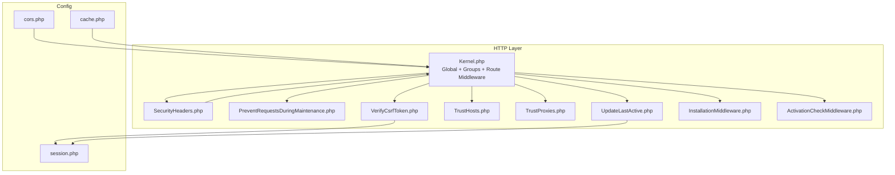

**Diagram sources**
- [Kernel.php:18-52](file://app/Http/Kernel.php#L18-L52)
- [SecurityHeaders.php:10-23](file://app/Http/Middleware/SecurityHeaders.php#L10-L23)
- [PreventRequestsDuringMaintenance.php:7-17](file://app/Http/Middleware/PreventRequestsDuringMaintenance.php#L7-L17)
- [VerifyCsrfToken.php:7-18](file://app/Http/Middleware/VerifyCsrfToken.php#L7-L18)
- [TrustHosts.php:7-20](file://app/Http/Middleware/TrustHosts.php#L7-L20)
- [TrustProxies.php:8-23](file://app/Http/Middleware/TrustProxies.php#L8-L23)
- [UpdateLastActive.php:23-36](file://app/Http/Middleware/UpdateLastActive.php#L23-L36)
- [InstallationMiddleware.php:7-20](file://app/Http/Middleware/InstallationMiddleware.php#L7-L20)
- [ActivationCheckMiddleware.php:11-26](file://app/Http/Middleware/ActivationCheckMiddleware.php#L11-L26)
- [session.php:21-201](file://config/session.php#L21-L201)
- [cors.php:18-35](file://config/cors.php#L18-L35)
- [cache.php:18-107](file://config/cache.php#L18-L107)

**Section sources**
- [Kernel.php:18-52](file://app/Http/Kernel.php#L18-L52)

## Core Components
- Global middleware stack: Host trust, maintenance prevention, input trimming, CORS, and security headers.
- Web group: Cookies, session, CSRF protection, routing bindings, localization.
- API group: Throttling, routing bindings, last activity tracking.
- Route middleware: Authentication, authorization, role guards, module checks, installation and activation checks, localization, and more.
- Configuration: Session, CORS, cache.

Key implementation references:
- Global middleware registration and ordering: [Kernel.php:18-28](file://app/Http/Kernel.php#L18-L28)
- Web group middleware: [Kernel.php:35-46](file://app/Http/Kernel.php#L35-L46)
- API group middleware: [Kernel.php:47-52](file://app/Http/Kernel.php#L47-L52)
- Route middleware registry: [Kernel.php:61-86](file://app/Http/Kernel.php#L61-L86)

**Section sources**
- [Kernel.php:18-86](file://app/Http/Kernel.php#L18-L86)

## Architecture Overview
The middleware pipeline applies security controls in a layered manner:
- Early global middleware validates and hardens the request/response envelope.
- Web-specific middleware secures session-bound interactions.
- API-specific middleware enforces rate limits and tracks activity.
- Route middleware enforces authentication, authorization, and environment checks.

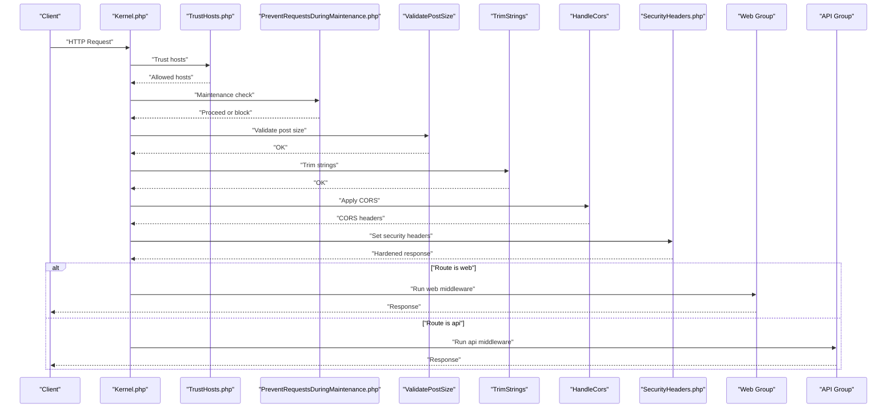

**Diagram sources**
- [Kernel.php:18-52](file://app/Http/Kernel.php#L18-L52)
- [SecurityHeaders.php:10-23](file://app/Http/Middleware/SecurityHeaders.php#L10-L23)
- [PreventRequestsDuringMaintenance.php:7-17](file://app/Http/Middleware/PreventRequestsDuringMaintenance.php#L7-L17)
- [TrustHosts.php:14-19](file://app/Http/Middleware/TrustHosts.php#L14-L19)

## Detailed Component Analysis

### Security Headers Implementation
SecurityHeaders middleware sets defensive headers and removes fingerprinting headers. It ensures frame protection, MIME sniffing prevention, XSS filtering, referrer policy, permissions policy, and removes server identity headers.

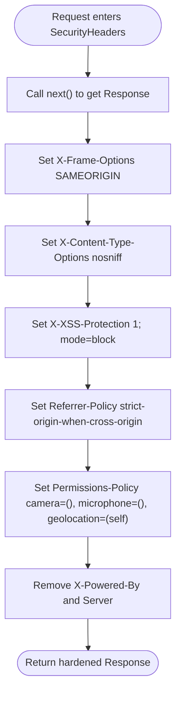

**Diagram sources**
- [SecurityHeaders.php:10-23](file://app/Http/Middleware/SecurityHeaders.php#L10-L23)

**Section sources**
- [SecurityHeaders.php:10-23](file://app/Http/Middleware/SecurityHeaders.php#L10-L23)

### Maintenance Mode Handling
PreventRequestsDuringMaintenance blocks requests while maintenance mode is active, except for explicitly allowed URIs. The default implementation maintains an empty allowlist.

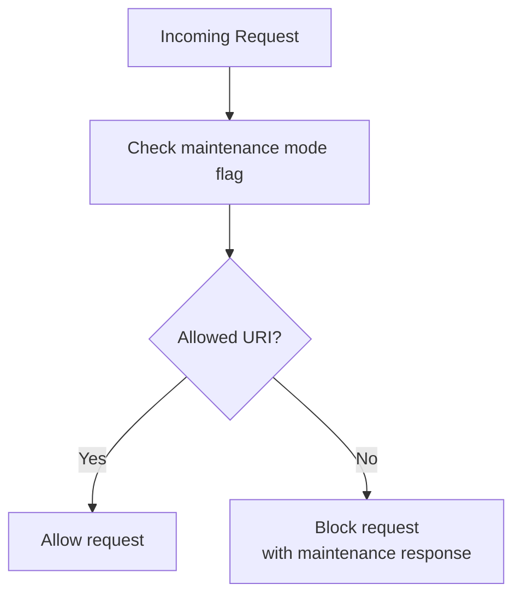

**Diagram sources**
- [PreventRequestsDuringMaintenance.php:14-16](file://app/Http/Middleware/PreventRequestsDuringMaintenance.php#L14-L16)

**Section sources**
- [PreventRequestsDuringMaintenance.php:7-17](file://app/Http/Middleware/PreventRequestsDuringMaintenance.php#L7-L17)

### CSRF Prevention
VerifyCsrfToken extends the framework’s CSRF middleware and defines URIs excluded from CSRF verification. This is essential for payment callbacks and external integrations.

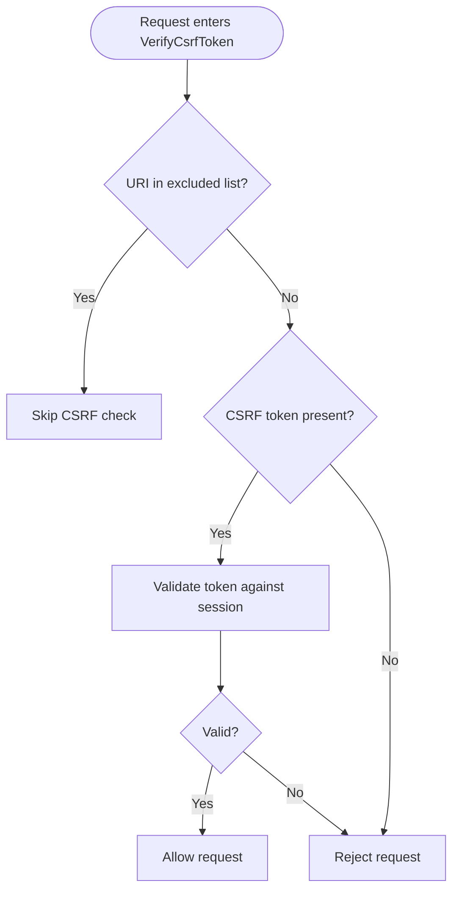

**Diagram sources**
- [VerifyCsrfToken.php:14-17](file://app/Http/Middleware/VerifyCsrfToken.php#L14-L17)

**Section sources**
- [VerifyCsrfToken.php:7-18](file://app/Http/Middleware/VerifyCsrfToken.php#L7-L18)

### Last Activity Tracking
UpdateLastActive middleware updates the authenticated API user’s last activity timestamp only when the last update is older than one minute. It uses a quiet save to avoid triggering model events.

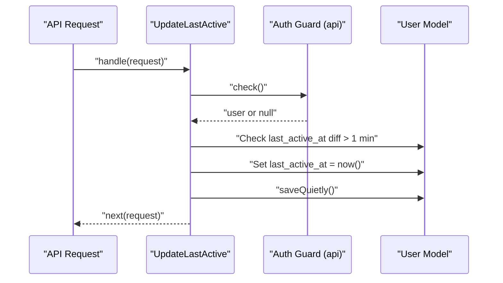

**Diagram sources**
- [UpdateLastActive.php:25-32](file://app/Http/Middleware/UpdateLastActive.php#L25-L32)

**Section sources**
- [UpdateLastActive.php:23-36](file://app/Http/Middleware/UpdateLastActive.php#L23-L36)

### Session Security
Session configuration controls driver, lifetime, encryption, cookie attributes (secure, httpOnly, sameSite), and domain/path. These settings mitigate session hijacking and cross-site leakage.

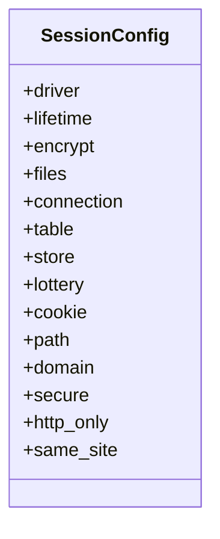

**Diagram sources**
- [session.php:21-201](file://config/session.php#L21-L201)

**Section sources**
- [session.php:21-201](file://config/session.php#L21-L201)

### Rate Limiting Mechanisms
- API group uses the built-in throttle middleware.
- Application-wide rate limiter configured for API routes.
- Authentication and OTP endpoints use dedicated throttles.

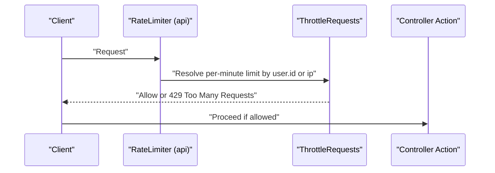

**Diagram sources**
- [activate_update_routes.txt:64-66](file://installation/activate_update_routes.txt#L64-L66)
- [api.php:42-55](file://routes/api/v1/api.php#L42-L55)

**Section sources**
- [activate_update_routes.txt:62-67](file://installation/activate_update_routes.txt#L62-L67)
- [api.php:42-55](file://routes/api/v1/api.php#L42-L55)

### Activation Checks
ActivationCheckMiddleware currently delegates to the ActivationClass trait. The trait provides domain resolution, addon configuration retrieval, cache key generation, and persistence of activation responses to configuration files and cache.

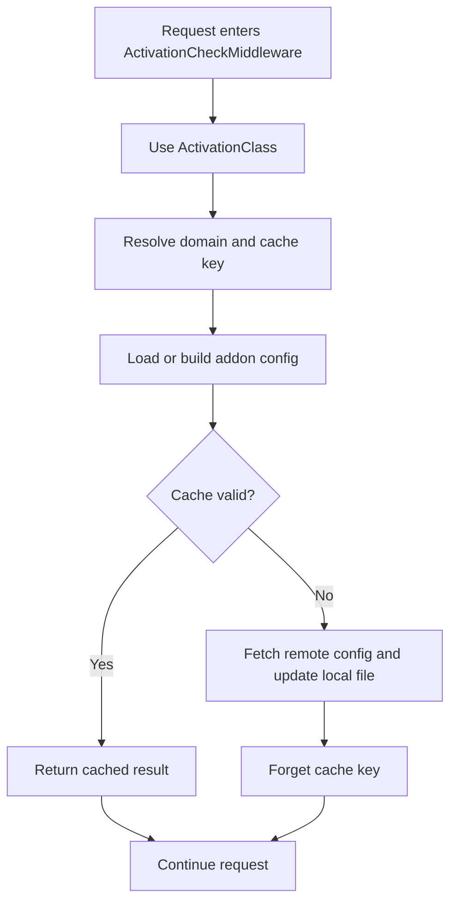

**Diagram sources**
- [ActivationCheckMiddleware.php:22-25](file://app/Http/Middleware/ActivationCheckMiddleware.php#L22-L25)
- [ActivationClass.php:15-24](file://app/Traits/ActivationClass.php#L15-L24)
- [ActivationClass.php:64-77](file://app/Traits/ActivationClass.php#L64-L77)

**Section sources**
- [ActivationCheckMiddleware.php:11-26](file://app/Http/Middleware/ActivationCheckMiddleware.php#L11-L26)
- [ActivationClass.php:8-79](file://app/Traits/ActivationClass.php#L8-L79)

### Installation Middleware
InstallationMiddleware is a placeholder that forwards requests without modification. It can be extended to gate installation or update flows.

**Section sources**
- [InstallationMiddleware.php:7-20](file://app/Http/Middleware/InstallationMiddleware.php#L7-L20)

### Trust Hosts and Proxies
TrustHosts restricts accepted hosts to application URL subdomains. TrustProxies detects forwarded headers from load balancers and ELBs.

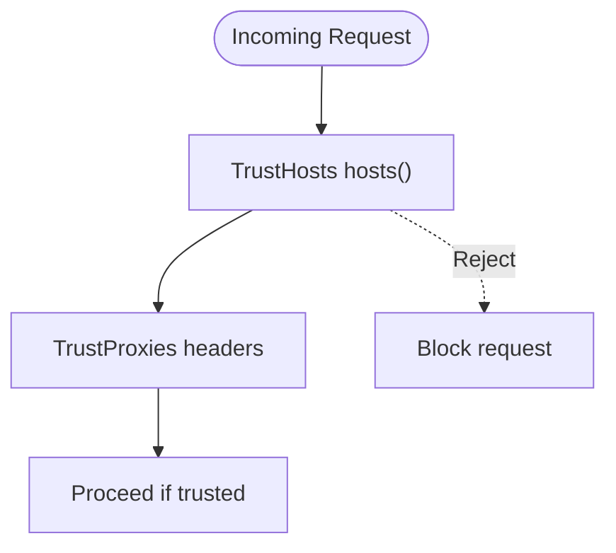

**Diagram sources**
- [TrustHosts.php:14-19](file://app/Http/Middleware/TrustHosts.php#L14-L19)
- [TrustProxies.php:22](file://app/Http/Middleware/TrustProxies.php#L22)

**Section sources**
- [TrustHosts.php:7-20](file://app/Http/Middleware/TrustHosts.php#L7-L20)
- [TrustProxies.php:8-23](file://app/Http/Middleware/TrustProxies.php#L8-L23)

### Request Validation and Input Sanitization
- Global trimming and conversion middleware normalize input.
- Route-level validation uses Laravel validators and form requests.
- Input sanitization strategies include:
  - Whitelisting allowed headers and origins via CORS configuration.
  - Using strict session cookie policies.
  - Enforcing minimum password lengths and strong validation rules.
  - Avoiding hardcoded OTP bypasses and validating OTP against temporary records.

Examples of validation and sanitization in practice:
- OTP verification and rate-limiting for phone/email verifications: [CustomerAuthController.php:33-248](file://app/Http/Controllers/Api/V1/Auth/CustomerAuthController.php#L33-L248)
- Registration validation with password strength: [CustomerAuthController.php:389-464](file://app/Http/Controllers/Api/V1/Auth/CustomerAuthController.php#L389-L464)
- Login validation and throttling: [CustomerAuthController.php:567-800](file://app/Http/Controllers/Api/V1/Auth/CustomerAuthController.php#L567-L800)

**Section sources**
- [CustomerAuthController.php:33-248](file://app/Http/Controllers/Api/V1/Auth/CustomerAuthController.php#L33-L248)
- [CustomerAuthController.php:389-464](file://app/Http/Controllers/Api/V1/Auth/CustomerAuthController.php#L389-L464)
- [CustomerAuthController.php:567-800](file://app/Http/Controllers/Api/V1/Auth/CustomerAuthController.php#L567-L800)

## Dependency Analysis
The middleware stack depends on:
- Kernel for ordering and grouping.
- Configuration files for session, CORS, and cache behavior.
- Route definitions for applying throttling and middleware groups.

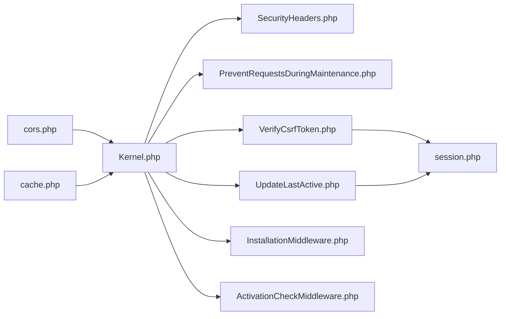

**Diagram sources**
- [Kernel.php:18-52](file://app/Http/Kernel.php#L18-L52)
- [VerifyCsrfToken.php:14-17](file://app/Http/Middleware/VerifyCsrfToken.php#L14-L17)
- [UpdateLastActive.php:25-32](file://app/Http/Middleware/UpdateLastActive.php#L25-L32)
- [session.php:21-201](file://config/session.php#L21-L201)
- [cors.php:18-35](file://config/cors.php#L18-L35)
- [cache.php:18-107](file://config/cache.php#L18-L107)

**Section sources**
- [Kernel.php:18-52](file://app/Http/Kernel.php#L18-L52)

## Performance Considerations
- Minimize middleware overhead by keeping global middleware minimal and targeted.
- Use throttling judiciously; adjust rates per endpoint based on traffic patterns.
- Cache activation and configuration data to reduce repeated I/O.
- Avoid excessive session writes; UpdateLastActive already prevents frequent updates by enforcing a 1-minute interval.

## Troubleshooting Guide
Common issues and resolutions:
- Unexpected maintenance mode blocking: Verify maintenance mode flag and the allowlist in PreventRequestsDuringMaintenance.
- CSRF failures on specific endpoints: Confirm the URI is included in VerifyCsrfToken excluded list.
- Session cookie not set or rejected: Check session cookie settings (secure, httpOnly, sameSite, domain) in session.php.
- CORS preflight failures: Validate allowed origins and headers in cors.php.
- Rate limiting too aggressive: Adjust throttle limits in route definitions and RateLimiter configuration.

**Section sources**
- [PreventRequestsDuringMaintenance.php:14-16](file://app/Http/Middleware/PreventRequestsDuringMaintenance.php#L14-L16)
- [VerifyCsrfToken.php:14-17](file://app/Http/Middleware/VerifyCsrfToken.php#L14-L17)
- [session.php:129-199](file://config/session.php#L129-L199)
- [cors.php:18-35](file://config/cors.php#L18-L35)
- [activate_update_routes.txt:64-66](file://installation/activate_update_routes.txt#L64-L66)

## Conclusion
The application employs a layered security middleware stack that hardens responses, validates requests, enforces session security, and applies rate limiting. Proper configuration of session, CORS, and cache settings further strengthens protection. Extending middleware for specialized needs (activation checks, installation gating) is straightforward and integrates cleanly with the existing kernel and route middleware registry.

## Appendices

### Practical Middleware Configuration Examples
- Apply throttling to sensitive endpoints:
  - See throttle usage in route definitions: [api.php:42-55](file://routes/api/v1/api.php#L42-L55)
- Configure API rate limiting globally:
  - See RateLimiter configuration: [activate_update_routes.txt:62-67](file://installation/activate_update_routes.txt#L62-L67)
- Customize CSRF exclusions:
  - Modify excluded URIs in VerifyCsrfToken: [VerifyCsrfToken.php:14-17](file://app/Http/Middleware/VerifyCsrfToken.php#L14-L17)
- Tune session security:
  - Adjust cookie and lifetime settings in session.php: [session.php:129-199](file://config/session.php#L129-L199)

### Custom Middleware Development Best Practices
- Keep middleware single-purpose and composable.
- Use early returns for allowlist/bypass scenarios.
- Log and monitor blocked requests for security insights.
- Parameterize thresholds (e.g., last activity update intervals) for tuning.