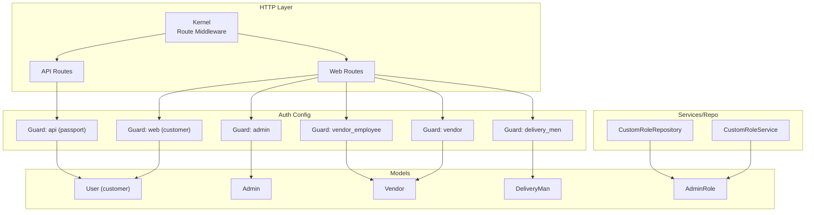
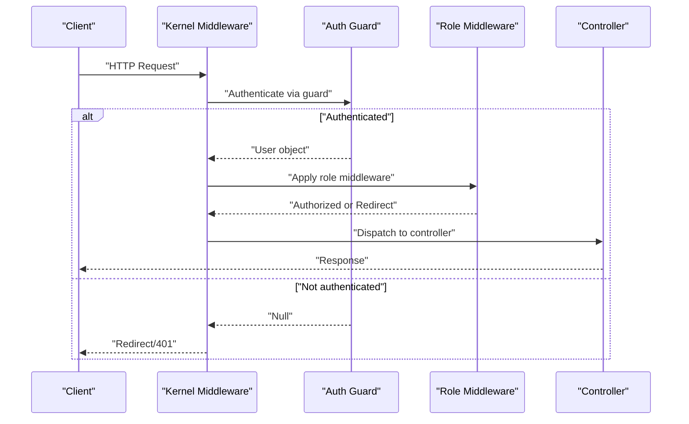
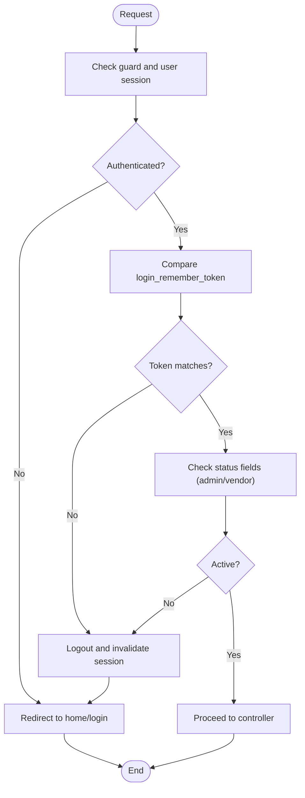
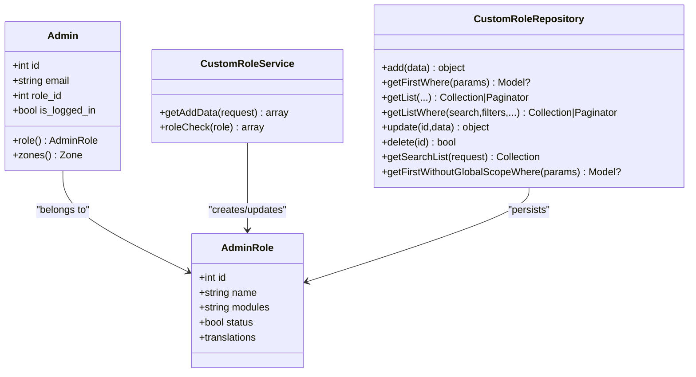
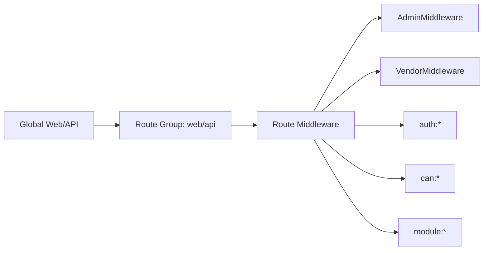
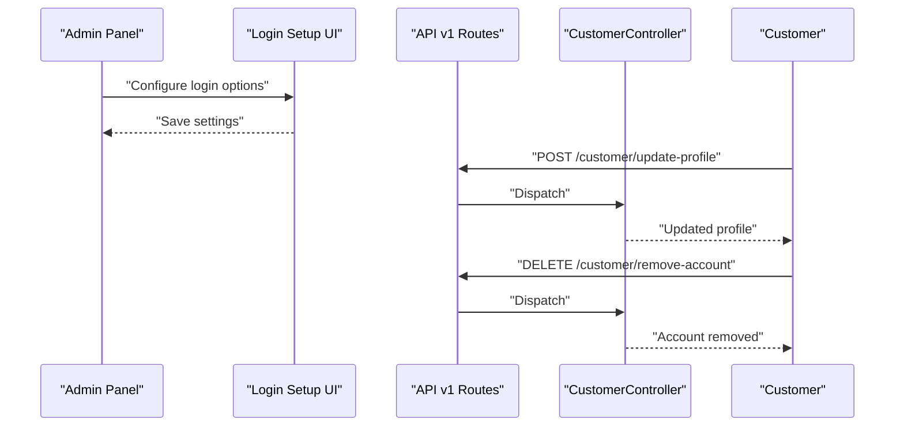
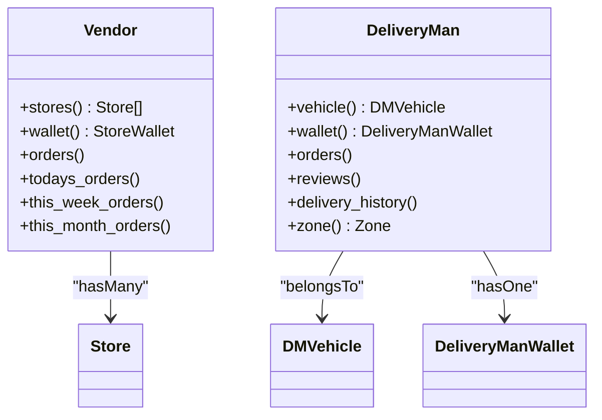
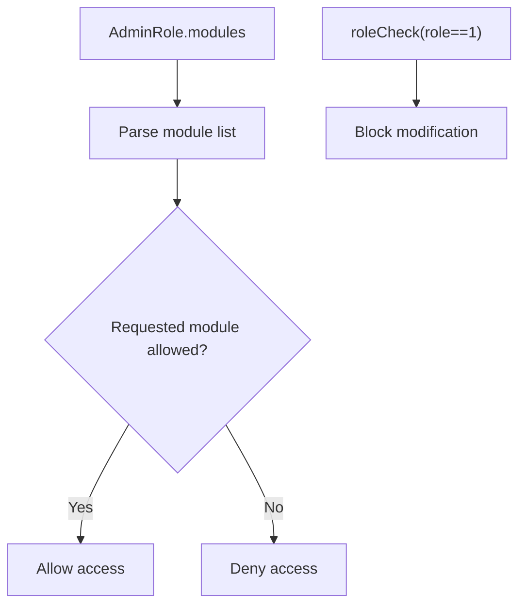
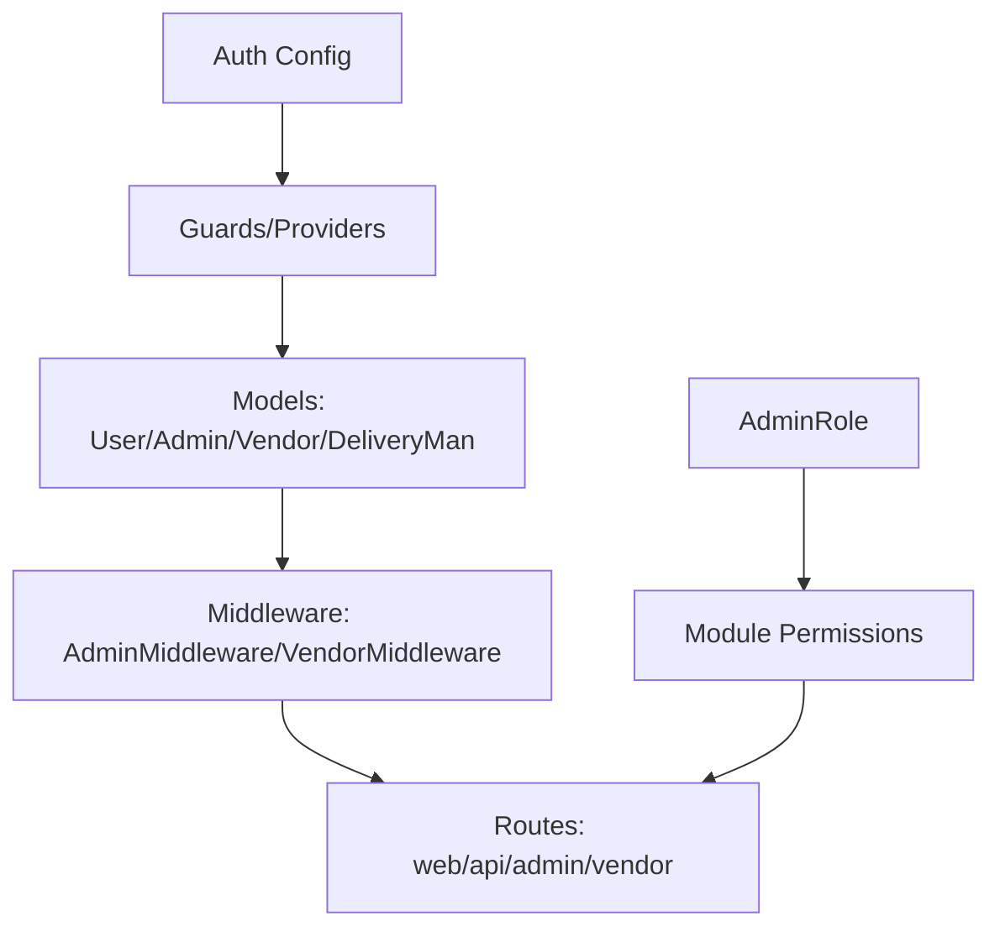

# User Management System

<cite>
**Referenced Files in This Document**
- [Kernel.php](file://app/Http/Kernel.php)
- [auth.php](file://config/auth.php)
- [AdminMiddleware.php](file://app/Http/Middleware/AdminMiddleware.php)
- [VendorMiddleware.php](file://app/Http/Middleware/VendorMiddleware.php)
- [User.php](file://app/Models/User.php)
- [Admin.php](file://app/Models/Admin.php)
- [Vendor.php](file://app/Models/Vendor.php)
- [DeliveryMan.php](file://app/Models/DeliveryMan.php)
- [AdminRole.php](file://app/Models/AdminRole.php)
- [CustomRoleService.php](file://app/Services/CustomRoleService.php)
- [CustomRoleRepository.php](file://app/Repositories/CustomRoleRepository.php)
- [routes.php](file://routes/admin/routes.php)
- [api.php](file://routes/api/v1/api.php)
- [login_page.blade.php](file://resources/views/admin-views/login-setup/login_page.blade.php)
</cite>

## Table of Contents
1. [Introduction](#introduction)
2. [Project Structure](#project-structure)
3. [Core Components](#core-components)
4. [Architecture Overview](#architecture-overview)
5. [Detailed Component Analysis](#detailed-component-analysis)
6. [Dependency Analysis](#dependency-analysis)
7. [Performance Considerations](#performance-considerations)
8. [Troubleshooting Guide](#troubleshooting-guide)
9. [Conclusion](#conclusion)
10. [Appendices](#appendices)

## Introduction
This document describes the user management system with a focus on multi-role architecture supporting customers, vendors, delivery personnel, and administrative users. It explains role-based access control, authentication flows, and permission systems; documents user registration processes, profile management, and account lifecycle management; details the middleware stack handling authentication, authorization, and role validation; and provides practical examples of role transitions, permission inheritance, and security considerations. It also addresses user data protection, session management, and integration with external identity providers.

## Project Structure
The user management system spans several layers:
- Authentication configuration defines multiple guards/providers for distinct user types.
- Middleware enforces role-aware session validation and guard-specific checks.
- Models encapsulate user profiles, roles, and relationships.
- Services and repositories support custom role creation and management.
- Routing integrates module permissions and guard-specific routes.

**Diagram sources**
- [Kernel.php:35-86](file://app/Http/Kernel.php#L35-L86)
- [auth.php:38-115](file://config/auth.php#L38-L115)
- [User.php:19-279](file://app/Models/User.php#L19-L279)
- [Admin.php:31-149](file://app/Models/Admin.php#L31-L149)
- [Vendor.php:14-146](file://app/Models/Vendor.php#L14-L146)
- [DeliveryMan.php:13-234](file://app/Models/DeliveryMan.php#L13-L234)
- [AdminRole.php:21-82](file://app/Models/AdminRole.php#L21-L82)
- [CustomRoleService.php:10-32](file://app/Services/CustomRoleService.php#L10-L32)
- [CustomRoleRepository.php:12-87](file://app/Repositories/CustomRoleRepository.php#L12-L87)

**Section sources**
- [Kernel.php:18-86](file://app/Http/Kernel.php#L18-L86)
- [auth.php:38-115](file://config/auth.php#L38-L115)

## Core Components
- Authentication guards and providers:
  - web: customer sessions
  - admin: administrators with role-based permissions
  - vendor and vendor_employee: store owners and employees
  - delivery_men: delivery agents
  - api: Passport-based tokens for mobile/web clients
- Middleware stack:
  - Global middleware for security headers and CORS
  - Route middleware for authentication, authorization, and role checks
- Models:
  - User: customer profile, relations, XP system integrations
  - Admin: administrator with role linkage and zone scoping
  - Vendor: store-linked vendor with earnings and wallet
  - DeliveryMan: agent with availability, ratings, and wallet
- Custom Role Management:
  - AdminRole model with module permissions
  - CustomRoleService and CustomRoleRepository for CRUD and checks

**Section sources**
- [auth.php:38-115](file://config/auth.php#L38-L115)
- [Kernel.php:35-86](file://app/Http/Kernel.php#L35-L86)
- [User.php:19-279](file://app/Models/User.php#L19-L279)
- [Admin.php:31-149](file://app/Models/Admin.php#L31-L149)
- [Vendor.php:14-146](file://app/Models/Vendor.php#L14-L146)
- [DeliveryMan.php:13-234](file://app/Models/DeliveryMan.php#L13-L234)
- [AdminRole.php:21-82](file://app/Models/AdminRole.php#L21-L82)
- [CustomRoleService.php:10-32](file://app/Services/CustomRoleService.php#L10-L32)
- [CustomRoleRepository.php:12-87](file://app/Repositories/CustomRoleRepository.php#L12-L87)

## Architecture Overview
The system separates concerns by guard/provider per user type, with middleware enforcing session validity and role checks. The API layer uses Passport for token-based authentication. Custom roles enable granular module-level permissions for admins.

**Diagram sources**
- [Kernel.php:35-86](file://app/Http/Kernel.php#L35-L86)
- [AdminMiddleware.php:20-45](file://app/Http/Middleware/AdminMiddleware.php#L20-L45)
- [VendorMiddleware.php:19-58](file://app/Http/Middleware/VendorMiddleware.php#L19-L58)
- [auth.php:38-115](file://config/auth.php#L38-L115)

## Detailed Component Analysis

### Multi-Guard Authentication and Session Management
- Guards:
  - web: customer sessions
  - admin: admin sessions with role and zone scoping
  - vendor/vendor_employee: store-linked vendors and employees
  - delivery_men: delivery agents
  - api: Passport tokens for REST clients
- Session validation:
  - AdminMiddleware and VendorMiddleware check login_remember_token and status fields, logging out invalid sessions and redirecting to login with a warning.
- Security headers and CORS:
  - Global middleware sets security headers and CORS policy.

**Diagram sources**
- [AdminMiddleware.php:20-45](file://app/Http/Middleware/AdminMiddleware.php#L20-L45)
- [VendorMiddleware.php:19-58](file://app/Http/Middleware/VendorMiddleware.php#L19-L58)
- [Kernel.php:18-28](file://app/Http/Kernel.php#L18-L28)

**Section sources**
- [auth.php:38-115](file://config/auth.php#L38-L115)
- [AdminMiddleware.php:20-45](file://app/Http/Middleware/AdminMiddleware.php#L20-L45)
- [VendorMiddleware.php:19-58](file://app/Http/Middleware/VendorMiddleware.php#L19-L58)
- [Kernel.php:18-28](file://app/Http/Kernel.php#L18-L28)

### Role-Based Access Control (RBAC) for Administrators
- AdminRole model stores role metadata and module permissions.
- Admin model links to AdminRole and supports zone scoping.
- CustomRoleService provides role creation data and basic checks (e.g., preventing modification of top-level roles).
- CustomRoleRepository handles persistence and search/filtering.

**Diagram sources**
- [Admin.php:31-149](file://app/Models/Admin.php#L31-L149)
- [AdminRole.php:21-82](file://app/Models/AdminRole.php#L21-L82)
- [CustomRoleService.php:10-32](file://app/Services/CustomRoleService.php#L10-L32)
- [CustomRoleRepository.php:12-87](file://app/Repositories/CustomRoleRepository.php#L12-L87)

**Section sources**
- [AdminRole.php:21-82](file://app/Models/AdminRole.php#L21-L82)
- [Admin.php:67-78](file://app/Models/Admin.php#L67-L78)
- [CustomRoleService.php:13-29](file://app/Services/CustomRoleService.php#L13-L29)
- [CustomRoleRepository.php:18-69](file://app/Repositories/CustomRoleRepository.php#L18-L69)

### Middleware Stack for Authentication and Authorization
- Global middleware:
  - SecurityHeaders, CORS, maintenance checks, trimming, CSRF verification (web group).
- Route middleware:
  - auth, can, verified, throttle, guest redirection, localization, module checks, installation checks, subscription checks, and role-specific middlewares (admin, vendor, vendor.api, dm.api).
- Role-specific enforcement:
  - AdminMiddleware validates admin session and role token.
  - VendorMiddleware validates vendor/vendor_employee session, status, and role token.

**Diagram sources**
- [Kernel.php:18-52](file://app/Http/Kernel.php#L18-L52)
- [Kernel.php:61-86](file://app/Http/Kernel.php#L61-L86)
- [AdminMiddleware.php:20-45](file://app/Http/Middleware/AdminMiddleware.php#L20-L45)
- [VendorMiddleware.php:19-58](file://app/Http/Middleware/VendorMiddleware.php#L19-L58)

**Section sources**
- [Kernel.php:18-86](file://app/Http/Kernel.php#L18-L86)
- [AdminMiddleware.php:20-45](file://app/Http/Middleware/AdminMiddleware.php#L20-L45)
- [VendorMiddleware.php:19-58](file://app/Http/Middleware/VendorMiddleware.php#L19-L58)

### Customer Registration, Profile Management, and Lifecycle
- Customer model (User):
  - Fields include personal info, verification flags, zone association, and preferences.
  - Relations include orders, addresses, and storage attachments.
  - Hidden attributes protect sensitive fields; appended image URLs resolve storage disks.
- Registration and login options:
  - Admin UI supports manual login, OTP login, and social login toggles.
- API endpoints for customer profile:
  - Customer endpoints under the API v1 routes include profile updates, interest updates, hide phone toggle, and account removal.

**Diagram sources**
- [login_page.blade.php:48-76](file://resources/views/admin-views/login-setup/login_page.blade.php#L48-L76)
- [api.php:333-346](file://routes/api/v1/api.php#L333-L346)
- [User.php:29-58](file://app/Models/User.php#L29-L58)

**Section sources**
- [User.php:29-130](file://app/Models/User.php#L29-L130)
- [login_page.blade.php:48-76](file://resources/views/admin-views/login-setup/login_page.blade.php#L48-L76)
- [api.php:333-346](file://routes/api/v1/api.php#L333-L346)

### Vendor and Delivery Personnel Lifecycle
- Vendor model:
  - Links to stores, wallets, and order transactions; exposes earnings and order metrics.
- DeliveryMan model:
  - Tracks availability, ratings, vehicles, wallets, and delivery history; scopes by zone.
- Vendor middleware:
  - Enforces vendor and vendor employee status and login_remember_token.

**Diagram sources**
- [Vendor.php:89-104](file://app/Models/Vendor.php#L89-L104)
- [DeliveryMan.php:54-122](file://app/Models/DeliveryMan.php#L54-L122)

**Section sources**
- [Vendor.php:89-104](file://app/Models/Vendor.php#L89-L104)
- [DeliveryMan.php:54-122](file://app/Models/DeliveryMan.php#L54-L122)
- [VendorMiddleware.php:19-58](file://app/Http/Middleware/VendorMiddleware.php#L19-L58)

### Permission Inheritance and Module-Level Controls
- AdminRole stores module permissions as a serialized field; translation support is integrated.
- CustomRoleService includes a roleCheck that prevents unauthorized modifications to top-level roles.
- CustomRoleRepository excludes top-level roles from listings and supports search and pagination.

**Diagram sources**
- [AdminRole.php:30-43](file://app/Models/AdminRole.php#L30-L43)
- [CustomRoleService.php:22-29](file://app/Services/CustomRoleService.php#L22-L29)
- [CustomRoleRepository.php:35-49](file://app/Repositories/CustomRoleRepository.php#L35-L49)

**Section sources**
- [AdminRole.php:30-43](file://app/Models/AdminRole.php#L30-L43)
- [CustomRoleService.php:22-29](file://app/Services/CustomRoleService.php#L22-L29)
- [CustomRoleRepository.php:35-49](file://app/Repositories/CustomRoleRepository.php#L35-L49)

### Practical Examples

#### Example: Admin Role Transition
- Scenario: Promote a staff member to a higher admin role with expanded module permissions.
- Steps:
  - Use CustomRoleService to prepare role data and ensure top-level protection.
  - Persist via CustomRoleRepository and assign Admin to AdminRole.
- Outcome: Admin gains access to additional modules gated by module middleware.

**Section sources**
- [CustomRoleService.php:13-29](file://app/Services/CustomRoleService.php#L13-L29)
- [CustomRoleRepository.php:18-26](file://app/Repositories/CustomRoleRepository.php#L18-L26)
- [Admin.php:67-70](file://app/Models/Admin.php#L67-L70)

#### Example: Customer Profile Update
- Scenario: Customer updates preferences and removes account.
- Steps:
  - Call API endpoints for profile update and account removal.
  - Backend validates authentication and applies guard rules.
- Outcome: Updated profile and account lifecycle handled securely.

**Section sources**
- [api.php:333-346](file://routes/api/v1/api.php#L333-L346)

#### Example: Vendor Session Validation
- Scenario: Vendor employee logs in from a new device.
- Steps:
  - Middleware compares login_remember_token; mismatch triggers logout and redirects to login.
- Outcome: Session integrity enforced across devices.

**Section sources**
- [VendorMiddleware.php:27-34](file://app/Http/Middleware/VendorMiddleware.php#L27-L34)
- [AdminMiddleware.php:27-38](file://app/Http/Middleware/AdminMiddleware.php#L27-L38)

### Security Considerations
- Session validation:
  - login_remember_token ensures single-session consistency; mismatches trigger logout and token regeneration.
- Status checks:
  - Admin and vendor middleware enforce active status; inactive users are logged out.
- Hidden fields:
  - Sensitive fields are hidden in model casts and response contexts.
- CORS and security headers:
  - Global middleware applies security headers and CORS policies.

**Section sources**
- [AdminMiddleware.php:22-38](file://app/Http/Middleware/AdminMiddleware.php#L22-L38)
- [VendorMiddleware.php:21-34](file://app/Http/Middleware/VendorMiddleware.php#L21-L34)
- [User.php:54-58](file://app/Models/User.php#L54-L58)
- [Kernel.php:18-28](file://app/Http/Kernel.php#L18-L28)

## Dependency Analysis
- Guards/providers map to specific models and storage mechanisms.
- Middleware depends on guard selection and session state.
- AdminRole is central to module-level permissions; CustomRoleService/Repository mediate persistence and validation.

**Diagram sources**
- [auth.php:38-115](file://config/auth.php#L38-L115)
- [AdminMiddleware.php:20-45](file://app/Http/Middleware/AdminMiddleware.php#L20-L45)
- [VendorMiddleware.php:19-58](file://app/Http/Middleware/VendorMiddleware.php#L19-L58)
- [AdminRole.php:30-43](file://app/Models/AdminRole.php#L30-L43)

**Section sources**
- [auth.php:38-115](file://config/auth.php#L38-L115)
- [AdminMiddleware.php:20-45](file://app/Http/Middleware/AdminMiddleware.php#L20-L45)
- [VendorMiddleware.php:19-58](file://app/Http/Middleware/VendorMiddleware.php#L19-L58)
- [AdminRole.php:30-43](file://app/Models/AdminRole.php#L30-L43)

## Performance Considerations
- Middleware overhead:
  - Session checks and token comparisons occur per request; keep login_remember_token generation efficient.
- Model relations:
  - Eager loading storage and translations reduces N+1 queries for images and localized names.
- Pagination:
  - Use paginated lists for roles and searchable endpoints to limit payload sizes.

[No sources needed since this section provides general guidance]

## Troubleshooting Guide
- Session expired or cross-device login:
  - Symptom: Redirect to login with a warning about expired session.
  - Resolution: Re-authenticate; ensure login_remember_token is consistent across sessions.
- Vendor/vendor employee blocked:
  - Symptom: Automatic logout when status is inactive or store status is inactive.
  - Resolution: Activate account/store and re-authenticate.
- Role modification blocked:
  - Symptom: Attempt to modify top-level role fails.
  - Resolution: Use CustomRoleService roleCheck to validate role ID before update.

**Section sources**
- [AdminMiddleware.php:22-38](file://app/Http/Middleware/AdminMiddleware.php#L22-L38)
- [VendorMiddleware.php:21-45](file://app/Http/Middleware/VendorMiddleware.php#L21-L45)
- [CustomRoleService.php:22-29](file://app/Services/CustomRoleService.php#L22-L29)

## Conclusion
The user management system implements a robust multi-guard, role-based architecture with strong session validation and module-level permissions. Guards and middleware ensure secure access for customers, vendors, delivery personnel, and administrators. The custom role system enables flexible permission inheritance and enforcement. Together with hidden fields, CORS/security headers, and lifecycle endpoints, the system provides a secure and extensible foundation for user management.

[No sources needed since this section summarizes without analyzing specific files]

## Appendices

### Appendix A: Route-Level Module Permission Example
- Admin custom role routes demonstrate module-level gating using middleware.

**Section sources**
- [routes.php:272-280](file://routes/admin/routes.php#L272-L280)