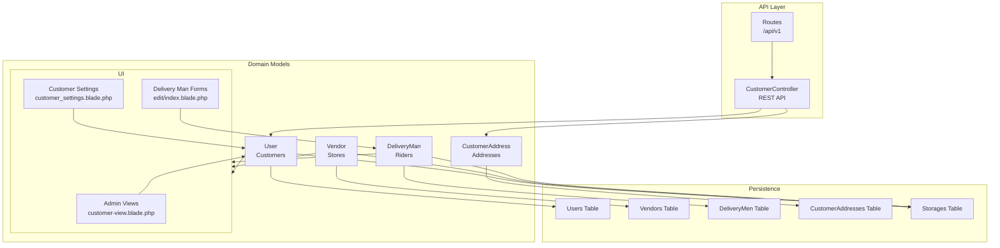
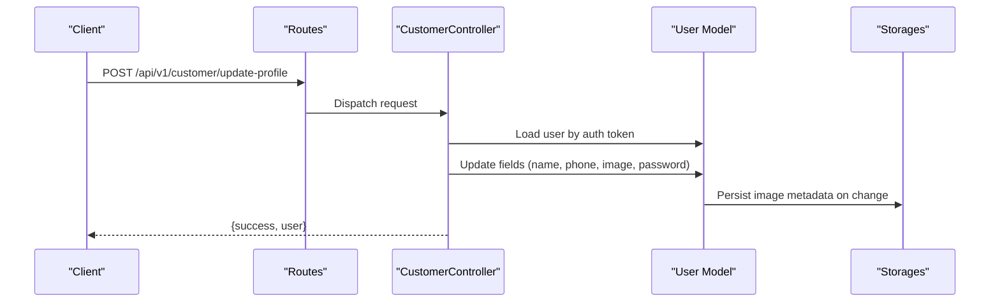
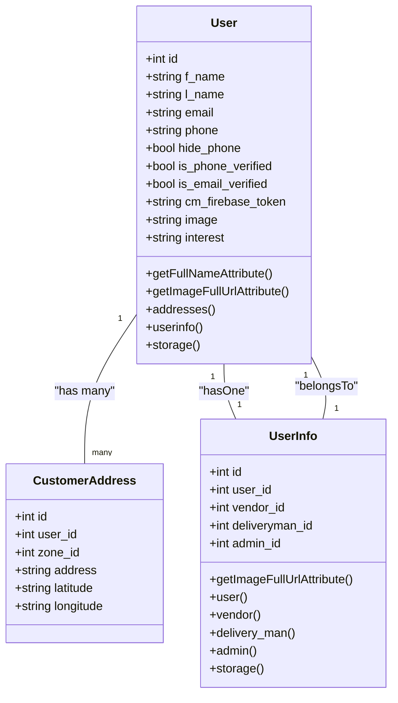
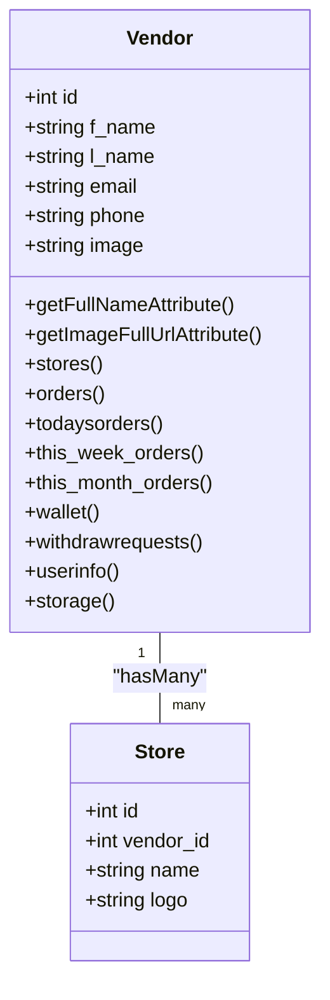
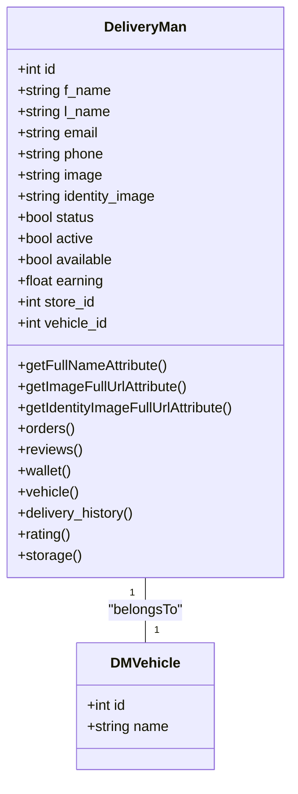
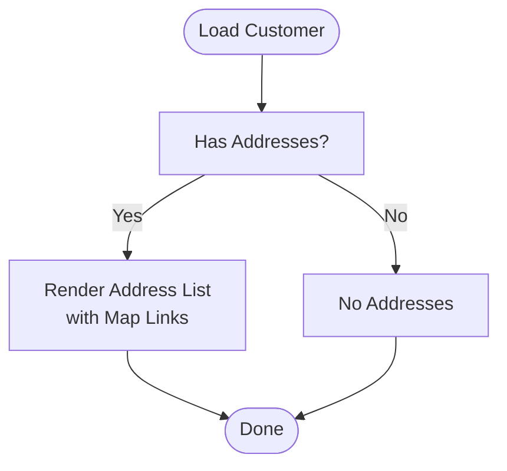
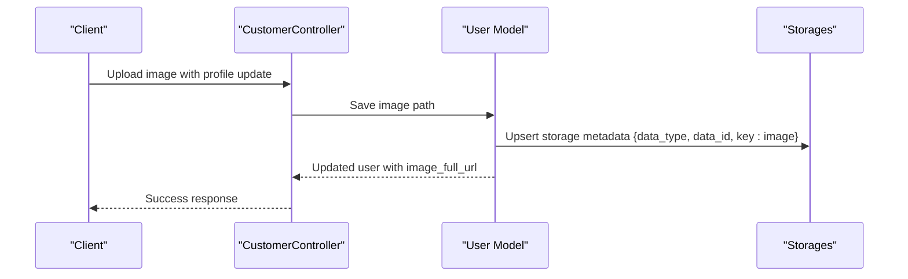
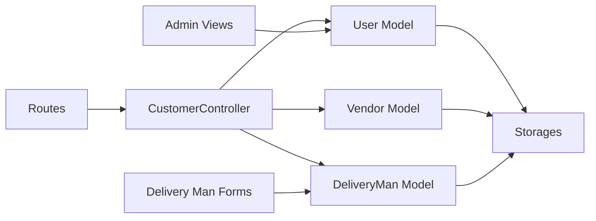

# User Profile Management

<cite>
**Referenced Files in This Document**
- [User.php](file://app/Models/User.php)
- [UserInfo.php](file://app/Models/UserInfo.php)
- [CustomerAddress.php](file://app/Models/CustomerAddress.php)
- [DeliveryMan.php](file://app/Models/DeliveryMan.php)
- [Vendor.php](file://app/Models/Vendor.php)
- [CustomerController.php](file://app/Http/Controllers/Api/V1/CustomerController.php)
- [api.php](file://routes/api/v1/api.php)
- [2025_12_05_014021_add_hide_phone_col_to_users_table.php](file://database/migrations/2025_12_05_014021_add_hide_phone_col_to_users_table.php)
- [customer-view.blade.php](file://resources/views/admin-views/customer/customer-view.blade.php)
- [customer_settings.blade.php](file://resources/views/admin-views/customer/settings.blade.php)
- [edit.blade.php](file://resources/views/vendor-views/delivery-man/edit.blade.php)
- [index.blade.php](file://resources/views/vendor-views/delivery-man/index.blade.php)
- [info.blade.php](file://resources/views/admin-views/delivery-man/view/info.blade.php)
- [customer_list_export.php](file://app/Exports/CustomerListExport.php)
- [customer_order_export.php](file://app/Exports/CustomerOrderExport.php)
- [users_export.php](file://app/Exports/UsersExport.php)
- [customer_export.blade.php](file://resources/views/user-export.blade.php)
</cite>

## Table of Contents
1. [Introduction](#introduction)
2. [Project Structure](#project-structure)
3. [Core Components](#core-components)
4. [Architecture Overview](#architecture-overview)
5. [Detailed Component Analysis](#detailed-component-analysis)
6. [Dependency Analysis](#dependency-analysis)
7. [Performance Considerations](#performance-considerations)
8. [Troubleshooting Guide](#troubleshooting-guide)
9. [Conclusion](#conclusion)
10. [Appendices](#appendices)

## Introduction
This document describes the user profile management system across three primary roles: customers, vendors, and delivery personnel. It covers profile fields, validation rules, data privacy controls, address management, profile image handling, preference settings, verification processes, data export capabilities, visibility settings, data retention, and GDPR compliance measures. The goal is to provide a comprehensive yet accessible guide for developers and stakeholders to understand how profiles are modeled, validated, stored, and exposed via APIs and admin interfaces.

## Project Structure
Profile management spans several layers:
- Data models define the schema and relationships for users, vendors, delivery personnel, and customer addresses.
- Controllers expose profile-related endpoints for customers and manage profile updates.
- Views render profile forms and settings for admins and vendors.
- Migrations introduce privacy controls such as phone number visibility.
- Exports support data portability and deletion requests.

**Diagram sources**
- [CustomerController.php](file://app/Http/Controllers/Api/V1/CustomerController.php)
- [api.php](file://routes/api/v1/api.php)
- [User.php](file://app/Models/User.php)
- [Vendor.php](file://app/Models/Vendor.php)
- [DeliveryMan.php](file://app/Models/DeliveryMan.php)
- [CustomerAddress.php](file://app/Models/CustomerAddress.php)
- [UserInfo.php](file://app/Models/UserInfo.php)
- [customer-view.blade.php](file://resources/views/admin-views/customer/customer-view.blade.php)
- [edit.blade.php](file://resources/views/vendor-views/delivery-man/edit.blade.php)
- [index.blade.php](file://resources/views/vendor-views/delivery-man/index.blade.php)
- [customer_settings.blade.php](file://resources/views/admin-views/customer/settings.blade.php)

**Section sources**
- [CustomerController.php](file://app/Http/Controllers/Api/V1/CustomerController.php)
- [api.php](file://routes/api/v1/api.php)
- [User.php](file://app/Models/User.php)
- [Vendor.php](file://app/Models/Vendor.php)
- [DeliveryMan.php](file://app/Models/DeliveryMan.php)
- [CustomerAddress.php](file://app/Models/CustomerAddress.php)
- [UserInfo.php](file://app/Models/UserInfo.php)
- [customer-view.blade.php](file://resources/views/admin-views/customer/customer-view.blade.php)
- [edit.blade.php](file://resources/views/vendor-views/delivery-man/edit.blade.php)
- [index.blade.php](file://resources/views/vendor-views/delivery-man/index.blade.php)
- [customer_settings.blade.php](file://resources/views/admin-views/customer/settings.blade.php)

## Core Components
- Customer profile model encapsulates personal details, verification flags, preferences, and image resolution.
- Vendor and DeliveryMan models mirror profile needs with role-specific fields and relations.
- CustomerAddress manages multiple addresses per customer with zone scoping.
- UserInfo provides a unified view across roles for profile images.
- Controllers expose profile read/update endpoints and handle verification notifications.
- Admin and vendor UIs provide forms for profile editing and settings.

**Section sources**
- [User.php](file://app/Models/User.php)
- [Vendor.php](file://app/Models/Vendor.php)
- [DeliveryMan.php](file://app/Models/DeliveryMan.php)
- [CustomerAddress.php](file://app/Models/CustomerAddress.php)
- [UserInfo.php](file://app/Models/UserInfo.php)
- [CustomerController.php](file://app/Http/Controllers/Api/V1/CustomerController.php)

## Architecture Overview
The profile system follows a layered architecture:
- API routes dispatch to controllers for customer profile operations.
- Controllers coordinate with models and storage to update and retrieve profile data.
- Views render forms for admin and vendor profile management.
- Migrations evolve schema for privacy controls and storage metadata.

**Diagram sources**
- [api.php](file://routes/api/v1/api.php)
- [CustomerController.php](file://app/Http/Controllers/Api/V1/CustomerController.php)
- [User.php](file://app/Models/User.php)

## Detailed Component Analysis

### Customer Profiles
Customer profiles are represented by the User model and related entities.

- Fields and validation
  - Personal: first name, last name, email, phone, password.
  - Verification: phone/email verified flags.
  - Preferences: interest categories, hide phone flag, Firebase token, POS origin flag.
  - Privacy: hide_phone column introduced via migration.
  - Validation rules enforced in controller update logic (e.g., password length, image upload handling).

- Address management
  - One-to-many relationship with CustomerAddress.
  - Addresses scoped by zone via model scopes.

- Profile image handling
  - Full URL generation via appended accessor using storage metadata.
  - On image change, storages metadata is updated atomically.

- Preference settings
  - Toggle hide phone setting exposed via API endpoint.
  - Interest categories supported for personalization.

- Verification processes
  - Email verification notification sent during profile updates when enabled.

- Data exports
  - Customer list and order history exports available for data portability/deletion requests.

**Diagram sources**
- [User.php](file://app/Models/User.php)
- [CustomerAddress.php](file://app/Models/CustomerAddress.php)
- [UserInfo.php](file://app/Models/UserInfo.php)

**Section sources**
- [User.php](file://app/Models/User.php)
- [CustomerAddress.php](file://app/Models/CustomerAddress.php)
- [UserInfo.php](file://app/Models/UserInfo.php)
- [CustomerController.php](file://app/Http/Controllers/Api/V1/CustomerController.php)
- [api.php](file://routes/api/v1/api.php)
- [2025_12_05_014021_add_hide_phone_col_to_users_table.php](file://database/migrations/2025_12_05_014021_add_hide_phone_col_to_users_table.php)
- [customer_list_export.php](file://app/Exports/CustomerListExport.php)
- [customer_order_export.php](file://app/Exports/CustomerOrderExport.php)
- [users_export.php](file://app/Exports/UsersExport.php)
- [customer_export.blade.php](file://resources/views/user-export.blade.php)

### Vendor Profiles
Vendor profiles are represented by the Vendor model and related entities.

- Fields and validation
  - Authentication fields (password, tokens) hidden from serialization.
  - Profile image handled via appended accessor and storage metadata.

- Store associations
  - One-to-many with Store; earnings and order metrics computed via scope methods.

- Profile image handling
  - Full URL generation via appended accessor using storage metadata.
  - On image change, storages metadata is updated atomically.

**Diagram sources**
- [Vendor.php](file://app/Models/Vendor.php)

**Section sources**
- [Vendor.php](file://app/Models/Vendor.php)

### Delivery Personnel Profiles
Delivery personnel profiles are represented by the DeliveryMan model and related entities.

- Fields and validation
  - Availability, earnings, vehicle association, identity documents.
  - Identity images support multiple entries with JSON parsing.

- Profile image handling
  - Full URL generation via appended accessor using storage metadata.
  - Identity images resolved to full URLs for display.

- Earnings and ratings
  - Computed metrics via scope methods and aggregated queries.

**Diagram sources**
- [DeliveryMan.php](file://app/Models/DeliveryMan.php)

**Section sources**
- [DeliveryMan.php](file://app/Models/DeliveryMan.php)
- [info.blade.php](file://resources/views/admin-views/delivery-man/view/info.blade.php)
- [edit.blade.php](file://resources/views/vendor-views/delivery-man/edit.blade.php)
- [index.blade.php](file://resources/views/vendor-views/delivery-man/index.blade.php)

### Address Management
- CustomerAddress model defines address fields and zone scoping.
- Admin view displays customer addresses with map links derived from coordinates.
- Delivery-man edit/index forms capture general information; address fields are managed separately via customer address records.

**Diagram sources**
- [CustomerAddress.php](file://app/Models/CustomerAddress.php)
- [customer-view.blade.php](file://resources/views/admin-views/customer/customer-view.blade.php)

**Section sources**
- [CustomerAddress.php](file://app/Models/CustomerAddress.php)
- [customer-view.blade.php](file://resources/views/admin-views/customer/customer-view.blade.php)

### Profile Image Handling
- All three roles resolve full image URLs via appended accessors using storage metadata.
- On image updates, a storage record is created/updated atomically to ensure consistent URL generation.

**Diagram sources**
- [CustomerController.php](file://app/Http/Controllers/Api/V1/CustomerController.php)
- [User.php](file://app/Models/User.php)

**Section sources**
- [User.php](file://app/Models/User.php)
- [Vendor.php](file://app/Models/Vendor.php)
- [DeliveryMan.php](file://app/Models/DeliveryMan.php)

### Preference Settings
- Hide phone preference: exposed via API endpoint to toggle visibility of phone in contexts where permitted.
- Customer settings UI allows administrators to enable/disable customer-related features.

**Section sources**
- [api.php](file://routes/api/v1/api.php)
- [2025_12_05_014021_add_hide_phone_col_to_users_table.php](file://database/migrations/2025_12_05_014021_add_hide_phone_col_to_users_table.php)
- [customer_settings.blade.php](file://resources/views/admin-views/customer/settings.blade.php)

### Verification Processes
- During profile updates, email verification notifications can be triggered depending on system mail configuration and feature flags.
- Verification status flags exist on the User model for phone and email.

**Section sources**
- [CustomerController.php](file://app/Http/Controllers/Api/V1/CustomerController.php)
- [User.php](file://app/Models/User.php)

### Data Export Capabilities
- Customer list export and customer order export are available for data portability and deletion requests.
- Unified user export view supports administrative data handling.

**Section sources**
- [customer_list_export.php](file://app/Exports/CustomerListExport.php)
- [customer_order_export.php](file://app/Exports/CustomerOrderExport.php)
- [users_export.php](file://app/Exports/UsersExport.php)
- [customer_export.blade.php](file://resources/views/user-export.blade.php)

## Dependency Analysis
- Controllers depend on models for data access and on helpers/storage for image handling.
- Models depend on storage metadata for consistent URL generation.
- Views depend on models for rendering profile and address data.
- Routes depend on controllers for endpoint dispatch.

**Diagram sources**
- [api.php](file://routes/api/v1/api.php)
- [CustomerController.php](file://app/Http/Controllers/Api/V1/CustomerController.php)
- [User.php](file://app/Models/User.php)
- [Vendor.php](file://app/Models/Vendor.php)
- [DeliveryMan.php](file://app/Models/DeliveryMan.php)
- [customer-view.blade.php](file://resources/views/admin-views/customer/customer-view.blade.php)
- [edit.blade.php](file://resources/views/vendor-views/delivery-man/edit.blade.php)

**Section sources**
- [api.php](file://routes/api/v1/api.php)
- [CustomerController.php](file://app/Http/Controllers/Api/V1/CustomerController.php)
- [User.php](file://app/Models/User.php)
- [Vendor.php](file://app/Models/Vendor.php)
- [DeliveryMan.php](file://app/Models/DeliveryMan.php)
- [customer-view.blade.php](file://resources/views/admin-views/customer/customer-view.blade.php)
- [edit.blade.php](file://resources/views/vendor-views/delivery-man/edit.blade.php)

## Performance Considerations
- Eager loading storage metadata reduces N+1 queries for image URL resolution.
- Image updates trigger a single atomic upsert to the storages table to avoid stale URLs.
- Zone scoping on addresses and delivery personnel ensures efficient filtering.

[No sources needed since this section provides general guidance]

## Troubleshooting Guide
- Profile image not updating:
  - Verify image upload and controller logic for saving images.
  - Confirm storages metadata is updated after save hooks.

- Hide phone setting not applied:
  - Ensure migration column exists and API endpoint is invoked.
  - Check admin settings UI for correct toggling.

- Email verification not sent:
  - Confirm mail configuration and feature flags are enabled.
  - Inspect controller logic for sending verification emails.

**Section sources**
- [CustomerController.php](file://app/Http/Controllers/Api/V1/CustomerController.php)
- [2025_12_05_014021_add_hide_phone_col_to_users_table.php](file://database/migrations/2025_12_05_014021_add_hide_phone_col_to_users_table.php)

## Conclusion
The profile management system provides a robust foundation for customer, vendor, and delivery personnel profiles with strong privacy controls, flexible address management, and secure image handling. The API exposes essential profile operations, while admin and vendor UIs streamline profile maintenance. Data export capabilities support data portability and deletion requests, and verification mechanisms help maintain data integrity.

[No sources needed since this section summarizes without analyzing specific files]

## Appendices

### Practical Examples

- Update customer profile
  - Endpoint: POST /api/v1/customer/update-profile
  - Fields: name, email, phone, password, image
  - Behavior: Updates personal details; sends email verification if configured

- Toggle hide phone
  - Endpoint: POST /api/v1/customer/toggle-hide-phone
  - Behavior: Switches visibility of phone in applicable contexts

- View customer addresses
  - UI: Admin customer view renders addresses with map links

- Edit delivery personnel
  - UI: Vendor delivery man forms capture general info and identity images

**Section sources**
- [api.php](file://routes/api/v1/api.php)
- [CustomerController.php](file://app/Http/Controllers/Api/V1/CustomerController.php)
- [customer-view.blade.php](file://resources/views/admin-views/customer/customer-view.blade.php)
- [edit.blade.php](file://resources/views/vendor-views/delivery-man/edit.blade.php)
- [index.blade.php](file://resources/views/vendor-views/delivery-man/index.blade.php)

### Data Privacy Controls and GDPR Compliance
- Data minimization: Only necessary fields are exposed via API and views.
- Consent-based verification: Email verification notifications are conditional on configuration.
- Right to erasure: Data export endpoints facilitate data portability and deletion requests.
- Transparency: Admin settings allow enabling/disabling customer features.

**Section sources**
- [CustomerController.php](file://app/Http/Controllers/Api/V1/CustomerController.php)
- [customer_settings.blade.php](file://resources/views/admin-views/customer/settings.blade.php)
- [customer_list_export.php](file://app/Exports/CustomerListExport.php)
- [customer_order_export.php](file://app/Exports/CustomerOrderExport.php)
- [users_export.php](file://app/Exports/UsersExport.php)
- [customer_export.blade.php](file://resources/views/user-export.blade.php)