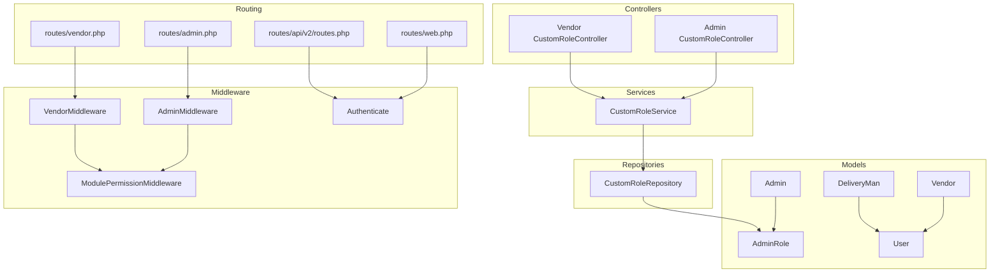
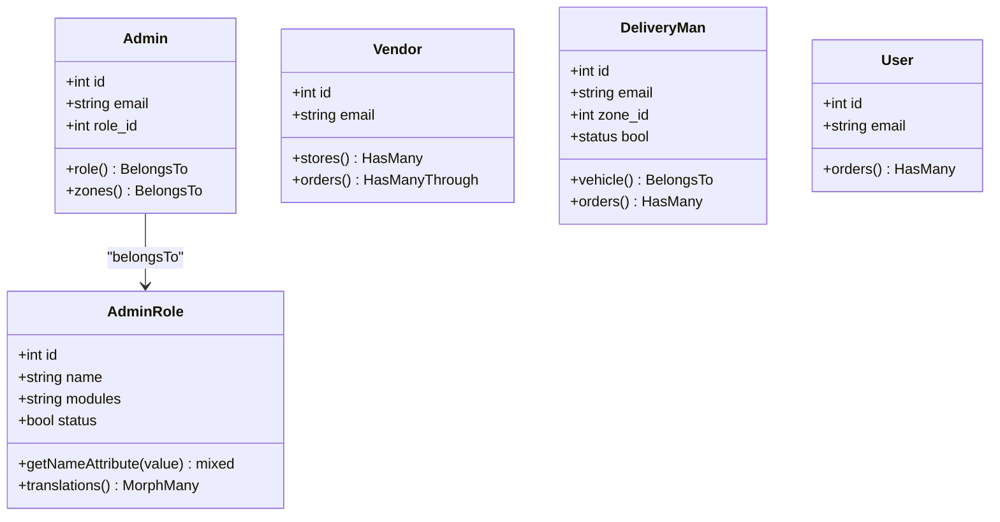
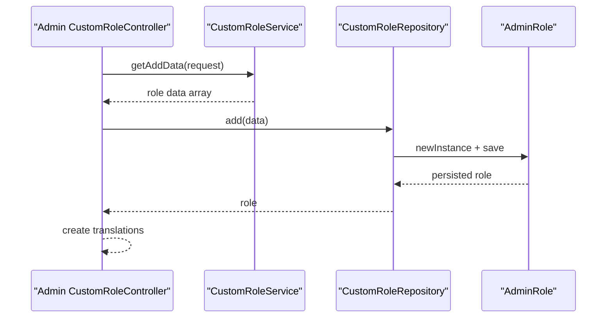
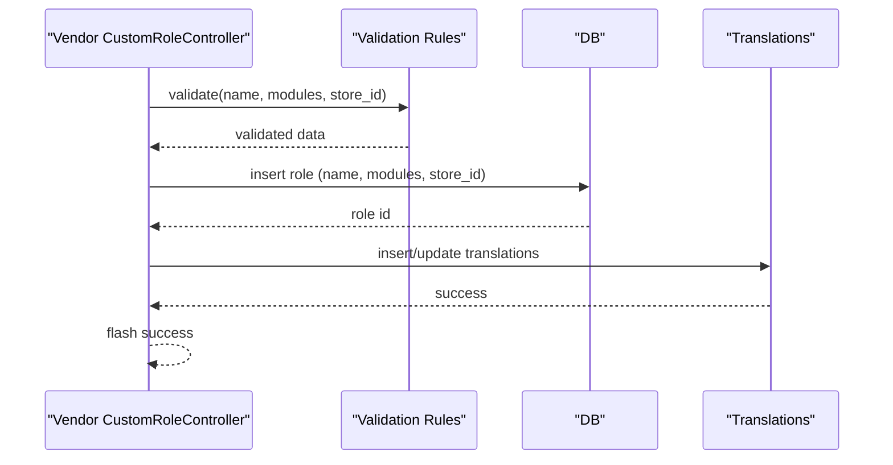
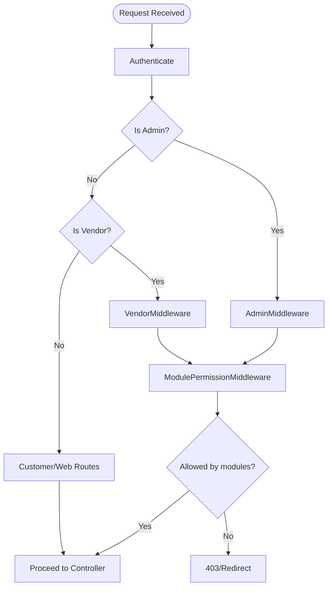
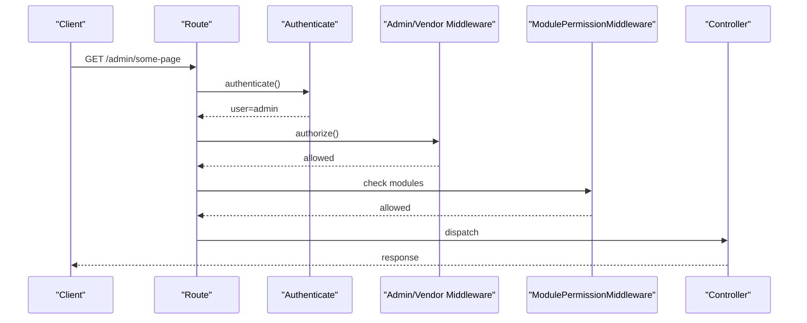
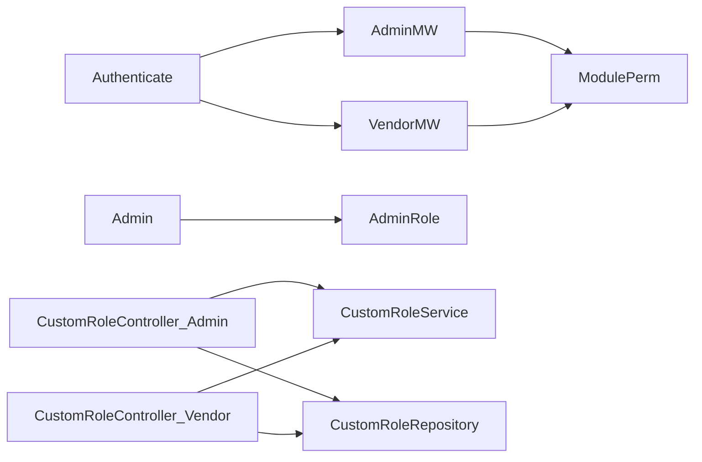

# User Roles and Permissions

<cite>
**Referenced Files in This Document**
- [AdminRole.php](file://app/Models/AdminRole.php)
- [CustomRoleService.php](file://app/Services/CustomRoleService.php)
- [CustomRoleRepository.php](file://app/Repositories/CustomRoleRepository.php)
- [CustomRoleController.php (Admin)](file://app/Http/Controllers/Admin/Employee/CustomRoleController.php)
- [CustomRoleController.php (Vendor)](file://app/Http/Controllers/Vendor/CustomRoleController.php)
- [Admin.php](file://app/Models/Admin.php)
- [Vendor.php](file://app/Models/Vendor.php)
- [DeliveryMan.php](file://app/Models/DeliveryMan.php)
- [User.php](file://app/Models/User.php)
- [Authenticate.php](file://app/Http/Middleware/Authenticate.php)
- [AdminMiddleware.php](file://app/Http/Middleware/AdminMiddleware.php)
- [VendorMiddleware.php](file://app/Http/Middleware/VendorMiddleware.php)
- [ModulePermissionMiddleware.php](file://app/Http/Middleware/ModulePermissionMiddleware.php)
- [routes/admin.php](file://routes/admin.php)
- [routes/vendor.php](file://routes/vendor.php)
- [routes/web.php](file://routes/web.php)
- [routes/api/v2/routes.php](file://routes/api/v2/routes.php)
</cite>

## Table of Contents
1. [Introduction](#introduction)
2. [Project Structure](#project-structure)
3. [Core Components](#core-components)
4. [Architecture Overview](#architecture-overview)
5. [Detailed Component Analysis](#detailed-component-analysis)
6. [Dependency Analysis](#dependency-analysis)
7. [Performance Considerations](#performance-considerations)
8. [Troubleshooting Guide](#troubleshooting-guide)
9. [Conclusion](#conclusion)

## Introduction
This document describes the role-based access control (RBAC) system supporting four primary user types:
- Administrator (admin panel)
- Vendor (store panel)
- Delivery Personnel (rider/delivery)
- Customer (web/app)

It explains role hierarchies, permission inheritance, middleware-based authorization, the AdminRole system, custom role creation, and permission assignment mechanisms. It also covers practical examples of role transitions, permission checking, and security boundary enforcement, including role-based route protection and resource access controls.

## Project Structure
The RBAC system spans models, repositories, services, controllers, middleware, and routing layers:
- Models define user types and role metadata
- Services encapsulate role creation logic and permission checks
- Repositories manage persistence and queries
- Controllers orchestrate UI flows and enforce basic role checks
- Middleware enforces authentication and authorization boundaries
- Routing defines protected areas per role

**Diagram sources**
- [AdminRole.php:1-82](file://app/Models/AdminRole.php#L1-L82)
- [Admin.php:1-149](file://app/Models/Admin.php#L1-L149)
- [Vendor.php:1-146](file://app/Models/Vendor.php#L1-L146)
- [DeliveryMan.php:1-234](file://app/Models/DeliveryMan.php#L1-L234)
- [User.php:1-279](file://app/Models/User.php#L1-L279)
- [CustomRoleService.php:1-32](file://app/Services/CustomRoleService.php#L1-L32)
- [CustomRoleRepository.php:1-87](file://app/Repositories/CustomRoleRepository.php#L1-L87)
- [CustomRoleController.php (Admin):1-102](file://app/Http/Controllers/Admin/Employee/CustomRoleController.php#L1-L102)
- [CustomRoleController.php (Vendor):1-159](file://app/Http/Controllers/Vendor/CustomRoleController.php#L1-L159)
- [AdminMiddleware.php](file://app/Http/Middleware/AdminMiddleware.php)
- [VendorMiddleware.php](file://app/Http/Middleware/VendorMiddleware.php)
- [ModulePermissionMiddleware.php](file://app/Http/Middleware/ModulePermissionMiddleware.php)
- [Authenticate.php:1-35](file://app/Http/Middleware/Authenticate.php#L1-L35)
- [routes/admin.php](file://routes/admin.php)
- [routes/vendor.php](file://routes/vendor.php)
- [routes/web.php](file://routes/web.php)
- [routes/api/v2/routes.php](file://routes/api/v2/routes.php)

**Section sources**
- [AdminRole.php:1-82](file://app/Models/AdminRole.php#L1-L82)
- [CustomRoleService.php:1-32](file://app/Services/CustomRoleService.php#L1-L32)
- [CustomRoleRepository.php:1-87](file://app/Repositories/CustomRoleRepository.php#L1-L87)
- [CustomRoleController.php (Admin):1-102](file://app/Http/Controllers/Admin/Employee/CustomRoleController.php#L1-L102)
- [CustomRoleController.php (Vendor):1-159](file://app/Http/Controllers/Vendor/CustomRoleController.php#L1-L159)
- [AdminMiddleware.php](file://app/Http/Middleware/AdminMiddleware.php)
- [VendorMiddleware.php](file://app/Http/Middleware/VendorMiddleware.php)
- [ModulePermissionMiddleware.php](file://app/Http/Middleware/ModulePermissionMiddleware.php)
- [Authenticate.php:1-35](file://app/Http/Middleware/Authenticate.php#L1-L35)
- [routes/admin.php](file://routes/admin.php)
- [routes/vendor.php](file://routes/vendor.php)
- [routes/web.php](file://routes/web.php)
- [routes/api/v2/routes.php](file://routes/api/v2/routes.php)

## Core Components
- AdminRole model: Stores role metadata and localized names via translations. Provides global scopes for localization and translation loading.
- Admin model: Links administrators to AdminRole via foreign key and exposes zone scoping.
- Vendor model: Represents store owners/users with financial and order-related relations.
- DeliveryMan model: Represents riders with availability, earnings, and zone scoping.
- User model: Represents customers with profile, orders, and XP system integrations.
- CustomRoleService: Encapsulates role creation data shaping and a basic role check logic.
- CustomRoleRepository: Handles CRUD operations for roles, filtering out reserved roles and applying pagination/search.
- Admin and Vendor CustomRoleControllers: Provide UI flows for creating/updating/deleting roles and enforcing basic role checks.
- Middleware: Authenticate, AdminMiddleware, VendorMiddleware, ModulePermissionMiddleware enforce authentication and authorization boundaries.
- Routing: Defines protected routes for admin, vendor, web, and API contexts.

**Section sources**
- [AdminRole.php:1-82](file://app/Models/AdminRole.php#L1-L82)
- [Admin.php:1-149](file://app/Models/Admin.php#L1-L149)
- [Vendor.php:1-146](file://app/Models/Vendor.php#L1-L146)
- [DeliveryMan.php:1-234](file://app/Models/DeliveryMan.php#L1-L234)
- [User.php:1-279](file://app/Models/User.php#L1-L279)
- [CustomRoleService.php:1-32](file://app/Services/CustomRoleService.php#L1-L32)
- [CustomRoleRepository.php:1-87](file://app/Repositories/CustomRoleRepository.php#L1-L87)
- [CustomRoleController.php (Admin):1-102](file://app/Http/Controllers/Admin/Employee/CustomRoleController.php#L1-L102)
- [CustomRoleController.php (Vendor):1-159](file://app/Http/Controllers/Vendor/CustomRoleController.php#L1-L159)
- [Authenticate.php:1-35](file://app/Http/Middleware/Authenticate.php#L1-L35)
- [AdminMiddleware.php](file://app/Http/Middleware/AdminMiddleware.php)
- [VendorMiddleware.php](file://app/Http/Middleware/VendorMiddleware.php)
- [ModulePermissionMiddleware.php](file://app/Http/Middleware/ModulePermissionMiddleware.php)

## Architecture Overview
The RBAC architecture separates concerns across models, services, repositories, controllers, and middleware. Authentication is enforced centrally, while authorization is layered via role models and module-level permissions.

**Diagram sources**
- [AdminRole.php:1-82](file://app/Models/AdminRole.php#L1-L82)
- [Admin.php:1-149](file://app/Models/Admin.php#L1-L149)
- [Vendor.php:1-146](file://app/Models/Vendor.php#L1-L146)
- [DeliveryMan.php:1-234](file://app/Models/DeliveryMan.php#L1-L234)
- [User.php:1-279](file://app/Models/User.php#L1-L279)

**Section sources**
- [AdminRole.php:1-82](file://app/Models/AdminRole.php#L1-L82)
- [Admin.php:1-149](file://app/Models/Admin.php#L1-L149)
- [Vendor.php:1-146](file://app/Models/Vendor.php#L1-L146)
- [DeliveryMan.php:1-234](file://app/Models/DeliveryMan.php#L1-L234)
- [User.php:1-279](file://app/Models/User.php#L1-L279)

## Detailed Component Analysis

### AdminRole System
- Purpose: Define administrative roles with localized names and module-level permissions stored as JSON.
- Localization: Uses a morph-many translation relationship and a global scope to load translations for the current locale.
- Persistence: AdminRole instances are created and managed via repositories and services.

**Diagram sources**
- [CustomRoleController.php (Admin):46-52](file://app/Http/Controllers/Admin/Employee/CustomRoleController.php#L46-L52)
- [CustomRoleService.php:13-20](file://app/Services/CustomRoleService.php#L13-L20)
- [CustomRoleRepository.php:18-26](file://app/Repositories/CustomRoleRepository.php#L18-L26)
- [AdminRole.php:21-82](file://app/Models/AdminRole.php#L21-L82)

**Section sources**
- [AdminRole.php:1-82](file://app/Models/AdminRole.php#L1-L82)
- [CustomRoleService.php:1-32](file://app/Services/CustomRoleService.php#L1-L32)
- [CustomRoleRepository.php:1-87](file://app/Repositories/CustomRoleRepository.php#L1-L87)
- [CustomRoleController.php (Admin):1-102](file://app/Http/Controllers/Admin/Employee/CustomRoleController.php#L1-L102)

### Custom Role Creation and Management
- Admin panel: Provides add/update/delete flows with search and pagination. Enforces a basic role check that blocks modifications to a reserved role ID.
- Vendor panel: Supports store-scoped roles with module permissions and localized names. Validates uniqueness per store and updates translations.

**Diagram sources**
- [CustomRoleController.php (Vendor):32-85](file://app/Http/Controllers/Vendor/CustomRoleController.php#L32-L85)
- [CustomRoleController.php (Vendor):87-150](file://app/Http/Controllers/Vendor/CustomRoleController.php#L87-L150)

**Section sources**
- [CustomRoleController.php (Vendor):1-159](file://app/Http/Controllers/Vendor/CustomRoleController.php#L1-L159)
- [CustomRoleService.php:22-29](file://app/Services/CustomRoleService.php#L22-L29)
- [CustomRoleRepository.php:33-50](file://app/Repositories/CustomRoleRepository.php#L33-L50)

### Permission Assignment and Inheritance
- AdminRole.modules stores JSON-encoded module permissions. Access checks are performed via module-level middleware.
- Admin users inherit permissions based on their AdminRole.modules and are scoped by zone.
- Vendor employees can be assigned store-specific roles with module permissions.
- Delivery personnel and customers do not have custom roles in the analyzed code; access is controlled via route guards and module permissions.

**Diagram sources**
- [Authenticate.php:15-33](file://app/Http/Middleware/Authenticate.php#L15-L33)
- [AdminMiddleware.php](file://app/Http/Middleware/AdminMiddleware.php)
- [VendorMiddleware.php](file://app/Http/Middleware/VendorMiddleware.php)
- [ModulePermissionMiddleware.php](file://app/Http/Middleware/ModulePermissionMiddleware.php)

**Section sources**
- [AdminRole.php:1-82](file://app/Models/AdminRole.php#L1-L82)
- [Admin.php:67-78](file://app/Models/Admin.php#L67-L78)
- [CustomRoleRepository.php:33-50](file://app/Repositories/CustomRoleRepository.php#L33-L50)
- [Authenticate.php:1-35](file://app/Http/Middleware/Authenticate.php#L1-L35)
- [AdminMiddleware.php](file://app/Http/Middleware/AdminMiddleware.php)
- [VendorMiddleware.php](file://app/Http/Middleware/VendorMiddleware.php)
- [ModulePermissionMiddleware.php](file://app/Http/Middleware/ModulePermissionMiddleware.php)

### Role-Based Route Protection
- Admin routes: Protected by admin middleware and module permission middleware.
- Vendor routes: Protected by vendor middleware and module permission middleware.
- Web routes: Protected by authentication middleware; API routes redirect unauthenticated requests to a failure endpoint.
- API v2 routes: Protected similarly to web routes for API contexts.

**Diagram sources**
- [routes/admin.php](file://routes/admin.php)
- [routes/vendor.php](file://routes/vendor.php)
- [routes/web.php](file://routes/web.php)
- [routes/api/v2/routes.php](file://routes/api/v2/routes.php)
- [Authenticate.php:15-33](file://app/Http/Middleware/Authenticate.php#L15-L33)
- [AdminMiddleware.php](file://app/Http/Middleware/AdminMiddleware.php)
- [VendorMiddleware.php](file://app/Http/Middleware/VendorMiddleware.php)
- [ModulePermissionMiddleware.php](file://app/Http/Middleware/ModulePermissionMiddleware.php)

**Section sources**
- [routes/admin.php](file://routes/admin.php)
- [routes/vendor.php](file://routes/vendor.php)
- [routes/web.php](file://routes/web.php)
- [routes/api/v2/routes.php](file://routes/api/v2/routes.php)
- [Authenticate.php:1-35](file://app/Http/Middleware/Authenticate.php#L1-L35)

### Practical Examples

- Role transitions:
  - An administrator assigns a store-specific role to a vendor employee via the vendor panel. The controller validates uniqueness per store and persists modules and translations.
  - A vendor creates a custom role for internal staff; the system ensures the role name is unique within the store and stores module permissions as JSON.

- Permission checking:
  - The AdminRole.modules field is used by module permission middleware to allow or deny access to specific features.
  - The service’s roleCheck method prevents modification of a reserved role ID in admin flows.

- Security boundary enforcement:
  - Admin users are zone-scoped via Admin.zones relationship.
  - Vendor roles are scoped to store_id in vendor role controller.
  - Authentication middleware redirects unauthenticated users to appropriate login/home pages depending on context.

**Section sources**
- [CustomRoleController.php (Vendor):32-85](file://app/Http/Controllers/Vendor/CustomRoleController.php#L32-L85)
- [CustomRoleController.php (Vendor):87-150](file://app/Http/Controllers/Vendor/CustomRoleController.php#L87-L150)
- [CustomRoleService.php:22-29](file://app/Services/CustomRoleService.php#L22-L29)
- [Admin.php:110-117](file://app/Models/Admin.php#L110-L117)
- [CustomRoleController.php (Vendor):18-30](file://app/Http/Controllers/Vendor/CustomRoleController.php#L18-L30)

## Dependency Analysis
- Admin depends on AdminRole for permission modules and zone scoping.
- Vendor roles are independent of AdminRole; vendor role management is handled separately with store scoping.
- Middleware layers stack: Authenticate → Admin/Vendor → ModulePermission to enforce authorization.
- Controllers depend on services and repositories to encapsulate business logic and persistence.

**Diagram sources**
- [Authenticate.php:15-33](file://app/Http/Middleware/Authenticate.php#L15-L33)
- [AdminMiddleware.php](file://app/Http/Middleware/AdminMiddleware.php)
- [VendorMiddleware.php](file://app/Http/Middleware/VendorMiddleware.php)
- [ModulePermissionMiddleware.php](file://app/Http/Middleware/ModulePermissionMiddleware.php)
- [Admin.php:67-78](file://app/Models/Admin.php#L67-L78)
- [CustomRoleController.php (Admin):1-102](file://app/Http/Controllers/Admin/Employee/CustomRoleController.php#L1-L102)
- [CustomRoleController.php (Vendor):1-159](file://app/Http/Controllers/Vendor/CustomRoleController.php#L1-L159)
- [CustomRoleService.php:1-32](file://app/Services/CustomRoleService.php#L1-L32)
- [CustomRoleRepository.php:1-87](file://app/Repositories/CustomRoleRepository.php#L1-L87)

**Section sources**
- [Admin.php:1-149](file://app/Models/Admin.php#L1-L149)
- [CustomRoleController.php (Admin):1-102](file://app/Http/Controllers/Admin/Employee/CustomRoleController.php#L1-L102)
- [CustomRoleController.php (Vendor):1-159](file://app/Http/Controllers/Vendor/CustomRoleController.php#L1-L159)
- [CustomRoleService.php:1-32](file://app/Services/CustomRoleService.php#L1-L32)
- [CustomRoleRepository.php:1-87](file://app/Repositories/CustomRoleRepository.php#L1-L87)
- [Authenticate.php:1-35](file://app/Http/Middleware/Authenticate.php#L1-L35)
- [AdminMiddleware.php](file://app/Http/Middleware/AdminMiddleware.php)
- [VendorMiddleware.php](file://app/Http/Middleware/VendorMiddleware.php)
- [ModulePermissionMiddleware.php](file://app/Http/Middleware/ModulePermissionMiddleware.php)

## Performance Considerations
- Use pagination for role lists to avoid heavy queries.
- Leverage global scopes judiciously; ensure translation loading does not cause N+1 queries.
- Cache frequently accessed module permission sets if dynamic updates are not required.
- Keep module permission JSON compact and indexed for efficient middleware checks.

## Troubleshooting Guide
- Authentication failures:
  - Unauthenticated requests are redirected based on route context. Verify routes and middleware bindings.
- Authorization denied:
  - Admin/Vendor middleware combined with module permission middleware control access. Confirm AdminRole.modules or vendor role modules include the requested module.
- Reserved role modifications blocked:
  - The service’s roleCheck prevents editing a reserved role ID. Adjust logic if necessary and ensure proper fallbacks.

**Section sources**
- [Authenticate.php:15-33](file://app/Http/Middleware/Authenticate.php#L15-L33)
- [CustomRoleService.php:22-29](file://app/Services/CustomRoleService.php#L22-L29)
- [AdminMiddleware.php](file://app/Http/Middleware/AdminMiddleware.php)
- [VendorMiddleware.php](file://app/Http/Middleware/VendorMiddleware.php)
- [ModulePermissionMiddleware.php](file://app/Http/Middleware/ModulePermissionMiddleware.php)

## Conclusion
The RBAC system leverages AdminRole for administrative permissions, supports vendor-specific roles with module-level controls, and enforces authorization via stacked middleware. Controllers and services encapsulate role creation and checks, while routing defines secure boundaries per user type. Extending the system involves adding modules to AdminRole.modules and ensuring middleware checks align with new capabilities.